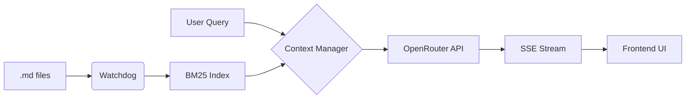

<div align="center">
  
</div>

# KernelBot

Agente RAG acadêmico local-first. Indexação BM25 em memória sobre Markdown com silos de disciplina, streaming SSE e rastreabilidade total de fontes.

## O que é

O KernelBot é um agente RAG **local-first** para estudo/trabalho acadêmico: você mantém seu repositório de conteúdo em Markdown versionável (Git-friendly) e o sistema recupera trechos relevantes via busca lexical determinística (BM25) antes de chamar o modelo.

A arquitetura é **implementada sob o protocolo ACL (Agente de Contexto Local)**, com injeção explícita de metadados de fontes antes da resposta para manter rastreabilidade ponta-a-ponta.

## Problema que resolve

- Pesquisa rápida e determinística sobre seu acervo local (sem embeddings, sem “black box” de vetores).
- Respostas em streaming com contexto auditável, reduzindo incerteza sobre “de onde veio” cada afirmação.

O KernelBot elimina o custo de oportunidade de assistir 120 minutos de material bruto para validar uma dúvida de 30 segundos.

## Diferenciais

- **Local-first**: `content/` é a fonte da verdade (Markdown + YAML), fácil de versionar e revisar.
- **Zero-Vector RAG**: recuperação lexical via BM25 (previsível, reproduzível, depurável).
- **Tempo real**: streaming SSE para feedback imediato.
- **Auditabilidade de Contexto**: o sistema injeta metadados de fontes (ex.: via bloco `[ACL_META]`) antes da resposta, permitindo rastrear exatamente quais trechos sustentaram cada saída.

## Fluxo de dados (alto nível)



## Requisitos

- Python 3.10+
- Chave `OPENROUTER_API_KEY` no arquivo `.env` na raiz do repositório

## Instalação

```bash
pip install -r requirements.txt
```

## Executar

```bash
python main.py
```

Ou com Uvicorn:

```bash
uvicorn main:app --host 127.0.0.1 --port 8000
```

Abra `http://127.0.0.1:8000`.

## Organização do conteúdo (`content/`)

O repositório espera silos de disciplina em subpastas dentro de `content/`. Exemplos existentes:

- `content/python/`
- `content/visualizacao-sql/`
- `content/planejamento-curso-carreira/`
- `content/projeto-bloco/`
- `content/doc/`

## Estrutura

| Caminho | Função |
|--------|--------|
| `main.py` | Orquestração: logging, `SearchEngine`, watchdog, `create_app` |
| `core/` | Config (`Settings`), logging centralizado |
| `engine/` | BM25 (`SearchEngine`), `ContentWatcher`, `ContextManager`, `ChatProvider` |
| `api/` | Rotas FastAPI (`GET /`, `POST /chat`) |
| `app/` | `create_app()`, estado injetado em `app.state` |
| `content/` | Arquivos `.md` indexados |
| `templates/` | UI (Jinja2) |

## Stack (camadas e papel)

| Camada | Tecnologia | Papel Estratégico |
|---|---|---|
| Core Engine | Python 3.10+ | Processamento assíncrono e lógica de RAG |
| Search | BM25Okapi | Recuperação lexical determinística (Zero-Vector) |
| Real-time | SSE (Server-Sent Events) | Streaming de tokens com overhead mínimo |
| Persistence | Markdown + YAML | Fonte da verdade versionável via Git |
| IA Gateway | OpenRouter | Orquestração de modelos com fallback automático |

## Limitações (honestidade técnica)

- **Sem embeddings**: BM25 prioriza correspondência lexical; textos com sinônimos distantes podem demandar melhor normalização/curadoria do conteúdo.
- **Dívida de Taxonomia**: a precisão do sistema é diretamente proporcional à organização das subpastas em `content/`.

## Testes

```bash
python -m pytest tests/ -v
```

## Logging

O projeto usa `logging` da biblioteca padrão com loggers prefixados `kernelbots.*` (ex.: `kernelbots.engine.search`, `kernelbots.api.chat`). Para logs estruturados em JSON no stdout, é possível estender `core/logging_config.py` com algo como `structlog` no mesmo ponto de configuração.

## Comandos no chat

- `/content …` — força uso da base local (com fallback para os primeiros chunks se não houver hit BM25).
- `/doc …` — injeta o conteúdo de `documentation.md` quando disponível no índice.
- `/python …`, `/visualizacao-sql …` — restringe a busca exclusivamente ao silo da disciplina mencionada.
- `/reset` ou `/limpar` — limpa o pinned context (memória de curto prazo) da sessão atual.
