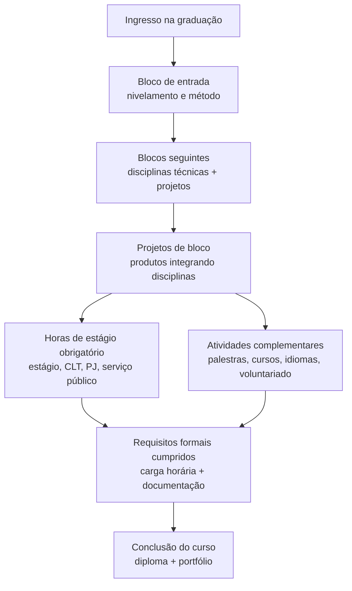

## Visão Geral do Conceito

Esta lição explica **como sua graduação é estruturada** no Infinity e o que isso significa para o seu planejamento de carreira desde o primeiro bloco. Você vai entender o papel dos <mark style="background-color: #242424; padding: 2px 4px; border-radius: 3px; color: inherit;">`blocos de disciplinas`</mark>, por que não existe <mark style="background-color: #242424; padding: 2px 4px; border-radius: 3px; color: inherit;">`TCC tradicional`</mark>, como funcionam o <mark style="background-color: #242424; padding: 2px 4px; border-radius: 3px; color: inherit;">`estágio obrigatório`</mark> e as <mark style="background-color: #242424; padding: 2px 4px; border-radius: 3px; color: inherit;">`atividades complementares`</mark>.  
Tudo isso impacta diretamente **quando** e **como** você poderá entrar no mercado (ou se reposicionar) e qual será sua carga de estudos e projetos ao longo do curso.

Ao finalizar, você terá uma visão clara do “tabuleiro” da graduação e poderá começar a tomar decisões conscientes sobre **onde investir energia** em cada fase.

## Modelo Mental

Um bom modelo mental para esta disciplina é enxergar a graduação como um **projeto de longo prazo de desenvolvimento profissional**, não apenas como um conjunto de aulas isoladas.

Você pode imaginar o curso como um **pipeline de formação**:

- Entrada: você, com sua história, experiência prévia e objetivos.
- Estrutura: blocos, disciplinas, projetos, estágio e atividades complementares.
- Saída: um profissional que já entregou vários produtos, tem horas comprovadas de atuação e um portfólio coerente com o mercado.

Em vez de um grande “chefe final” chamado <mark style="background-color: #242424; padding: 2px 4px; border-radius: 3px; color: inherit;">`TCC`</mark>, a graduação se organiza como **vários mini-chefes**: projetos de bloco que vão construindo, passo a passo, sua experiência prática.

Do ponto de vista de carreira, o modelo mental importante é:

- Cada bloco é uma **sprint longa** em que você aumenta seu nível técnico e entrega um produto.
- O <mark style="background-color: #242424; padding: 2px 4px; border-radius: 3px; color: inherit;">`estágio obrigatório`</mark> é a **tradução disso em horas formais de trabalho na área**.
- As <mark style="background-color: #242424; padding: 2px 4px; border-radius: 3px; color: inherit;">`atividades complementares`</mark> são os **“buffs”** que você adiciona ao seu perfil: idiomas, eventos, cursos, voluntariado.

## Mecânica Central

### Estrutura em blocos

Na graduação do Infinity:

- Um <mark style="background-color: #242424; padding: 2px 4px; border-radius: 3px; color: inherit;">`bloco`</mark> é um conjunto de disciplinas (tipicamente cinco) que **rodam simultaneamente** por cerca de seis meses.
- Essas disciplinas são planejadas de forma a **convergir para um produto final**: um projeto que integra o que foi aprendido em todas elas.
- Em vez de um <mark style="background-color: #242424; padding: 2px 4px; border-radius: 3px; color: inherit;">`TCC`</mark> único, você terá **projetos de bloco** ao longo do curso, cada um servindo como evidência de competências desenvolvidas.

### Avaliação por competências

O modelo é **baseado em competências e projetos**, não em provas tradicionais:

- Não há provas de múltipla escolha com nota de 0 a 10 como foco principal.
- A avaliação acontece por meio de **trabalhos e entregas práticas**, a cada duas semanas e em projetos finais de bloco (como as avaliações <mark style="background-color: #242424; padding: 2px 4px; border-radius: 3px; color: inherit;">`TP`</mark> e <mark style="background-color: #242424; padding: 2px 4px; border-radius: 3px; color: inherit;">`AT`</mark> mencionadas na aula).
- A regra de presença segue a legislação: cerca de **75% de frequência mínima** nas aulas síncronas para você ser considerado presente naquela disciplina.

### Estágio obrigatório

O <mark style="background-color: #242424; padding: 2px 4px; border-radius: 3px; color: inherit;">`estágio obrigatório`</mark>:

- Faz parte da **carga horária mínima exigida** para você se formar.
- Normalmente exige **cerca de 400 horas** de atuação em atividades ligadas à área do curso (TI, dados, desenvolvimento, suporte, produto digital, etc.).
- Pode ser cumprido de formas diferentes:
  - Estágio formal com contrato entre empresa, aluno e faculdade.
  - Trabalho CLT ou como <mark style="background-color: #242424; padding: 2px 4px; border-radius: 3px; color: inherit;">`PJ`</mark>, desde que haja comprovação de que você atua na área.
  - Atuação como servidor público em funções ligadas à TI/dados, mediante declaração.
- Só contam horas **a partir do início da graduação**; trabalhos anteriores ao início do curso não valem para estágio.

### Atividades complementares

As <mark style="background-color: #242424; padding: 2px 4px; border-radius: 3px; color: inherit;">`atividades complementares`</mark>:

- São um conjunto de horas que você precisa acumular com ações formativas adicionais, como:
  - Participação em palestras, congressos, hackathons.
  - Cursos externos (por exemplo, na <mark style="background-color: #242424; padding: 2px 4px; border-radius: 3px; color: inherit;">`Udemy`</mark>, <mark style="background-color: #242424; padding: 2px 4px; border-radius: 3px; color: inherit;">`Coursera`</mark> etc., desde que sejam comprováveis e não pirateados).
  - Cursos de idiomas.
  - Trabalho voluntário em entidades formais.
- A quantidade de horas varia conforme o curso (por exemplo, cerca de 80h em cursos mais curtos e até 300h em engenharias).
- Cada categoria tem **limites máximos** de horas que podem ser aproveitadas, descritos no manual da graduação.

### Requerimentos e comprovação

Quase tudo que envolve **registro formal** (declarações, estágio, atividades complementares) passa por:

- Abertura de um <mark style="background-color: #242424; padding: 2px 4px; border-radius: 3px; color: inherit;">`requerimento`</mark> no sistema oficial (por exemplo, `requerimento.infinit.edu.br`).
- Anexar comprovações: declaração de empresa, carteira de trabalho, certificados de cursos, crachá de eventos, carta de ONG etc.
- Acompanhamento do andamento do pedido pelo **número de protocolo** gerado pelo sistema.

### Diagrama do fluxo da graduação

O diagrama abaixo resume o fluxo principal da sua jornada na graduação, do ponto de vista de blocos, estágios e formação:



## Uso Prático

Nesta seção, a aplicação é **de planejamento de curso e carreira**, não de código. A ideia é transformar regras abstratas em decisões concretas para os próximos semestres.

### Exemplo 1 — Aproveitar trabalho atual como estágio

Imagine que você já trabalha como analista de suporte, analista de dados, desenvolvedor ou em função de TI em uma empresa.

Passo a passo para transformar isso em horas de estágio obrigatório:

1. Confirmar se suas atividades são **diretamente relacionadas** à área da graduação (TI, dados, desenvolvimento de produtos digitais etc.).
2. Ler, no manual da graduação, o capítulo de <mark style="background-color: #242424; padding: 2px 4px; border-radius: 3px; color: inherit;">`estágio obrigatório`</mark> e o conceito de <mark style="background-color: #242424; padding: 2px 4px; border-radius: 3px; color: inherit;">`termo substitutivo de estágio`</mark>.
3. Solicitar à empresa:
   - Uma carta em papel timbrado (ou PDF oficial) descrevendo suas funções.
   - Carga horária semanal.
   - Tempo de atuação na função.
4. Abrir um <mark style="background-color: #242424; padding: 2px 4px; border-radius: 3px; color: inherit;">`requerimento`</mark> específico de estágio no sistema da faculdade.
5. Anexar a documentação e aguardar a análise do coordenador do curso.

O resultado prático é que você **não precisa abandonar seu trabalho atual** para cumprir o estágio, desde que ele seja compatível com a área.

### Exemplo 2 — Planejar estágio sendo iniciante

Se você está começando do zero na área, sem experiência prévia, uma estratégia típica é:

- Focar no **primeiro bloco** em:
  - Entender o modelo de ensino, blocos, avaliações e prazos.
  - Construir base técnica suficiente para ser competitivo em vagas de estágio (a partir de ~1 ano de curso, como muitas empresas pedem).
- A partir do segundo bloco:
  - Usar projetos de bloco como **portfólio** em processos seletivos.
  - Buscar oportunidades de estágio remoto ou presencial que permitam conciliar com o trabalho atual, se houver.
  - Fazer pequenos freelas ou projetos colaborativos com colegas para aumentar experiência prática.

### Exemplo 3 — Planejar atividades complementares desde cedo

Para evitar acumular centenas de horas de atividades complementares no final do curso:

- Use cada semestre para:
  - Assistir palestras, meetups online, lives técnicas recomendadas pela faculdade.
  - Completar ao menos **um curso externo** relevante para sua trilha (por exemplo, fundamentos de Git, lógica de programação, fundamentos de nuvem).
  - Investir em um curso de idioma (inglês, espanhol), se isso fizer sentido para sua carreira.
- Guarde **todos os comprovantes** em uma pasta organizada (digital), já pensando em anexar depois nos requerimentos.

## Erros Comuns

- **Deixar estágio e atividades complementares para o final**  
  Resultado: acúmulo de pressão justamente quando as disciplinas técnicas estão mais avançadas, aumentando risco de atraso na formatura.

- **Achar que qualquer trabalho conta como estágio**  
  Estágio precisa estar vinculado **à área da graduação**; funções sem relação com TI/dados não são aceitas como estágio obrigatório.

- **Não guardar comprovantes**  
  Fazer cursos, participar de eventos e voluntariado sem guardar certificados, crachás ou declarações impede que essas horas sejam validadas.

- **Confundir estágio com atividade complementar**  
  Alguns alunos tentam usar atividades complementares para substituir a carga horária de estágio, o que não é permitido: são componentes diferentes da matriz curricular.

- **Ignorar o manual da graduação**  
  Deixar de ler o manual faz com que as regras de presença, estágio e atividades complementares pareçam “surpresas desagradáveis” perto da formatura.

- **Subestimar a importância de projetos de bloco**  
  Tratar o projeto de bloco como “só mais um trabalho” reduz o potencial de gerar portfólio forte para processos seletivos.

## Visão Geral de Debugging

Aqui, “debugging” significa **corrigir o curso da sua jornada acadêmica e de carreira** quando algo está saindo do planejado.

Perguntas para diagnosticar problemas:

- Você sabe **quantas horas de estágio** precisa cumprir e quantas já foram validadas?
- Você sabe **quantas horas de atividades complementares** são exigidas no seu curso?
- Você tem uma **lista clara** dos projetos de bloco que já entregou e quais competências eles mostram?
- Você conhece os **canais oficiais** para tirar dúvidas (gerência acadêmica, equipe de estágio, secretaria, Infinity Online)?

Passos básicos de debugging:

1. **Leitura de documentação**  
   Revisar o manual do aluno e o manual da graduação, especialmente seções de estágio, atividades complementares e presença.

2. **Mapeamento de status atual**  
   Fazer uma tabela com:
   - Blocos cursados e projetos entregues.
   - Horas de estágio validadas e pendentes.
   - Horas de atividades complementares acumuladas.

3. **Abertura de requerimentos**  
   Quando houver dúvidas específicas (por exemplo, se determinado emprego vale como estágio), abrir requerimento para a equipe de estágio/coordenador e **documentar a resposta**.

4. **Ajuste de plano**  
   Com base nas respostas:
   - Antecipar ou postergar início de estágio.
   - Intensificar participação em atividades complementares em períodos mais leves do curso.

<details>
<summary>Checklist rápido de correção de rota</summary>

- [ ] Sei quantas horas de estágio preciso cumprir e quantas já tenho.
- [ ] Sei quantas horas de atividades complementares preciso cumprir e quantas já tenho.
- [ ] Tenho registros organizados (PDFs, imagens) de todas as atividades que podem ser aproveitadas.
- [ ] Sei como abrir requerimento para dúvidas ou validações.
- [ ] Tenho um plano de quais blocos são melhores para focar em estágio e em atividades complementares.
</details>

## Principais Pontos

- **Blocos** organizam disciplinas em torno de **projetos práticos**, substituindo o modelo de TCC único por uma sequência de produtos.
- **Estágio obrigatório** é parte da carga horária total do curso e precisa ser **comprovado** com atividades na área de TI/dados/tecnologia.
- **Atividades complementares** são horas extras de formação (palestras, cursos, voluntariado, idiomas) que precisam de **comprovantes formais**.
- As regras de **presença, estágio e atividades complementares** estão descritas no **manual da graduação** e devem ser conhecidas desde o início.
- Um bom planejamento distribui estágio e atividades complementares ao longo dos blocos, evitando acumular tudo no final do curso.

## Preparação para Prática

Ao terminar esta lição, você deve ser capaz de:

- Explicar para outra pessoa como funciona a estrutura de blocos, projetos e ausência de TCC na sua graduação.
- Desenhar um plano preliminar de **quando** pretende iniciar estágio e **como** pretende comprovar essas horas.
- Levantar quais atividades que você já faz (ou pretende fazer) podem contar como **atividades complementares**.
- Identificar, no manual e nos sistemas oficiais, **onde tirar dúvidas** e **como abrir requerimentos** para situações específicas.

Na próxima seção, você vai transformar essa compreensão em um **plano concreto de ação** para os próximos semestres.

## Laboratório de Prática

Nesta disciplina, o Laboratório de Prática não envolve código, mas sim **planejamento estruturado**. Use Markdown ou texto estruturado para responder, de preferência dentro do ambiente do curso.

### Exercício Easy — Mapa do seu bloco de entrada

**Objetivo:** conectar o que você ouviu na aula com sua situação atual.

Enunciado:

Crie um pequeno documento em Markdown respondendo às perguntas abaixo:

1. Qual é a sua graduação (por exemplo, Análise e Desenvolvimento de Sistemas, Ciência de Dados, etc.)?
2. Quais disciplinas compõem o seu **bloco de entrada**?
3. Qual é o **produto/projeto final** esperado para este bloco (se já foi mencionado)?
4. Quais competências você espera desenvolver neste bloco que podem ajudar em um futuro estágio?

Boilerplate sugerido (para você copiar e completar):

```markdown
# Mapa do meu bloco de entrada

## Minha graduação
- Curso:

## Disciplinas do bloco de entrada
- Disciplina 1:
- Disciplina 2:
- Disciplina 3:
- Disciplina 4:
- Disciplina 5:

## Projeto ou produto deste bloco
- Descrição (se já foi informada):

## Competências que quero desenvolver neste bloco
- Competência 1:
- Competência 2:
- Competência 3:
```

### Exercício Medium — Plano preliminar de estágio

**Objetivo:** desenhar um plano realista de como cumprir as horas de estágio obrigatório.

Enunciado:

Monte um plano preliminar para cumprir suas horas de estágio, cobrindo:

- Se você já trabalha na área ou não.
- Formas possíveis de comprovar horas (CLT, PJ, serviço público, estágio formal, freelas).
- Em qual período do curso você pretende iniciar o estágio (por exemplo, após 1 ano).
- Uma estimativa de quantas horas por semana você poderia dedicar ao estágio.

Boilerplate sugerido:

```markdown
# Plano preliminar de estágio

## Minha situação atual
- Trabalho na área? (sim/não)
- Tipo de vínculo (CLT, PJ, serviço público, outro):

## Formas possíveis de comprovar horas
- Opção 1:
- Opção 2:

## Quando pretendo iniciar o estágio
- Bloco/semestre alvo:
- Motivo dessa escolha:

## Estimativa de carga horária semanal
- Horas por semana disponíveis para estágio:
- Previsão de meses necessários para atingir ~400 horas:
```

### Exercício Hard — Roteiro de atividades complementares para o curso inteiro

**Objetivo:** distribuir atividades complementares ao longo da graduação para evitar acúmulo.

Enunciado:

Assumindo que seu curso exige um total de **X horas** de atividades complementares (consulte o manual ou use uma estimativa inicial), crie um plano distribuindo essas horas ao longo dos blocos/semestres. Para cada período, liste:

- Tipos de atividades que você pretende fazer (palestras, cursos online, hackathons, voluntariado, idiomas).
- Quantidade estimada de horas.
- Como você pretende **comprovar** cada atividade.

Boilerplate sugerido:

```markdown
# Plano de atividades complementares

## Total estimado de horas necessárias
- Total de horas de atividades complementares: X

## Distribuição por bloco/semestre

### Bloco 1
- Atividade 1 (tipo, carga horária estimada, forma de comprovação):
- Atividade 2:

### Bloco 2
- Atividade 1:
- Atividade 2:

### Bloco 3
- Atividade 1:
- Atividade 2:

### Bloco 4
- Atividade 1:
- Atividade 2:

## Riscos e plano B
- O que faço se não conseguir cumprir o planejado em um bloco?
```

---

<!-- CONCEPT_EXTRACTION
concepts:
  - blocos de disciplinas e projetos de bloco
  - estágio obrigatório e termo substitutivo
  - atividades complementares e comprovação
  - avaliação por competências e presença mínima
skills:
  - Planejar o cumprimento de horas de estágio ao longo da graduação
  - Planejar atividades complementares de forma distribuída no curso
  - Interpretar regras de estágio e atividades complementares no manual da graduação
  - Utilizar canais oficiais (requerimentos, equipe de estágio, gerência acadêmica) para tirar dúvidas
examples:
  - plano-preliminar-estagio-analista-suporte
  - plano-atividades-complementares-curso-inteiro
  - mapa-bloco-entrada-disciplinas-projeto
-->

<!-- EXERCISES_JSON
[
  {
    "id": "planejamento-bloco-entrada",
    "slug": "planejamento-bloco-entrada",
    "difficulty": "easy",
    "title": "Mapear disciplinas e competências do bloco de entrada",
    "discipline": "planejamento-curso-carreira",
    "editorLanguage": "markdown",
    "tags": ["planejamento", "blocos", "projetos"],
    "summary": "Organizar as disciplinas do bloco de entrada e relacioná-las com o projeto e competências que você quer desenvolver."
  },
  {
    "id": "plano-preliminar-estagio",
    "slug": "plano-preliminar-estagio",
    "difficulty": "medium",
    "title": "Desenhar um plano preliminar de estágio obrigatório",
    "discipline": "planejamento-curso-carreira",
    "editorLanguage": "markdown",
    "tags": ["planejamento", "estagio", "carreira"],
    "summary": "Construir um plano realista para cumprir as horas de estágio obrigatório, considerando sua situação atual e possibilidades de comprovação."
  },
  {
    "id": "roteiro-atividades-complementares",
    "slug": "roteiro-atividades-complementares",
    "difficulty": "hard",
    "title": "Montar um roteiro de atividades complementares para o curso inteiro",
    "discipline": "planejamento-curso-carreira",
    "editorLanguage": "markdown",
    "tags": ["planejamento", "atividades-complementares"],
    "summary": "Distribuir as horas de atividades complementares ao longo dos blocos, escolhendo tipos de atividade e formas de comprovação."
  }
]
-->

