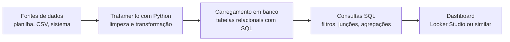

## Visão Geral do Conceito

O projeto de bloco é a trilha prática que conecta, em um único cenário, o que você aprende em <mark style="background-color: #242424; padding: 2px 4px; border-radius: 3px; color: inherit;">`Python`</mark>, <mark style="background-color: #242424; padding: 2px 4px; border-radius: 3px; color: inherit;">`SQL`</mark> e visualização de dados com ferramentas como <mark style="background-color: #242424; padding: 2px 4px; border-radius: 3px; color: inherit;">`Looker Studio`</mark>.  
Em vez de estudar cada disciplina de forma isolada, você aplica esses conhecimentos em um mini‑projeto de dados que se aproxima mais de um ambiente real de trabalho.

O objetivo desta lição é alinhar expectativas sobre o projeto de bloco de **Fundamentos de Processamento de Dados**, mostrar como as peças se conectam e preparar você para aproveitar melhor as aulas práticas e os testes de performance.

## Modelo Mental

Pense no projeto de bloco como um **simulador leve de projeto de dados real**.  
Você não está apenas “fazendo exercícios de linguagem”, mas treinando a forma de pensar de alguém que trabalha com dados em empresa: entender o problema, desenhar um fluxo, escolher ferramentas, escrever consultas e scripts simples e, por fim, entregar um resultado visual.

Um bom modelo mental é enxergar o projeto como um **pipeline**:

- **Entrada**: dados vindos de planilhas, sistemas ou arquivos.
- **Processamento**: limpeza, transformação e combinação desses dados com <mark style="background-color: #242424; padding: 2px 4px; border-radius: 3px; color: inherit;">`Python`</mark> e <mark style="background-color: #242424; padding: 2px 4px; border-radius: 3px; color: inherit;">`SQL`</mark>.
- **Saída**: dashboards e relatórios em <mark style="background-color: #242424; padding: 2px 4px; border-radius: 3px; color: inherit;">`Looker Studio`</mark> ou ferramenta similar.

Você é avaliado não só pela sintaxe, mas por conseguir **contar uma história de dados** coerente: onde os dados estão, o que precisa ser calculado e como isso aparece para o usuário final.

## Mecânica Central

Na prática, o projeto de bloco deste semestre funciona em torno de algumas ideias principais:

- **Etapas graduais em vez de um único grande entregável**: em vez de construir um único projeto longo desde o primeiro dia, você passa por etapas menores, muitas vezes em sessões de *live coding* avaliadas (testes de performance).
- **Integração entre disciplinas**: cada disciplina aprofunda sua parte (por exemplo, sintaxe de <mark style="background-color: #242424; padding: 2px 4px; border-radius: 3px; color: inherit;">`Python`</mark>), mas o projeto de bloco obriga a “ligar os pontos” entre elas.
- **Foco em fundamentos de dados**: entender **como dados fluem** entre arquivos, banco e dashboards é mais importante do que usar recursos avançados de qualquer ferramenta.

Um fluxo típico que você irá construir pode ser representado assim:



Esse diagrama resume o tipo de raciocínio que o projeto de bloco quer desenvolver: sempre saber **onde** o dado está, **o que** é feito com ele e **como** isso vira um resultado visual ou de negócio.

## Uso Prático

Ao longo do semestre, você deve usar o projeto de bloco para aproximar o conteúdo das disciplinas do seu contexto profissional:

- Se você já trabalha em empresa, pode propor **cenários reais simplificados** (por exemplo, relatórios de vendas, atendimento ou estoque) como base para o seu mini‑projeto.
- Se ainda não trabalha, pode usar dados públicos ou exemplos próximos do dia a dia (por exemplo, acompanhamento de estudos, controle financeiro simples, registros de chamados).

Alguns exemplos concretos de uso do projeto de bloco:

- Carregar uma planilha de vendas com <mark style="background-color: #242424; padding: 2px 4px; border-radius: 3px; color: inherit;">`Python`</mark>, limpar campos vazios e salvar em um arquivo pronto para importar em um banco de dados.
- Escrever consultas em <mark style="background-color: #242424; padding: 2px 4px; border-radius: 3px; color: inherit;">`SQL`</mark> que calculam faturamento mensal, ticket médio e produtos mais vendidos.
- Montar um dashboard com gráfico de linha (eixo tempo) e tabela detalhada usando <mark style="background-color: #242424; padding: 2px 4px; border-radius: 3px; color: inherit;">`Looker Studio`</mark> ou ferramenta similar, conectando diretamente às consultas.

Ao usar o projeto de bloco dessa forma, você transforma cada aula teórica em um **passo a mais** em um projeto que poderia, com ajustes, ser mostrado em uma entrevista ou no seu portfólio.

## Erros Comuns

- **Tratar o projeto como um conjunto de exercícios desconectados**  
  Ficar apenas “resolvendo questões” sem amarrar tudo em um cenário único de dados faz você perder o principal ganho do projeto de bloco, que é pensar de ponta a ponta.

- **Começar pela ferramenta em vez do problema**  
  Abrir o <mark style="background-color: #242424; padding: 2px 4px; border-radius: 3px; color: inherit;">`Looker Studio`</mark> antes de entender quais métricas e filtros fazem sentido leva a dashboards bonitos mas pouco úteis.

- **Ignorar a qualidade dos dados**  
  Escrever consultas e gráficos em cima de dados sujos (valores faltantes, tipos errados, datas inconsistentes) gera resultados enganosos. A etapa de limpeza com <mark style="background-color: #242424; padding: 2px 4px; border-radius: 3px; color: inherit;">`Python`</mark> é parte essencial do projeto, não “detalhe”.

- **Querer usar recursos avançados cedo demais**  
  Antes de pensar em *joins* muito complexos ou visualizações sofisticadas, garanta que o pipeline básico (carregar, limpar, salvar, consultar, visualizar) está funcionando.

## Visão Geral de Debugging

Quando algo der errado no seu projeto de bloco, pense em **debugging de fluxo**, não só em debugging de código:

1. **Verifique a entrada**  
   Os arquivos ou tabelas têm os campos esperados? Os tipos de dados estão corretos (datas, números, textos)?
2. **Verifique o processamento intermediário**  
   O script em <mark style="background-color: #242424; padding: 2px 4px; border-radius: 3px; color: inherit;;">`Python`</mark> está realmente produzindo o arquivo ou tabela com as colunas que a próxima etapa espera?
3. **Verifique as consultas**  
   A consulta em <mark style="background-color: #242424; padding: 2px 4px; border-radius: 3px; color: inherit;};">`SQL`</mark> está filtrando demais ou de menos? Os *joins* estão corretos?
4. **Verifique a visualização**  
   O gráfico está usando a dimensão e a métrica certas? O filtro de data não está escondendo dados importantes?

Uma boa prática é manter **amostras pequenas de dados** para testes rápidos e só depois aplicar o fluxo completo em volumes maiores.

## Principais Pontos

- O projeto de bloco é um **exercício guiado de projeto de dados**, não apenas um conjunto de exercícios de sintaxe.
- Você usa <mark style="background-color: #242424; padding: 2px 4px; border-radius: 3px; color: inherit;">`Python`</mark>, <mark style="background-color: #242424; padding: 2px 4px; border-radius: 3px; color: inherit;">`SQL`</mark> e visualização para construir um **pipeline de dados completo**, ainda que simples.
- A avaliação considera sua capacidade de **integrar disciplinas**, entender o problema e entregar algo que faria sentido em um contexto profissional.
- Debuggar o projeto significa seguir o caminho dos dados, da entrada até o dashboard, identificando em qual etapa o problema aparece.

## Preparação para Prática

Depois desta lição, você deve ser capaz de:

- Descrever em poucas linhas o objetivo do projeto de bloco de fundamentos de dados.
- Rascunhar um pipeline simples que envolva arquivos, banco de dados e dashboard.
- Escolher um pequeno cenário de dados (real ou fictício) que possa servir de base para o seu mini‑projeto ao longo do semestre.

No Laboratório de Prática a seguir, você irá começar a **desenhar e documentar** esse pipeline, preparando o terreno para as próximas lições mais técnicas de <mark style="background-color: #242424; padding: 2px 4px; border-radius: 3px; color: inherit;">`Python`</mark> e <mark style="background-color: #242424; padding: 2px 4px; border-radius: 3px; color: inherit;">`SQL`</mark>.

## Laboratório de Prática

### Exercício Easy — Desenhando seu primeiro pipeline

Escolha um cenário simples de dados (por exemplo, vendas em uma loja pequena, controle de estudos, controle financeiro pessoal) e descreva, em código, as etapas principais do pipeline do seu projeto de bloco.

Use o esqueleto abaixo e complete os trechos marcados com `TODO`:

```python
SCENARIO_DESCRIPTION = "Controle simples de vendas em uma loja de bairro"


def describe_pipeline() -> list[str]:
    """
    Retorna uma lista de etapas do pipeline de dados do seu projeto de bloco.
    A lista deve seguir a ordem em que os dados passam pelo sistema.
    """
    steps: list[str] = []

    # TODO: adicionar pelo menos 4 etapas, por exemplo:
    # - "Coletar dados de vendas em uma planilha CSV"
    # - "Limpar e padronizar os dados com Python"
    # - "Carregar dados em uma tabela no banco"
    # - "Criar consultas SQL para métricas principais"
    # - "Montar dashboard com gráficos e filtros"

    return steps


if __name__ == "__main__":
    for step in describe_pipeline():
        print(f"- {step}")
```

O arquivo deve executar sem erro mesmo antes de você preencher os `TODO` (a saída pode ser vazia inicialmente).

### Exercício Medium — Rascunhando consultas para o dashboard

Imagine que os dados do seu cenário foram carregados em uma tabela `vendas`.  
Escreva consultas em <mark style="background-color: #242424; padding: 2px 4px; border-radius: 3px; color: inherit;">`SQL`</mark> que poderiam alimentar gráficos e tabelas do seu dashboard.

Complete os trechos marcados como `TODO`:

```sql
-- TODO: completar a consulta para faturamento total por mês
SELECT
    /* TODO: escolher coluna de data ou mês */ AS mes,
    SUM(/* TODO: coluna de valor da venda */) AS faturamento_total
FROM vendas
/* TODO: se necessário, ajustar agrupamento ou filtros */
GROUP BY mes;

-- TODO: consulta para produtos mais vendidos
SELECT
    /* TODO: coluna de identificação do produto */ AS produto,
    COUNT(*) AS quantidade_vendida
FROM vendas
GROUP BY produto
ORDER BY quantidade_vendida DESC;
```

O foco aqui é pensar **quais perguntas de negócio** seu dashboard precisa responder, traduzindo isso em consultas.

### Exercício Hard — Conectando tudo em um mini‑roteiro de projeto

Agora, crie um pequeno roteiro em <mark style="background-color: #242424; padding: 2px 4px; border-radius: 3px; color: inherit;">`Python`</mark> que documente, de forma executável, as responsabilidades de cada etapa do seu projeto de bloco.

Use o esqueleto abaixo:

```python
from dataclasses import dataclass
from typing import Callable, List


@dataclass
class Step:
    name: str
    description: str
    owner: str  # ex.: "Python", "SQL", "Dashboard"


def build_project_steps() -> List[Step]:
    steps: List[Step] = []

    # TODO: adicionar pelo menos 5 etapas reais do seu projeto de bloco,
    # distribuindo responsabilidades entre Python, SQL e dashboard.
    # Exemplo:
    # steps.append(Step(
    #     name="Importar planilha de vendas",
    #     description="Ler arquivo CSV bruto enviado pelo time comercial.",
    #     owner="Python",
    # ))

    return steps


def summarize_pipeline(steps: List[Step]) -> None:
    print("Resumo do pipeline do projeto de bloco:")
    for i, step in enumerate(steps, start=1):
        print(f"{i}. [{step.owner}] {step.name} - {step.description}")


if __name__ == "__main__":
    pipeline_steps = build_project_steps()
    summarize_pipeline(pipeline_steps)
```

Esse roteiro pode servir como documentação inicial do seu projeto para ser compartilhado com colegas, professores ou em uma futura apresentação.

<!-- CONCEPT_EXTRACTION
concepts:
  - projeto de bloco
  - pipeline de dados
  - integração de disciplinas
  - ferramentas de dados
skills:
  - Desenhar um pipeline simples de dados de ponta a ponta
  - Relacionar Python, SQL e visualização dentro de um mesmo projeto
  - Traduzir perguntas de negócio em consultas e métricas
examples:
  - projeto-bloco-pipeline-simples
  - projeto-bloco-consultas-dashboard
  - projeto-bloco-roteiro-documentado
-->

<!-- EXERCISES_JSON
[
  {
    "id": "projeto-bloco-pipeline-simples",
    "slug": "projeto-bloco-pipeline-simples",
    "difficulty": "easy",
    "title": "Desenhar o primeiro pipeline do projeto de bloco",
    "discipline": "projeto-bloco",
    "editorLanguage": "python",
    "tags": ["projeto-bloco", "pipeline-de-dados", "python"],
    "summary": "Completar uma função Python que lista as etapas principais do pipeline de dados do projeto de bloco."
  },
  {
    "id": "projeto-bloco-consultas-dashboard",
    "slug": "projeto-bloco-consultas-dashboard",
    "difficulty": "medium",
    "title": "Esboçar consultas para o dashboard do projeto",
    "discipline": "projeto-bloco",
    "editorLanguage": "sql",
    "tags": ["projeto-bloco", "sql", "dashboard"],
    "summary": "Escrever consultas SQL que calculam métricas básicas para alimentar um dashboard de vendas."
  },
  {
    "id": "projeto-bloco-roteiro-documentado",
    "slug": "projeto-bloco-roteiro-documentado",
    "difficulty": "hard",
    "title": "Documentar o pipeline do projeto de bloco em código",
    "discipline": "projeto-bloco",
    "editorLanguage": "python",
    "tags": ["projeto-bloco", "documentacao", "pipeline-de-dados"],
    "summary": "Modelar as etapas do pipeline do projeto de bloco em uma estrutura de dados Python e imprimir um resumo organizado."
  }
]
-->

