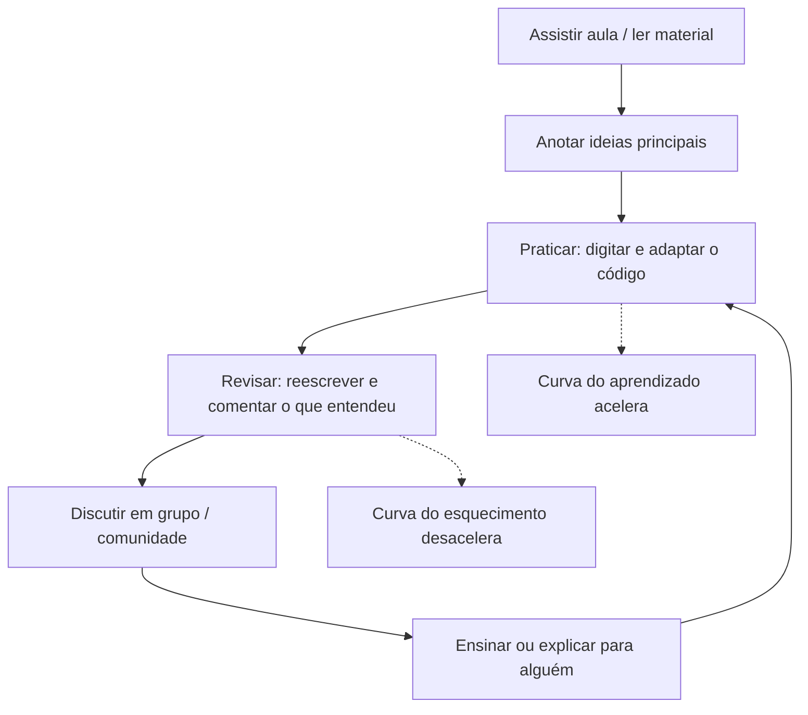

## Visão Geral do Conceito

Esta lição apresenta **por que aprender a programar** e **por que a disciplina começa com <mark style="background-color: #242424; padding: 2px 4px; border-radius: 3px; color: inherit;">`Python`</mark>** como primeira linguagem.  
Vamos conectar os objetivos da disciplina, o modelo de avaliação e os princípios de estudo à realidade de quem está iniciando em Análise e Desenvolvimento de Sistemas (ADS) e processamento de dados.

Ao final, você terá um mapa mental claro: o que é programação, qual o papel de <mark style="background-color: #242424; padding: 2px 4px; border-radius: 3px; color: inherit;">`Python`</mark> nesse cenário e como organizar sua rotina para realmente aprender, e não só “assistir aula”.

## Modelo Mental

### Programar como ferramenta e como esporte

Programação é, ao mesmo tempo:

- Uma **ferramenta**: você usa código para automatizar tarefas, analisar dados, integrar sistemas, criar APIs, construir dashboards e resolver problemas reais de negócio.
- Um **esporte/arte**: escrever código é como resolver quebra‑cabeças. Existem várias soluções possíveis para o mesmo problema, com diferentes estilos, paradigmas e níveis de eficiência.

Um bom modelo mental para programação é pensar em **dar instruções precisas para um agente extremamente obediente, porém literal**: o computador faz exatamente o que você manda, não o que você “quis dizer”.

### Papel do aluno em EAD: você é o protagonista

Na educação presencial tradicional, o professor costuma ser o ator principal; no modelo de educação a distância/híbrido apresentado pelo professor Gesiel, **o aluno passa a ser o protagonista**:

- Você escolhe horários, organiza rotina e decide quantas vezes revisa o conteúdo.
- O professor e o material (trilhas, vídeos, livros) são **guias**, não a única fonte de conhecimento.
- Sem prática deliberada e auto‑gestão, a disciplina vira apenas mais um vídeo na sua fila de streaming.

> **Regra:** nesta disciplina, assistir à aula é o ponto de partida — a aprendizagem acontece quando você pratica, revisa, discute e tenta explicar para outras pessoas.

### Curva do aprendizado e curva do esquecimento

Duas ideias centrais da aula de contexto explicam por que a disciplina insiste em prática contínua:

- **Curva do aprendizado**: no começo a evolução é lenta (sensação de “não sei nada”), depois acelera e, com o tempo, chega a um platô de proficiência. Esse salto só acontece **com várias tentativas**: escrever código, errar, corrigir, refatorar.
- **Curva do esquecimento (Ebbinghaus)**: se você não revisa, a retenção cai rapidamente — em poucos dias você esquece quase tudo. Revisões espaçadas (1 dia, 3 dias, 1 semana, 1 mês) “empurram” a curva para cima.

Esses modelos justificam:

- A existência de TPs e AT ao longo de 11 semanas.
- A recomendação explícita de **digitar o código**, não apenas copiar.
- A ênfase do professor em comunidades, grupos de estudo e ensino entre pares.

### Diagrama: ciclo de aprendizado em programação



## Mecânica Central

### O que é programação?

De forma operacional, **programar** é definir, passo a passo, o que o computador deve fazer para resolver um problema, usando uma linguagem formal como <mark style="background-color: #242424; padding: 2px 4px; border-radius: 3px; color: inherit;">`Python`</mark>.  
Para isso você combina:

- **Dados** (números, textos, datas, listas, dicionários…).
- **Operações** (cálculos, comparações, acesso a estruturas de dados).
- **Controle de fluxo** (decisões, laços de repetição, chamadas de funções).

Ao longo da disciplina, esses blocos aparecerão como:

- Primeiros programas, operadores matemáticos e fundamentos de <mark style="background-color: #242424; padding: 2px 4px; border-radius: 3px; color: inherit;">`strings`</mark>.
- Entrada de usuário e verificação de valores.
- Estruturas condicionais, repetições e listas.
- Primeiras funções e modularização de código.

### O que é Python e por que começar por ele?

Da aula de contexto, consolidamos as características mais relevantes de <mark style="background-color: #242424; padding: 2px 4px; border-radius: 3px; color: inherit;">`Python`</mark> para um estudante de ADS:

- **Linguagem de alto nível**: você escreve próximo da forma como pensa o problema, sem se preocupar com detalhes de memória e registradores.
- **Multiplataforma**: roda em <mark style="background-color: #242424; padding: 2px 4px; border-radius: 3px; color: inherit;">`Unix`</mark>, <mark style="background-color: #242424; padding: 2px 4px; border-radius: 3px; color: inherit;">`Windows`</mark> e outros sistemas sem mudar o código.
- **Multiparadigma**: suporta estilos procedurais, orientados a objetos e funcionais.
- **Tipagem dinâmica e forte**:
  - Dinâmica: o tipo é decidido em tempo de execução.
  - Forte: a linguagem não deixa você misturar tipos incompatíveis (por exemplo, somar número com texto sem conversão).
- **Interpretada (com opção de empacotamento)**: ideal para ciclos rápidos de teste.
- **Open Source**: nenhuma taxa ou royalty para uso.

No contexto de processamento de dados:

- A comunidade é enorme e ativa (ex.: Python Brasil, Pythons regionais, bibliotecas de dados e IA).
- A biblioteca padrão é extensa (arquivos, rede, datas, <mark style="background-color: #242424; padding: 2px 4px; border-radius: 3px; color: inherit;">`json`</mark>, <mark style="background-color: #242424; padding: 2px 4px; border-radius: 3px; color: inherit;">`sqlite3`</mark>, etc.).
- Ecosistema forte em dados e IA (apesar de esta disciplina focar nos fundamentos de programação).

### Mecânica da disciplina e avaliação

A organização da disciplina, apresentada em aula, reforça a ideia de aprendizado progressivo:

- **Cronograma trimestral (11 semanas)**:
  - Semanas 1–9: conteúdo e prática guiada.
  - Semana 10: entrega do AT (trabalho avaliativo principal).
  - Semana 11: reentrega/reintegra do AT, se necessário.
- **Avaliação por competência**:
  - TPs (Testes de Performance) são pré‑requisitos e treinamento para o AT.
  - AT é obrigatório e determina o conceito final (como <mark style="background-color: #242424; padding: 2px 4px; border-radius: 3px; color: inherit;">`DNL`</mark>, <mark style="background-color: #242424; padding: 2px 4px; border-radius: 3px; color: inherit;">`DL`</mark>, etc.).
  - Entregas atrasadas perdem conceito máximo, mesmo que o conteúdo esteja correto.

> **Regra:** trate cada TP como um treino valioso para o AT — eles não “dão nota”, mas constroem a proficiência exigida na avaliação final.

## Uso Prático

### Exemplos reais de onde Python aparece

Alguns exemplos citados na aula (e amplamente conhecidos no mercado):

- Motores de busca e serviços web (a primeira versão do buscador do Google usou fortemente <mark style="background-color: #242424; padding: 2px 4px; border-radius: 3px; color: inherit;">`Python`</mark>).
- Sistemas bancários e modelos de <mark style="background-color: #242424; padding: 2px 4px; border-radius: 3px; color: inherit;">`machine learning`</mark> para recomendação, antifraude, churn e ofertas.
- Pipelines de dados, ETLs, APIs de dados e dashboards.
- Ferramentas científicas, automação de tarefas de escritório, scripts para manutenção de servidores.

Para você, estudante de fundamentos de processamento de dados, isso significa:

- O mesmo conhecimento de base (variáveis, condicionais, laços, funções) é reaproveitado em:
  - pequenos scripts para automatizar tarefas pessoais;
  - ETLs e pipelines de dados;
  - back‑ends de APIs;
  - notebooks de análise exploratória.

### Um exemplo simples inspirado na aula: relógio digital

Na aula, o professor mostra um **relógio digital** feito com Python e a biblioteca gráfica <mark style="background-color: #242424; padding: 2px 4px; border-radius: 3px; color: inherit;">`tkinter`</mark>.  
O código ilustra vários aspectos importantes:

- Importação de módulos (<mark style="background-color: #242424; padding: 2px 4px; border-radius: 3px; color: inherit;">`import tkinter as tk`</mark>, <mark style="background-color: #242424; padding: 2px 4px; border-radius: 3px; color: inherit;">`from time import strftime`</mark>).
- Criação de janelas e widgets.
- Uso de funções e atualização periódica com <mark style="background-color: #242424; padding: 2px 4px; border-radius: 3px; color: inherit;">`after`</mark>.

Versões futuras da disciplina vão retomar esse tipo de exemplo quando você já dominar os blocos básicos da linguagem.

## Erros Comuns

- **Acreditar que assistir aula é suficiente**  
  Ignorar a prática de digitar e adaptar o código faz com que a curva do esquecimento domine; poucas semanas depois, tudo parece “novo” de novo.

- **Depender demais de modelos de linguagem (LLMs) no início**  
  Usar uma LLM para gerar todas as soluções impede que você desenvolva o **pensamento computacional**: decompor problemas, criar algoritmos, prever comportamentos. Use a IA como apoio para explicar erros e revisar código, não como substituto para pensar.

- **Não ter rotina de estudo definida**  
  “Estudar quando der” quase sempre significa “estudar pouco e em blocos muito espaçados”. Sem consistência semanal, os TPs e o AT tornam‑se fontes de ansiedade em vez de consolidação do aprendizado.

- **Subestimar o tempo de maturação da curva de aprendizado**  
  Desistir logo nas primeiras dificuldades porque “não levo jeito” é, muitas vezes, apenas sinal de que você ainda está no trecho inicial da curva, onde o progresso é pouco visível.

## Visão Geral de Debugging

Mesmo sem escrever muito código nesta primeira lição, já vale adotar uma mentalidade de debugging:

- **Quando algo não faz sentido no conteúdo**:
  - Identifique exatamente onde está a dúvida (termo, exemplo, diagrama, parte da aula).
  - Volte ao trecho correspondente na trilha escrita ou na gravação.
  - Escreva com suas próprias palavras o que você entendeu — muitas vezes a confusão fica clara nesse processo.

- **Quando um conceito não “gruda”**:
  - Verifique se você já praticou o suficiente (ex.: escrevendo exemplos adicionais, criando pequenas variações).
  - Planeje revisões explícitas (1, 3, 7, 30 dias) no seu calendário, mesmo que sejam rápidas.

- **Quando o código não funciona** (nas próximas lições):
  - Leia a mensagem de erro completa e destaque termos técnicos.
  - Reproduza o erro em um exemplo mínimo.
  - Procure padrões: tipos incompatíveis, indentação, nomes de variáveis, uso incorreto de funções.

## Principais Pontos

- Programar é uma **ferramenta poderosa e uma forma de pensamento** que se aplica a praticamente qualquer área de tecnologia e dados.
- O modelo de EAD/híbrido da disciplina coloca **você** como protagonista: sem rotina, prática e revisão, o conteúdo se perde rapidamente.
- Curva do aprendizado e curva do esquecimento explicam por que é preciso **praticar, revisar, discutir e ensinar** para consolidar conhecimento.
- <mark style="background-color: #242424; padding: 2px 4px; border-radius: 3px; color: inherit;">`Python`</mark> é uma primeira linguagem estratégica: simples de ler, extremamente versátil e muito usada em dados, web e automação.
- TPs e ATs estruturam o trimestre para que você construa proficiência de forma progressiva, não em uma maratona de última hora.

## Preparação para Prática

Antes de partir para código mais intenso nas próximas lições, você deve ser capaz de:

- Explicar, em voz alta, **por que** está estudando programação e o que espera resolver com isso nos próximos anos.
- Apontar pelo menos **três usos concretos de Python** em dados ou sistemas que façam sentido para você.
- Desenhar (no papel ou em ferramenta digital) a **sua própria curva de aprendizado** esperada, anotando estratégias para mantê‑la em crescimento.
- Configurar um ambiente mínimo para praticar (IDE ou editor, versão de <mark style="background-color: #242424; padding: 2px 4px; border-radius: 3px; color: inherit;">`Python`</mark>, local ou online) e saber onde salvar/organizar seus arquivos de exercícios.

As atividades do Laboratório de Prática abaixo ajudam a transformar essas reflexões em ações concretas, já com um pouco de código.

## Laboratório de Prática

> **Importante:** os códigos abaixo são boilerplates **executáveis**, com lacunas marcadas como `TODO`. O objetivo é que você edite essas partes no Editor Integrado, testando e experimentando.

### Exercício Easy — Plano mínimo de estudo semanal

Crie um pequeno script que ajude você a planejar **quantas horas precisa estudar por semana** para minimizar a curva do esquecimento, considerando:

- Quantas aulas síncronas tem na semana.
- Quantas horas livres por dia você consegue dedicar à disciplina.
- Uma recomendação mínima de 30 minutos extras de prática por dia em que houver aula.

Use entradas simples de usuário e mostre um resumo no final.

```python
def calcular_horas_semanais(aulas_por_semana: int, horas_livres_por_dia: float) -> float:
    """
    Calcula uma estimativa de horas de estudo por semana.

    Recomendação básica:
    - Para cada aula síncrona, reservar pelo menos 1 hora extra de prática.
    - Em dias com aula, adicionar 0.5h (30 minutos) extras.
    """
    # TODO: implementar a regra descrita na docstring
    # Dica: pense na semana como tendo 7 dias e some somente os dias com aula.
    return 0.0


def main() -> None:
    print("=== Planejador simples de horas de estudo ===")
    try:
        aulas = int(input("Quantas aulas síncronas de Python você tem na semana? "))
        horas_livres = float(input("Em média, quantas horas livres por dia você consegue dedicar à disciplina? "))
    except ValueError:
        print("Entrada inválida. Use números, por favor.")
        return

    horas_semanais = calcular_horas_semanais(aulas, horas_livres)
    print(f"\nVocê deveria reservar pelo menos {horas_semanais:.1f} horas por semana para estudar Python.")
    print("Ajuste esse valor conforme sua realidade e outras disciplinas.")


if __name__ == "__main__":
    main()
```

### Exercício Medium — Simulador da curva do esquecimento

Implemente um programa que, dado um **tópico de estudo** (por exemplo, “strings em Python”), sugira datas relativas para revisão, inspiradas na curva do esquecimento:

- Revisão 1: 1 dia depois.
- Revisão 2: 3 dias depois.
- Revisão 3: 7 dias depois.
- Revisão 4: 30 dias depois.

Não se preocupe ainda com datas reais do calendário; pense apenas em “+1 dia”, “+3 dias” etc.

```python
REVIEW_OFFSETS_DIAS = [1, 3, 7, 30]


def gerar_plano_revisao(nome_topico: str) -> list[str]:
    """
    Gera descrições de revisões baseadas em offsets fixos (em dias).

    Exemplo de saída para 'strings em Python':
    - 'Revisar 'strings em Python' em +1 dia'
    - 'Revisar 'strings em Python' em +3 dias'
    ...
    """
    # TODO: criar uma lista de mensagens de revisão usando REVIEW_OFFSETS_DIAS
    # Use f-strings para montar as frases.
    return []


def main() -> None:
    print("=== Plano de revisão por curva do esquecimento ===")
    topico = input("Qual tópico você estudou hoje? ")
    revisoes = gerar_plano_revisao(topico)

    if not revisoes:
        print("Nenhuma revisão planejada ainda. Implemente a função gerar_plano_revisao().")
        return

    print("\nSugestão de revisões:")
    for linha in revisoes:
        print("-", linha)


if __name__ == "__main__":
    main()
```

### Exercício Hard — Diário de prática e motivação

Escreva um programa interativo que registre **minissedimentos diários de prática** de Python em um formato simples de texto.  
O programa deve:

- Perguntar o **dia da semana** e **quanto tempo você praticou** (em minutos).
- Pedir uma breve descrição do que você praticou (por exemplo: “fiz os exercícios de strings”).
- Salvar um registro em um arquivo local chamado <mark style="background-color: #242424; padding: 2px 4px; border-radius: 3px; color: inherit;">`diario_pratica.txt`</mark>.
- Relembrar a importância de comunidade: ao final, sugerir que você compartilhe o que aprendeu com alguém (grupo, fórum, colega).

```python
from pathlib import Path
from datetime import datetime


ARQUIVO_DIARIO = Path("diario_pratica.txt")


def registrar_entrada(dia_semana: str, minutos: int, descricao: str) -> None:
    """
    Registra uma linha no arquivo de diário com timestamp, dia, minutos e descrição.
    O arquivo é criado automaticamente se não existir.
    """
    # TODO: abrir o arquivo em modo append e escrever uma linha no formato:
    # [YYYY-MM-DD HH:MM] (dia_semana) minutos min - descricao
    # Dica: use datetime.now().strftime(...) para formar o timestamp.
    pass


def main() -> None:
    print("=== Diário de prática de Python ===")
    dia = input("Dia da semana (ex.: segunda, terça): ").strip()

    try:
        minutos = int(input("Quantos minutos você praticou hoje? "))
    except ValueError:
        print("Valor inválido de minutos. Use apenas números inteiros.")
        return

    descricao = input("Descreva em uma frase o que você praticou: ").strip()

    registrar_entrada(dia_semana=dia, minutos=minutos, descricao=descricao)

    print("\nEntrada registrada em", ARQUIVO_DIARIO.resolve())
    print("Lembrete: compartilhar o que você aprendeu com alguém aumenta muito a retenção :)")


if __name__ == "__main__":
    main()
```

<!-- CONCEPT_EXTRACTION
concepts:
  - programação como ferramenta
  - pensamento computacional
  - curva de aprendizado
  - curva do esquecimento
  - tipagem dinâmica e forte em Python
  - avaliação por competência
skills:
  - Planejar rotina de estudo consistente em programação
  - Relacionar uso de Python com problemas reais de dados e sistemas
  - Aplicar revisões espaçadas para reduzir o esquecimento
  - Interpretar estrutura de disciplina e avaliações para organizar estudos
examples:
  - relogio-digital-tkinter
  - plano-estudo-semanal-python
  - plano-revisao-curva-esquecimento
  - diario-pratica-python
-->

<!-- EXERCISES_JSON
[
  {
    "id": "python-plano-estudo-semanal",
    "slug": "python-plano-estudo-semanal",
    "difficulty": "easy",
    "title": "Planejar horas de estudo semanal em Python",
    "discipline": "python",
    "editorLanguage": "python",
    "tags": ["python", "rotina-de-estudo", "pensamento-computacional"],
    "summary": "Completar o script que estima quantas horas por semana dedicar à disciplina com base em aulas síncronas e tempo livre."
  },
  {
    "id": "python-plano-revisao-curva-esquecimento",
    "slug": "python-plano-revisao-curva-esquecimento",
    "difficulty": "medium",
    "title": "Gerar plano de revisão inspirado na curva do esquecimento",
    "discipline": "python",
    "editorLanguage": "python",
    "tags": ["python", "revisao", "curva-do-esquecimento"],
    "summary": "Implementar uma função que gera mensagens de revisão em diferentes offsets de dias para um tópico estudado."
  },
  {
    "id": "python-diario-pratica",
    "slug": "python-diario-pratica",
    "difficulty": "hard",
    "title": "Registrar um diário de prática de Python",
    "discipline": "python",
    "editorLanguage": "python",
    "tags": ["python", "arquivos", "rotina-de-estudo"],
    "summary": "Completar um script que grava em arquivo um diário de prática com dia, minutos e descrição das atividades realizadas."
  }
]
-->

