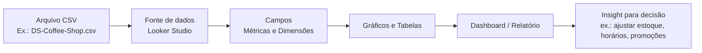

## Visão Geral do Conceito

A disciplina de **Introdução à Visualização de Dados e SQL** começa com uma pergunta simples: como transformar dados brutos em decisões melhores? Em muitas empresas, as pessoas precisam decidir entre confiar apenas em <mark style="background-color: #242424; padding: 2px 4px; border-radius: 3px; color: inherit;">`achismo`</mark> ou apoiar-se em dados. A visualização de dados existe exatamente para isso: conectar **negócio** e **dados** por meio de gráficos, painéis e relatórios.

Nesta primeira lição, o foco é entender **por que** visualizar dados é importante, **como** arquivos <mark style="background-color: #242424; padding: 2px 4px; border-radius: 3px; color: inherit;">`CSV`</mark> entram nessa história e **como** dar os primeiros passos no <mark style="background-color: #242424; padding: 2px 4px; border-radius: 3px; color: inherit;">`Looker Studio`</mark>. Usaremos um arquivo simples (como o `Ch1_ExampleCSV.csv` ou a planilha de um coffee shop) para construir nosso primeiro painel.

Ao final, você terá uma visão clara do **cronograma da disciplina**, do modelo de avaliação com <mark style="background-color: #242424; padding: 2px 4px; border-radius: 3px; color: inherit;">`TPs`</mark> e <mark style="background-color: #242424; padding: 2px 4px; border-radius: 3px; color: inherit;">`AT`</mark>, e dos primeiros passos práticos com dashboards.

## Modelo Mental

Pense em visualização de dados como **contar histórias com dados**:

- Os **dados brutos** (arquivos, tabelas, planilhas) são como anotações soltas.
- O **dashboard** é a história organizada que você conta para alguém entender o que está acontecendo.
- O **Looker Studio** é o palco onde essa história aparece: gráficos, filtros e indicadores.

Outra forma de enxergar:

- Sem visualização, uma empresa decide entre:
  - Pessoa 1 — que depende dos dados (planilhas, relatórios, gráficos).
  - Pessoa 2 — que decide só pelo instinto.
- Com visualização bem-feita, os dois mundos se aproximam: a experiência da pessoa é **alimentada** por evidências.

O arquivo <mark style="background-color: #242424; padding: 2px 4px; border-radius: 3px; color: inherit;">`CSV`</mark> entra como o **ponto de partida da jornada**: encontrar dados, entender seu formato e conectá-los ao Looker Studio é o primeiro passo para qualquer dashboard.

Visualização de dados, ao longo da disciplina, sempre vai percorrer três palavras:

- **História** — qual narrativa de negócio queremos contar?
- **Jornada** — qual caminho o usuário faz pelo relatório até chegar ao insight?
- **Entendimento e insights** — quais conclusões reais podemos tirar do painel?

## Mecânica Central

### 1. Fluxo básico de um dashboard com CSV

O fluxo mínimo que você precisa dominar nesta lição é:

1. Ter um arquivo <mark style="background-color: #242424; padding: 2px 4px; border-radius: 3px; color: inherit;">`CSV`</mark> com colunas bem definidas (por exemplo, data da venda, produto, quantidade, receita).
2. Acessar o <mark style="background-color: #242424; padding: 2px 4px; border-radius: 3px; color: inherit;">`Looker Studio`</mark> usando **a conta institucional do Infnet**.
3. Criar um **relatório** (no Looker Studio, o dashboard é chamado de relatório).
4. Adicionar uma **fonte de dados** via upload de arquivo <mark style="background-color: #242424; padding: 2px 4px; border-radius: 3px; color: inherit;">`CSV`</mark>.
5. Escolher **métricas** (valores que somamos, contamos) e **dimensões** (categorias pelas quais analisamos essas métricas).
6. Construir pelo menos um gráfico simples (ex.: vendas por dia, ou quantidade por produto).

Visualmente, o fluxo desta lição pode ser visto assim:



### 2. Formato CSV em prática

Um arquivo <mark style="background-color: #242424; padding: 2px 4px; border-radius: 3px; color: inherit;">`CSV`</mark> é um texto simples. Cada linha representa um registro; cada coluna é separada por vírgula ou ponto e vírgula. Exemplo simplificado, inspirado em uma cafeteria:

```text
date,product,category,quantity,total_revenue
2026-03-01,Cappuccino,Drinks,3,21.00
2026-03-01,Brownie,Food,2,18.00
2026-03-02,Latte,Drinks,5,35.00
```

Por ser um formato universal, quase toda ferramenta de dados (inclusive o Looker Studio) sabe **importar** esse tipo de arquivo sem esforço.

### 3. Acesso acadêmico e Infinite Online

No contexto do curso, o acesso ao Looker Studio e ao material didático é organizado assim:

- Você entra no **Infinite Online** com a conta de aluno.
- Dentro do bloco de entrada, acessa a disciplina **Introdução à Visualização de Dados e SQL**.
- A partir da aula, dos TPs e da trilha de aprendizado, recebe os links e arquivos (como `Ch1_ExampleCSV.csv` e `DS-Coffee-Shop.xlsx`).
- Sempre que o material exigir login no Looker Studio, você deve usar **o e-mail institucional do Infnet**, não o Gmail pessoal.

Esse cuidado garante que:

- O acesso está vinculado ao **mundo acadêmico** (alunos, professores, coordenação).
- Professores conseguem acompanhar atividades e organizar avaliações com <mark style="background-color: #242424; padding: 2px 4px; border-radius: 3px; color: inherit;">`TPs`</mark> e <mark style="background-color: #242424; padding: 2px 4px; border-radius: 3px; color: inherit;">`AT`</mark>.

### 4. Cronograma de 11 semanas

O trimestre é organizado em **11 semanas (etapas)**:

- Da **semana 1 à 9** — foco em conteúdo:
  - Etapas 1 a 4: Looker Studio (visualização com CSV e Google Sheets, preparação de dados, controles e compartilhamento).
  - Etapas 5 a 9: SQL (conceitos, ambiente de prática e consultas com operadores, `ORDER BY`, `GROUP BY`, `HAVING`, `DISTINCT`).
- **Semana 10** — entrega do <mark style="background-color: #242424; padding: 2px 4px; border-radius: 3px; color: inherit;">`AT`</mark>.
- **Semana 11** — dúvidas finais e, se necessário, reentrega do <mark style="background-color: #242424; padding: 2px 4px; border-radius: 3px; color: inherit;">`AT`</mark>.

Essa estrutura garante tempo para:

- Introdução conceitual e prática de visualização.
- Transição para SQL, que será a base dos dados em muitas situações reais.

### 5. Avaliação por competências (TP e AT)

A disciplina segue o modelo de **avaliação por competências**:

- <mark style="background-color: #242424; padding: 2px 4px; border-radius: 3px; color: inherit;">`TP`</mark> — Teste de Performance:
  - São **3 TPs** nesta disciplina.
  - **Todos** devem ser entregues e são **obrigatórios**.
  - Não valem pontos diretamente, mas são **pré-requisitos** para poder fazer o <mark style="background-color: #242424; padding: 2px 4px; border-radius: 3px; color: inherit;">`AT`</mark>.
  - Servem como **aquecimento prático**, alinhado ao que é cobrado depois.
- <mark style="background-color: #242424; padding: 2px 4px; border-radius: 3px; color: inherit;">`AT`</mark> — Assessment:
  - É a **prova/trabalho principal** da disciplina.
  - Precisa ser entregue dentro do prazo.
  - **Vale pontos** e compõe a nota final.

Na prática, quase tudo que aparece no <mark style="background-color: #242424; padding: 2px 4px; border-radius: 3px; color: inherit;">`TP1`</mark> está conectado ao que você vê nas primeiras aulas: acesso ao Looker Studio, upload de CSV, montagem de um primeiro relatório e registro em <mark style="background-color: #242424; padding: 2px 4px; border-radius: 3px; color: inherit;">`PDF`</mark> com prints e links.

## Uso Prático

### Exemplo 1 — Primeiro relatório com CSV de exemplo

Suponha que você recebeu o arquivo `Ch1_ExampleCSV.csv` com dados de vendas diárias. O passo a passo mínimo para criar o primeiro relatório no Looker Studio é:

1. Acessar `https://lookerstudio.google.com/navigation/reporting` usando o **e-mail institucional do Infnet**.
2. Clicar em **Criar** → **Relatório**.
3. Em **Adicionar dados**, escolher **Upload de arquivo CSV**.
4. Enviar o arquivo `Ch1_ExampleCSV.csv`.
5. Selecionar alguns campos:
   - Dimensão: `date`
   - Métrica: `total_revenue`
6. Inserir um gráfico de série temporal mostrando faturamento por dia.

Isso já produz um primeiro **dashboard mínimo**: você consegue ver, em segundos, dias com maior e menor faturamento.

### Exemplo 2 — Dashboard de cafeteria (DS-Coffee-Shop)

Com um arquivo semelhante ao `DS-Coffee-Shop.xlsx` convertido para CSV:

- Dimensões possíveis:
  - `date`
  - `product`
  - `category`
  - `store_location`
- Métricas possíveis:
  - `quantity`
  - `total_revenue`

Você pode montar:

- Um gráfico de barras com **receita por categoria** (`category` × `SUM(total_revenue)`).
- Uma tabela com **top 10 produtos por receita** (`product` ordenado por `SUM(total_revenue)`).
- Um filtro por `store_location` para comparar lojas.

Mesmo sem SQL ainda, essa combinação já começa a responder perguntas de negócio:

- Quais produtos mais vendem?
- Qual categoria traz mais receita?
- Qual loja merece reforço de estoque?

## Erros Comuns

- **Misturar contas de e-mail**  
  Tentar acessar o Looker Studio com o Gmail pessoal em vez do e-mail institucional do Infnet, perdendo acesso aos recursos configurados para o curso.

- **Ignorar o formato do CSV**  
  Subir arquivos com separador errado (por exemplo, vírgula vs. ponto e vírgula) sem conferir visualmente se as colunas foram detectadas corretamente.

- **Nomear mal o relatório**  
  Criar relatórios chamados apenas de “Relatório 1” ou “Teste”, o que atrapalha a organização, especialmente em TPs e projetos.

- **Focar só na estética**  
  Investir tempo apenas em cores e fontes, sem se perguntar qual pergunta de negócio o gráfico responde.

- **Deixar o TP para a última hora**  
  Esperar até o fim do prazo do TP para montar o dashboard, descobrindo tarde demais problemas de acesso, conta ou dados incompletos.

## Visão Geral de Debugging

Quando algo dá errado na construção do dashboard, siga uma linha de raciocínio sistemática:

1. **Conferir acesso e conta**
   - Estou logado com o **e-mail institucional** correto?
   - Tenho acesso ao Infinite Online e aos links do TP?
2. **Validar dados na origem**
   - O arquivo <mark style="background-color: #242424; padding: 2px 4px; border-radius: 3px; color: inherit;">`CSV`</mark> abre corretamente em um editor de texto ou planilha?
   - As colunas essenciais (data, valor, categoria) existem e estão no formato esperado?
3. **Checar mapeamento no Looker Studio**
   - Campos numéricos estão marcados como **métricas** (ex.: `NUMBER`, `CURRENCY`)?
   - Datas estão com tipo de data (`DATE`), não apenas `TEXT`?
4. **Revisar filtros e intervalos de data**
   - Há algum filtro escondendo todos os dados?
   - O intervalo de datas está correto (por exemplo, não está filtrando um período sem registros)?
5. **Registrar evidências**
   - Tire prints do problema para facilitar perguntas a monitores, professores ou colegas.

## Principais Pontos

- **Visualização de dados** conecta negócio e dados, transformando números em histórias e decisões.
- O formato **CSV** é a forma mais simples e universal de levar dados para ferramentas como o Looker Studio.
- O **Looker Studio** organiza tudo em relatórios (dashboards) com **fontes de dados**, **métricas** e **dimensões**.
- A disciplina tem um **cronograma de 11 semanas**, com 9 de conteúdo e 2 voltadas ao AT e suas revisões.
- **TPs são obrigatórios** e preparam direto para o **AT**, mas não substituem a aula ao vivo nem a prática contínua.

## Preparação para Prática

Depois desta lição, você deve ser capaz de:

- Explicar, em poucas frases, **por que** a visualização de dados é crucial para um cientista, engenheiro ou analista de dados.
- Abrir o Looker Studio com a conta correta e localizar o espaço de criação de relatórios.
- Conectar um arquivo <mark style="background-color: #242424; padding: 2px 4px; border-radius: 3px; color: inherit;">`CSV`</mark> a um relatório.
- Construir pelo menos **um gráfico simples** (por exemplo, faturamento diário) e **um filtro** (por produto ou categoria).
- Ler o enunciado de um TP e identificar quais partes já são cobertas pelo que você viu na aula.

Se algum desses pontos ainda parece nebuloso, volte nas seções de **Modelo Mental**, **Mecânica Central** e **Uso Prático** antes de ir para o Laboratório.

## Laboratório de Prática

### Desafio Easy — Primeiro gráfico a partir de um CSV

Objetivo: criar um gráfico simples de faturamento diário a partir de um arquivo CSV.

Enunciado:

- Considere um arquivo `coffee_shop_sales.csv` com colunas `date`, `product`, `category`, `quantity`, `total_revenue`.
- No Looker Studio, crie um relatório chamado **"Meu Primeiro Relatório — Coffee Shop"**.
- Conecte o arquivo CSV como fonte de dados.
- Adicione um gráfico de série temporal mostrando `SUM(total_revenue)` por `date`.
- Adicione um filtro por `category`.

Use o bloco abaixo apenas como referência textual dos campos esperados (não será executado no Looker Studio, mas ajuda a documentar o esquema de dados):

```sql
-- TODO: documentar os campos do CSV usado no dashboard
-- Tabela lógica: coffee_shop_sales
-- Colunas principais:
--   date (DATE)
--   product (TEXT)
--   category (TEXT)
--   quantity (NUMBER)
--   total_revenue (NUMBER)
```

### Desafio Medium — Comparar categorias de produto

Objetivo: enxergar quais categorias trazem mais receita usando o mesmo conjunto de dados.

Enunciado:

- Reutilize o relatório anterior ou crie outro chamado **"Coffee Shop — Categorias"**.
- Crie um gráfico de barras com:
  - Dimensão: `category`
  - Métrica: `SUM(total_revenue)`
- Ordene as barras da maior para a menor receita.
- Adicione um filtro de intervalo de datas para analisar apenas um mês específico.

No editor de exercícios do ISS, use o bloco abaixo para esboçar uma query SQL que você **poderia** usar em um banco relacional que gerasse esses mesmos dados:

```sql
-- TODO: completar a query que calcula receita por categoria
SELECT
  category,
  SUM(total_revenue) AS total_revenue
FROM coffee_shop_sales
-- TODO: adicionar filtro de datas adequado, por exemplo, apenas um mês
GROUP BY category
ORDER BY total_revenue DESC;
```

### Desafio Hard — Storytelling de negócio em uma única página

Objetivo: produzir uma página de dashboard que conte uma história coerente sobre o desempenho da cafeteria.

Enunciado:

- Crie um relatório chamado **"Coffee Shop — Visão Geral"**.
- A partir do mesmo CSV:
  - Mostre **faturamento total por mês**.
  - Destaque as **3 categorias com maior receita total**.
  - Exiba os **5 produtos mais vendidos** em quantidade.
  - Inclua pelo menos **um controle/filtro** (por exemplo, por loja, se existir `store_location`).
- Pense em como organizar os gráficos na tela de forma que alguém não técnico entenda, em menos de um minuto, **o que está indo bem** e **o que merece atenção**.

Use o bloco abaixo como ponto de partida para estruturar as consultas que alimentariam esse painel em um banco SQL:

```sql
-- TODO: montar consultas que dariam suporte ao storytelling do dashboard

-- 1) Receita por mês
SELECT
  DATE_TRUNC('month', date) AS month,
  SUM(total_revenue)        AS monthly_revenue
FROM coffee_shop_sales
GROUP BY month
ORDER BY month;

-- 2) Top categorias por receita
SELECT
  category,
  SUM(total_revenue) AS total_revenue
FROM coffee_shop_sales
GROUP BY category
ORDER BY total_revenue DESC
LIMIT 3;

-- 3) Top produtos por quantidade vendida
SELECT
  product,
  SUM(quantity) AS total_quantity
FROM coffee_shop_sales
GROUP BY product
ORDER BY total_quantity DESC
LIMIT 5;
```

<!-- CONCEPT_EXTRACTION
concepts:
  - visualização de dados com dashboards
  - fluxo dados → fonte → gráficos → insight
  - arquivos CSV como fonte de dados
  - métricas e dimensões em ferramentas de BI
  - modelo de avaliação com TPs e AT
skills:
  - Conectar um arquivo CSV ao Looker Studio usando conta institucional
  - Escolher métricas e dimensões adequadas para um primeiro dashboard
  - Ler e interpretar o enunciado de TPs relacionados a visualização de dados
  - Diagnosticar problemas básicos de dados em dashboards (tipos, filtros, datas)
examples:
  - looker-csv-first-dashboard
  - coffee-shop-category-analysis
  - coffee-shop-storytelling-dashboard
-->

<!-- EXERCISES_JSON
[
  {
    "id": "visualizar-dados-csv-looker-easy",
    "slug": "visualizar-dados-csv-looker-easy",
    "difficulty": "easy",
    "title": "Primeiro gráfico com CSV no Looker Studio",
    "discipline": "visualizacao-sql",
    "editorLanguage": "sql",
    "tags": ["visualizacao-dados", "looker-studio", "csv"],
    "summary": "Conectar um arquivo CSV simples ao Looker Studio e criar um gráfico de faturamento diário com filtro por categoria."
  },
  {
    "id": "visualizar-dados-csv-looker-medium",
    "slug": "visualizar-dados-csv-looker-medium",
    "difficulty": "medium",
    "title": "Comparar categorias de produto no dashboard",
    "discipline": "visualizacao-sql",
    "editorLanguage": "sql",
    "tags": ["visualizacao-dados", "looker-studio", "metricas"],
    "summary": "Criar um gráfico de barras por categoria de produto, ordenado por receita, com filtro de intervalo de datas."
  },
  {
    "id": "visualizar-dados-csv-looker-hard",
    "slug": "visualizar-dados-csv-looker-hard",
    "difficulty": "hard",
    "title": "Storytelling de negócio com dashboard da coffee shop",
    "discipline": "visualizacao-sql",
    "editorLanguage": "sql",
    "tags": ["visualizacao-dados", "storytelling", "sql"],
    "summary": "Montar uma página de dashboard que conte a história de desempenho de uma cafeteria, combinando gráficos e filtros coerentes."
  }
]
-->

