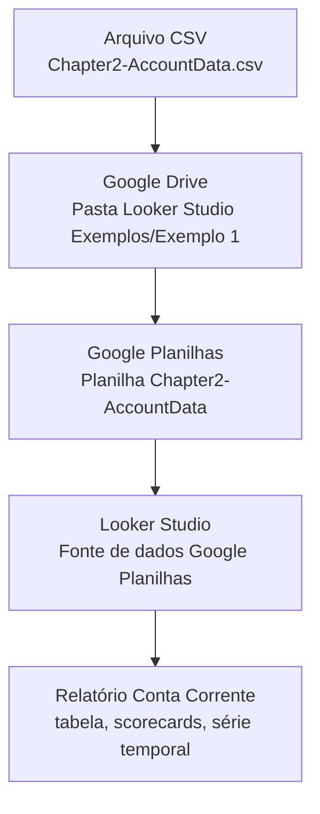

## Visão Geral do Conceito

Na Aula 1 você viu como **visualizar dados de um CSV simples** diretamente no <mark style="background-color: #242424; padding: 2px 4px; border-radius: 3px; color: inherit;">`Looker Studio`</mark>. Nesta aula, vamos um passo além: usar um conjunto realista de **transações bancárias** (`Chapter2-AccountData.csv`) para construir um painel de conta corrente com **tabela detalhada**, **scorecards** e **série temporal**.

O foco aqui é aprender a **preparar dados no Google Planilhas** e configurá-los corretamente no Looker Studio. Isso envolve limpar datas e valores monetários, definir o tipo correto de cada campo, escolher agregações adequadas e montar uma primeira página de relatório legível para alguém de negócio.

Ao final da lição, você terá um dashboard de conta corrente semelhante ao do livro de referência, adaptado para **Real brasileiro (R$)** e pronto para ser estendido nas próximas aulas (comparações de anos, filtros avançados e exploração interativa).

## Modelo Mental

Pense no fluxo desta aula como uma **cozinha de dados**:

- O arquivo <mark style="background-color: #242424; padding: 2px 4px; border-radius: 3px; color: inherit;">`Chapter2-AccountData.csv`</mark> é o **ingrediente cru**: transações de uma conta bancária com datas, descrições, categorias e valores.
- O <mark style="background-color: #242424; padding: 2px 4px; border-radius: 3px; color: inherit;">`Google Drive`</mark> e o <mark style="background-color: #242424; padding: 2px 4px; border-radius: 3px; color: inherit;">`Google Planilhas`</mark> são a **bancada de preparo**: onde você organiza, padroniza e formata os dados.
- O <mark style="background-color: #242424; padding: 2px 4px; border-radius: 3px; color: inherit;">`Looker Studio`</mark> é o **fogão e o prato final**: onde os dados viram visualizações que contam a história do saldo, dos depósitos e dos saques.

Uma conta bancária tem duas perspectivas complementares:

- **Visão de detalhe** — cada transação com data, descrição, categoria e valor.
- **Visão de resumo** — indicadores como saldo médio, saldo mínimo/máximo e tendência ao longo do tempo.

O dashboard desta aula é justamente a **ponte** entre essas duas perspectivas, usando:

- Uma **tabela** para detalhar transações.
- **Scorecards** para destacar saldos médios/mínimos/máximos.
- Uma **série temporal** para enxergar o comportamento do saldo ao longo de meses.

## Mecânica Central

### 1. Fluxo de dados: do CSV ao dashboard

O pipeline dessa aula pode ser resumido assim:



Cada etapa tem um papel específico:

- **CSV** — saída original do banco online, com campos como `Transaction Number`, `Date`, `Description`, `Memo`, `Category`, `Transaction Amount`, `Balance`, `Temp 1`.
- **Google Planilhas** — organiza e formata os dados, inclusive conversão de moeda e datas.
- **Fonte de dados no Looker Studio** — mapeia colunas para tipos (texto, moeda, data) e define agregações padrão.
- **Relatório** — monta os gráficos e componentes visuais para análise.

### 2. Preparando a planilha no Google Drive

Passos principais descritos no guia:

1. Acesse <mark style="background-color: #242424; padding: 2px 4px; border-radius: 3px; color: inherit;">`https://drive.google.com`</mark> com sua conta acadêmica.
2. Crie a pasta `Looker Studio Exemplos` e, dentro dela, a pasta `Exemplo 1`.
3. Envie o arquivo <mark style="background-color: #242424; padding: 2px 4px; border-radius: 3px; color: inherit;">`Chapter2-AccountData.csv`</mark> para essa pasta.
4. Clique duas vezes no arquivo e escolha **Abrir com → Planilhas Google**.

Na **Planilha Google**:

- Verifique se cada coluna está corretamente alinhada:
  - `Transaction Number` — identificador da transação.
  - `Date` — data no padrão local.
  - `Description` e `Memo` — textos descritivos.
  - `Category` — categoria da despesa/receita.
  - `Transaction Amount` — valor da transação (positivo para depósito, negativo para saque).
  - `Balance` — saldo após a transação.

### 3. Limpeza e formatação de colunas

Para que o Looker Studio interprete corretamente **datas** e **valores monetários**, o guia orienta a:

- Na coluna `Date`:
  - Selecionar todas as células de data.
  - Menu <mark style="background-color: #242424; padding: 2px 4px; border-radius: 3px; color: inherit;">`Formatar → Número → Texto simples`</mark>.
  - Em seguida, ajustar alinhamento em <mark style="background-color: #242424; padding: 2px 4px; border-radius: 3px; color: inherit;">`Formatar → Alinhamento → Esquerda`</mark>.

- Na coluna `Transaction Amount`:
  - Selecionar todos os valores.
  - Aplicar formato de moeda em <mark style="background-color: #242424; padding: 2px 4px; border-radius: 3px; color: inherit;">`Formatar → Número → Moeda`</mark>.
  - Usar <mark style="background-color: #242424; padding: 2px 4px; border-radius: 3px; color: inherit;">`Editar → Localizar e substituir`</mark> para:
    - Remover vírgulas `,` usadas como separadores de milhar.
    - Trocar pontos `.` por vírgulas `,` quando necessário para o padrão brasileiro.

- Repetir o mesmo processo para a coluna `Balance`.

Esses ajustes garantem que, quando a planilha for usada como fonte de dados:

- `Transaction Amount` e `Balance` sejam tratados como **números (moeda)**.
- O Looker possa calcular somas, médias, mínimos e máximos corretamente.

### 4. Conectando a planilha ao Looker Studio

No Looker Studio:

1. Acesse `https://lookerstudio.google.com`.
2. Clique em **Relatório em branco**.
3. Na janela **Adicionar dados ao relatório**, escolha o conector **Google Planilhas**.
4. Em **Todos os itens**, selecione a planilha `Chapter2-AccountData`.
5. Confirme em **Adicionar ao relatório**.

Na tela de configuração de campos:

- Ajuste os tipos e agregações, seguindo o guia:
  - `Balance`
    - Tipo: **Moeda → BRL - Real brasileiro (R$)**.
    - Agregação padrão: **Médio** (média do saldo).
  - `Transaction Amount`
    - Tipo: **Moeda → BRL - Real brasileiro (R$)**.
    - Agregação padrão: **Soma** (total de transações).
  - `Transaction Number`
    - Tipo: **Texto** (não queremos somar ou fazer média deste campo).

Renomeie o relatório para algo significativo, por exemplo:

- <mark style="background-color: #242424; padding: 2px 4px; border-radius: 3px; color: inherit;">`Conta corrente – Exemplo prático do Looker Studio 1.0`</mark>.

### 5. Componentes visuais principais

O relatório desta aula combina três tipos de visualizações:

- **Tabela detalhada**:
  - Dimensões: `Date`, `Description`, `Memo`.
  - Métricas: `Transaction Amount`, `Balance`.
  - Ordenação: `Date` (decrescente) e, em seguida, `Balance`.
  - Estilo: ocultar números de linha, ajustar colunas aos dados.

- **Scorecards (Visão Geral)**:
  - Scorecard 1 — `Saldo Médio`:
    - Métrica: `AVG(Balance)`.
    - Cor de fundo: amarelo.
  - Scorecard 2 — `Saldo Máximo`:
    - Métrica: `MAX(Balance)`.
    - Cor de fundo: verde clara.
  - Scorecard 3 — `Saldo Mínimo`:
    - Métrica: `MIN(Balance)`.
    - Cor de fundo: vermelha clara.

- **Gráfico de série temporal suavizada**:
  - Dimensão: `Date`.
  - Métrica: `AVG(Balance)` com nome de exibição `Saldo Médio`.
  - Tratamento de dados ausentes com **Interpolação linear** para reduzir “quedas” artificiais abaixo de zero.

Esses três blocos criam uma narrativa:

1. Scorecards respondem: **“qual é o nível típico do saldo?”**  
2. A série temporal mostra: **“como o saldo evolui ao longo do tempo?”**  
3. A tabela explica: **“quais transações explicam esses movimentos?”**  

## Uso Prático

### Exemplo 1 — Preparando a planilha de conta corrente

Suponha que você acabou de baixar o `Chapter2-AccountData.csv` da página de recursos do livro. O fluxo mínimo para deixá-lo pronto no Google Planilhas é:

1. Enviar o CSV para a pasta `Looker Studio Exemplos/Exemplo 1` no Google Drive.
2. Abrir como `Planilhas Google`.
3. Ajustar formatação das colunas:
   - Garantir que `Date` use um formato de data coerente com o Brasil.
   - Remover símbolos de moeda e separadores de milhar em `Transaction Amount` e `Balance` antes de aplicar o formato de moeda.
4. Salvar e fechar a guia da planilha.

Depois disso, a planilha está pronta para se tornar uma **fonte de dados estável** para vários relatórios (1.0, 2.0, 3.0, etc.).

### Exemplo 2 — Relatório 1.0: visão básica da conta corrente

Objetivo: montar a primeira versão do relatório com tabela + scorecards + série temporal.

Passos principais (resumidos do guia):

1. Criar um relatório em branco e conectá-lo à planilha `Chapter2-AccountData`.
2. Ajustar tipos e agregações dos campos relevantes.
3. Inserir a **tabela** com:
   - Dimensões: `Date`, `Description`, `Memo`.
   - Métricas: `Transaction Amount`, `Balance`.
   - Ordenações: `Date` (decrescente) e `Balance` (crescente).
4. Adicionar **scorecards** para `Saldo Médio`, `Saldo Máximo` e `Saldo Mínimo` com cores distintas.
5. Criar a **série temporal suavizada** de `Saldo Médio` ao longo do tempo.

Esse relatório já permite responder perguntas como:

- Em quais períodos o saldo ficou mais crítico?
- Qual foi o saldo máximo atingido?
- Quais transações ocorreram nas datas mais problemáticas?

### Exemplo 3 — Cabeçalho, layout e seletor de período

O guia também sugere melhorar a **apresentação visual**:

- Adicionar um retângulo de cabeçalho com cor de fundo (por exemplo, azul) e texto com o nome da conta:  
  `Conta Corrente Chris Cooper`.
- Inserir o logo da conta/cliente (por exemplo, `ChrisCooperLogo.png`).
- Construir um **controle de período** no cabeçalho para filtrar um intervalo padrão (por exemplo, 2018–2019).

Esses detalhes ajudam a transformar um conjunto de gráficos soltos em um **relatório profissional** com identidade visual e filtros intuitivos.

## Erros Comuns

- **Não limpar símbolos de moeda e separadores**  
  Deixar `Transaction Amount` e `Balance` com `$`, vírgulas de milhar e pontos inconsistentes impede que o Looker trate os campos como números, quebrando somas e médias.

- **Tratar identificadores como números agregáveis**  
  Manter `Transaction Number` com tipo numérico e agregação padrão pode gerar totais sem sentido; esse campo deve ser tratado como texto.

- **Misturar datas como texto sem padronização**  
  Datas com formatos mistos (diferentes padrões de dia/mês/ano) produzem gráficos de séries temporais confusos ou vazios.

- **Esquecer de configurar agregações padrão**  
  Deixar `Balance` com agregação `Soma` distorce o conceito de saldo, que normalmente faz mais sentido como **média** ou valor no fim de um período.

- **Layout poluído**  
  Encher a página com muitos gráficos pequenos, sem hierarquia visual, dificulta a leitura rápida por parte do usuário de negócio.

## Visão Geral de Debugging

Quando o relatório da conta corrente não se comportar como esperado, siga esta sequência:

1. **Verifique a planilha**  
   - Abra o `Chapter2-AccountData` no Google Planilhas.
   - Confira se não há colunas duplicadas, cabeçalhos repetidos ou linhas extras no topo/rodapé.

2. **Cheque tipos e agregações na fonte de dados**  
   - Veja se `Transaction Amount` e `Balance` estão como moeda BRL.
   - Confirme as agregações padrão (`SUM` para montantes, `AVG` para saldo).

3. **Teste visualizações simples primeiro**  
   - Monte um gráfico de tabela com poucas colunas para validar se os dados aparecem.
   - Depois, adicione scorecards e séries temporais.

4. **Revise filtros de período e controles**  
   - Filtros de período muito restritos podem esconder todos os dados.
   - Certifique-se de que o controle de período está vinculado à dimensão de data correta.

5. **Compare com o guia**  
   - Volte aos passos do capítulo (2.1–2.4) e revise configurações críticas como nomes de exibição, tipos de dados e ordenações.

## Principais Pontos

- **Google Planilhas** é uma etapa fundamental para limpar e estruturar dados vindos de CSV antes de visualizá-los.
- Configurar **tipos de dados** e **agregações padrão** no Looker Studio é tão importante quanto montar os gráficos.
- Um bom dashboard de conta corrente combina **tabela detalhada**, **scorecards de resumo** e **série temporal**.
- Cabeçalho, cores e controles de período ajudam a transformar um conjunto de gráficos em um **relatório profissional**.
- A maior parte dos problemas vem da **qualidade dos dados de entrada**, não dos gráficos em si — por isso, preparação de dados é parte central da disciplina.

## Preparação para Prática

Depois desta lição, você deve ser capaz de:

- Organizar um dataset de conta corrente no Google Drive/Planilhas e deixá-lo limpo para uso.
- Conectar a planilha ao Looker Studio e configurar campos-chave (`Date`, `Transaction Amount`, `Balance`).
- Construir um relatório simples, porém útil, com tabela, scorecards e série temporal.
- Identificar rapidamente se um problema vem dos dados, da fonte ou da visualização.

Se algum desses itens ainda não estiver claro, volte às seções de **Mecânica Central** e **Uso Prático** antes de iniciar o Laboratório.

## Laboratório de Prática

### Desafio Easy — Limpar e formatar a planilha de conta corrente

Objetivo: deixar o `Chapter2-AccountData.csv` pronto no Google Planilhas para ser usado por qualquer relatório.

Enunciado:

- Crie as pastas `Looker Studio Exemplos/Exemplo 1` no seu Google Drive acadêmico.
- Envie o arquivo `Chapter2-AccountData.csv` e abra-o como Planilhas Google.
- Limpe e formate as colunas `Date`, `Transaction Amount` e `Balance` conforme descrito na lição.
- Garanta que todos os valores monetários estejam corretamente reconhecidos como moeda em R$.

Use o bloco abaixo apenas como *checklist codificado* das colunas esperadas:

```sql
-- TODO: conferir se a planilha tem exatamente estas colunas principais
-- Transaction Number (TEXT)
-- Date               (DATE)
-- Description        (TEXT)
-- Memo               (TEXT)
-- Category           (TEXT)
-- Transaction Amount (NUMBER / CURRENCY)
-- Balance            (NUMBER / CURRENCY)
```

### Desafio Medium — Montar o relatório Conta Corrente 1.0

Objetivo: construir o relatório básico com tabela, scorecards e série temporal.

Enunciado:

- No Looker Studio, crie um relatório em branco e conecte a planilha `Chapter2-AccountData`.
- Configure os campos:
  - `Balance` como moeda BRL com agregação padrão `AVG`.
  - `Transaction Amount` como moeda BRL com agregação padrão `SUM`.
  - `Transaction Number` como texto.
- Monte:
  - Uma **tabela** com `Date`, `Description`, `Memo`, `Transaction Amount`, `Balance`, ordenada por data (decrescente).
  - Três **scorecards**: `Saldo Médio`, `Saldo Máximo`, `Saldo Mínimo`.
  - Uma **série temporal suavizada** de `Saldo Médio`.

No editor integrado do ISS, use este esboço de consulta para documentar como você **validaria** os mesmos dados em SQL:

```sql
-- TODO: ajustar nomes de tabela/colunas conforme seu ambiente SQL
SELECT
  MIN(balance)  AS saldo_minimo,
  MAX(balance)  AS saldo_maximo,
  AVG(balance)  AS saldo_medio,
  SUM(amount)   AS total_transacoes
FROM account_transactions;
```

### Desafio Hard — Melhorar layout e experiência de leitura

Objetivo: transformar o relatório 1.0 em algo mais próximo de um dashboard usado por um gerente de conta.

Enunciado:

- Copie seu relatório 1.0 para uma nova versão chamada **"Conta Corrente – Exemplo prático 1.1"**.
- Ajuste:
  - **Tamanho da página** (largura/altura) para algo confortável (por exemplo, 900×700).
  - **Cabeçalho** com retângulo, título e, se quiser, um logo fictício.
  - **Scorecards** com cores de fundo coerentes e nomes de exibição claros.
  - **Controle de período** configurado para focar em um recorte de datas (por exemplo, apenas 2018).
- Certifique-se de que a página, ao ser aberta, conta uma história rápida: saldo atual, comportamento ao longo do tempo e lista recente de transações.

Use o bloco abaixo como um lugar para rascunhar como você documentaria as decisões de design do dashboard:

```markdown
<!-- TODO: documentar decisões de layout do dashboard de conta corrente
- Objetivo principal da página:
- Quais perguntas de negócio o painel responde em menos de 1 minuto:
- Justificativa das cores dos scorecards:
- Justificativa do intervalo de datas padrão:
-->
```

<!-- CONCEPT_EXTRACTION
concepts:
  - preparação de dados em planilhas para BI
  - conexão Google Planilhas → Looker Studio
  - scorecards, séries temporais e tabelas em dashboards
  - tipos de dados e agregações padrão em fontes de dados
skills:
  - Importar arquivos CSV para o Google Drive e convertê-los em Google Planilhas
  - Limpar campos de data e moeda para uso em dashboards
  - Configurar tipos e agregações de campos no Looker Studio
  - Construir relatórios básicos com tabela, scorecards e série temporal
examples:
  - bank-account-sheets-cleaning
  - bank-account-dashboard-v1
  - bank-account-dashboard-layout-improvement
-->

<!-- EXERCISES_JSON
[
  {
    "id": "conta-bancaria-google-sheets-easy",
    "slug": "conta-bancaria-google-sheets-easy",
    "difficulty": "easy",
    "title": "Limpar e formatar a planilha de conta corrente",
    "discipline": "visualizacao-sql",
    "editorLanguage": "sql",
    "tags": ["preparacao-dados", "google-planilhas", "csv"],
    "summary": "Importar o CSV de conta corrente para o Google Planilhas e formatar datas e valores monetários para uso em dashboards."
  },
  {
    "id": "conta-bancaria-google-sheets-medium",
    "slug": "conta-bancaria-google-sheets-medium",
    "difficulty": "medium",
    "title": "Construir o relatório Conta Corrente 1.0",
    "discipline": "visualizacao-sql",
    "editorLanguage": "sql",
    "tags": ["looker-studio", "scorecards", "series-temporais"],
    "summary": "Criar um relatório básico com tabela de transações, scorecards de saldo e série temporal do saldo médio."
  },
  {
    "id": "conta-bancaria-google-sheets-hard",
    "slug": "conta-bancaria-google-sheets-hard",
    "difficulty": "hard",
    "title": "Refinar layout e usabilidade do dashboard de conta corrente",
    "discipline": "visualizacao-sql",
    "editorLanguage": "sql",
    "tags": ["visualizacao-dados", "layout", "ux-dashboard"],
    "summary": "Aprimorar o layout do relatório de conta corrente com cabeçalho, controle de período e hierarquia visual clara."
  }
]
-->

