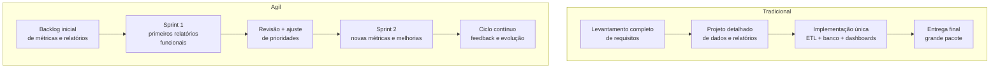

## Visão Geral do Conceito

Todo projeto profissional — inclusive projetos de dados — precisa de uma forma organizada de sair da ideia até a entrega de valor para o cliente.  
As **metodologias de projeto** são justamente esse conjunto de práticas que definem como o time planeja, executa, acompanha e entrega o trabalho.

Nesta lição, vamos comparar a **metodologia tradicional** (modelo em cascata) com a **metodologia ágil** e o <mark style="background-color: #242424; padding: 2px 4px; border-radius: 3px; color: inherit;">`Manifesto Ágil`</mark>, ligando esses conceitos ao seu **projeto de bloco** e a projetos de dados no mercado.

## Modelo Mental

Um bom modelo mental para metodologias de projeto é pensar em **como o valor aparece para o cliente ao longo do tempo**:

- Na **metodologia tradicional**, o projeto é como construir uma ponte: define-se tudo no início, segue-se uma sequência rígida de fases e só no fim o cliente “usa” a solução.
- Na **metodologia ágil**, o projeto é como manter e evoluir um aplicativo: o cliente recebe versões menores, frequentes, e o time ajusta o rumo a cada iteração.

Em projetos de dados isso significa escolher entre:

- Ter um **grande dashboard pronto só no final**, após meses de trabalho; ou
- Ter **relatórios menores e úteis desde cedo**, que vão ficando melhores a cada sprint.

O projeto de bloco usa essa visão para que você aprenda a **trabalhar em ciclos curtos**, sempre entregando algo que funciona, em vez de acumular tudo para o último dia.

## Mecânica Central

### 1. Metodologia Tradicional (cascata)

Na metodologia tradicional, o projeto passa por **fases sequenciais**, em geral com pouca volta atrás:

- **Iniciação**: justificativa do projeto, objetivo, escopo alto nível.
- **Planejamento detalhado**: requisitos, cronograma, orçamento, riscos.
- **Execução**: desenvolvimento ou construção da solução.
- **Monitoramento e controle**: acompanhar prazos, custos, qualidade.
- **Encerramento**: entrega final, aceite do cliente, documentação.

Em um projeto de dados isso pode significar:

- Meses definindo requisitos de todos os relatórios.
- Um grande esforço único para modelar o banco, construir ETL e dashboards.
- Usuário só interagindo com a solução quando tudo “termina”.

Esse modelo funciona melhor quando:

- O problema é muito bem conhecido e **muda pouco**.
- As regras regulatórias exigem documentação rígida.
- O custo de refazer é altíssimo (por exemplo, infraestrutura física).

### 2. Metodologia Ágil

Metodologias ágeis (como <mark style="background-color: #242424; padding: 2px 4px; border-radius: 3px; color: inherit;">`Scrum`</mark> e <mark style="background-color: #242424; padding: 2px 4px; border-radius: 3px; color: inherit;">`Kanban`</mark>) nasceram da necessidade de entregar software mais rápido e com maior capacidade de adaptação.

Algumas características centrais:

- Trabalho organizado em **iterações curtas** (sprints) ou fluxo contínuo.
- Lista priorizada de itens de trabalho (<mark style="background-color: #242424; padding: 2px 4px; border-radius: 3px; color: inherit;">`backlog`</mark>).
- Entregas frequentes de **incrementos funcionais** (por exemplo, um conjunto de relatórios já utilizáveis).
- Reuniões rápidas para alinhamento diário (<mark style="background-color: #242424; padding: 2px 4px; border-radius: 3px; color: inherit;">`daily`</mark>).
- Revisões e retrospectivas para ajustar processo e prioridades.

Em projetos de dados, isso se traduz, por exemplo, em:

- Primeira sprint focada em conectar a fonte de dados e entregar um relatório simples.
- Sprints seguintes adicionando métricas novas, segmentações, telas extras.
- Ajustes de escopo baseados em feedback: “esse gráfico não ajuda; precisamos enxergar por região, não por produto”.

### 3. Manifesto Ágil

O <mark style="background-color: #242424; padding: 2px 4px; border-radius: 3px; color: inherit;">`Manifesto Ágil`</mark> resume os valores que orientam as metodologias ágeis.  
Ele não é um método em si, mas uma **bússola de princípios**.

Os quatro valores principais podem ser lidos em linguagem de projetos de dados assim:

- **Indivíduos e interações mais que processos e ferramentas**  
  Ter uma boa conversa com o time de negócio para entender a métrica correta é mais importante do que seguir cegamente um template de documentação.

- **Software em funcionamento mais que documentação abrangente**  
  Um dashboard simples, mas que o time de vendas já usa, vale mais do que um documento extenso definindo requisitos de um dashboard que ainda não existe.

- **Colaboração com o cliente mais que negociação de contratos**  
  É melhor ajustar o backlog junto com o cliente ao perceber que uma métrica não faz sentido do que insistir no escopo só porque “estava no contrato”.

- **Responder a mudanças mais que seguir um plano**  
  Se o negócio muda (nova política comercial, novo produto), o pipeline de dados e os relatórios devem ser ajustados, mesmo que isso quebre o plano original.

O manifesto não joga fora planos nem documentação, mas lembra que, em ambientes de tecnologia e dados, **flexibilidade** costuma gerar mais valor do que rigidez.

### 4. Comparando os modelos em um projeto de dados

O diagrama a seguir contrasta a visão de entrega de valor em cada abordagem:



No projeto de bloco, mesmo em escala reduzida, a ideia é se aproximar do lado **ágil**:  
ter entregas frequentes (por exemplo, versões do pipeline e do dashboard) em vez de um único “trabalho final” no fim do semestre.

## Uso Prático

### Aplicando no projeto de bloco

No contexto do seu projeto de bloco:

- Você pode tratar cada **etapa importante** (como conexão às fontes, construção de consultas, montagem do dashboard) como um **mini‑entregável**.
- Pode organizar o trabalho em **sprints de estudo**, por exemplo:
  - Sprint 1: consolidar fontes de dados e limpar arquivos.
  - Sprint 2: criar tabelas e consultas em <mark style="background-color: #242424; padding: 2px 4px; border-radius: 3px; color: inherit;">`SQL`</mark>.
  - Sprint 3: montar a primeira versão do dashboard.
  - Sprint 4: refinar visualizações e adicionar filtros.

Em um cenário de empresa, um time de dados poderia:

- Rodar uma sprint de duas semanas cujo objetivo é **colocar em produção** um painel mínimo para acompanhar vendas diárias.
- Nas sprints seguintes, melhorar a modelagem, a performance das consultas e a qualidade visual, usando feedback real de quem usa o painel.

### Exemplo concreto de backlog para projeto de dados

Um backlog simplificado de projeto de dados poderia incluir itens como:

- “Conectar ao banco transacional e extrair tabela de pedidos”.
- “Criar tabela de fatos de vendas agregadas por dia”.
- “Implementar métrica de ticket médio”.
- “Criar gráfico de linha de vendas por dia”.
- “Adicionar filtro por região no dashboard”.

Cada item gera uma pequena entrega que já muda algo para o usuário final.  
O seu projeto de bloco pode (e deve) ser pensado assim, mesmo que a avaliação venha em momentos específicos.

## Erros Comuns

- **Confundir agilidade com falta de planejamento**  
  Metodologias ágeis não significam “fazer tudo de qualquer jeito”. Ainda há planejamento, mas em ciclos menores, com espaço para revisão.

- **Tentar aplicar 100% de um framework formal sem adaptação**  
  Forçar todas as cerimônias de <mark style="background-color: #242424; padding: 2px 4px; border-radius: 3px; color: inherit;">`Scrum`</mark> em um projeto pequeno de estudo pode gerar mais burocracia do que aprendizado. É melhor aplicar os **princípios** (entregas frequentes, feedback, priorização) de forma leve.

- **Não definir o que é “valor” para cada entrega**  
  Abrir o editor de dashboards, adicionar gráficos aleatórios e chamar isso de sprint é um erro. Cada entrega precisa responder: *qual nova pergunta de negócio este artefato ajuda a responder?*

- **Usar metodologia apenas como etiqueta**  
  Dizer que “usa ágil” mas continuar trabalhando como cascata (planejamento fixo, nenhuma adaptação, entregas só no final) é muito comum e pouco efetivo.

## Visão Geral de Debugging

Debuggar problemas de projeto (não só de código) significa observar **onde o fluxo de trabalho está travando**:

1. **Problemas de comunicação**  
   - O time não entende o que o cliente realmente precisa?  
   - As histórias de usuário ou itens de backlog estão mal escritos?
2. **Problemas de fatiamento de entregas**  
   - As tarefas são grandes demais e nunca “terminam”?  
   - É possível quebrar “Dashboard completo de vendas” em entregas menores?
3. **Problemas de priorização**  
   - O time está gastando tempo em detalhes de visual, enquanto faltam métricas essenciais?  
   - O que realmente muda o dia a dia do usuário?
4. **Problemas de adaptação**  
   - Mudanças de contexto (nova regra de negócio, fonte de dados indisponível) estão sendo reconhecidas e refletidas no plano?  
   - Ou o time continua seguindo o plano original por inércia?

Ao perceber um “bug de processo”, use a mentalidade do manifesto ágil:  
volte a conversar com as pessoas certas, simplifique a próxima entrega e ajuste o plano em vez de culpar somente o código.

## Principais Pontos

- Metodologias de projeto definem **como** o trabalho é organizado, não só **o que** será feito.
- O modelo **tradicional** foca em fases sequenciais e entrega grande ao final; o modelo **ágil** foca em iterações curtas com entregas frequentes.
- O <mark style="background-color: #242424; padding: 2px 4px; border-radius: 3px; color: inherit;">`Manifesto Ágil`</mark> prioriza pessoas, software funcionando, colaboração e adaptação a mudanças.
- Em projetos de dados (e no projeto de bloco), trabalhar de forma ágil significa **entregar valor parcial cedo**, colher feedback e melhorar continuamente.

## Preparação para Prática

Depois desta lição, você deve ser capaz de:

- Explicar para um colega as diferenças entre metodologia tradicional e ágil com exemplos de projetos de dados.
- Esboçar um backlog ou plano de sprints para o seu projeto de bloco, indicando o que será entregue em cada ciclo.
- Identificar sinais de que um projeto está “travado” por seguir um modelo inadequado e sugerir ajustes inspirados em princípios ágeis.

No Laboratório de Prática a seguir, você vai praticar a **tradução de um projeto de dados em backlog e sprints**, e refletir sobre como isso se aplicaria a um time real de engenharia de dados.

## Laboratório de Prática

### Exercício Easy — Backlog mínimo de projeto de dados

Crie uma lista de itens de backlog para um pequeno projeto de dashboard de vendas.  
Use o esqueleto abaixo e complete os `TODO`:

```python
from dataclasses import dataclass
from typing import List


@dataclass
class BacklogItem:
    id: int
    title: str
    description: str
    business_value: int  # 1 a 5


def build_minimum_backlog() -> List[BacklogItem]:
    items: List[BacklogItem] = []

    # TODO: adicionar pelo menos 4 itens reais de projeto de dados,
    # com títulos e descrições claras. Exemplo:
    # items.append(BacklogItem(
    #     id=1,
    #     title="Conectar ao banco de vendas",
    #     description="Configurar conexão de leitura ao banco transacional de pedidos.",
    #     business_value=5,
    # ))

    return items


if __name__ == "__main__":
    for item in build_minimum_backlog():
        print(f"[{item.business_value}] {item.title} - {item.description}")
```

O arquivo deve rodar sem erros antes de você preencher os `TODO` (a lista pode começar vazia).

### Exercício Medium — Planejando sprints para o projeto de bloco

Agora, distribua os itens de backlog em sprints curtas, planejando entregas funcionais a cada ciclo.

```python
from dataclasses import dataclass
from typing import List


@dataclass
class Sprint:
    name: str
    goal: str
    backlog_ids: List[int]


def plan_sprints() -> List[Sprint]:
    sprints: List[Sprint] = []

    # TODO: criar pelo menos 3 sprints (ex.: "Sprint 1 - Conectar e limpar dados"),
    # cada uma com um objetivo claro e lista de IDs de backlog relacionados
    # ao seu projeto de bloco.

    return sprints


if __name__ == "__main__":
    for sprint in plan_sprints():
        print(f"{sprint.name}: {sprint.goal} -> itens {sprint.backlog_ids}")
```

O foco aqui é garantir que **cada sprint tenha um objetivo concreto e alcançável**, que produza algo utilizável ou testável.

### Exercício Hard — Comparando fluxo tradicional e ágil no seu cenário

Para consolidar, escreva um pequeno script que descreve como seria o **fluxo tradicional** e o **fluxo ágil** para o mesmo projeto de dados, destacando vantagens e riscos de cada abordagem.

```python
from dataclasses import dataclass
from typing import List


@dataclass
class ApproachStep:
    model: str  # "tradicional" ou "agil"
    order: int
    description: str
    risk: str


def compare_approaches() -> List[ApproachStep]:
    steps: List[ApproachStep] = []

    # TODO: descrever pelo menos 4 passos para cada modelo (tradicional e ágil)
    # aplicados ao MESMO projeto de dados.
    # Para cada passo, registrar também um risco típico daquele modelo.

    return steps


if __name__ == "__main__":
    for step in compare_approaches():
        print(f"[{step.model}] {step.order} - {step.description} (risco: {step.risk})")
```

Esse exercício ajuda a treinar sua capacidade de **escolher a abordagem adequada** e explicar os impactos para pessoas não técnicas.

<!-- CONCEPT_EXTRACTION
concepts:
  - metodologia tradicional
  - metodologia ágil
  - manifesto ágil
  - backlog e sprints
skills:
  - Comparar metodologias de projeto tradicional e ágil em projetos de dados
  - Traduzir valores do manifesto ágil em decisões práticas de backlog e entregas
  - Planejar sprints curtas com objetivos claros para um projeto de dados
examples:
  - backlog-minimo-projeto-dados
  - sprints-projeto-bloco
  - comparacao-tradicional-vs-agil
-->

<!-- EXERCISES_JSON
[
  {
    "id": "backlog-minimo-projeto-dados",
    "slug": "backlog-minimo-projeto-dados",
    "difficulty": "easy",
    "title": "Montar um backlog mínimo de projeto de dados",
    "discipline": "projeto-bloco",
    "editorLanguage": "python",
    "tags": ["projeto-bloco", "metodologia-agil", "backlog"],
    "summary": "Definir itens de backlog com valor de negócio para um pequeno projeto de dashboard de vendas."
  },
  {
    "id": "sprints-projeto-bloco",
    "slug": "sprints-projeto-bloco",
    "difficulty": "medium",
    "title": "Planejar sprints para o projeto de bloco",
    "discipline": "projeto-bloco",
    "editorLanguage": "python",
    "tags": ["projeto-bloco", "sprints", "planejamento"],
    "summary": "Organizar itens de backlog em sprints curtas com objetivos claros e entregas funcionais."
  },
  {
    "id": "comparacao-tradicional-vs-agil",
    "slug": "comparacao-tradicional-vs-agil",
    "difficulty": "hard",
    "title": "Comparar fluxo tradicional e ágil em um projeto de dados",
    "discipline": "projeto-bloco",
    "editorLanguage": "python",
    "tags": ["projeto-bloco", "metodologia-tradicional", "metodologia-agil"],
    "summary": "Descrever e comparar passos e riscos de abordagens tradicionais e ágeis aplicadas ao mesmo projeto de dados."
  }
]
-->

