## Visão Geral do Conceito

Esta lição mostra como sair do **céu cheio de possibilidades** (cursos, linguagens, trilhas, países, formatos de trabalho) e chegar a um **caminho concreto de carreira**, usando a matriz <mark style="background-color: #242424; padding: 2px 4px; border-radius: 3px; color: inherit;">`SWOT`</mark> aplicada à sua vida.  
O foco é tirar você do modo “boiando no mar, deixando a maré levar” e colocar no modo “navegação intencional”: clareza de onde está, para onde quer ir e que ajustes precisa fazer.

Você vai entender por que **comparações rígidas de tempo** (idade, ano de formatura, tempo até o primeiro emprego) são perigosas para a saúde mental e para o planejamento, e como substituir isso por um processo mais inteligente: **definir objetivo, mapear forças/fraquezas e construir ações**.

## Modelo Mental

O modelo mental central desta aula combina três ideias:

1. **Universo de pontos vs constelações**  
   - Olhar para a carreira sem planejamento é como olhar um céu cheio de estrelas sem conexões: muitos pontos bonitos, mas sem forma.
   - Quando você traça linhas entre alguns pontos (decisões, competências, experiências), surgem **constelações**: narrativas coerentes sobre quem você é profissionalmente e aonde quer chegar.

2. **Maré vs navegação ativa**  
   - Ficar sem plano é como entrar no mar e ficar apenas boiando: a corrente decide aonde você vai parar.
   - Ter um plano não garante um mar sem ondas, mas permite **ajustar a rota** sempre que surgir um desvio (demissão, mudança de país, crise econômica).

3. **Relógios diferentes**  
   - Cada pessoa tem um <mark style="background-color: #242424; padding: 2px 4px; border-radius: 3px; color: inherit;">`tempo de vida`</mark> e um <mark style="background-color: #242424; padding: 2px 4px; border-radius: 3px; color: inherit;">`tempo de carreira`</mark> diferentes.  
   - Histórias reais de gente que começou tardiamente (ou muito cedo) e chegou longe mostram que **não existe idade mágica** para “dar certo”, mas sim **decisões consistentes ao longo do tempo**.

Pense na matriz <mark style="background-color: #242424; padding: 2px 4px; border-radius: 3px; color: inherit;">`SWOT`</mark> como um **painel de instrumentos**: ela não decide o destino, mas mostra condições para que você ajuste a rota conscientemente.

## Mecânica Central

### Conceito de SWOT aplicado à carreira

A matriz <mark style="background-color: #242424; padding: 2px 4px; border-radius: 3px; color: inherit;">`SWOT`</mark> (Strengths, Weaknesses, Opportunities, Threats) vem do planejamento estratégico, mas aqui é aplicada **à pessoa**:

- <mark style="background-color: #242424; padding: 2px 4px; border-radius: 3px; color: inherit;">`Strengths (Forças)`</mark> — características internas que te ajudam:
  - Competências técnicas que você já tem (por exemplo, lógica de programação, Excel avançado, contato prévio com Python).
  - Competências comportamentais (organização, disciplina, facilidade de comunicação, curiosidade).
  - Experiências relevantes (trabalhos anteriores, projetos, voluntariado).

- <mark style="background-color: #242424; padding: 2px 4px; border-radius: 3px; color: inherit;">`Weaknesses (Fraquezas)`</mark> — características internas que atrapalham:
  - Gaps técnicos importantes (não saber inglês, zero experiência com ferramentas básicas da área).
  - Gaps comportamentais (procrastinação forte, timidez extrema, dificuldade de trabalhar em grupo).

- <mark style="background-color: #242424; padding: 2px 4px; border-radius: 3px; color: inherit;">`Opportunities (Oportunidades)`</mark> — fatores externos que ajudam:
  - Mercado aquecido em determinadas áreas (dados, desenvolvimento web, nuvem).
  - Bolsas, eventos, hackathons, projetos colaborativos dentro da faculdade.
  - Rede de contatos, comunidade da turma, empresas da região, possibilidade de trabalho remoto.

- <mark style="background-color: #242424; padding: 2px 4px; border-radius: 3px; color: inherit;">`Threats (Ameaças)`</mark> — fatores internos ou externos que podem te travar:
  - Fraquezas que se tornam críticas (por exemplo, medo de falar em público atrapalhando todas as entrevistas).
  - Contexto de vida (falta de tempo, necessidade de trabalhar em horário pesado, responsabilidades familiares).
  - Condições de mercado (crises, alta concorrência em determinadas posições iniciais).

### Fluxo do planejamento de carreira com SWOT

O diagrama abaixo mostra o fluxo típico sugerido na aula:

```mermaid
flowchart TD
    A[Universo de possibilidades<br/>cursos, áreas, trilhas] --> B[Definir objetivo profissional<br/>cargo ou área desejada]
    B --> C[Analisar forças e fraquezas<br/>SWOT interna]
    C --> D[Mapear oportunidades e ameaças<br/>mercado e contexto de vida]
    D --> E[Escolher ações concretas<br/>reforçar forças, reduzir ameaças]
    E --> F[Executar e revisar rota<br/>TPs, projetos, estágio, atividades]
    F --> B

    style A fill:#111,stroke:#555
    style B fill:#151515,stroke:#888
    style C fill:#151515,stroke:#888
    style D fill:#151515,stroke:#888
    style E fill:#151515,stroke:#888
    style F fill:#111,stroke:#555
```



Note que há um **ciclo**: você revisita o objetivo e a matriz SWOT sempre que algo relevante muda (por exemplo, um curso novo, uma promoção, uma mudança de país).

### Ligação com o TP1 da disciplina

O exercício mencionado na aula (TP1) segue exatamente esse fluxo:

1. Definir **a área, profissão ou cargo** que você almeja (imediato ou de médio prazo).
2. Listar as **características desse profissional**:
   - Competências técnicas.
   - Competências comportamentais.
3. Fazer sua **SWOT pessoal**:
   - Pelo menos três forças e três fraquezas.
   - Oportunidades e ameaças conectadas ao objetivo.
4. Definir **ações concretas** para:
   - Reforçar as forças relevantes.
   - Reduzir ou mitigar ameaças baseadas em fraquezas.

## Uso Prático

Nesta seção, o uso prático é construir um esboço do seu **plano de carreira** com base nas orientações da aula.

### Exemplo 1 — Estudante de ADS mirando vaga de estágio em desenvolvimento back-end

Suposição:

- Curso: Análise e Desenvolvimento de Sistemas.
- Objetivo de curto/médio prazo: vaga de estágio ou júnior em desenvolvimento back-end.

Trecho de SWOT possível:

- Forças:
  - Já fez cursos introdutórios de lógica e de Python.
  - Boa disciplina para estudar diariamente.
  - Facilidade em explicar conceitos para colegas.
- Fraquezas:
  - Inglês básico, dificuldade de ler documentação.
  - Tende a procrastinar projetos longos.
  - Insegurança em entrevistas.
- Oportunidades:
  - Alta demanda por back-end com APIs.
  - Projetos de bloco que obrigam a construir produtos reais.
  - Comunidade da turma disposta a montar projetos paralelos.
- Ameaças:
  - Perder vagas com exigência forte de leitura em inglês.
  - Falhar em dinâmicas de grupo por timidez.

Possíveis ações:

- Matricular-se em um curso de inglês focado em leitura técnica.
- Participar de um hackathon ou projeto colaborativo para treinar trabalho em grupo.
- Fazer um mini-curso de **oratória/apresentação** ou ensaiar entrevistas com colegas usando ferramentas como <mark style="background-color: #242424; padding: 2px 4px; border-radius: 3px; color: inherit;">`ChatGPT`</mark> como apoio.

### Exemplo 2 — Profissional em transição de área

Suposição:

- Pessoa já trabalha como assistente administrativo, mas quer migrar para a área de dados.

Aplicação:

- Objetivo: “Atuar como analista júnior de dados em até X anos”.
- Forças:
  - Forte conhecimento de processos internos da empresa.
  - Hábito de trabalhar com planilhas e relatórios.
  - Rede de contatos na organização atual.
- Fraquezas:
  - Pouco domínio de estatística.
  - Zero experiência com SQL e ferramentas de visualização.
- Oportunidades:
  - Empresa iniciando área de BI.
  - Possibilidade de trabalhar em projetos internos de dados ainda como administrativo.
- Ameaças:
  - Ficar preso em atividades administrativas por falta de portfólio de dados.

Possíveis ações:

- Usar projetos de bloco e atividades complementares para construir **cases de dados**.
- Buscar, dentro da empresa, tarefas que envolvam coleta e análise de dados para ir documentando resultados.
- Planejar, com antecedência, quando iniciar o estágio formal ou a transição de função.

## Erros Comuns

- **Querer um plano perfeito e imutável**  
  A carreira é cheia de reviravoltas; tentar desenhar um roteiro rígido demais gera frustração. O objetivo é ter **direção e capacidade de ajuste**, não um mapa fixo.

- **Fazer SWOT genérica demais**  
  Listar forças e fraquezas sem conectar ao objetivo específico (“ser dev back-end”, “ser analista de dados”, “ser product manager”) torna a ferramenta pouco útil.

- **Ignorar fraquezas que viram ameaças reais**  
  Saber que tem dificuldade extrema de se comunicar e ainda assim não tomar nenhuma ação concreta é abrir mão de oportunidades que dependem justamente dessa competência.

- **Copiar objetivos dos outros**  
  Escolher trilha de carreira apenas porque “é o que todo mundo está fazendo” ou “paga mais” desconsidera o seu perfil, interesses e contexto de vida.

- **Não transformar o plano em ações com prazo**  
  Sem prazos e tarefas pequenas (cursos, projetos, exercícios de exposição), o planejamento vira só um texto bonito sem impacto na realidade.

## Visão Geral de Debugging

Se o seu plano de carreira “não estiver rodando bem”, estas são algumas perguntas de debugging:

- Você **de fato definiu um objetivo** (cargo/área) ou só escreveu termos vagos como “trabalhar com tecnologia”?
- Sua matriz <mark style="background-color: #242424; padding: 2px 4px; border-radius: 3px; color: inherit;">`SWOT`</mark> foi pensada **em função desse objetivo** ou é apenas uma lista genérica de qualidades e defeitos?
- Você tem **ações com prazo** para lidar com pelo menos uma fraqueza crítica?
- Está se comparando demais com linhas do tempo alheias (idade, ano de graduação, primeira vaga) e ignorando sua própria trajetória?

Passos para corrigir rota:

1. **Reescrever o objetivo**  
   Torná-lo mais específico (ex.: “vaga de estágio em suporte técnico em até 12 meses”, “meu primeiro projeto pago de front-end em até 18 meses”).

2. **Refazer a SWOT focada no objetivo**  
   Revisar forças/fraquezas, oportunidades/ameaças com a pergunta: “isso impacta ou não este objetivo específico?”.

3. **Escolher poucas ações críticas**  
   Em vez de tentar fazer tudo, focar nas 2–3 ações que mais reduzem ameaças ou mais alavancam forças nesse momento.

4. **Marcar revisão periódica**  
   Definir momentos (por exemplo, a cada bloco) para revisar o plano, ajustando à luz de novas informações.

<details>
<summary>Checklist de saúde do seu plano de carreira</summary>

- [ ] Objetivo definido de forma específica e em tempo aproximado.
- [ ] SWOT pessoal feita com o objetivo em mente.
- [ ] Pelo menos uma ação concreta para cada fraqueza crítica listada.
- [ ] Lista de oportunidades monitoradas (eventos, cursos, vagas, projetos internos).
- [ ] Data marcada para revisar a matriz SWOT e o objetivo.
</details>

## Principais Pontos

- **Cada pessoa tem seu próprio tempo**; comparar carreiras em linha reta é enganoso e desmotivador.
- A matriz <mark style="background-color: #242424; padding: 2px 4px; border-radius: 3px; color: inherit;">`SWOT`</mark> aplicada à carreira ajuda a transformar um universo de possibilidades em um plano de ação conectado ao seu objetivo.
- Um **bom plano** começa com objetivo claro, passa por mapeamento honesto de forças e fraquezas e chega em ações com prazo.
- Revisitando o plano a cada bloco, você ajusta a rota sem se perder, mesmo quando surgem imprevistos.

## Preparação para Prática

Depois desta lição, você deve ser capaz de:

- Explicar por que **seguir o seu próprio tempo** de carreira é mais saudável e eficaz do que copiar roteiros alheios.
- Escolher um **objetivo profissional inicial** coerente com sua realidade atual.
- Construir uma matriz <mark style="background-color: #242424; padding: 2px 4px; border-radius: 3px; color: inherit;">`SWOT`</mark> pessoal conectada a esse objetivo.
- Derivar, a partir da SWOT, **pelo menos três ações específicas** para os próximos meses.

No Laboratório de Prática, você vai produzir versões estruturadas desse plano, que podem servir de base para o TP1 e para conversas com mentores, professores e colegas.

## Laboratório de Prática

### Exercício Easy — Descrevendo sua constelação de carreira

**Objetivo:** sair do “céu de pontos” e começar a desenhar a constelação.

Enunciado:

Em um pequeno texto estruturado, responda:

1. Qual é o **objetivo profissional** que você tem em mente para os próximos 2–3 anos?  
2. Quais são **3 experiências ou características** que já fazem parte da sua história e que se conectam com esse objetivo?  
3. O que mais te motiva nessa direção (interesse intelectual, impacto, salário, estilo de vida etc.)?

Boilerplate sugerido:

```markdown
# Minha constelação de carreira

## Objetivo para os próximos 2–3 anos
- Quero:

## Pontos que já se conectam com esse objetivo
- Ponto 1:
- Ponto 2:
- Ponto 3:

## O que me motiva nessa direção
- Motivo 1:
- Motivo 2:
```

### Exercício Medium — Sua matriz SWOT pessoal

**Objetivo:** aplicar SWOT à sua carreira, com base no objetivo definido.

Enunciado:

Monte uma matriz SWOT pessoal em texto ou tabela simples, considerando **o objetivo profissional que você definiu no exercício anterior**.

Boilerplate sugerido:

```markdown
# Minha SWOT de carreira

## Objetivo
- Objetivo profissional:

## Forças (Strengths)
- Força 1:
- Força 2:
- Força 3:

## Fraquezas (Weaknesses)
- Fraqueza 1:
- Fraqueza 2:
- Fraqueza 3:

## Oportunidades (Opportunities)
- Oportunidade 1:
- Oportunidade 2:

## Ameaças (Threats)
- Ameaça 1:
- Ameaça 2:
```

### Exercício Hard — Plano de ações para 6–12 meses

**Objetivo:** transformar a SWOT em um plano prático com ações, prazos e critérios de sucesso.

Enunciado:

Com base na sua matriz SWOT, crie um **plano de ações** para os próximos 6–12 meses. Para cada ação, detalhe:

- Qual fator da SWOT ela atinge (força, fraqueza, oportunidade ou ameaça).
- O que exatamente você fará.
- Prazo estimado.
- Como saberá que a ação foi concluída com sucesso.

Boilerplate sugerido:

```markdown
# Plano de ações (6–12 meses)

## Ação 1
- Fator da SWOT relacionado:
- Descrição da ação:
- Prazo:
- Critério de sucesso:

## Ação 2
- Fator da SWOT relacionado:
- Descrição da ação:
- Prazo:
- Critério de sucesso:

## Ação 3
- Fator da SWOT relacionado:
- Descrição da ação:
- Prazo:
- Critério de sucesso:
```

---

<!-- CONCEPT_EXTRACTION
concepts:
  - planejamento de carreira
  - análise SWOT pessoal
  - objetivo profissional e rota
  - singularidade do tempo de carreira
skills:
  - Definir objetivos profissionais de curto e médio prazo
  - Construir uma matriz SWOT aplicada à própria carreira
  - Identificar ações para mitigar ameaças e explorar oportunidades
  - Revisar e ajustar planos de carreira periodicamente
examples:
  - swot-estudante-ads-backend
  - swot-profissional-transicao-dados
  - plano-acoes-carreira-6-12-meses
-->

<!-- EXERCISES_JSON
[
  {
    "id": "constelacao-de-carreira",
    "slug": "constelacao-de-carreira",
    "difficulty": "easy",
    "title": "Desenhar sua constelação de carreira",
    "discipline": "planejamento-curso-carreira",
    "editorLanguage": "markdown",
    "tags": ["planejamento", "carreira", "objetivos"],
    "summary": "Conectar experiências e interesses pessoais a um objetivo profissional para os próximos anos."
  },
  {
    "id": "swot-pessoal-carreira",
    "slug": "swot-pessoal-carreira",
    "difficulty": "medium",
    "title": "Construir sua matriz SWOT pessoal",
    "discipline": "planejamento-curso-carreira",
    "editorLanguage": "markdown",
    "tags": ["planejamento", "swot", "autoconhecimento"],
    "summary": "Aplicar a matriz SWOT à sua carreira, mapeando forças, fraquezas, oportunidades e ameaças."
  },
  {
    "id": "plano-acoes-carreira-6-12-meses",
    "slug": "plano-acoes-carreira-6-12-meses",
    "difficulty": "hard",
    "title": "Criar um plano de ações de carreira para 6–12 meses",
    "discipline": "planejamento-curso-carreira",
    "editorLanguage": "markdown",
    "tags": ["planejamento", "carreira", "acoes"],
    "summary": "Transformar a SWOT em um conjunto de ações concretas com prazos e critérios de sucesso."
  }
]
-->

