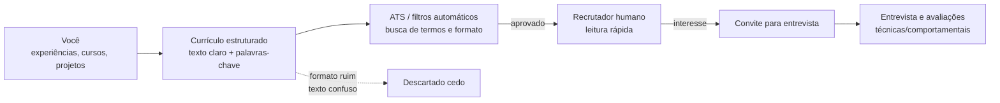

## Visão Geral do Conceito

Esta lição reconstrói o papel do currículo na sua carreira em tecnologia: ele é **a isca, não o peixe**.  
Você vai entender que o currículo não “ganha a vaga” sozinho; o que ele faz é **chamar a atenção** do recrutador ou da triagem automática para que você seja convidado a uma entrevista, onde de fato poderá se apresentar.

Ao mesmo tempo, o currículo é um documento sensível: ele precisa equilibrar **clareza técnica, compatibilidade com sistemas ATS e segurança de dados pessoais**, além de traduzir bem experiências de transição de carreira, empreendedorismo, trabalhos anteriores e estágio.

## Modelo Mental

Alguns modelos mentais importantes desta aula:

1. **Currículo como isca de pesca**  
   - O processo seletivo é como uma pescaria: várias “iscas” (currículos) são lançadas para atrair o interesse do recrutador.
   - Sua função é **ser visto e gerar convite para conversa**; depois disso, o currículo já cumpriu seu papel.

2. **Currículo como API entre você e o recrutador**  
   - Pense no currículo como uma API de baixo ruído: ele expõe **endpoints claros** (formação, experiência, skills, links) que o recrutador ou o ATS consegue “chamar” rapidamente.
   - Campos mal definidos, texto denso ou layout confuso são como documentações ruins: aumentam o atrito e fazem o recrutador pular para o próximo “endpoint” (= outro candidato).

3. **Currículo como log estruturado, não como redação**  
   - Em vez de um texto corrido, o currículo funciona melhor como um **log estruturado de eventos relevantes** da sua trajetória (formações, experiências, projetos, atividades extras).
   - O método <mark style="background-color: #242424; padding: 2px 4px; border-radius: 3px; color: inherit;">`SOAR`</mark> ou <mark style="background-color: #242424; padding: 2px 4px; border-radius: 3px; color: inherit;">`STAR`</mark> ajuda a transformar “fiz suporte” em uma história de situação, ação e resultado que comunica valor real.

## Mecânica Central

### Papel do currículo no funil de seleção

O currículo atua nas primeiras etapas do funil:

- **Triagem automática (ATS)**:
  - Ferramentas que leem texto, buscam <mark style="background-color: #242424; padding: 2px 4px; border-radius: 3px; color: inherit;">`palavras-chave`</mark> e eliminam currículos que não parecem aderentes.
  - Formatos com duas colunas, muitos elementos gráficos e PDFs pesados podem atrapalhar a leitura por essas ferramentas.

- **Leitura rápida por um recrutador**:
  - Um analista de RH ou gestor técnico normalmente passa poucos segundos na primeira leitura.
  - Ele procura **palavras e blocos específicos**: curso, tecnologias, experiências relevantes, contexto de negócio, idiomas, links (Linkedin, GitHub).

- **Função principal**:
  - **Despertar interesse suficiente** para que o recrutador pense: “Quero ouvir essa pessoa”.
  - Uma vez marcada a entrevista, o currículo cumpriu sua missão.

### Segurança de dados e o que NÃO colocar

Por circular digitalmente fora do seu controle, o currículo não deve expor:

- Endereço completo (rua, número, CEP); use algo como “Cidade / Estado”.
- Documentos: <mark style="background-color: #242424; padding: 2px 4px; border-radius: 3px; color: inherit;">`CPF`</mark>, <mark style="background-color: #242424; padding: 2px 4px; border-radius: 3px; color: inherit;">`RG`</mark> etc.
- Dados familiares (nome completo de pais).
- Dados que facilitem clonagem de identidade (data de nascimento + documentos + endereço).
- Foto: além de não ajudar o ATS, pode enviar sinais visuais irrelevantes e introduzir vieses.

Informações que devem aparecer:

- Nome completo.
- E-mail profissional.
- Telefone/WhatsApp.
- Cidade/Estado.
- Link para <mark style="background-color: #242424; padding: 2px 4px; border-radius: 3px; color: inherit;">`LinkedIn`</mark>.
- Link para <mark style="background-color: #242424; padding: 2px 4px; border-radius: 3px; color: inherit;">`GitHub`</mark> (essencial em tecnologia).
- Dupla cidadania, quando existir e for relevante (por exemplo, “Cidadania brasileira e italiana”).

### Estrutura recomendada de currículo para tecnologia

Uma estrutura simples e amigável para ATS e humanos:

1. **Cabeçalho de contato**
   - Nome.
   - Contatos (e-mail, telefone).
   - Cidade/Estado.
   - Links (LinkedIn, GitHub, portfólio).

2. **Título e resumo/objetivo**
   - Título que já indique sua área: por exemplo, “Estudante de ADS em busca de estágio em desenvolvimento back-end”.
   - Um pequeno parágrafo ou lista curta dizendo:
     - Em que ponto da formação você está.
     - Que tipo de oportunidade busca (estágio, júnior, dados, suporte, produto).
     - 2–3 competências-chave aderentes às vagas que vai mirar.
   - Este campo é onde você encaixa muitas **palavras-chave** da vaga-alvo.

3. **Formação acadêmica**
   - Graduação (curso, instituição, data de conclusão ou “em andamento — previsão: AAAA”).
   - Formações técnicas relevantes (técnico em informática etc.).
   - Não incluir ensino médio quando já se está no nível superior.

4. **Experiência profissional**
   - Ordem cronológica reversa (do mais recente ao mais antigo).
   - Para cada experiência:
     - Nome da empresa.
     - Cargo/função.
     - Período (mês/ano início — mês/ano fim ou “atual”).
     - 3–5 bullets descrevendo resultados usando <mark style="background-color: #242424; padding: 2px 4px; border-radius: 3px; color: inherit;">`SOAR/STAR`</mark>.

5. **Cursos e certificações**
   - Cursos relevantes (Fundação Bradesco, Udemy, Coursera, trilhas específicas etc.).
   - Não misturar com graduação; manter em seção separada.

6. **Outras atividades e interesses**
   - Trabalho voluntário.
   - Participação em palestras, congressos, hackathons.
   - Atividades que mostram disciplina, trabalho em equipe, resiliência (esportes, música, empreendedorismo).

### Descrição de experiências com SOAR/STAR

Em vez de apenas listar funções, descreva **situações concretas**:

- <mark style="background-color: #242424; padding: 2px 4px; border-radius: 3px; color: inherit;">`S`</mark> — Situação: qual era o contexto?
- <mark style="background-color: #242424; padding: 2px 4px; border-radius: 3px; color: inherit;">`O/T`</mark> — Oportunidade/Task: qual era o desafio ou a tarefa?
- <mark style="background-color: #242424; padding: 2px 4px; border-radius: 3px; color: inherit;">`A`</mark> — Ação: o que você fez?
- <mark style="background-color: #242424; padding: 2px 4px; border-radius: 3px; color: inherit;">`R`</mark> — Resultado: qual foi o efeito concreto?

Exemplo simplificado inspirado na aula:

- “Responsável pela montagem e suporte de infraestrutura de TI em stand de feira de óleo e gás, garantindo o funcionamento contínuo de demonstrações técnicas para dezenas de clientes sem incidentes durante todo o evento.”

### Diagrama do fluxo currículo ↔ ATS ↔ recrutador



## Uso Prático

### Exemplo 1 — Primeiro currículo para estágio em TI

Você ainda não trabalhou formalmente, mas:

- Tem curso técnico em informática.
- Está cursando ADS.
- Fez alguns projetos de bloco e cursos livres.

Como preencher:

- No resumo:
  - “Estudante de Análise e Desenvolvimento de Sistemas, com curso técnico em informática, em busca de estágio em suporte técnico ou desenvolvimento back-end. Familiaridade com <mark style="background-color: #242424; padding: 2px 4px; border-radius: 3px; color: inherit;">`Windows`</mark>, <mark style="background-color: #242424; padding: 2px 4px; border-radius: 3px; color: inherit;">`Linux`</mark> básico, lógica de programação em <mark style="background-color: #242424; padding: 2px 4px; border-radius: 3px; color: inherit;">`Python`</mark> e uso de <mark style="background-color: #242424; padding: 2px 4px; border-radius: 3px; color: inherit;">`GitHub`</mark> para versionamento.”
- Em experiência:
  - Criar uma subseção “Projetos acadêmicos relevantes” com bullets usando SOAR/STAR (por exemplo, projetos de bloco).
- Em cursos:
  - Listar cursos livres de lógica, Git, introdução a banco de dados etc.

### Exemplo 2 — Transição de carreira para dados

Você vem de engenharia, logística, comércio exterior, design ou outra área:

- Transforme experiências “de fora de TI” em evidências úteis:
  - Trabalho com dashboards.
  - Análise de dados de clientes.
  - Experiência com relatórios, métricas, prazos, contato com stakeholders.
- Mostre isso nas descrições:
  - “Desenvolvimento de dashboards em ferramenta X para acompanhar indicadores de logística, reduzindo tempo de tomada de decisão.”
  - “Atuação em laboratório de geoprocessamento em parceria com Defesa Civil, realizando análises de dados espaciais para suporte a decisões.”

### Exemplo 3 — Empreendedorismo e dupla cidadania

Se você foi empresária(o) ou franqueada(o):

- Destaque:
  - Gestão financeira.
  - Relacionamento com clientes.
  - Gestão de fornecedores.
  - Definição e acompanhamento de metas.
  - Uso de ferramentas digitais (por exemplo, marketing digital, sites, automações).

Se tem dupla cidadania:

- Inclua isso de forma simples:
  - “Cidadania brasileira e italiana.”
- Isso pode ser relevante para vagas remotas, empresas globais ou oportunidades internacionais.

## Erros Comuns

- **Usar currículo altamente gráfico, com duas colunas e muitos elementos visuais**  
  Pode ficar bonito, mas dificulta leitura por ATS e até por recrutadores que querem texto copiável.

- **Copiar e colar apenas o job description**  
  Descrever só “responsável por X, Y, Z” não mostra quem você foi na prática, nem que resultados ajudou a gerar.

- **Incluir dados sensíveis demais**  
  Endereço completo, documentos e informações familiares aumentam o risco de uso indevido e engenharia social.

- **Misturar ensino médio, cursos livres e graduação em um bloco só**  
  Confunde a leitura e dilui a importância da formação principal.

- **Ter parágrafos enormes, sem bullets**  
  Dificulta a leitura rápida; o recrutador tende a deixar “para depois” — e quase nunca volta.

## Visão Geral de Debugging

Se o seu currículo não está gerando entrevistas, pergunte:

- Ele está **alinhado a vagas reais** (com palavras-chave copiadas corretamente do anúncio)?
- O layout é simples o suficiente para **ATS e humanos**?
- Há **projetos, cursos e atividades recentes** que você ainda não incluiu?
- Você está **adaptando o resumo/objetivo** para cada tipo de vaga ou usando sempre o mesmo texto genérico?

Passos de correção:

1. **Rever layout**  
   Transformar templates gráficos em um formato simples, linear, com seções bem marcadas.

2. **Mapear palavras-chave das vagas-alvo**  
   Ler anúncios e destacar termos técnicos e de contexto, replicando-os no currículo (quando verdadeiros).

3. **Reescrever descrições de experiência com SOAR/STAR**  
   Substituir frases vagas por bullets que indiquem situação, ação e resultado.

4. **Checar dados pessoais e segurança**  
   Remover documentos, endereço completo e outros itens desnecessários.

<details>
<summary>Checklist rápido de saúde do currículo</summary>

- [ ] Layout simples, legível e compatível com ATS (sem colunas múltiplas e fotos).
- [ ] Dados pessoais sem informações sensíveis desnecessárias.
- [ ] Resumo/objetivo alinhado à área e às vagas que você está buscando.
- [ ] Experiências descritas com foco em resultados (SOAR/STAR).
- [ ] Sessões claras para formação, experiência, cursos e outras atividades.
</details>

## Principais Pontos

- O currículo é uma **isca** para gerar entrevistas, não o elemento que sozinho garante a vaga.
- **Segurança de dados** importa: não exponha mais do que o necessário em um documento que circula livremente.
- Um bom currículo para tecnologia é **simples, limpo, cheio de palavras-chave relevantes e rico em exemplos de experiências e projetos**.
- Métodos como <mark style="background-color: #242424; padding: 2px 4px; border-radius: 3px; color: inherit;">`SOAR`</mark>/<mark style="background-color: #242424; padding: 2px 4px; border-radius: 3px; color: inherit;">`STAR`</mark> ajudam a transformar qualquer trajetória — inclusive transição de carreira e empreendedorismo — em histórias que comunicam valor.

## Preparação para Prática

Depois desta lição, você deve ser capaz de:

- Montar um currículo em formato compatível com ATS, focado em tecnologia.
- Selecionar quais informações pessoais incluir e quais omitir por segurança.
- Reescrever descrições de experiência para refletir melhor seu perfil e objetivos.
- Conectar este currículo ao que você já planejou em termos de carreira (SWOT, blocos, estágio).

No Laboratório de Prática, você vai estruturar (ou revisar) o seu currículo real, usando os modelos e critérios desta lição.

## Laboratório de Prática

### Exercício Easy — Mapa das seções do seu currículo

**Objetivo:** garantir que seu currículo tem as seções essenciais, bem organizadas.

Enunciado:

Crie um esboço textual (não precisa ser o currículo completo ainda) listando as seções que o seu currículo terá e o que entra em cada uma.

Boilerplate sugerido:

```markdown
# Estrutura do meu currículo

## Cabeçalho
- Nome:
- E-mail:
- Telefone:
- Cidade/Estado:
- LinkedIn:
- GitHub:

## Título e resumo
- Título:
- Resumo (2–3 frases):

## Formação
- Curso:
- Instituição:
- Situação (concluído / em andamento + previsão):

## Experiência profissional
- Experiência 1:
- Experiência 2:

## Cursos e certificações
- Curso 1:
- Curso 2:

## Outras atividades e interesses
- Atividade 1:
- Atividade 2:
```

### Exercício Medium — Reescrevendo uma experiência com SOAR/STAR

**Objetivo:** transformar uma descrição vaga em uma descrição orientada a resultados.

Enunciado:

Escolha uma experiência (formal, projeto, empreendedorismo ou voluntariado) e escreva **pelo menos três bullets** usando a estrutura SOAR/STAR.

Boilerplate sugerido:

```markdown
# Experiência: [nome da empresa ou projeto]

- Situação / contexto:
- Oportunidade / tarefa:
- Ação:
- Resultado:

## Bullets para o currículo
- Bullet 1:
- Bullet 2:
- Bullet 3:
```

### Exercício Hard — Revisão completa do seu currículo atual

**Objetivo:** aplicar todos os conceitos para gerar uma versão pronta para enviar a vagas reais.

Enunciado:

Pegue seu currículo atual e:

1. Adapte o layout para o formato recomendado.
2. Ajuste dados pessoais (removendo informações sensíveis).
3. Atualize experiências usando SOAR/STAR.
4. Inclua cursos, projetos e atividades complementares recentes.

Crie uma nova versão e escreva um pequeno comentário explicando as principais mudanças.

Boilerplate sugerido:

```markdown
# Revisão do meu currículo

## Mudanças de layout
- Antes:
- Depois:

## Mudanças em dados pessoais
- Removido:
- Adicionado:

## Mudanças em experiências
- Experiência 1 (antes/depois):
- Experiência 2 (antes/depois):

## Novos cursos / projetos incluídos
- Item 1:
- Item 2:
```

---

<!-- CONCEPT_EXTRACTION
concepts:
  - currículo como isca em processos seletivos
  - segurança de dados pessoais em currículos
  - compatibilidade de currículo com ATS
  - descrição de experiências com SOAR/STAR
skills:
  - Estruturar um currículo simples, claro e legível por ATS
  - Selecionar e proteger informações pessoais no currículo
  - Reescrever descrições de experiência com foco em resultados
  - Adaptar currículo para diferentes vagas usando palavras-chave
examples:
  - curriculo-estagio-ads-primeiro-emprego
  - curriculo-transicao-carreira-dados
  - curriculo-empreendedorismo-para-ti
-->

<!-- EXERCISES_JSON
[
  {
    "id": "estrutura-curriculo-tecnologia",
    "slug": "estrutura-curriculo-tecnologia",
    "difficulty": "easy",
    "title": "Definir a estrutura do seu currículo de tecnologia",
    "discipline": "planejamento-curso-carreira",
    "editorLanguage": "markdown",
    "tags": ["curriculo", "estrutura", "ats"],
    "summary": "Planejar as seções principais do currículo e o que entrará em cada uma."
  },
  {
    "id": "experiencia-soar-star",
    "slug": "experiencia-soar-star",
    "difficulty": "medium",
    "title": "Reescrever uma experiência usando SOAR/STAR",
    "discipline": "planejamento-curso-carreira",
    "editorLanguage": "markdown",
    "tags": ["curriculo", "experiencias", "soar", "star"],
    "summary": "Transformar uma descrição vaga de experiência em bullets orientados a situação, ação e resultado."
  },
  {
    "id": "revisao-completa-curriculo",
    "slug": "revisao-completa-curriculo",
    "difficulty": "hard",
    "title": "Fazer uma revisão completa do seu currículo atual",
    "discipline": "planejamento-curso-carreira",
    "editorLanguage": "markdown",
    "tags": ["curriculo", "planejamento-carreira"],
    "summary": "Aplicar todas as melhorias de layout, conteúdo e segurança para gerar um currículo pronto para vagas reais."
  }
]
-->

