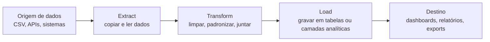

## Visão Geral do Conceito

Projetos de dados profissionais raramente envolvem apenas “rodar uma query” ou “montar um gráfico”.  
Na prática, você trabalha dentro de um **pipeline de dados**, que começa na **origem**, passa por **processamento / transformação** e termina em um **destino** onde alguém consome a informação — geralmente dashboards, relatórios ou APIs.

Esta lição conecta a visão de projeto de bloco com o ciclo <mark style="background-color: #242424; padding: 2px 4px; border-radius: 3px; color: inherit;">`origem → processamento → destino`</mark>, apresentando os principais tipos de bancos de dados e ferramentas que você verá no mercado (e que o professor comenta em aula): <mark style="background-color: #242424; padding: 2px 4px; border-radius: 3px; color: inherit;">`SQL Server`</mark>, <mark style="background-color: #242424; padding: 2px 4px; border-radius: 3px; color: inherit;">`PostgreSQL`</mark>, <mark style="background-color: #242424; padding: 2px 4px; border-radius: 3px; color: inherit;">`MySQL`</mark>, <mark style="background-color: #242424; padding: 2px 4px; border-radius: 3px; color: inherit;">`MongoDB`</mark>, <mark style="background-color: #242424; padding: 2px 4px; border-radius: 3px; color: inherit;">`DBeaver`</mark>, <mark style="background-color: #242424; padding: 2px 4px; border-radius: 3px; color: inherit;">`SQL Server Management Studio`</mark>, <mark style="background-color: #242424; padding: 2px 4px; border-radius: 3px; color: inherit;">`pgAdmin`</mark>, <mark style="background-color: #242424; padding: 2px 4px; border-radius: 3px; color: inherit;">`Looker Studio`</mark>, <mark style="background-color: #242424; padding: 2px 4px; border-radius: 3px; color: inherit;">`Power BI`</mark> e outras.

## Modelo Mental

Use o seguinte modelo mental para qualquer projeto de dados, inclusive o seu projeto de bloco:

- **Origem**: onde os dados nascem ou são coletados (sistemas transacionais, planilhas, arquivos CSV, APIs).
- **Processamento / ETL**: scripts em <mark style="background-color: #242424; padding: 2px 4px; border-radius: 3px; color: inherit;">`Python`</mark>, processos de <mark style="background-color: #242424; padding: 2px 4px; border-radius: 3px; color: inherit;">`ETL`</mark> (Extract–Transform–Load) e consultas em <mark style="background-color: #242424; padding: 2px 4px; border-radius: 3px; color: inherit;">`SQL`</mark> que limpam, transformam e organizam os dados.
- **Destino**: onde as pessoas de negócio realmente enxergam valor — dashboards em <mark style="background-color: #242424; padding: 2px 4px; border-radius: 3px; color: inherit;">`Looker Studio`</mark> ou <mark style="background-color: #242424; padding: 2px 4px; border-radius: 3px; color: inherit;">`Power BI`</mark>, relatórios, exports para outros sistemas.

Ferramentas são **meios** para navegar nesse pipeline, não o objetivo final.  
Saber “clicar no Looker” ou “abrir o DBeaver” é pouco; o que importa é entender **em qual parte do fluxo você está** e qual problema de dados está resolvendo ali.

## Mecânica Central

### 1. Pipeline de dados e ETL

O professor descreve o pipeline como um **ciclo de vida dos dados**:

1. **Origem** — dados crus em sistemas, arquivos ou bancos.
2. **Processamento** — extração, transformação e carga (<mark style="background-color: #242424; padding: 2px 4px; border-radius: 3px; color: inherit;">`ETL`</mark>).
3. **Destino** — camada de consumo (dashboards, relatórios, consultas analíticas).

Visualmente:



No projeto de bloco, você vai trabalhar principalmente entre **origem e processamento** (Python + SQL), preparando os dados para que ferramentas de visualização possam consumi-los com segurança.

### 2. Bancos de dados relacionais

Quando o professor fala de <mark style="background-color: #242424; padding: 2px 4px; border-radius: 3px; color: inherit;">`SQL Server`</mark>, <mark style="background-color: #242424; padding: 2px 4px; border-radius: 3px; color: inherit;">`PostgreSQL`</mark>, <mark style="background-color: #242424; padding: 2px 4px; border-radius: 3px; color: inherit;">`MySQL`</mark>, <mark style="background-color: #242424; padding: 2px 4px; border-radius: 3px; color: inherit;">`Oracle`</mark> e outros, ele está falando de **bancos relacionais**.

Características principais:

- Dados organizados em **tabelas** com linhas (registros) e colunas (campos).
- Relações explícitas entre tabelas (por exemplo, cliente–pedido–itens).
- Forte suporte a **integridade referencial** e **regras de negócio** no próprio banco.
- Linguagem padrão de consulta: <mark style="background-color: #242424; padding: 2px 4px; border-radius: 3px; color: inherit;">`SQL`</mark>.

Isso significa que, em geral, a mesma consulta SQL pode ser adaptada com poucas mudanças para diferentes bancos relacionais — e é exatamente isso que acontece quando você troca, por exemplo, de <mark style="background-color: #242424; padding: 2px 4px; border-radius: 3px; color: inherit;">`PostgreSQL`</mark> para <mark style="background-color: #242424; padding: 2px 4px; border-radius: 3px; color: inherit;">`MySQL`</mark>.

### 3. Bancos de dados não relacionais

Já sistemas como <mark style="background-color: #242424; padding: 2px 4px; border-radius: 3px; color: inherit;">`MongoDB`</mark> são exemplos de bancos **não relacionais** (NoSQL), muitas vezes orientados a documentos:

- Dados armazenados como **documentos** (geralmente em formato <mark style="background-color: #242424; padding: 2px 4px; border-radius: 3px; color: inherit;">`JSON`</mark> ou similar).
- Estrutura de campos **mais flexível**: documentos da mesma coleção podem ter campos diferentes.
- Linguagem de consulta própria, em vez de SQL tradicional.

Isso dá mais liberdade quando você não conhece de antemão todos os campos que podem aparecer, mas exige **disciplina de modelagem** para não virar caos.

Um ponto importante que o professor enfatiza:  
não existe um “meio termo mágico”; o que há é **analisar requisitos do projeto** e escolher a tecnologia que mais se encaixa.

### 4. Critérios para escolher entre relacional e não relacional

Algumas perguntas práticas:

- Os dados são altamente estruturados e estáveis?  
  → Tendência a usar bancos relacionais.
- Você precisa de **joins complexos** e integridade forte entre entidades?  
  → Relacional costuma ser melhor.
- O esquema dos dados muda com frequência ou é imprevisível?  
  → Bancos não relacionais ganham espaço.
- O volume e a velocidade de escrita são extremos, com variedade grande de formatos?  
  → Muitas arquiteturas combinam camadas NoSQL com relacionais.

No seu projeto de bloco inicial, faz sentido **começar com um banco relacional**.  
Você aprende a pensar em tabelas, chaves e consultas SQL — a base para quase todos os projetos de dados.

### 5. Ferramentas de banco de dados e visualização

O professor também lista diversas **ferramentas de trabalho**:

- Ferramentas de banco:
  - <mark style="background-color: #242424; padding: 2px 4px; border-radius: 3px; color: inherit;">`SQL Server Management Studio (SSMS)`</mark> para <mark style="background-color: #242424; padding: 2px 4px; border-radius: 3px; color: inherit;">`SQL Server`</mark>.
  - <mark style="background-color: #242424; padding: 2px 4px; border-radius: 3px; color: inherit;">`pgAdmin`</mark> para <mark style="background-color: #242424; padding: 2px 4px; border-radius: 3px; color: inherit;">`PostgreSQL`</mark>.
  - <mark style="background-color: #242424; padding: 2px 4px; border-radius: 3px; color: inherit;">`MySQL Workbench`</mark> para <mark style="background-color: #242424; padding: 2px 4px; border-radius: 3px; color: inherit;">`MySQL`</mark>.
  - Ferramentas multi-banco como <mark style="background-color: #242424; padding: 2px 4px; border-radius: 3px; color: inherit;">`DBeaver`</mark>, que conseguem se conectar a vários SGBDs diferentes pela mesma interface.
- Ferramentas de visualização:
  - <mark style="background-color: #242424; padding: 2px 4px; border-radius: 3px; color: inherit;">`Looker Studio`</mark> (Google).
  - <mark style="background-color: #242424; padding: 2px 4px; border-radius: 3px; color: inherit;">`Power BI`</mark> (Microsoft).
  - Outras como <mark style="background-color: #242424; padding: 2px 4px; border-radius: 3px; color: inherit;">`Qlik`</mark>.

Um ponto chave é **não confundir ferramenta com banco**.  
Na analogia que surgiu em aula: pense no **Instagram** como se fosse o banco de dados, e no **aplicativo mobile** e no **navegador web** como ferramentas diferentes que acessam o mesmo conteúdo.

## Uso Prático

### No seu projeto de bloco

Você pode estruturar o ambiente de trabalho assim:

- Escolher **um banco relacional** local (por exemplo, <mark style="background-color: #242424; padding: 2px 4px; border-radius: 3px; color: inherit;">`PostgreSQL`</mark> ou <mark style="background-color: #242424; padding: 2px 4px; border-radius: 3px; color: inherit;">`MySQL`</mark>).
- Usar uma **ferramenta cliente** (como <mark style="background-color: #242424; padding: 2px 4px; border-radius: 3px; color: inherit;">`DBeaver`</mark> ou a ferramenta nativa do banco) para criar tabelas e testar consultas.
- Escrever scripts em <mark style="background-color: #242424; padding: 2px 4px; border-radius: 3px; color: inherit;">`Python`</mark> que:
  - lêem dados de arquivos CSV;
  - realizam limpeza e transformação básica;
  - inserem ou atualizam dados no banco.
- Conectar uma ferramenta de visualização (como <mark style="background-color: #242424; padding: 2px 4px; border-radius: 3px; color: inherit;">`Looker Studio`</mark>) a esse banco ou a *views* SQL para montar os dashboards.

### Exemplo de mini pipeline para estudo

Um pipeline de estudo alinhado ao projeto de bloco poderia ser:

1. Baixar um CSV de vendas (por exemplo, do contexto de outra disciplina).
2. Escrever um script em <mark style="background-color: #242424; padding: 2px 4px; border-radius: 3px; color: inherit;">`Python`</mark> que:
   - converte datas para formato padrão;
   - padroniza nomes de colunas;
   - salva um novo CSV “limpo”.
3. Criar uma tabela `vendas` em um banco relacional e carregar o CSV limpo.
4. Escrever consultas em <mark style="background-color: #242424; padding: 2px 4px; border-radius: 3px; color: inherit;">`SQL`</mark> para faturamento diário, ticket médio, produtos mais vendidos.
5. Conectar um dashboard em <mark style="background-color: #242424; padding: 2px 4px; border-radius: 3px; color: inherit;">`Looker Studio`</mark> a essas consultas e montar gráficos simples.

Esse tipo de prática é muito próximo de atividades reais em times de engenharia / análise de dados.

## Erros Comuns

- **Confundir banco com ferramenta de acesso**  
  Achar que “usa DBeaver” como se fosse usar um banco específico, quando na verdade ele é só o cliente. Isso atrapalha na hora de discutir arquitetura com outras pessoas.

- **Confiar demais na ferramenta de visualização para processar dados crus**  
  Subir arquivos mal estruturados direto no dashboard e tentar fazer toda a limpeza ali costuma gerar relatórios lentos, difíceis de manter e cheios de inconsistências.

- **Ignorar requisitos do projeto ao escolher o banco**  
  Escolher uma tecnologia só porque “é a que eu conheço” ou “é o que está na moda”, sem avaliar estrutura dos dados, volume, necessidade de relacionamentos e flexibilidade de esquema.

- **Não pensar no pipeline de ponta a ponta**  
  Ficar preso só na query ou só no gráfico, sem considerar como aquela etapa conversa com a anterior e a seguinte.

## Visão Geral de Debugging

Quando o pipeline dá problema, pergunte-se:

1. **Origem**  
   - O arquivo chegou com colunas diferentes das esperadas?  
   - A API mudou o formato do JSON?
2. **Processamento**  
   - O script em <mark style="background-color: #242424; padding: 2px 4px; border-radius: 3px; color: inherit;">`Python`</mark> está tratando valores nulos, tipos incorretos e datas?  
   - A carga para o banco está falhando por causa de chave duplicada ou violação de constraint?
3. **Banco de dados**  
   - A modelagem está adequada? Tabelas e índices fazem sentido para as consultas que o dashboard roda?  
   - Há diferenças de dialeto SQL entre o que você escreveu e o SGBD que está usando?
4. **Destino (dashboard)**  
   - Os gráficos estão apontando para as tabelas/views corretas?  
   - Filtros e agregações do dashboard não estão contradizendo a lógica das consultas SQL?

Debuggar bem é **seguir o caminho do dado**, verificando em que ponto ele deixa de fazer sentido.

## Principais Pontos

- Todo projeto de dados passa por um pipeline **origem → processamento → destino**, frequentemente implementado como um processo <mark style="background-color: #242424; padding: 2px 4px; border-radius: 3px; color: inherit;">`ETL`</mark>.
- Bancos relacionais (SQL Server, PostgreSQL, MySQL, Oracle) e não relacionais (MongoDB, etc.) atendem necessidades diferentes, a serem escolhidas pelos **requisitos do projeto**.
- Ferramentas como <mark style="background-color: #242424; padding: 2px 4px; border-radius: 3px; color: inherit;">`DBeaver`</mark> e <mark style="background-color: #242424; padding: 2px 4px; border-radius: 3px; color: inherit;">`pgAdmin`</mark> são clientes; dashboards como <mark style="background-color: #242424; padding: 2px 4px; border-radius: 3px; color: inherit;">`Looker Studio`</mark> e <mark style="background-color: #242424; padding: 2px 4px; border-radius: 3px; color: inherit;">`Power BI`</mark> ficam na camada de **destino**.
- No projeto de bloco, você treina a construir esse fluxo de ponta a ponta em escala reduzida, pensando como alguém que trabalha diariamente com dados.

## Preparação para Prática

Após esta lição, você deve ser capaz de:

- Desenhar o pipeline do seu projeto de bloco identificando origem, processamento e destino dos dados.
- Justificar a escolha de um banco relacional específico para esse projeto, com base nos requisitos.
- Selecionar um conjunto mínimo de ferramentas (cliente de banco + linguagem + visualização) e explicar o papel de cada uma.

No Laboratório de Prática a seguir, você irá **documentar e simular esse pipeline em código**, reforçando a visão integrada entre Python, SQL, bancos e dashboards.

## Laboratório de Prática

### Exercício Easy — Mapeando origem, processamento e destino

Descreva, em código, o pipeline do seu projeto de bloco indicando tecnologias usadas em cada etapa.

```python
from dataclasses import dataclass
from typing import List


@dataclass
class PipelineStage:
    name: str
    role: str
    technology: str


def build_pipeline() -> List[PipelineStage]:
    stages: List[PipelineStage] = []

    # TODO: adicionar pelo menos 4 etapas reais do seu projeto de bloco.
    # Exemplo de ideias:
    # - "Origem CSV de vendas" / "entrada" / "arquivo .csv"
    # - "Limpeza inicial" / "processamento" / "Python"
    # - "Carga em tabela relacional" / "armazenamento" / "PostgreSQL"
    # - "Dashboard de vendas" / "consumo" / "Looker Studio"

    return stages


if __name__ == "__main__":
    for stage in build_pipeline():
        print(f"{stage.name} -> ({stage.role}) via {stage.technology}")
```

### Exercício Medium — Comparando bancos e ferramentas para um cenário

Escolha um cenário simples (por exemplo, monitorar tickets de suporte) e compare opções de bancos e ferramentas de acesso.

```python
from dataclasses import dataclass
from typing import List


@dataclass
class TechOption:
    kind: str          # "banco" ou "ferramenta"
    name: str          # ex.: "PostgreSQL", "DBeaver"
    strengths: str
    risks: str


def evaluate_options() -> List[TechOption]:
    options: List[TechOption] = []

    # TODO: registrar pelo menos 3 bancos e 2 ferramentas de acesso,
    # explicando pontos fortes e riscos em relação ao seu cenário.

    return options


if __name__ == "__main__":
    for option in evaluate_options():
        print(f"[{option.kind}] {option.name} -> + {option.strengths} / - {option.risks}")
```

### Exercício Hard — Simulando um mini ETL em código

Implemente um esqueleto de ETL em <mark style="background-color: #242424; padding: 2px 4px; border-radius: 3px; color: inherit;">`Python`</mark> que documente claramente as etapas de extração, transformação e carga, mesmo que a implementação completa ainda seja `TODO`.

```python
from dataclasses import dataclass
from typing import Any, List


@dataclass
class ETLStep:
    name: str
    description: str


def extract() -> List[Any]:
    """Extrai dados da origem (simulado)."""
    # TODO: simular leitura de dados (ex.: lista de dicionários representando linhas de um CSV)
    return []


def transform(rows: List[Any]) -> List[Any]:
    """Transforma dados brutos em dados prontos para carga."""
    # TODO: aplicar pelo menos uma transformação simples (ex.: normalizar campos, remover nulos)
    return rows


def load(rows: List[Any]) -> None:
    """Carrega dados transformados em um destino (simulado)."""
    # TODO: simular inserção em uma tabela (por exemplo, apenas imprimir as linhas transformadas)
    for row in rows:
        print(row)


def run_etl() -> None:
    steps = [
        ETLStep("extract", "Ler dados da origem"),
        ETLStep("transform", "Limpar e padronizar dados"),
        ETLStep("load", "Carregar dados no destino"),
    ]
    print("Rodando ETL com etapas:")
    for step in steps:
        print(f"- {step.name}: {step.description}")

    raw = extract()
    ready = transform(raw)
    load(ready)


if __name__ == "__main__":
    run_etl()
```

Esse exercício prepara você para, mais à frente, conectar esse esqueleto a dados reais do seu projeto de bloco.

<!-- CONCEPT_EXTRACTION
concepts:
  - pipeline de dados
  - ETL
  - bancos relacionais
  - bancos não relacionais
  - ferramentas de banco de dados
  - ferramentas de visualização
skills:
  - Mapear origem, processamento e destino em um pipeline de dados
  - Diferenciar bancos relacionais e não relacionais e justificar escolhas
  - Selecionar e combinar ferramentas de banco e visualização para um projeto de dados
examples:
  - pipeline-projeto-bloco
  - comparacao-bancos-ferramentas
  - etl-simulado-python
-->

<!-- EXERCISES_JSON
[
  {
    "id": "pipeline-projeto-bloco",
    "slug": "pipeline-projeto-bloco",
    "difficulty": "easy",
    "title": "Mapear o pipeline do projeto de bloco",
    "discipline": "projeto-bloco",
    "editorLanguage": "python",
    "tags": ["projeto-bloco", "pipeline-de-dados"],
    "summary": "Listar etapas do pipeline de dados do projeto de bloco com o papel e a tecnologia de cada uma."
  },
  {
    "id": "comparacao-bancos-ferramentas",
    "slug": "comparacao-bancos-ferramentas",
    "difficulty": "medium",
    "title": "Comparar bancos e ferramentas para um cenário de dados",
    "discipline": "projeto-bloco",
    "editorLanguage": "python",
    "tags": ["projeto-bloco", "bancos-relacionais", "bancos-nao-relacionais"],
    "summary": "Avaliar bancos de dados e ferramentas clientes para um cenário simples de projeto de dados."
  },
  {
    "id": "etl-simulado-python",
    "slug": "etl-simulado-python",
    "difficulty": "hard",
    "title": "Simular um mini ETL em Python",
    "discipline": "projeto-bloco",
    "editorLanguage": "python",
    "tags": ["projeto-bloco", "etl", "python"],
    "summary": "Implementar o esqueleto de um processo ETL em Python, documentando extração, transformação e carga."
  }
]
-->

