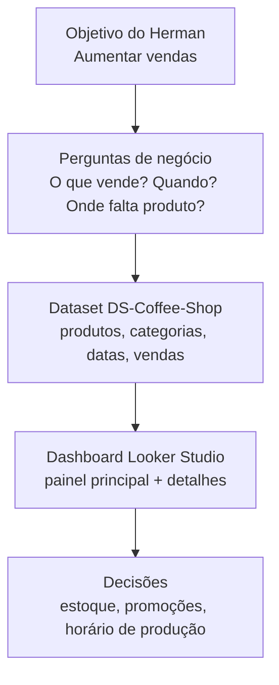
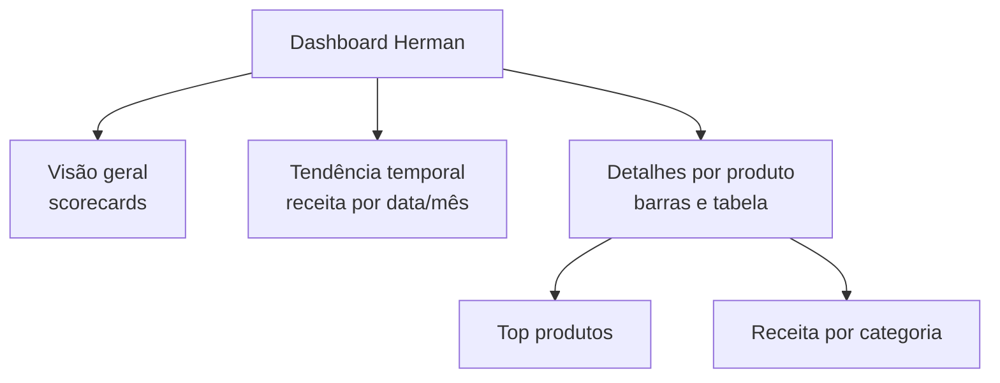

## Visão Geral do Conceito

Nesta lição, você vai pegar o contexto da **cafeteria Herman Cake & Coffee Shop** e traduzi-lo em um **dashboard de negócio** no Looker Studio. O objetivo declarado pelo Herman é simples: **aumentar o volume de vendas da cafeteria**. A partir desse objetivo, você precisa escolher **métricas**, **dimensões** e um **layout de relatório** que ajudem o dono a decidir melhor.

O dataset `DS-Coffee-Shop` (disponível nos materiais da disciplina) traz informações de vendas de produtos da cafeteria. A partir dele, você construirá um painel capaz de responder perguntas como: quais produtos vendem mais, em que períodos, e quais itens devem ser priorizados em estoque e promoções.

Mais do que arrastar gráficos, esta lição foca em **pensar como alguém de BI**: começar pelo objetivo de negócio, definir o que precisa ser medido e só depois montar visualizações no Looker Studio.

## Modelo Mental

Pense no processo em três camadas:

1. **Negócio (o mundo do Herman)**  
   - Objetivo: vender mais e evitar faltar produto na vitrine.  
   - Dor atual: ele só recebe relatórios **semanais** do contador e reage atrasado.

2. **Dados (o mundo das tabelas)**  
   - Dataset `DS-Coffee-Shop` com colunas como produto, categoria, data, quantidade, receita.  
   - Linhas representando vendas individuais ou agregadas.

3. **Dashboard (ponte entre os dois mundos)**  
   - Painel principal com visão geral de vendas.  
   - Gráficos e tabelas que contam a “história” da cafeteria: o que vende melhor, quando e quanto.

Podemos representar essa visão em alto nível assim:



O dashboard não é fim em si mesmo: ele é uma **ferramenta de decisão**. Toda escolha de métrica, filtro ou gráfico deve responder a perguntas que aproximem o Herman de seu objetivo.

## Mecânica Central

### 1. Entrevista com o Herman: objetivos e contexto

Na transcrição da aula, o professor reconstrói uma pequena entrevista com o Herman. A partir dela, temos:

- **Objetivo atual**  
  - “Quero aumentar o volume de vendas da cafeteria.”

- **Como ele trabalha hoje**  
  - Registra receitas em planilhas ou sistemas simples.
  - Envia dados ao contador.
  - Recebe um relatório com produtos mais vendidos apenas **no fim da semana**.
  - Usa esse relatório para fazer pedidos de ingredientes para a **semana seguinte**.

- **Problema**  
  - A visão é atrasada: muitas decisões são tomadas “no escuro” até chegar o relatório semanal.
  - Ele não tem visão diária (ou quase em tempo real) do que está acontecendo.

- **Nível de conhecimento de dados**  
  - Herman conhece bem o **negócio** (o que vende, quais produtos são críticos).
  - Mas não domina planilhas, métricas nem ferramentas de BI.

Essa entrevista define o “briefing” do dashboard: precisamos dar ao Herman uma visão mais rápida, clara e visual das vendas, usando uma ferramenta que seja **acessível via navegador** e fácil de atualizar — o Looker Studio.

### 2. Dataset DS-Coffee-Shop

O arquivo `DS-Coffee-Shop` (fornecido nos materiais) representa as vendas de uma cafeteria. Embora os detalhes possam variar, um esquema típico inclui colunas como:

- `date` — data da venda.
- `product_name` — nome do produto (ex.: cappuccino, brownie).
- `category` — categoria (bebida, comida, doce, salgado).
- `quantity` — quantidade vendida.
- `unit_price` — preço unitário.
- `total_revenue` — receita total (`quantity * unit_price`).
- (opcional) `store_location`, `time_of_day`, etc.

Mapeando para o modelo mental de BI:

- **Dimensões** (para “cortar” a análise):
  - `date`, `product_name`, `category`, possivelmente `store_location`.
- **Métricas** (para agregar):
  - `quantity`, `total_revenue`.

É esse dataset que vamos conectar ao Looker Studio para construir o dashboard da cafeteria Herman.

### 3. Perguntas de negócio que o dashboard deve responder

Com base no objetivo do Herman, algumas perguntas essenciais são:

- **Produtos e categorias**
  - Quais produtos mais vendem?
  - Quais categorias trazem mais receita?
  - Existem produtos com vendas tão baixas que ocupam espaço de estoque à toa?

- **Tempo**
  - Em quais dias da semana as vendas são maiores?
  - Há sazonalidade por mês (ex.: mais vendas em datas específicas)?

- **Operação**
  - Quais produtos deveriam ter produção reforçada em determinados horários/dias?
  - Há produtos frequentemente em falta que prejudicam a experiência do cliente?

Cada pergunta dessas deve inspirar **pelo menos um gráfico ou componente** no dashboard.

### 4. Estrutura do relatório no Looker Studio

Um desenho possível para o primeiro painel da cafeteria:

- **Cabeçalho**
  - Título: “Herman Cake & Coffee Shop — Visão Geral de Vendas”.
  - Logo simples da cafeteria (se disponível).
  - Controle de período (por exemplo, mês corrente, último mês).

- **Faixa superior: Visão geral**
  - Scorecards:
    - Receita total no período.
    - Quantidade total vendida.
    - Número de produtos distintos vendidos.

- **Área central: Tendência ao longo do tempo**
  - Série temporal com `SUM(total_revenue)` por `date` ou por `month`.

- **Área inferior: Detalhes por produto/categoria**
  - Gráfico de barras com `SUM(total_revenue)` por `product_name` (top N).
  - Gráfico de barras ou pizza por `category`.
  - Tabela com colunas chave (`product_name`, `category`, `quantity`, `total_revenue`).

Podemos representar a hierarquia de informação assim:



Esse layout permite que o Herman:

- Veja rapidamente **se as vendas estão boas** (scorecards).
- Entenda **como variam no tempo** (série temporal).
- Descubra **o que está puxando ou segurando o resultado** (produtos e categorias).

### 5. Painéis adicionais e desdobramentos

Além do painel principal, você pode planejar:

- **Painel de produtos**  
  - Foco em performance de cada item.
  - Filtros por categoria.
  - Tabelas com margens, se disponíveis no dataset.

- **Painel de horários/dias da semana**  
  - Se houver coluna de hora/dia da semana, gráficos por faixa horária/dia para apoiar decisões de escala de equipe e produção.

O importante é sempre seguir o fluxo:

1. Objetivo de negócio.
2. Perguntas específicas.
3. Dados disponíveis.
4. Visualização adequada.

## Uso Prático

### Exemplo 1 — Escolhendo métricas para Herman

Suponha que você já importou `DS-Coffee-Shop` para o Google Planilhas ou diretamente para o Looker Studio. Você precisa escolher **3–4 métricas principais** para a visão geral:

- `SUM(total_revenue)` — receita total no período.
- `SUM(quantity)` — quantidade total de itens vendidos.
- `COUNT_DISTINCT(product_name)` — número de produtos distintos vendidos.
- (Opcional) `AVG(total_revenue)` por transação, se o dataset trouxer essa granularidade.

Essas métricas permitem ao Herman perceber se:

- A cafeteria está vendendo “forte” em termos de receita.
- A quantidade de itens vendidos faz sentido com a capacidade de produção.
- O mix de produtos é variado ou está concentrado em poucos itens.

### Exemplo 2 — Dimensões e filtros relevantes

Para que o dashboard seja explorável, você pode usar:

- Filtro de **período** (controle de data).
- Filtro de **categoria** (`category`).
- Filtro de **produto** (`product_name`) via lista suspensa.

Esses controles permitem que o Herman:

- Veja rapidamente a performance apenas de bebidas ou apenas de doces.
- Compare períodos específicos (por exemplo, semana do Dia dos Namorados vs semana normal).

### Exemplo 3 — Conectando com decisões de estoque

Com o dashboard montado, algumas decisões típicas que o Herman pode tomar:

- Aumentar o estoque de insumos para produtos com alta receita e alta venda recorrente.
- Descontinuar ou repensar produtos com venda muito baixa e margem pequena.
- Planejar promoções em dias/horários com movimento fraco.

O dashboard passa a ser não apenas um relatório estático, mas uma **ferramenta de simulação mental**: ao mexer nos filtros, o Herman visualiza cenários e decide.

## Erros Comuns

- **Começar pelo gráfico, não pelo objetivo**  
  Sair arrastando componentes no Looker Studio sem saber o que a área de negócio precisa leva a dashboards bonitos, porém inúteis.

- **Métricas descoladas da operação**  
  Escolher indicadores que não geram ações concretas (por exemplo, gráficos muito sofisticados, mas que não influenciam estoque, promoções ou escala de funcionários).

- **Excesso de informação em uma única página**  
  Lotar o painel com muitos gráficos pequenos, sem hierarquia visual, dificulta a leitura para alguém como o Herman.

- **Ignorar o nível de conhecimento da área de negócio**  
  Usar termos ou visualizações avançadas sem contexto (métricas estatísticas complexas, por exemplo) para um público que ainda está começando no tema.

- **Desalinhamento com os dados disponíveis**  
  Planejar perguntas que o dataset atual ainda não responde (por exemplo, tentar analisar margem de lucro se só temos preço de venda).

## Visão Geral de Debugging

Quando o dashboard da cafeteria não estiver ajudando de verdade:

1. **Revisite o objetivo de negócio**
   - O painel responde diretamente a “como aumentar o volume de vendas?”.
   - Existem métricas que ninguém está usando para decidir nada?

2. **Observe como o usuário navega**
   - O Herman encontra rapidamente o que precisa?
   - Quais gráficos ele ignora sempre?

3. **Simule decisões**
   - Escolha uma pergunta prática (“devo comprar mais insumo de qual produto essa semana?”).
   - Veja se o dashboard leva a uma resposta clara.

4. **Simplifique quando necessário**
   - Remova ou mova para painéis secundários gráficos que poluem a visão principal.

5. **Considere lacunas de dados**
   - Se decisões importantes dependem de dados que você não tem (como margem), considere incluir essas colunas no dataset em versões futuras.

## Principais Pontos

- Todo dashboard começa com um **objetivo de negócio claro**, não com um gráfico.
- O caso da **cafeteria Herman** é um exemplo de como traduzir dores reais (relatórios lentos, visão semanal) em um painel visual.
- O dataset **DS-Coffee-Shop** fornece dimensões e métricas suficientes para responder perguntas fundamentais de vendas.
- Um bom layout organiza a informação em **visão geral → tendência → detalhes**, com filtros bem escolhidos.
- O sucesso do dashboard se mede pela **qualidade das decisões** que ele viabiliza, não pela quantidade de gráficos.

## Preparação para Prática

Depois desta lição, você deve ser capaz de:

- Conduzir uma mini-entrevista de requisitos com uma pessoa de negócio (como o Herman).
- Traduzir um objetivo de negócio em perguntas e, em seguida, em métricas/dimensões concretas.
- Esboçar no papel (ou em texto) a estrutura de um painel antes de abrir o Looker Studio.
- Avaliar se um dashboard realmente está ajudando a tomar decisões melhores.

Se ainda estiver confuso sobre como sair “dos dados para as decisões”, volte às seções de **Modelo Mental** e **Mecânica Central** antes do Laboratório.

## Laboratório de Prática

### Desafio Easy — Mapear perguntas de negócio para métricas e dimensões

Objetivo: praticar a tradução de objetivos em elementos de dashboard.

Enunciado:

- Liste, em uma tabela, pelo menos **5 perguntas** que o Herman poderia querer responder com o dashboard (por exemplo, “Quais são os 5 produtos com maior receita na última semana?”).
- Para cada pergunta, indique:
  - Quais **dimensões** do `DS-Coffee-Shop` você precisa.
  - Quais **métricas** precisa calcular.

No editor do ISS, use o esqueleto abaixo:

```markdown
<!-- TODO: mapear perguntas → dimensões/métricas
- Pergunta 1:
  - Dimensões:
  - Métricas:
- Pergunta 2:
  - Dimensões:
  - Métricas:
-->
```

### Desafio Medium — Esboçar o layout do dashboard Herman

Objetivo: planejar o layout de um painel de uma página para a cafeteria.

Enunciado:

- Crie um esboço textual (ou desenhado em outro lugar, descrito aqui) contendo:
  - Cabeçalho (título, logo, controle de período).
  - Bloco de visão geral (scorecards).
  - Bloco de tendência temporal.
  - Bloco de detalhes por produto/categoria.
- Para cada bloco, indique quais campos do `DS-Coffee-Shop` pretende usar.

Você pode registrar esse esboço assim:

```markdown
<!-- TODO: esboço de layout do dashboard Herman
- Cabeçalho:
- Visão geral (scorecards):
- Tendência temporal:
- Detalhes (barras/tabelas):
-->
```

### Desafio Hard — Propor um segundo painel complementar

Objetivo: pensar além da visão geral e propor um painel complementar útil.

Enunciado:

- Proponha um **segundo painel** (ou aba) para o relatório da cafeteria, com foco em um tema específico, por exemplo:
  - Horários/dias da semana.
  - Análise de categorias.
  - Produtos em risco de ruptura de estoque.
- Descreva:
  - Objetivo específico desse segundo painel.
  - Métricas e dimensões usadas.
  - Como ele se conecta ao painel principal (por exemplo, link, botão, navegação por aba).

Use o bloco abaixo para capturar o desenho desse segundo painel:

```markdown
<!-- TODO: descrição do segundo painel complementar
- Objetivo:
- Campos usados:
- Relação com o painel principal:
-->
```

<!-- CONCEPT_EXTRACTION
concepts:
  - objetivo de negócio em dashboards
  - seleção de métricas e dimensões a partir de um dataset
  - desenho de layout de painel (visão geral, tendência, detalhes)
  - uso de dashboards para apoiar decisões de estoque e vendas
skills:
  - Conduzir entrevistas curtas com áreas de negócio para levantar requisitos de dashboards
  - Traduzir objetivos em perguntas, métricas e dimensões
  - Planejar a estrutura de um relatório no Looker Studio antes da implementação
examples:
  - herman-coffee-shop-dashboard-main
  - herman-coffee-shop-dashboard-products
  - herman-coffee-shop-dashboard-time-analysis
-->

<!-- EXERCISES_JSON
[
  {
    "id": "dashboard-cafeteria-herman-easy",
    "slug": "dashboard-cafeteria-herman-easy",
    "difficulty": "easy",
    "title": "Perguntas de negócio para o dashboard da cafeteria",
    "discipline": "visualizacao-sql",
    "editorLanguage": "sql",
    "tags": ["dashboards", "requisitos-negocio", "metricas"],
    "summary": "Listar perguntas de negócio do Herman e mapear para dimensões e métricas do dataset DS-Coffee-Shop."
  },
  {
    "id": "dashboard-cafeteria-herman-medium",
    "slug": "dashboard-cafeteria-herman-medium",
    "difficulty": "medium",
    "title": "Planejar o layout do painel principal da cafeteria",
    "discipline": "visualizacao-sql",
    "editorLanguage": "sql",
    "tags": ["dashboards", "layout", "visualizacao-dados"],
    "summary": "Esboçar a organização de cabeçalho, scorecards, gráficos e tabelas para o dashboard principal da cafeteria Herman."
  },
  {
    "id": "dashboard-cafeteria-herman-hard",
    "slug": "dashboard-cafeteria-herman-hard",
    "difficulty": "hard",
    "title": "Desenhar um segundo painel complementar para a cafeteria",
    "discipline": "visualizacao-sql",
    "editorLanguage": "sql",
    "tags": ["dashboards", "planejamento", "analise-negocio"],
    "summary": "Propor e descrever um segundo painel focado em um aspecto específico das vendas da cafeteria, como horários ou categorias."
  }
]
-->

