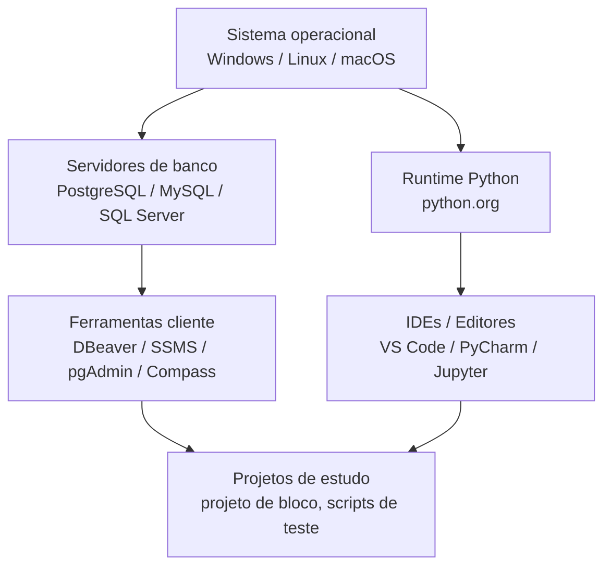

## Visão Geral do Conceito

Um **laboratório de dados** é o conjunto de ferramentas e configurações que você usa diariamente para estudar, testar ideias e desenvolver projetos com dados.  
Ele inclui banco(s) de dados, linguagens de programação, IDEs, utilitários de linha de comando e pequenos projetos de teste.

Nesta lição, vamos transformar as orientações do professor em um **roteiro concreto** para você montar seu próprio laboratório de dados com <mark style="background-color: #242424; padding: 2px 4px; border-radius: 3px; color: inherit;">`Python`</mark> e <mark style="background-color: #242424; padding: 2px 4px; border-radius: 3px; color: inherit;">`SQL`</mark>, alinhado ao projeto de bloco.

## Modelo Mental

Pense no laboratório como um **ambiente de treino profissional**:

- É onde você erra à vontade, instala ferramentas, testa versões diferentes e quebra coisas sem medo.
- É também onde você começa a ter a mesma rotina de quem trabalha com dados: abrir IDE, conectar em banco, rodar scripts, ajustar queries, visualizar resultados.

Um bom modelo mental é enxergar o laboratório em **camadas**:

- **Sistema operacional**: Windows, Linux ou macOS.
- **Serviços de dados**: servidores de banco (por exemplo, <mark style="background-color: #242424; padding: 2px 4px; border-radius: 3px; color: inherit;">`PostgreSQL`</mark>, <mark style="background-color: #242424; padding: 2px 4px; border-radius: 3px; color: inherit;">`MySQL`</mark>, <mark style="background-color: #242424; padding: 2px 4px; border-radius: 3px; color: inherit;">`SQL Server`</mark>).
- **Ferramentas cliente**: <mark style="background-color: #242424; padding: 2px 4px; border-radius: 3px; color: inherit;">`DBeaver`</mark>, <mark style="background-color: #242424; padding: 2px 4px; border-radius: 3px; color: inherit;">`SQL Server Management Studio`</mark>, <mark style="background-color: #242424; padding: 2px 4px; border-radius: 3px; color: inherit;">`pgAdmin`</mark>, <mark style="background-color: #242424; padding: 2px 4px; border-radius: 3px; color: inherit;">`MongoDB Compass`</mark>.
- **Linguagem de programação**: runtime de <mark style="background-color: #242424; padding: 2px 4px; border-radius: 3px; color: inherit;">`Python`</mark>.
- **IDEs e editores**: <mark style="background-color: #242424; padding: 2px 4px; border-radius: 3px; color: inherit;">`VS Code`</mark>, <mark style="background-color: #242424; padding: 2px 4px; border-radius: 3px; color: inherit;">`PyCharm`</mark>, <mark style="background-color: #242424; padding: 2px 4px; border-radius: 3px; color: inherit;">`Jupyter Notebook`</mark>.

Essas camadas trabalham juntas para você conseguir testar o pipeline de dados visto nas lições anteriores.

## Mecânica Central

### 1. Arquitetura geral do laboratório

Podemos representar o laboratório com o diagrama abaixo:



Seu projeto de bloco vive na camada `PROJECT`, mas depende de todas as outras para funcionar bem.

### 2. Bancos de dados e ferramentas cliente

Para o laboratório mínimo de dados, você precisa de **pelo menos um banco relacional** e **uma ferramenta de acesso**:

- Exemplos de servidores:
  - <mark style="background-color: #242424; padding: 2px 4px; border-radius: 3px; color: inherit;">`PostgreSQL`</mark>
  - <mark style="background-color: #242424; padding: 2px 4px; border-radius: 3px; color: inherit;">`MySQL`</mark>
  - <mark style="background-color: #242424; padding: 2px 4px; border-radius: 3px; color: inherit;">`SQL Server`</mark>
- Exemplos de ferramentas cliente:
  - <mark style="background-color: #242424; padding: 2px 4px; border-radius: 3px; color: inherit;">`SQL Server Management Studio`</mark> (para SQL Server).
  - <mark style="background-color: #242424; padding: 2px 4px; border-radius: 3px; color: inherit;">`pgAdmin`</mark> (para PostgreSQL).
  - <mark style="background-color: #242424; padding: 2px 4px; border-radius: 3px; color: inherit;">`MySQL Workbench`</mark> (para MySQL).
  - Ferramentas multi-banco como <mark style="background-color: #242424; padding: 2px 4px; border-radius: 3px; color: inherit;">`DBeaver`</mark>.

Lembre-se:

- O **servidor** é o que guarda os dados.
- A **ferramenta cliente** é só a interface para visualizar e manipular esses dados.

### 3. Instalação do runtime Python

Para usar <mark style="background-color: #242424; padding: 2px 4px; border-radius: 3px; color: inherit;">`Python`</mark> como ferramenta de dados, você precisa primeiro instalar o **runtime oficial**:

1. Acessar o site oficial (`python.org`) e baixar a versão recomendada para o seu sistema.
2. Durante a instalação:
   - Marcar a opção para adicionar Python ao `PATH` (quando disponível).
   - Aceitar a instalação padrão (*Install Now*).
3. Testar em um terminal:

```bash
python --version
```

Se aparecer uma versão (por exemplo, `Python 3.13.x`), o runtime está disponível para scripts e IDEs.

### 4. IDEs e editores para Python

O professor enfatiza três ferramentas principais:

- <mark style="background-color: #242424; padding: 2px 4px; border-radius: 3px; color: inherit;">`VS Code`</mark>  
  Editor leve e extensível, suporta muitas linguagens. Para funcionar bem com Python você precisa:
  - instalar a extensão oficial de <mark style="background-color: #242424; padding: 2px 4px; border-radius: 3px; color: inherit;">`Python`</mark>;
  - selecionar o interpretador correto (por exemplo, `Python 3.13` instalado no sistema).

- <mark style="background-color: #242424; padding: 2px 4px; border-radius: 3px; color: inherit;">`PyCharm`</mark>  
  IDE focada em Python, com muitos recursos para projetos maiores (refatoração, testes, depuração avançada). Possui versão gratuita adequada para estudos.

- <mark style="background-color: #242424; padding: 2px 4px; border-radius: 3px; color: inherit;">`Jupyter Notebook`</mark>  
  Ambiente interativo baseado em blocos de código, ótimo para experimentos rápidos com dados e visualizações.

Cada uma tem vantagens diferentes, mas todas precisam ser apontadas para o **mesmo runtime Python**, para que seus scripts funcionem de forma consistente.

### 5. Organização mínima do laboratório

Uma organização simples e funcional para o semestre pode ser:

- Pasta `laboratorio-dados/` com:
  - subpasta `bancos/` para dumps, scripts de criação de tabelas e anotações sobre conexões;
  - subpasta `python/` para scripts e notebooks de teste;
  - subpasta `projeto-bloco/` para o mini-projeto integrado do semestre.

Dentro de `python/`, ter pelo menos:

- Um script de teste de conexão ao banco.
- Um script simples de leitura de CSV e inserção em tabela.

Isso garante que o laboratório não seja apenas “ferramentas instaladas”, mas um **espaço de prática contínua**.

## Uso Prático

### Checklist de laboratório mínimo para o projeto de bloco

Para acompanhar bem as próximas aulas, é recomendável ter:

- **1 banco relacional instalado** (por exemplo, PostgreSQL ou MySQL).
- **1 ferramenta cliente** para esse banco (pgAdmin, MySQL Workbench ou DBeaver).
- **Python 3.x instalado** via site oficial.
- **Pelo menos uma IDE** configurada com suporte a Python (VS Code com extensão de Python, PyCharm ou equivalente).
- **1 pasta de projeto** com scripts de teste, notebooks e anotações.

### Exemplo de fluxos do dia a dia no laboratório

Algumas atividades típicas que você pode praticar:

- Criar uma tabela `clientes` no banco via ferramenta cliente e depois escrever um script em Python que insere registros de teste.
- Exportar dados de um sistema ou planilha para CSV e usar Python para limpar e carregar no banco.
- Ler dados do banco com Python, aplicar alguma transformação e salvar o resultado em outro formato (por exemplo, outro CSV ou JSON).

Essas rotinas constroem o “músculo” que você vai usar tanto nas avaliações quanto em projetos reais.

## Erros Comuns

- **Instalar apenas a ferramenta cliente e achar que instalou o banco**  
  Abrir o DBeaver sem ter nenhum servidor de banco rodando leva à frustração: você precisa primeiro de um banco de dados para se conectar.

- **Confiar apenas em ambientes online**  
  Praticar somente em notebooks de nuvem ou ambientes da faculdade impede que você aprenda a lidar com problemas reais de instalação, caminhos, permissões e versões.

- **Misturar muitos bancos e ferramentas logo no início**  
  Instalar tudo (PostgreSQL, MySQL, SQL Server, MongoDB, etc.) de uma vez pode deixar o ambiente pesado e confuso. É melhor começar com **uma combinação simples e estável**.

- **Não validar o ambiente com testes pequenos**  
  Achar que “está tudo ok” porque instalou não basta; é essencial rodar scripts mínimos para verificar se Python, banco e IDE estão conversando entre si.

## Visão Geral de Debugging

Quando algo não funciona no laboratório, siga esta ordem:

1. **Verificar instalação**  
   - Comandos como `python --version` e a tela de conexão do banco funcionam?  
   - O serviço do banco está realmente em execução?
2. **Verificar configuração de IDE / cliente**  
   - O VS Code está usando o mesmo interpretador Python que você testou no terminal?  
   - As credenciais de conexão (host, porta, usuário, senha, banco) estão corretas?
3. **Verificar código de teste**  
   - O script de conexão está usando a biblioteca correta (`psycopg2`, `mysql-connector`, etc.)?  
   - Mensagens de erro estão sendo lidas com atenção?
4. **Verificar conflito de versões ou portas**  
   - Existe outro serviço usando a mesma porta do banco?  
   - As versões de drivers e clientes são compatíveis com a versão do servidor?

Tratar o laboratório como um **projeto vivo** facilita muito sua vida quando, no futuro, você precisar subir ambientes mais complexos.

## Principais Pontos

- Um laboratório de dados bem montado é o **fundamento prático** do seu aprendizado em Python, SQL e projeto de bloco.
- É essencial entender a diferença entre **servidores de banco**, **ferramentas cliente** e **IDEs de linguagem**.
- Começar simples (um banco, uma ferramenta cliente, uma IDE) e validar com scripts pequenos é melhor do que tentar abraçar todas as tecnologias de uma vez.
- Cuidar do laboratório é parte do seu desenvolvimento profissional, não apenas um detalhe técnico.

## Preparação para Prática

Depois desta lição, você deve ser capaz de:

- Descrever o laboratório mínimo necessário para o seu projeto de bloco.
- Escolher um conjunto pequeno mas completo de ferramentas para banco e Python.
- Validar o ambiente com testes simples de conexão e execução de código.

No Laboratório de Prática a seguir, você vai **documentar e testar** o seu laboratório em código, criando uma base sólida para todas as atividades do semestre.

## Laboratório de Prática

### Exercício Easy — Inventário do laboratório

Crie um pequeno inventário programático do seu laboratório atual.

```python
from dataclasses import dataclass
from typing import List


@dataclass
class Tool:
    category: str  # "banco", "cliente", "ide", "outro"
    name: str
    version: str
    status: str    # "instalado", "planejado", "nao_instalado"


def list_lab_tools() -> List[Tool]:
    tools: List[Tool] = []

    # TODO: preencher com as ferramentas reais do seu ambiente,
    # incluindo pelo menos um banco, uma ferramenta cliente e uma IDE.

    return tools


if __name__ == "__main__":
    for tool in list_lab_tools():
        print(f"[{tool.category}] {tool.name} ({tool.version}) -> {tool.status}")
```

### Exercício Medium — Checklist automatizado de ambiente

Implemente um script que faça pequenas verificações automáticas do seu laboratório (mesmo que de forma simulada).

```python
import shutil
from typing import Dict


def check_python() -> bool:
    """Verifica se o comando 'python' está disponível no PATH."""
    # TODO: usar shutil.which("python") para checar presença do executável
    return False


def check_client_installed(executable_name: str) -> bool:
    """Verifica se uma ferramenta cliente parece estar instalada."""
    # TODO: reutilizar shutil.which para nomes como "psql", "mysql" ou outros
    return False


def run_checks() -> Dict[str, bool]:
    results = {}
    results["python"] = check_python()
    # TODO: adicionar mais verificações relevantes ao seu laboratório
    return results


if __name__ == "__main__":
    for name, ok in run_checks().items():
        print(f"{name}: {'OK' if ok else 'FALHOU'}")
```

O objetivo é se acostumar a **verificar o ambiente de forma sistemática**, em vez de descobrir problemas só durante uma entrega importante.

### Exercício Hard — Plano de evolução do laboratório

Descreva, em código, um plano de evolução do seu laboratório ao longo do curso.

```python
from dataclasses import dataclass
from typing import List


@dataclass
class LabMilestone:
    semester: int
    goal: str
    required_tools: List[str]


def build_lab_roadmap() -> List[LabMilestone]:
    roadmap: List[LabMilestone] = []

    # TODO: definir pelo menos 3 marcos de evolução do laboratório,
    # por exemplo:
    # - semestre 1: banco relacional + Python + IDE
    # - semestre 2: introdução a NoSQL e pipelines ETL mais complexos
    # - semestre 3: orquestração, nuvem, etc.

    return roadmap


if __name__ == "__main__":
    for milestone in build_lab_roadmap():
        print(f"Semestre {milestone.semester}: {milestone.goal} -> {', '.join(milestone.required_tools)}")
```

Esse exercício ajuda você a enxergar o laboratório como **algo que cresce junto com a sua carreira**, não apenas como uma configuração pontual.

<!-- CONCEPT_EXTRACTION
concepts:
  - laboratorio de dados
  - ambiente de desenvolvimento
  - instalacao de python
  - ferramentas cliente de banco de dados
  - ides para python
skills:
  - Planejar e montar um laboratório mínimo de dados com Python e SQL
  - Diferenciar servidor de banco, ferramenta cliente e IDE de linguagem
  - Validar o ambiente com inventários e checks simples em código
examples:
  - inventario-laboratorio-dados
  - checklist-ambiente-python-sql
  - roadmap-evolucao-laboratorio
-->

<!-- EXERCISES_JSON
[
  {
    "id": "inventario-laboratorio-dados",
    "slug": "inventario-laboratorio-dados",
    "difficulty": "easy",
    "title": "Inventariar o laboratório de dados",
    "discipline": "projeto-bloco",
    "editorLanguage": "python",
    "tags": ["projeto-bloco", "laboratorio", "ambiente"],
    "summary": "Representar em código as principais ferramentas instaladas no laboratório de dados."
  },
  {
    "id": "checklist-ambiente-python-sql",
    "slug": "checklist-ambiente-python-sql",
    "difficulty": "medium",
    "title": "Criar um checklist automatizado do ambiente Python + SQL",
    "discipline": "projeto-bloco",
    "editorLanguage": "python",
    "tags": ["projeto-bloco", "ambiente", "python", "sql"],
    "summary": "Implementar verificações simples que sinalizam se Python e ferramentas-chave do laboratório estão disponíveis."
  },
  {
    "id": "roadmap-evolucao-laboratorio",
    "slug": "roadmap-evolucao-laboratorio",
    "difficulty": "hard",
    "title": "Planejar a evolução do laboratório de dados",
    "discipline": "projeto-bloco",
    "editorLanguage": "python",
    "tags": ["projeto-bloco", "planejamento", "laboratorio"],
    "summary": "Definir marcos de evolução do laboratório de dados ao longo dos semestres, em uma estrutura de dados Python."
  }
]
-->

