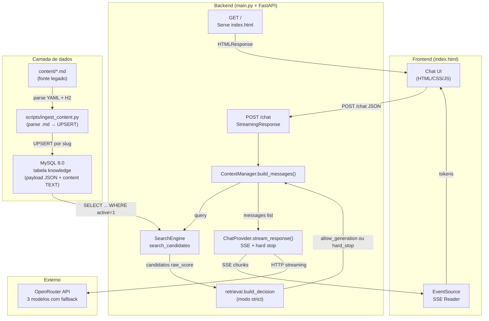
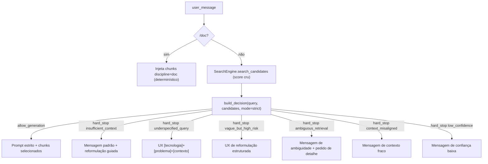

# ACL — Agente de Contexto Local
> Chatbot RAG de alta performance com indexação BM25 sobre MySQL, streaming SSE via OpenRouter e payloads JSON estruturados por aula.

---

## Propósito do sistema

O ACL (Agente de Contexto Local) é uma aplicação monolítica de propósito único: transformar um banco de dados MySQL de aulas estruturadas em uma base de conhecimento consultável via chat, usando um LLM externo como motor de respostas.

O público-alvo são alunos de graduação em tecnologia. Cada aula (originada de arquivos Markdown com front-matter YAML) é ingerida no MySQL com metadados estruturados (`payload JSON`) e texto integral (`content`). O motor BM25 indexa o conteúdo em memória, agrupado por disciplina (silo). A camada `engine/retrieval.py` decide se há contexto suficiente; só então os trechos selecionados entram no prompt do LLM. Em **modo estrito** (padrão), pergunta sem base ou com baixa confiança lexical **não** chama o LLM — o sistema responde com hard stop e mensagem orientando reformulação.

A arquitetura é deliberadamente enxuta — sem fila assíncrona, sem cache distribuído, sem embeddings vetoriais. O BM25 é mitigação **temporária** (`retrieval_mode = bm25_lexical_temporary` no trace); a evolução natural é busca híbrida (BM25 + embeddings + reranking). Toda a inteligência de busca lexical fica na memória do processo; a persistência e a estrutura ficam no MySQL.

---

## Arquitetura

### Stack

| Camada | Tecnologia |
|---|---|
| Servidor HTTP | FastAPI + Uvicorn |
| Índice de busca | BM25Okapi (`rank-bm25`) — in-memory, por silo |
| Banco de dados | MySQL 8.0 (`knowledge` com `payload JSON` + `content TEXT`) |
| Ingestão | `scripts/ingest_content.py` (parse Markdown → MySQL) |
| LLM gateway | OpenRouter API (via `httpx` async) |
| Frontend | HTML/CSS/JS puro (Jinja2 template) |
| Streaming | Server-Sent Events (SSE) |

### Diagrama de componentes



### Estrutura de arquivos

```
KernelBot/
├── main.py                 # Orquestração: logging, SearchEngine, create_app
├── core/                   # Settings (env), logging_config, systemPrompt/
├── engine/
│   ├── search.py           # SearchEngine — BM25 por silo; search_candidates()
│   ├── retrieval.py        # Contratos + build_decision + post_generation_flags
│   ├── database.py         # fetch_db_chunks(), fetch_db_discipline_ids()
│   ├── context.py          # ContextManager — roteador + hard stop UX
│   ├── chat_provider.py    # ChatProvider — SSE, hard stop sem LLM, sanity pós-geração
│   ├── pinned_store.py     # PinnedSessionStore — contexto fixado por sessão
│   └── watcher.py          # (legado — não utilizado, mantido para referência)
├── api/
│   └── routes.py           # GET / e POST /chat
├── app/
│   ├── factory.py          # create_app() com lifespan
│   └── state.py            # AppServices dataclass
├── scripts/
│   └── ingest_content.py   # Parse .md → validação → UPSERT no MySQL
├── SQL/
│   ├── schema.sql          # DDL da tabela knowledge v2
│   ├── schemas/
│   │   └── lesson_v1.json  # JSON Schema (Draft 2020-12) do payload
│   ├── migrations/
│   │   └── 001_to_v2.sql   # ALTER de v1 para v2
│   ├── create_readonly_user.sql
│   └── README.md           # Documentação do schema e ingestão
├── content/                # Fonte .md (legado — lido apenas pelo script de ingestão)
│   ├── doc/                # acl-overview.md, documentation.md
│   ├── python/             # 16 aulas
│   ├── visualizacao-sql/   # 17 aulas
│   ├── projeto-bloco/      # 9 aulas
│   └── planejamento-curso-carreira/  # 7 aulas
├── tests/
│   ├── test_retrieval.py       # Política de retrieval e gates
│   ├── test_context.py         # ContextManager com SearchEngine fake
│   ├── test_chat_provider.py   # Hard stop SSE sem chamar OpenRouter
│   └── test_calibration_runner.py
├── evaluation/
│   ├── calibration_runner.py   # JSONL de traces para calibração manual
│   ├── calibration_summary.py  # Percentis e taxas a partir do JSONL
│   ├── all.md                  # Amostra de perguntas para calibração
│   └── test_questions_runner.py
├── templates/
│   └── index.html          # Frontend: UI, CSS e JS em arquivo único
├── requirements.txt
└── .env                    # OPENROUTER_API_KEY + DB_HOST/PORT/NAME/USER/PASSWORD
```

---

## Módulos e responsabilidades

### `SearchEngine` — Índice BM25 por silo (fonte: MySQL)

Mantém em memória um índice BM25 por disciplina (silo), alimentado exclusivamente pelo MySQL. Não lê mais o filesystem.

**Inicialização:**
1. `__init__` chama `rebuild()`.
2. `fetch_db_chunks()` executa `SELECT id, slug, title, discipline, order, content FROM knowledge WHERE active = 1`.
3. Cada row é dividida em janelas de ~500 palavras com overlap de 50 (`_chunk_text` em `database.py`).
4. Chunks são agrupados por `discipline` em silos independentes, cada um com seu `BM25Okapi`.
5. `fetch_db_discipline_ids()` traz os nomes de disciplina válidos para whitelist.

**Busca:**

```python
def search_candidates(self, query: str, candidate_k: int = 8, discipline_filter: str | None = None) -> list[RetrievalCandidate]:
```

- Tokeniza a query com regex `\w+` (lowercase) e expande acento→sem-acento (Fase 3).
- Se `discipline_filter` fornecido e válido: busca apenas naquele silo.
- Se `global_context_mode == "geral"`: busca em **todos** os silos, merge por score bruto, trunca em `candidate_k`.
- **Não** aplica threshold por score; a decisão de suficiência fica em `engine/retrieval.build_decision`.
- Cada `RetrievalCandidate` carrega `raw_score` (BM25 cru) e `normalized_score` (normalizado por silo, apenas para UI).
- A API antiga `search()` continua disponível para compatibilidade (devolve `list[dict]`).

**Rebuild manual:**
O comando `/reload` no chat aciona `search_engine.rebuild()`, que refaz toda a leitura do MySQL e reconstrói os índices BM25.

### `database.py` — Acesso ao MySQL (schema v2)

Duas funções públicas:

| Função | Retorno | Query |
|--------|---------|-------|
| `fetch_db_chunks(settings)` | `list[dict]` com `text`, `source`, `discipline` | `SELECT id, slug, title, discipline, order, content FROM knowledge WHERE active = 1` |
| `fetch_db_discipline_ids(settings)` | `frozenset[str]` | `SELECT DISTINCT discipline FROM knowledge WHERE active = 1` |

Cada chunk tem `source = "db:{discipline}/{slug}"` e `discipline` real (não mais um valor fixo `"db"`).

### `ContextManager.build_messages()` — Roteador com decisão de retrieval

Desde a mitigação incremental, o `ContextManager` consome uma `RetrievalDecision` produzida em `engine/retrieval.py` e só monta o prompt quando `allow_generation=True`. Hard stop vira resposta pronta (`assistant` message) e o `ChatProvider` pula o LLM.



Regras críticas:

- `/content` **não injeta mais `scope_chunks[:5]`**. Sem hit forte → hard stop com UX de reformulação.
- `/doc` continua sendo fluxo determinístico (injeta todos os chunks do silo `doc`).
- Pin NÃO ressuscita contexto bloqueado: no modo `strict` o pin só serve como histórico de UI.
- O modo padrão é `strict`. `assistive` existe como flag, mas não é ativado por padrão.

Comandos reconhecidos: `/doc`, `/content`, `/python`, `/visualizacao-sql`, `/projeto-bloco`, `/planejamento-curso-carreira`, `/reload`, `/reset`, `/limpar`.

### `engine/retrieval.py` — Contratos e política

Camada nova que centraliza:

- `RetrievalCandidate` (score bruto + normalizado + termos que bateram).
- `RetrievalTrace` (estrutura serializável para avaliação).
- `RetrievalDecision` (allow_generation, reason, confidence, trace).
- `extract_informative_terms`, `coverage`, `coverage_weighted`, `classify_terms`, `is_vague_but_high_risk`, `build_decision`.
- `post_generation_flags` para sanity check pós-geração (Fase 3).
- `expand_query_tokens` para rewriting conservador (acento-sem-acento).

Toda métrica nova precisa justificar decisão concreta em até uma fase; caso contrário, sai do plano ou fica como debug temporário.

### `ChatProvider.stream_response()` — Streaming SSE com fallback

Faz requisição streaming ao OpenRouter e re-emite tokens via SSE.

**Modelos com fallback (em ordem):**

| Prioridade | Modelo |
|---|---|
| 1 | `openrouter/free` (router automático) |
| 2 | `deepseek/deepseek-r1:free` |
| 3 | `meta-llama/llama-4-maverick:free` |

**Condições de fallback:** HTTP 429 (rate limit), HTTP >= 400 (erro), timeout (60s), exceção inesperada — todos acionam o próximo modelo.

**Metadado `ACL_META` (v2):** antes dos tokens, emite `data: [ACL_META]{json}` com:

| Campo | Descrição |
|---|---|
| `v` | Versão do meta (2 desde a mitigação) |
| `label` | Rótulo do contexto (ex.: `Python`, `Documentação (doc)`) |
| `sources` | Fontes do banco (ex.: `db:python/algoritmos-e-notebooks`) |
| `pinned_active` / `pinned_display` | Estado do pin da sessão |
| `mode` | `strict` ou `assistive` |
| `decision` | `answer` ou `hard_stop` |
| `reason` | `ok`, `insufficient_context`, `underspecified_query`, `vague_but_high_risk`, `ambiguous_retrieval`, `context_misaligned`, `low_confidence`, `post_generation_misalignment`, `provider_error` |
| `confidence` | `high`, `medium` ou `low` |
| `llm_called` | `true` se o provider chamou o LLM, `false` em hard stop |
| `tokens_used` | Tokens contados (quando aplicável) |

**Hard stop:** quando `decision == "hard_stop"`, o provider envia a mensagem pronta (sem chamar o LLM) seguido de `[DONE]`. O sanity check pós-geração pode emitir um segundo `ACL_META` com `decision=hard_stop, reason=post_generation_misalignment` e anexar um aviso.

### `scripts/ingest_content.py` — Pipeline de ingestão

Parseia arquivos `.md` de `content/`, extrai front-matter YAML e seções H2+, valida contra `SQL/schemas/lesson_v1.json`, calcula SHA-256 e faz UPSERT por `slug` no MySQL.

```
content/*.md → parse YAML + H2 → validar JSON Schema → SHA-256 → UPSERT por slug → MySQL
```

**Flags:** `--dry-run`, `--only-discipline <nome>`, `--verbose`.

**Idempotência:** compara `source_checksum` (SHA-256 do arquivo) com o valor no banco. Se igual, SKIP. Se diferente, UPDATE. Se novo, INSERT.

---

## Modelo de dados (tabela `knowledge` v2)

| Coluna | Tipo | Descrição |
|--------|------|-----------|
| `id` | `INT UNSIGNED AUTO_INCREMENT` | PK |
| `slug` | `VARCHAR(255) UNIQUE` | Identificador da aula (ex: `por-que-programar-python`) |
| `discipline` | `VARCHAR(70)` | Silo/disciplina (ex: `python`, `visualizacao-sql`) |
| `title` | `VARCHAR(255)` | Título da aula |
| `order` | `INT` | Posição na sequência da disciplina |
| `content` | `MEDIUMTEXT` | Texto integral do .md (usado pelo chunker BM25) |
| `payload` | `JSON` | Representação estruturada (front-matter + seções + exercícios) |
| `payload_version` | `SMALLINT` | Versão do schema JSON (atualmente 1) |
| `source_checksum` | `CHAR(64)` | SHA-256 do arquivo .md de origem |
| `active` | `TINYINT(1)` | 1 = ativa, 0 = desativada |
| `created_at` / `updated_at` | `TIMESTAMP` | Timestamps automáticos |

**Índices:** `uk_slug` (unique), `idx_active_discipline`, `idx_discipline_order`.

**JSON payload (v1):** `schema_version`, `title`, `slug`, `discipline`, `order`, `description`, `reading_time`, `difficulty`, `concepts[]`, `prerequisites[]`, `learning_objectives[]`, `review_after_days[]`, `sections[{heading, level, body_md}]`, `exercises[{level?, question, answer?, hint?}]`.

---

## APIs

### Base URL

`http://127.0.0.1:8001` (configurável em `main.py`). Sem autenticação.

### Endpoints

| Método | Caminho | Descrição |
|--------|---------|-----------|
| `GET` | `/` | Serve a interface web (`index.html` via Jinja2) |
| `POST` | `/chat` | Recebe mensagem, retorna streaming SSE com resposta do LLM |

### `POST /chat`

**Request body (JSON):**

```json
{
  "message": "string (obrigatório)",
  "discipline": "string | null (opcional — filtra silo)",
  "session_id": "string | null (opcional — contexto fixado)"
}
```

**Response:** `text/event-stream` (SSE).

Cada evento é uma linha `data: <conteúdo>\n\n`:
- `data: [ACL_META]{...}` — metadados de rastreabilidade (primeiro evento).
- `data: <token>` — token parcial do LLM (newlines escapadas como `\\n`).
- `data: [DONE]` — fim do stream.
- `data: [ERROR] <mensagem>` — erro (todos os modelos falharam).

**Comandos especiais via `message`:**

| Comando | Efeito |
|---------|--------|
| `/reload` | Reconstrói o índice BM25 a partir do MySQL |
| `/doc <query>` | Injeta todos os chunks de `discipline=doc` (fluxo determinístico, sem decisão) |
| `/content <query>` | Busca global com política estrita; **sem fallback** de chunks brutos |
| `/python <query>` | Filtra busca pelo silo `python` |
| `/visualizacao-sql <query>` | Filtra busca pelo silo `visualizacao-sql` |
| `/projeto-bloco <query>` | Filtra busca pelo silo `projeto-bloco` |
| `/planejamento-curso-carreira <query>` | Filtra pelo silo `planejamento-curso-carreira` |
| `/reset` ou `/limpar` | Limpa contexto fixado da sessão |

**Erros HTTP:**

| Status | Causa |
|--------|-------|
| 400 | JSON inválido, `message` ausente/vazia, `discipline` com tipo errado, `session_id` inválido |

---

## Fluxos

### Fluxo 1: Ingestão de conteúdo (.md → MySQL)

```
1. Dev edita/cria arquivo .md em content/<discipline>/
2. Dev executa: python scripts/ingest_content.py
3. Script parseia YAML front-matter + seções H2 do corpo
4. Valida payload contra SQL/schemas/lesson_v1.json
5. Calcula SHA-256 do arquivo
6. UPSERT por slug no MySQL (INSERT se novo, UPDATE se checksum mudou, SKIP se igual)
7. Resultado: 51 rows em knowledge (49 aulas + 2 docs)
```

### Fluxo 2: Requisição de chat (ponta a ponta)

```
1. Usuário digita mensagem no frontend → Enter
2. POST /chat { message: "variáveis em Python", discipline: null }
3. ContextManager analisa prefixos (/doc, /content, /python, etc.) e seleciona modo=strict
4. SearchEngine.search_candidates(query, candidate_k=8, discipline_filter) devolve candidatos brutos
5. build_decision(query, candidates, mode="strict") aplica:
     - hard stop por ausência de hits ou top_score < MIN_SCORE,
     - underspecified_query (< MIN_TERMS termos informativos),
     - vague_but_high_risk (termo vago sem central forte),
     - ambiguous_retrieval (margem top1/top2 < MIN_SCORE_MARGIN),
     - context_misaligned (coverage < MIN_COVERAGE),
     - low_confidence (coverage ponderada baixa ou termo central ausente).
6. Se allow_generation=False, provider envia a mensagem de hard stop sem chamar o LLM.
7. Se allow_generation=True, ChatProvider.stream_response() envia ao OpenRouter (modelo 1 → fallback).
8. Tokens SSE são re-emitidos ao frontend.
9. Sanity check pós-geração (Fase 3): se a resposta falha, override para post_generation_misalignment.
10. Contexto é fixado na sessão (PinnedSessionStore) para turnos seguintes.
```

### Fluxo 3: Rebuild do índice (/reload)

```
1. Usuário envia /reload no chat
2. api/routes.py intercepta e chama search_engine.rebuild()
3. SearchEngine refaz fetch_db_chunks() + fetch_db_discipline_ids()
4. Novos índices BM25 por silo substituem os anteriores (lock)
5. Resposta SSE: "Índice reconstruído: N chunk(s) total (M silo(s) do MySQL)."
```

### Fluxo 4: Calibração de thresholds (avaliação)

Para calibrar `ACL_RETRIEVAL_*` com dados reais do MySQL, use a pasta `evaluation/`:

```bash
python -m evaluation.calibration_runner --questions evaluation/all.md --out evaluation/calibration_traces.jsonl --limit 20
python -m evaluation.calibration_summary --traces evaluation/calibration_traces.jsonl
```

- O **runner** gera uma linha JSON por pergunta com `query`, `top_score`, `second_score`, `score_margin`, `coverage`, `informative_terms`, `selected_sources`, `decision`, `reason`, `confidence`, `debug` (termos centrais/opcionais, `coverage_weighted`, etc.) e campos vazios `manual_label` / `manual_notes` para revisão humana.
- Linhas com `flow: doc_injection` correspondem a `/doc` (injeta o silo `doc` inteiro; não passam por `build_decision`).
- O **summary** imprime distribuição de `decision`/`reason`, percentis de `top_score` nos casos `answer`, taxas `Stop vs Answer`, `Ambiguous Retrieval Rate`, `Underspecified Query Rate` e `Vague But High Risk Rate`.

Regra de produto: thresholds não devem ser “chute”; ajuste com base nos percentis e nas etiquetas manuais (`manual_label`) após revisar os 20 casos (bootstrap). Evolução prevista: ampliar para 100–200 casos com sampling balanceado.

---

## Variáveis de ambiente (`.env`)

| Variável | Obrigatório | Default | Descrição |
|---|---|---|---|
| `OPENROUTER_API_KEY` | Sim | — | Chave da API OpenRouter. Falha fatal se ausente. |
| `DB_HOST` | Sim | — | Host do MySQL |
| `DB_PORT` | Não | `3306` | Porta do MySQL |
| `DB_NAME` | Sim | — | Nome do banco (ex: `pybot`) |
| `DB_USER` | Sim | — | Usuário MySQL |
| `DB_PASSWORD` | Sim | — | Senha do MySQL |
| `ACL_GLOBAL_CONTEXT` | Não | `geral` | `geral` (todos silos) ou `all` |
| `ACL_PINNED_MAX_TURNS` | Não | `5` | Turnos máximos com contexto fixado |
| `ACL_PINNED_MAX_CHARS` | Não | `24000` | Limite de chars no contexto fixado |
| `ACL_PINNED_WEAK_SCORE` | Não | `0.4` | Threshold legado para pin fraco |
| `ACL_RETRIEVAL_MIN_SCORE` | Não | `1.5` | Hard stop abaixo desse `top_score` BM25 bruto |
| `ACL_RETRIEVAL_MIN_SCORE_MARGIN` | Não | `0.15` | Margem mínima entre top1 e top2 |
| `ACL_RETRIEVAL_MIN_COVERAGE` | Não | `0.34` | Cobertura mínima de termos informativos |
| `ACL_RETRIEVAL_MIN_COVERAGE_WEIGHTED` | Não | `0.34` | Idem com termos centrais valendo 2x |
| `ACL_RETRIEVAL_MIN_TERMS` | Não | `2` | Termos informativos mínimos no modo strict |
| `ACL_RETRIEVAL_CANDIDATE_K` | Não | `8` | Candidatos devolvidos pelo SearchEngine |
| `ACL_RETRIEVAL_TOP_K` | Não | `4` | Chunks selecionados para o prompt |
| `ACL_RETRIEVAL_MAX_CHUNKS_PER_SOURCE` | Não | `2` | Diversidade mínima (evita 1 fonte dominando) |

---

## Limitações e pontos de atenção

| # | Problema | Impacto | Mitigação |
|---|---|---|---|
| 1 | Sem persistência de histórico no servidor | Cada requisição é stateless; histórico só em `sessionStorage` | Intencional para simplicidade |
| 2 | BM25-only (lexical) | Não captura intenção semântica; score alto com chunk errado ainda é possível | Gates de coverage, margem, `low_confidence`, sanity check pós-geração; calibrar com `evaluation/`; roadmap híbrido |
| 3 | Modo strict aumenta falsos negativos | Mais hard stops e pedidos de reformulação | Preferível a resposta confiante sem base; ajustar `ACL_RETRIEVAL_*` com traces |
| 4 | Modelos gratuitos com rate limit | Fallback pode esgotar | `openrouter/free` como primeiro modelo é mais resiliente; `provider_error` com UX amigável |
| 5 | Sem autenticação na interface | Qualquer um na rede local acessa | Deploy apenas em `127.0.0.1` |
| 6 | Chunker por janela de palavras (não por seção) | Chunks podem cortar no meio de uma seção | Evolução futura: chunker semântico usando `payload.sections` |
| 7 | Watcher desativado | Mudanças em `.md` não refletem automaticamente | Usar `/reload` após `ingest_content.py` |
| 8 | `content/` é legado | Não é lido pelo engine, apenas pelo script de ingestão | Manter como fonte para re-ingestão |
| 9 | Segundo `ACL_META` no stream | Sanity pós-geração pode emitir novo meta após tokens parciais | Frontend pode ignorar campos desconhecidos; UI mostra aviso concatenado |

---

## Glossário e referências

| Termo | Definição |
|-------|-----------|
| **Silo** | Partição lógica do índice BM25 por disciplina (`python`, `visualizacao-sql`, etc.) |
| **Chunk** | Trecho de ~500 palavras extraído de uma aula para indexação BM25 |
| **Payload** | Campo JSON na tabela `knowledge` com metadados estruturados da aula |
| **Discipline** | Identificador da disciplina/trilha (corresponde a uma pasta em `content/`) |
| **Pin / Contexto fixado** | Chunks mantidos na sessão do usuário por até N turnos; no modo strict **não** substitui decisão de hard stop |
| **Hard stop** | Resposta fixa sem LLM quando retrieval ou sanity check reprova a geração |
| **RetrievalTrace** | Registro serializável (`to_dict`) para logs e calibração |
| **Ingestão** | Processo de parse `.md` → validação → UPSERT no MySQL via `ingest_content.py` |

**Referências:**
- JSON Schema do payload: `SQL/schemas/lesson_v1.json`
- DDL da tabela: `SQL/schema.sql`
- Documentação do banco: `SQL/README.md`
- Script de ingestão: `scripts/ingest_content.py`
