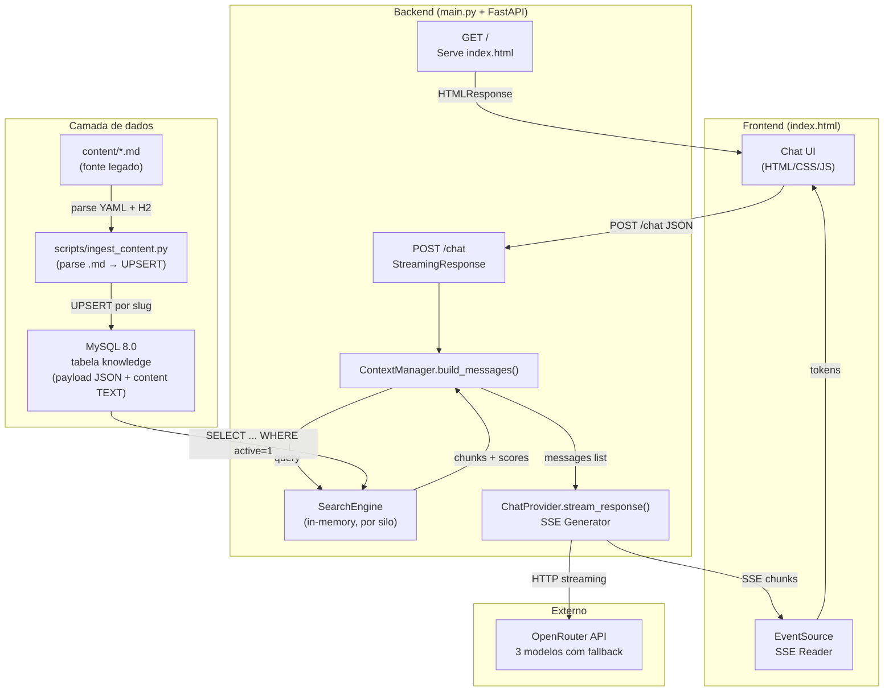
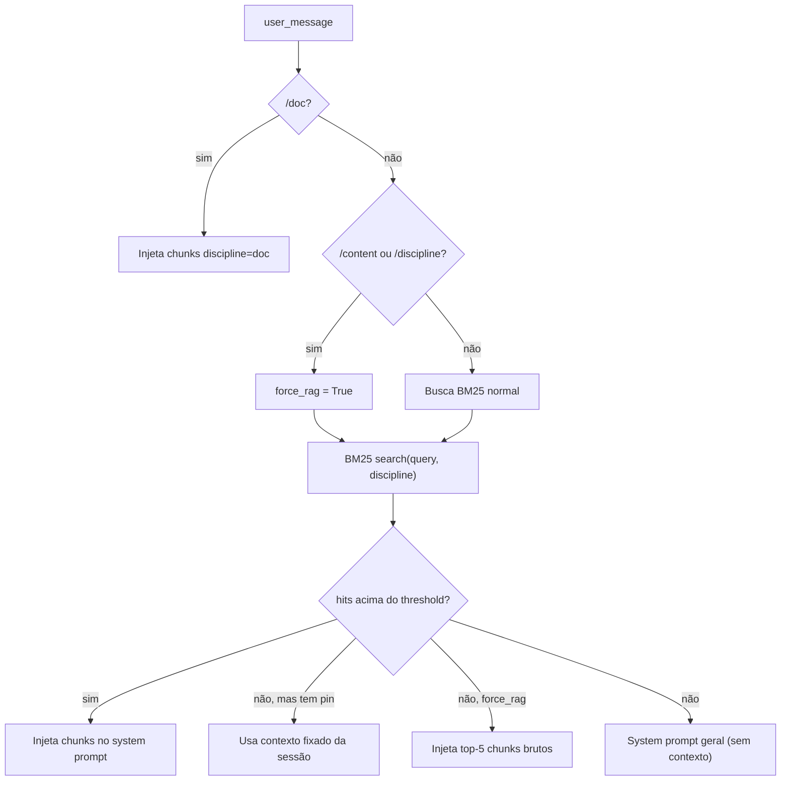

# ACL — Agente de Contexto Local
> Chatbot RAG de alta performance com indexação BM25 sobre MySQL, streaming SSE via OpenRouter e payloads JSON estruturados por aula.

---

## Propósito do sistema

O ACL (Agente de Contexto Local) é uma aplicação monolítica de propósito único: transformar um banco de dados MySQL de aulas estruturadas em uma base de conhecimento consultável via chat, usando um LLM externo como motor de respostas.

O público-alvo são alunos de graduação em tecnologia. Cada aula (originada de arquivos Markdown com front-matter YAML) é ingerida no MySQL com metadados estruturados (`payload JSON`) e texto integral (`content`). O motor BM25 indexa o conteúdo em memória, agrupado por disciplina (silo), e injeta os trechos mais relevantes no prompt do LLM antes de cada resposta.

A arquitetura é deliberadamente enxuta — sem fila assíncrona, sem cache distribuído, sem embeddings vetoriais. Toda a inteligência de busca fica na memória do processo; a persistência e a estrutura ficam no MySQL.

---

## Arquitetura

### Stack

| Camada | Tecnologia |
|---|---|
| Servidor HTTP | FastAPI + Uvicorn |
| Índice de busca | BM25Okapi (`rank-bm25`) — in-memory, por silo |
| Banco de dados | MySQL 8.0 (`knowledge` com `payload JSON` + `content TEXT`) |
| Ingestão | `scripts/ingest_content.py` (parse Markdown → MySQL) |
| LLM gateway | OpenRouter API (via `httpx` async) |
| Frontend | HTML/CSS/JS puro (Jinja2 template) |
| Streaming | Server-Sent Events (SSE) |

### Diagrama de componentes



### Estrutura de arquivos

```
KernelBot/
├── main.py                 # Orquestração: logging, SearchEngine, create_app
├── core/                   # Settings (env), logging_config, systemPrompt/
├── engine/
│   ├── search.py           # SearchEngine (BM25 por silo, fonte: MySQL)
│   ├── database.py         # fetch_db_chunks(), fetch_db_discipline_ids()
│   ├── context.py          # ContextManager.build_messages() — roteador RAG
│   ├── chat_provider.py    # ChatProvider — streaming SSE com fallback
│   ├── pinned_store.py     # PinnedSessionStore — contexto fixado por sessão
│   └── watcher.py          # (legado — não utilizado, mantido para referência)
├── api/
│   └── routes.py           # GET / e POST /chat
├── app/
│   ├── factory.py          # create_app() com lifespan
│   └── state.py            # AppServices dataclass
├── scripts/
│   └── ingest_content.py   # Parse .md → validação → UPSERT no MySQL
├── SQL/
│   ├── schema.sql          # DDL da tabela knowledge v2
│   ├── schemas/
│   │   └── lesson_v1.json  # JSON Schema (Draft 2020-12) do payload
│   ├── migrations/
│   │   └── 001_to_v2.sql   # ALTER de v1 para v2
│   ├── create_readonly_user.sql
│   └── README.md           # Documentação do schema e ingestão
├── content/                # Fonte .md (legado — lido apenas pelo script de ingestão)
│   ├── doc/                # acl-overview.md, documentation.md
│   ├── python/             # 16 aulas
│   ├── visualizacao-sql/   # 17 aulas
│   ├── projeto-bloco/      # 9 aulas
│   └── planejamento-curso-carreira/  # 7 aulas
├── tests/
│   ├── test_ingest.py      # 19 testes unitários (parse, validação, checksum)
│   └── test_integration.py # 10 testes de integração (search + MySQL)
├── templates/
│   └── index.html          # Frontend: UI, CSS e JS em arquivo único
├── requirements.txt
└── .env                    # OPENROUTER_API_KEY + DB_HOST/PORT/NAME/USER/PASSWORD
```

---

## Módulos e responsabilidades

### `SearchEngine` — Índice BM25 por silo (fonte: MySQL)

Mantém em memória um índice BM25 por disciplina (silo), alimentado exclusivamente pelo MySQL. Não lê mais o filesystem.

**Inicialização:**
1. `__init__` chama `rebuild()`.
2. `fetch_db_chunks()` executa `SELECT id, slug, title, discipline, order, content FROM knowledge WHERE active = 1`.
3. Cada row é dividida em janelas de ~500 palavras com overlap de 50 (`_chunk_text` em `database.py`).
4. Chunks são agrupados por `discipline` em silos independentes, cada um com seu `BM25Okapi`.
5. `fetch_db_discipline_ids()` traz os nomes de disciplina válidos para whitelist.

**Busca:**

```python
def search(self, query: str, top_k: int = 3, discipline_filter: str | None = None) -> list[dict]:
```

- Tokeniza a query com regex `\w+` (lowercase).
- Se `discipline_filter` fornecido e válido: busca apenas naquele silo.
- Se `global_context_mode == "geral"`: busca em **todos** os silos, merge por score, trunca em `top_k`.
- Threshold de 0.7 — chunks abaixo são descartados (intencional: evita contexto irrelevante).

**Rebuild manual:**
O comando `/reload` no chat aciona `search_engine.rebuild()`, que refaz toda a leitura do MySQL e reconstrói os índices BM25.

### `database.py` — Acesso ao MySQL (schema v2)

Duas funções públicas:

| Função | Retorno | Query |
|--------|---------|-------|
| `fetch_db_chunks(settings)` | `list[dict]` com `text`, `source`, `discipline` | `SELECT id, slug, title, discipline, order, content FROM knowledge WHERE active = 1` |
| `fetch_db_discipline_ids(settings)` | `frozenset[str]` | `SELECT DISTINCT discipline FROM knowledge WHERE active = 1` |

Cada chunk tem `source = "db:{discipline}/{slug}"` e `discipline` real (não mais um valor fixo `"db"`).

### `ContextManager.build_messages()` — Roteador de contexto

Decide qual contexto injetar no prompt e monta a lista `messages` para o LLM.



Comandos reconhecidos: `/doc`, `/content`, `/python`, `/visualizacao-sql`, `/projeto-bloco`, `/planejamento-curso-carreira`, `/reload`, `/reset`, `/limpar`.

### `ChatProvider.stream_response()` — Streaming SSE com fallback

Faz requisição streaming ao OpenRouter e re-emite tokens via SSE.

**Modelos com fallback (em ordem):**

| Prioridade | Modelo |
|---|---|
| 1 | `openrouter/free` (router automático) |
| 2 | `deepseek/deepseek-r1:free` |
| 3 | `meta-llama/llama-4-maverick:free` |

**Condições de fallback:** HTTP 429 (rate limit), HTTP >= 400 (erro), timeout (60s), exceção inesperada — todos acionam o próximo modelo.

**Metadado `ACL_META`:** antes dos tokens, emite `data: [ACL_META]{json}` com `label`, `sources`, `pinned_active` para rastreabilidade no frontend.

### `scripts/ingest_content.py` — Pipeline de ingestão

Parseia arquivos `.md` de `content/`, extrai front-matter YAML e seções H2+, valida contra `SQL/schemas/lesson_v1.json`, calcula SHA-256 e faz UPSERT por `slug` no MySQL.

```
content/*.md → parse YAML + H2 → validar JSON Schema → SHA-256 → UPSERT por slug → MySQL
```

**Flags:** `--dry-run`, `--only-discipline <nome>`, `--verbose`.

**Idempotência:** compara `source_checksum` (SHA-256 do arquivo) com o valor no banco. Se igual, SKIP. Se diferente, UPDATE. Se novo, INSERT.

---

## Modelo de dados (tabela `knowledge` v2)

| Coluna | Tipo | Descrição |
|--------|------|-----------|
| `id` | `INT UNSIGNED AUTO_INCREMENT` | PK |
| `slug` | `VARCHAR(255) UNIQUE` | Identificador da aula (ex: `por-que-programar-python`) |
| `discipline` | `VARCHAR(70)` | Silo/disciplina (ex: `python`, `visualizacao-sql`) |
| `title` | `VARCHAR(255)` | Título da aula |
| `order` | `INT` | Posição na sequência da disciplina |
| `content` | `MEDIUMTEXT` | Texto integral do .md (usado pelo chunker BM25) |
| `payload` | `JSON` | Representação estruturada (front-matter + seções + exercícios) |
| `payload_version` | `SMALLINT` | Versão do schema JSON (atualmente 1) |
| `source_checksum` | `CHAR(64)` | SHA-256 do arquivo .md de origem |
| `active` | `TINYINT(1)` | 1 = ativa, 0 = desativada |
| `created_at` / `updated_at` | `TIMESTAMP` | Timestamps automáticos |

**Índices:** `uk_slug` (unique), `idx_active_discipline`, `idx_discipline_order`.

**JSON payload (v1):** `schema_version`, `title`, `slug`, `discipline`, `order`, `description`, `reading_time`, `difficulty`, `concepts[]`, `prerequisites[]`, `learning_objectives[]`, `review_after_days[]`, `sections[{heading, level, body_md}]`, `exercises[{level?, question, answer?, hint?}]`.

---

## APIs

### Base URL

`http://127.0.0.1:8001` (configurável em `main.py`). Sem autenticação.

### Endpoints

| Método | Caminho | Descrição |
|--------|---------|-----------|
| `GET` | `/` | Serve a interface web (`index.html` via Jinja2) |
| `POST` | `/chat` | Recebe mensagem, retorna streaming SSE com resposta do LLM |

### `POST /chat`

**Request body (JSON):**

```json
{
  "message": "string (obrigatório)",
  "discipline": "string | null (opcional — filtra silo)",
  "session_id": "string | null (opcional — contexto fixado)"
}
```

**Response:** `text/event-stream` (SSE).

Cada evento é uma linha `data: <conteúdo>\n\n`:
- `data: [ACL_META]{...}` — metadados de rastreabilidade (primeiro evento).
- `data: <token>` — token parcial do LLM (newlines escapadas como `\\n`).
- `data: [DONE]` — fim do stream.
- `data: [ERROR] <mensagem>` — erro (todos os modelos falharam).

**Comandos especiais via `message`:**

| Comando | Efeito |
|---------|--------|
| `/reload` | Reconstrói o índice BM25 a partir do MySQL |
| `/doc <query>` | Força uso dos chunks de `discipline=doc` |
| `/content <query>` | Força RAG com fallback para top-5 chunks brutos |
| `/python <query>` | Filtra busca pelo silo `python` |
| `/visualizacao-sql <query>` | Filtra busca pelo silo `visualizacao-sql` |
| `/projeto-bloco <query>` | Filtra busca pelo silo `projeto-bloco` |
| `/planejamento-curso-carreira <query>` | Filtra pelo silo `planejamento-curso-carreira` |
| `/reset` ou `/limpar` | Limpa contexto fixado da sessão |

**Erros HTTP:**

| Status | Causa |
|--------|-------|
| 400 | JSON inválido, `message` ausente/vazia, `discipline` com tipo errado, `session_id` inválido |

---

## Fluxos

### Fluxo 1: Ingestão de conteúdo (.md → MySQL)

```
1. Dev edita/cria arquivo .md em content/<discipline>/
2. Dev executa: python scripts/ingest_content.py
3. Script parseia YAML front-matter + seções H2 do corpo
4. Valida payload contra SQL/schemas/lesson_v1.json
5. Calcula SHA-256 do arquivo
6. UPSERT por slug no MySQL (INSERT se novo, UPDATE se checksum mudou, SKIP se igual)
7. Resultado: 51 rows em knowledge (49 aulas + 2 docs)
```

### Fluxo 2: Requisição de chat (ponta a ponta)

```
1. Usuário digita mensagem no frontend → Enter
2. POST /chat { message: "variáveis em Python", discipline: null }
3. ContextManager analisa prefixos (/doc, /content, /python, etc.)
4. SearchEngine.search(query, discipline_filter) executa BM25 nos silos
5. Chunks com score >= 0.7 são injetados no system prompt
6. ChatProvider.stream_response() envia ao OpenRouter (modelo 1 → fallback)
7. Tokens SSE são re-emitidos ao frontend
8. Frontend renderiza Markdown incremental via marked.js
9. Contexto é fixado na sessão (PinnedSessionStore) para turnos seguintes
```

### Fluxo 3: Rebuild do índice (/reload)

```
1. Usuário envia /reload no chat
2. api/routes.py intercepta e chama search_engine.rebuild()
3. SearchEngine refaz fetch_db_chunks() + fetch_db_discipline_ids()
4. Novos índices BM25 por silo substituem os anteriores (lock)
5. Resposta SSE: "Índice reconstruído: N chunk(s) total (M silo(s) do MySQL)."
```

---

## Variáveis de ambiente (`.env`)

| Variável | Obrigatório | Default | Descrição |
|---|---|---|---|
| `OPENROUTER_API_KEY` | Sim | — | Chave da API OpenRouter. Falha fatal se ausente. |
| `DB_HOST` | Sim | — | Host do MySQL |
| `DB_PORT` | Não | `3306` | Porta do MySQL |
| `DB_NAME` | Sim | — | Nome do banco (ex: `pybot`) |
| `DB_USER` | Sim | — | Usuário MySQL |
| `DB_PASSWORD` | Sim | — | Senha do MySQL |
| `ACL_GLOBAL_CONTEXT` | Não | `geral` | `geral` (todos silos) ou `all` |
| `ACL_PINNED_MAX_TURNS` | Não | `5` | Turnos máximos com contexto fixado |
| `ACL_PINNED_MAX_CHARS` | Não | `24000` | Limite de chars no contexto fixado |
| `ACL_PINNED_WEAK_SCORE` | Não | `0.4` | Threshold para considerar hit "fraco" |

---

## Limitações e pontos de atenção

| # | Problema | Impacto | Mitigação |
|---|---|---|---|
| 1 | Sem persistência de histórico no servidor | Cada requisição é stateless; histórico só em `sessionStorage` | Intencional para simplicidade |
| 2 | BM25 threshold rígido (0.7) | Queries com vocabulário diferente do corpus não ativam RAG | Usar `/content` para forçar |
| 3 | Modelos gratuitos com rate limit | Fallback pode esgotar | `openrouter/free` como primeiro modelo é mais resiliente |
| 4 | Sem autenticação na interface | Qualquer um na rede local acessa | Deploy apenas em `127.0.0.1` |
| 5 | Chunker por janela de palavras (não por seção) | Chunks podem cortar no meio de uma seção | Evolução futura: chunker semântico usando `payload.sections` |
| 6 | Watcher desativado | Mudanças em `.md` não refletem automaticamente | Usar `/reload` após `ingest_content.py` |
| 7 | `content/` é legado | Não é lido pelo engine, apenas pelo script de ingestão | Manter como fonte para re-ingestão |

---

## Glossário e referências

| Termo | Definição |
|-------|-----------|
| **Silo** | Partição lógica do índice BM25 por disciplina (`python`, `visualizacao-sql`, etc.) |
| **Chunk** | Trecho de ~500 palavras extraído de uma aula para indexação BM25 |
| **Payload** | Campo JSON na tabela `knowledge` com metadados estruturados da aula |
| **Discipline** | Identificador da disciplina/trilha (corresponde a uma pasta em `content/`) |
| **Pin / Contexto fixado** | Chunks mantidos na sessão do usuário por até N turnos sem nova busca BM25 |
| **Ingestão** | Processo de parse `.md` → validação → UPSERT no MySQL via `ingest_content.py` |

**Referências:**
- JSON Schema do payload: `SQL/schemas/lesson_v1.json`
- DDL da tabela: `SQL/schema.sql`
- Documentação do banco: `SQL/README.md`
- Script de ingestão: `scripts/ingest_content.py`
