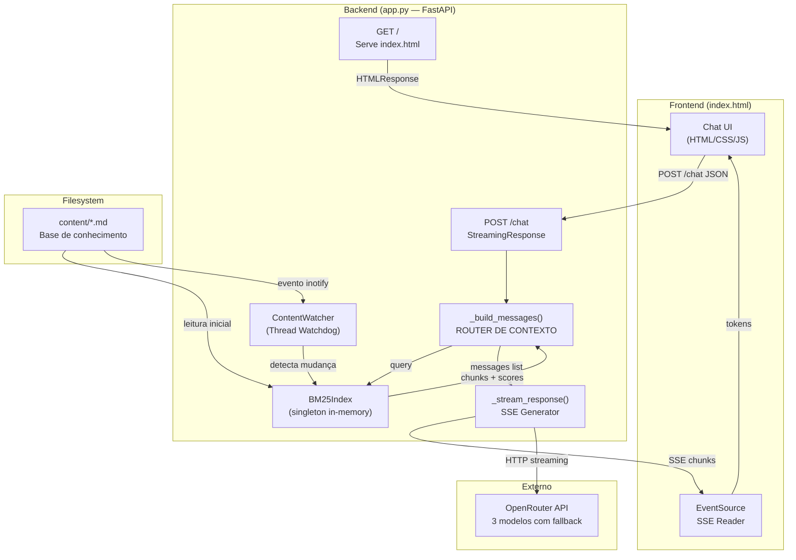
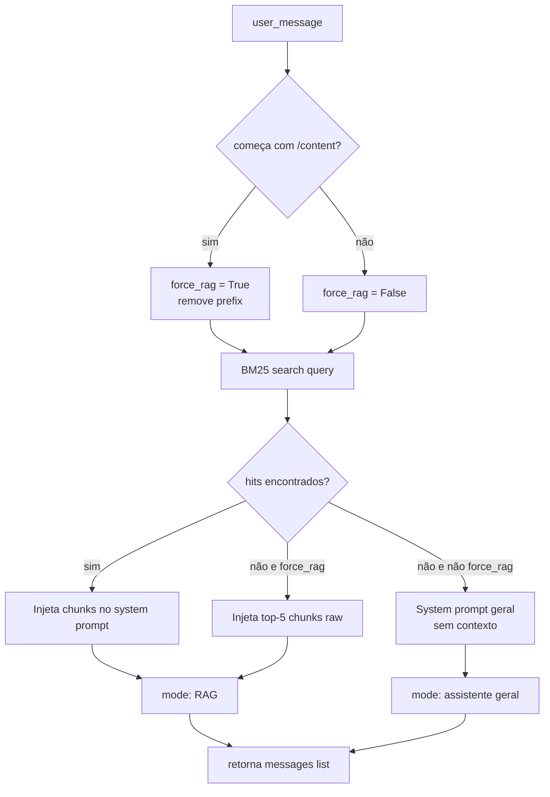

# ACL — Agente de Contexto Local
> Chatbot RAG de alta performance com indexação BM25, file-watching reativo e streaming SSE via OpenRouter.

---

## 1. Visão Geral

O ACL é uma aplicação monolítica de **propósito único**: transformar um diretório local de arquivos Markdown em uma base de conhecimento consultável via chat, usando um LLM externo como motor de respostas. A arquitetura é deliberadamente enxuta — sem banco de dados, sem fila assíncrona, sem cache distribuído. Toda a inteligência fica na memória do processo.

**Stack:**
| Camada | Tecnologia |
|---|---|
| Servidor HTTP | FastAPI + Uvicorn |
| Índice de busca | BM25Okapi (`rank-bm25`) |
| File watching | Watchdog (thread background) |
| LLM gateway | OpenRouter API (via `httpx` async) |
| Frontend | HTML/CSS/JS puro (Jinja2 template) |
| Streaming | Server-Sent Events (SSE) |

---

## 2. Estrutura de Arquivos

```
BotTes/
├── app.py              # Toda a lógica de backend (único módulo Python)
├── requirements.txt    # Dependências do projeto
├── .env                # Segredo: OPENROUTER_API_KEY
├── content/            # Base de conhecimento — arquivos .md servidos ao BM25
│   ├── acl-overview.md
│   └── aula-*.md       # Conteúdo educacional (17 arquivos no momento)
└── templates/
    └── index.html      # Frontend completo: UI, CSS e JS em um único arquivo
```

**Por que tudo em `app.py`?** Escolha de portabilidade — o projeto roda com `python app.py` em qualquer máquina com Python 3.11+ e as dependências instaladas. A refatoração em pacotes só se justifica quando houver múltiplos domínios (autenticação, jobs bg, APIs separadas).

---

## 3. Arquitetura



---

## 4. Módulos e Responsabilidades

### 4.1 `BM25Index` — Índice de Recuperação

**Responsabilidade:** Manter em memória um índice BM25 de todos os chunks extraídos dos arquivos `.md` em `/content`. É o coração do sistema RAG.

**Por que BM25 e não embedding vetorial?**
BM25 é determinístico, não requer GPU, não tem custo de API, e para domínios de texto técnico estruturado (como aulas em Markdown) a precisão é comparável a embeddings de modelos pequenos. A escolha é conscientemente pragmática para um sistema portável.

**Fluxo de indexação:**
1. `__init__` chama `rebuild()` imediatamente na inicialização.
2. `_chunk_markdown(path)` divide cada `.md` em seções por headers `#`, `##`, `###`. Cada seção vira um `dict { text, source }`.
3. Todos os chunks de todos os arquivos são tokenizados com regex `\w+` (lowercase) e alimentados ao `BM25Okapi`.
4. O índice e os chunks ficam protegidos por `threading.Lock` para acesso seguro do Watchdog.

**Busca:**
```python
def search(self, query: str, top_k: int = 3) -> list[dict]:
```
- Tokeniza a query da mesma forma que os documentos.
- Obtém scores BM25 brutos e **normaliza pelo score máximo** (escala 0–1).
- Filtra por `BM25_SCORE_THRESHOLD = 0.7` — chunks abaixo disso são descartados.
- Retorna os `top_k` hits com score acima do threshold.

> [!IMPORTANT]
> O threshold de 0.7 é agressivo. Se o usuário perguntar algo cujos termos não colidem bem com os tokens do índice, o sistema degrada para modo "assistente geral" sem contexto. Isso é intencional para evitar injeção de contexto irrelevante, mas pode surpreender.

---

### 4.2 `ContentWatcher` — File Watching Reativo

**Responsabilidade:** Monitorar `/content` em uma thread de background e acionar rebuild do BM25 quando arquivos `.md` forem criados, modificados ou deletados.

**Decisão de design crítica:** debounce de **1.5 segundos** via `threading.Timer`. Se múltiplos eventos chegarem em sequência (ex: editor salvando com escrita atômica em dois estágios), apenas o último dispara o rebuild. Cancela o timer anterior antes de criar um novo.

```python
def _debounced_rebuild(self) -> None:
    if self._timer and self._timer.is_alive():
        self._timer.cancel()
    self._timer = threading.Timer(1.5, self._index.rebuild)
    self._timer.start()
```

O observer é iniciado **fora** do lifespan do FastAPI, diretamente no escopo do módulo (`observer.start()`). O shutdown é feito no lifespan:
```python
async def lifespan(app: FastAPI):
    yield
    observer.stop()
    observer.join()
```

---

### 4.3 `_build_messages()` — Roteador de Contexto

**Responsabilidade:** Decidir se a requisição precisa de contexto RAG ou não, e montar a lista de mensagens para o LLM.

**Lógica de decisão:**



O comando `/content` é um override manual: força busca no índice mesmo que o score seja zero, injetando os 5 primeiros chunks como contexto de último recurso.

---

### 4.4 `_stream_response()` — Gerador SSE com Fallback

**Responsabilidade:** Fazer requisição streaming ao OpenRouter, parsear os chunks SSE da API, e re-emitir para o cliente como SSE.

**Modelos com fallback (em ordem de tentativa):**
| Prioridade | Modelo |
|---|---|
| 1 | `arcee-ai/trinity-large-preview:free` |
| 2 | `google/gemini-2.5-flash:free` |
| 3 | `meta-llama/llama-3.3-70b-instruct:free` |

**Condições de fallback:**
- HTTP 429 (rate limit) → tenta próximo imediatamente.
- HTTP >= 400 (qualquer outro erro) → loga o body e tenta próximo.
- `httpx.TimeoutException` (limite 60s) → tenta próximo.
- Qualquer exceção inesperada → loga com traceback e tenta próximo.

**Protocolo de escape SSE:**
O backend não pode emitir `\n` literal dentro de um campo `data:` SSE (quebraria o protocolo). A solução é escapar:
```python
safe = token.replace("\n", "\\n")
yield f"data: {safe}\n\n"
```
E o frontend desfaz o escape:
```js
fullText += payload.replace(/\\n/g, '\n');
```

---

### 4.5 `index.html` — Frontend Monolítico

O frontend é **autocontido** em um único arquivo Jinja2, sem bundler, sem framework JS.

**Dependências externas (CDN):**
- `marked.js v12` — parse de Markdown para HTML.
- `highlight.js v11.9` — syntax highlighting em blocos de código.
- `Inter` e `JetBrains Mono` — Google Fonts.

**Design tokens (CSS custom properties):**
| Token | Valor | Uso |
|---|---|---|
| `--bg` | `#1E1E1E` | Background geral |
| `--surface` | `#27272A` | Header/Footer |
| `--accent` | `#5B88B2` | Botões, links, foco |
| `--error` | `#F87171` | Mensagens de erro |
| `--success` | `#4ADE80` | Badge "Online" |

**Gerenciamento de estado:**
- Histórico de conversa é persistido em `sessionStorage` com chave `acl_history`.
- Limite de 10 mensagens (`MAX_HISTORY = 10`) — truncagem pela cauda mais antiga.
- Na recarga da página, o histórico é re-renderizado com `renderSavedHistory()`.

**Fluxo de streaming no frontend:**
1. `fetch('/chat', { method: 'POST', body: JSON.stringify({ message }) })`
2. `res.body.getReader()` — leitura manual do stream.
3. Buffer de texto parcial para lidar com chunks SSE fragmentados entre `read()` calls.
4. Re-render Markdown incremental a cada token recebido (`bubble.innerHTML = renderMarkdown(fullText)`).
5. Cursor piscante (`.cursor-blink::after { content: "▋" }`) removido ao final do stream.

---

## 5. Fluxo Completo de uma Requisição

```
Usuário digita mensagem → Enter
    │
    ▼
POST /chat { message: "..." }
    │
    ▼
_build_messages(user_message)
    ├── BM25Index.search(query) → [chunk1, chunk2, ...]
    └── compõe system prompt (RAG ou geral)
    │
    ▼
StreamingResponse(_stream_response(messages))
    │
    ▼
httpx.AsyncClient → OpenRouter API (stream=True)
    │
    ├── modelo 1 falha? → modelo 2 → modelo 3
    └── stream de tokens SSE
    │
    ▼
yield "data: <token>\n\n" (por token)
    │
    ▼
Frontend: reader.read() → buffer → parse SSE → marked.parse() → innerHTML
```

---

## 6. Configuração e Operação

### Variáveis de Ambiente (`.env`)

| Variável | Obrigatório | Descrição |
|---|---|---|
| `OPENROUTER_API_KEY` | **Sim** | Chave de API do OpenRouter. Falha fatal se ausente. |

### Dependências (`requirements.txt`)

```
fastapi
uvicorn
httpx
python-dotenv
jinja2
rank-bm25
watchdog
```

> [!WARNING]
> Nenhuma versão está fixada. Em produção, isso é uma bomba-relógio. Use `pip freeze > requirements.txt` após validação e commite as versões exatas.

### Inicialização

```bash
# Método 1 — direto
python app.py

# Método 2 — uvicorn com reload (desenvolvimento)
uvicorn app:app --host 127.0.0.1 --port 8000 --reload
```

Servidor sobe em `http://127.0.0.1:8000`.

### Adicionando conteúdo à base de conhecimento

Basta copiar arquivos `.md` para `/content/`. O Watchdog detecta em até 1.5s e reconstrói o índice automaticamente. Nenhum restart necessário.

---

## 7. Limitações e Pontos de Atenção

| # | Problema | Impacto | Mitigação atual |
|---|---|---|---|
| 1 | **Sem persistência de histórico no servidor** | Cada requisição é stateless. O histórico é só local (sessionStorage) | Intencional para simplicidade |
| 2 | **BM25 threshold rígido (0.7)** | Queries com vocabulário diferente do corpus não ativam RAG | Usar `/content` para forçar |
| 3 | **Modelos gratuitos com rate limit** | Fallback entre 3 modelos pode esgotar e retornar erro | Monitorar logs; adicionar modelos pagos |
| 4 | **API key exposta no `.env` sem rotação** | Risco de vazamento se o repo for publicado | `.env` deve estar no `.gitignore` |
| 5 | **Sem autenticação na interface** | Qualquer um na rede local acessa o chat | Deploy apenas em `127.0.0.1` |
| 6 | **Versões não fixadas nas dependências** | Quebra silenciosa em novas instalações | Fixar com `pip freeze` |
| 7 | **Re-render Markdown a cada token** | CPU despendida em parse repetido durante stream | Aceitável para tráfego baixo |

---

## 8. Extensões Naturais

Se o projeto crescer, estes são os próximos passos arquiteturais em ordem de impacto:

1. **Fixar versões** em `requirements.txt` → imediato, zero custo.
2. **Rate limiter no endpoint `/chat`** → `slowapi` + Redis para proteger em rede local.
3. **Multi-turno real** → passar histórico de mensagens no payload ao LLM (atualmente cada request é stateless no servidor).
4. **Embeddings híbridos** → combinar BM25 com um modelo de embedding local (ex: `sentence-transformers`) para recall semântico.
5. **Autenticação básica** → `fastapi.security.HTTPBasic` se exposto além de localhost.
