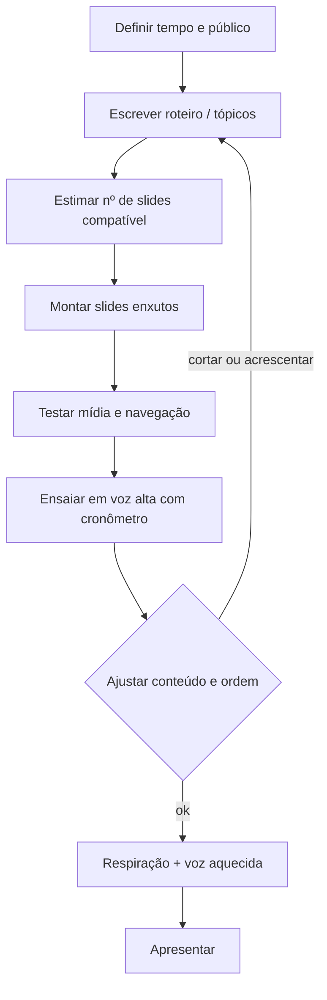

## Visão Geral do Conceito

Esta lição amarra três frentes: **entrega do trabalho final (AT)**, **uma apresentação breve sobre você** (como prática de comunicação) e **ferramentas de oratória e preparo** (medo, respiração, estrutura de slides, voz e postura). O objetivo não é “decorar dicas motivacionais”, e sim **operacionalizar**: o que juntar no arquivo, o que enviar no ambiente virtual, como ensaiar e como desenhar apoio visual que não brigue com sua fala.

No contexto do curso, a apresentação também prepara terreno para **apresentações recorrentes** ao longo da graduação e para situações profissionais em que você precisa expor trabalho, ideias ou resultados.

## Modelo Mental

1. **AT como integração, não como três entregas soltas**  
   As nove primeiras questões correspondem ao que você já produziu nos TPs; o AT pede um **documento único**, na **ordem do enunciado**, incorporando ajustes se houver retorno da correção. A nota relevante está nesse conjunto consolidado.

2. **Medo de palco como medo social**  
   O desconforto comum não é “ódio ao PowerPoint”, e sim **exposição + julgamento percebido**. Muitas pessoas associam errar visivelmente a **perda de aceitação** do grupo. Nomear esse padrão (“o que exatamente eu temo que aconteça?”) reduz o tamanho vago do medo.

3. **Slides = legendas do que você vai dizer, não um segundo palestrante**  
   Quem carrega a narrativa é **você**; o slide segura o fio condutor (palavras-chave, imagem, estrutura). Se o público precisa ler parágrafos ou decifrar animações enquanto você fala, a carga cognitiva **compete** com sua mensagem.

4. **Voz e corpo como canais de credibilidade**  
   Antes de “performar”, o básico é ser **ouvido e compreendido**: volume adequado, ritmo, variação de entonação, pausas. Isso vale para sala de aula, reuniões híbridas e entrevistas.

## Mecânica Central

### O que é o AT e o item 10

- **Itens 1 a 9:** correspondem ao **TP1, TP2 e TP3**; a expectativa é **reunir** o que você já fez em **um documento completo**, seguindo a ordem do AT, em vez de anexar os TPs separadamente como entrega principal.
- **Item 10:** pequena **apresentação sobre você** (nome, curso, origem/moradia, caminho até TI, competências que ajudam na área, interesses de carreira — com flexibilidade no que você prefere compartilhar).
- **Entrega no ambiente do curso:** enviar o texto consolidado e os **slides** (por exemplo <mark style="background-color: #242424; padding: 2px 4px; border-radius: 3px; color: inherit;">`PDF`</mark> exportado de <mark style="background-color: #242424; padding: 2px 4px; border-radius: 3px; color: inherit;">`PPT`</mark> ou outra ferramenta). **Não** é obrigatório gravar vídeo da apresentação para entrega; a roda de apresentações ocorre **em aula**.
- **Arquivos:** pode ser **um único arquivo** ou **mais de um** (por exemplo texto e slides separados), conforme organização que fizer sentido para você. Incluir links no material (por exemplo portfólio ou <mark style="background-color: #242424; padding: 2px 4px; border-radius: 3px; color: inherit;">`LinkedIn`</mark>) foi autorizado quando pertinente.

> **Regra operacional:** trate prazos do <mark style="background-color: #242424; padding: 2px 4px; border-radius: 3px; color: inherit;">`Moodle`</mark> como **fonte oficial** junto ao que a professora anuncia em aula; em caso de divergência, **confirme no ambiente** e nas orientações atualizadas da disciplina.

### Medo, julgamento e rejeição

A linha de raciocínio apresentada na aula liga:

- erro ou gafe percebida → **medo de julgamento** → fantasia de **perda de lugar** no grupo (trabalho, turma, liderança);
- em muitos casos, o núcleo afetivo é **medo de rejeição**, não o slide em si.

**Estratégia sugerida:** “desenhar” o medo — dar **nome** ao que você acha que vai acontecer se errar — e confrontar com evidências (uma apresentação acadêmica raramente tem o peso catastrófico que o cérebro antecipa no auge do nervosismo).

### Medo “real” versus medo “construído” (vídeo da aula)

- **Real:** associado a ameaça objetiva; o desconforto protege.
- **Construído:** alimentado por narrativas e antecipações; pode ser **retrabalhado** com prática, reenquadramento e técnicas corporais.

Para apresentações, a ideia é **não tratar** o palco como penhasco: o desconforto existe, mas a **curva de aprendizado** melhora com repetição.

### Respiração e “branco” mental

Sob forte ansiedade, o relato da aula conecta **estresse** a dificuldade de **raciocínio fluido** (o famoso branco). A respiração **lenta e profunda pelo diafragma**, com **boca fechada** na inspiração, aparece como forma de reduzir a sensação de pânico e recuperar foco.

> **Atenção:** evite **hiperventilação** (respiração muito rápida), que pode piorar o estado físico.

### Estrutura de trabalho: espinha dorsal antes do software

Ordem recomendada:

1. **Roteiro no papel** — lista de tópicos e ordem lógica (o que precisa vir antes para a história fazer sentido).
2. **Decisão de recursos** — fotos, linha do tempo, infográfico, quantidade de slides compatível com o **tempo**.
3. **Montagem na ferramenta** — <mark style="background-color: #242424; padding: 2px 4px; border-radius: 3px; color: inherit;">`PowerPoint`</mark>, <mark style="background-color: #242424; padding: 2px 4px; border-radius: 3px; color: inherit;">`Google Slides`</mark>, <mark style="background-color: #242424; padding: 2px 4px; border-radius: 3px; color: inherit;">`Prezi`</mark>, etc.

Ferramentas com **muito movimento espacial** (caso do <mark style="background-color: #242424; padding: 2px 4px; border-radius: 3px; color: inherit;">`Prezi`</mark> citado) podem gerar resultado visual forte, mas exigem **mais domínio** para não se perder durante a fala.

### Pecados da fala e o acrônimo em inglês **HAIL**

No trecho de oratória compartilhado na aula aparecem **hábitos a evitar** (fofoca, julgar, negatividade, reclamação, desculpas, exagero, dogmatismo/confundir fato com opinião) e quatro bases desejáveis que formam a palavra **HAIL**:

- **Honesty** — honestidade.
- **Authenticity** — autenticidade.
- **Integrity** — integridade (coerência entre discurso e prática).
- **Love** — no sentido de **desejar o bem** ao interlocutor, não romanticismo; isso também modera a honestidade brutal desnecessária.

### Caixa de ferramentas da voz (resumo)

- **Registro** — onde a voz ressoa (nariz, garganta, peito); associações culturais ligam graves a autoridade, mas o ponto prático é **projetar sem gritar**.
- **Timbre** — “cor” da voz; treinável com orientação profissional, postura e respiração.
- **Entonação** — variação de melodia; falar em **uma nota só** cansa e obscurece ênfases.
- **Ritmo** — acelerar para energia, desacelerar para peso; monotonia de ritmo + pós-almoço derruba atenção.
- **Silêncio** — pausas curtas são legítimas e marcam ideias importantes.
- **Volume** — ajustar para o fundo da sala; **microfone** pode proteger suas cordas vocais e evitar que quem está na frente sinta **agressividade** de um grito contínuo.



## Uso Prático

### Checklist antes de apresentar em sala

1. **Tempo:** ensaio **real** com cronômetro; ajuste o volume de conteúdo (não confie em “vou falar rápido”).
2. **Tecnologia:** abrir arquivo no equipamento que será usado; testar vídeo, animações e links.
3. **Alinhamento:** confirmar que o arquivo projetado é **o deck certo** (a aula trouxe o exemplo do palestrante que exibia **outra** apresentação).
4. **Legibilidade:** fonte grande o suficiente para quem está longe; poucas palavras por slide.
5. **Visual:** poucas cores por slide; evitar animação constante que roube foco.
6. **Corpo e voz:** respiração lenta antes de entrar; no presencial, **olhar** para pessoas diferentes, mover-se com naturalidade; verificar se **quem está atrás ouve**.

### Quando o tema é você mesmo

Use o item 10 como **treino de exposição** com **baixo risco de conteúdo externo**: você não precisa “passar por especialista” em um assunto novo, precisa **estruturar** sua narrativa com clareza e respeito ao tempo.

### Apresentações presenciais e microfone

Se a sala for grande, **gritar** para chegar ao fundo pode:

- cansar ou lesionar a voz;
- soar desproporcional para quem está perto.

A alternativa citada é **amplificar** com microfone quando disponível, mantendo tom **firme** sem confundir volume com hostilidade.

## Erros Comuns

- **Confundir entrega com ensaio:** montar 20–30 slides para **cinco minutos** sem ensaiar — a aula usa o exemplo de apresentação interrompida por **descompasso** entre tempo e material.
- **Slide parecendo artigo:** blocos de texto que o público tenta ler enquanto você fala outra coisa.
- **Excesso de estímulo visual:** muitas cores, fontes e transições; o cérebro da audiência **não** prioriza sua voz automaticamente.
- **Deck errado ou desatualizado:** perda de atenção mesmo depois de corrigir o arquivo.
- **Hiperventilar** antes de entrar no lugar de **respirar devagar**.
- **Monotonia total de voz e ritmo** — especialmente após refeição, quando a audiência já está com menor energia.
- **Depender de ferramentas complexas** sem treinar navegação (<mark style="background-color: #242424; padding: 2px 4px; border-radius: 3px; color: inherit;">`Prezi`</mark> e similares).

## Visão Geral de Debugging

Quando algo “sai ruim” em apresentação, separe **camadas**:

1. **Conteúdo/tempo** — faltou ensaio ou o roteiro estava acima da capacidade do slot.
2. **Mídia** — arquivo, resolução, modo apresentador, cabo, permissões.
3. **Estado fisiológico** — taquicardia, branco; volte a **respiração lenta** e a **primeira frase** memorizada para destravar.
4. **Alinhamento com slides** — você está falando **A** e mostrando **B**? Pare, confirme o arquivo, realinhe ou ignore o slide problemático com honestidade (“vamos ao próximo ponto”).

## Principais Pontos

- AT: **um documento** com itens 1–9 na ordem; **corrigir** o que a correção dos TPs apontou; item 10 é **apresentação sobre você**.
- Entregar **slides** (<mark style="background-color: #242424; padding: 2px 4px; border-radius: 3px; color: inherit;">`PDF`</mark> ou equivalente) no <mark style="background-color: #242424; padding: 2px 4px; border-radius: 3px; color: inherit;">`Moodle`</mark> junto do texto; apresentação oral em **aula**.
- Medo de palco costuma carregar **medo de julgamento/rejeição**; nomear ajuda; **domínio do tema** aumenta segurança — no item 10, o tema é você.
- **Roteiro antes do slide**; slides **enxutos**; **ensaio cronometrado**; **teste técnico** antes.
- Respiração **lenta e profunda** para reduzir pico de ansiedade; evitar hiperventilação.
- Voz: **variação**, **ritmo**, **pausas**, volume adequado; microfone como alternativa ao grito.
- Evitar hábitos tóxicos de fala; buscar base **HAIL** na comunicação profissional.

## Preparação para Prática

Você deve sair desta lição capaz de:

- Montar a **lista de entregáveis** do AT e o **roteiro** do item 10 sem depender só do improviso.
- Explicar **por que** slides minimalistas costumam funcionar melhor que murais de texto.
- Aplicar **um** ensaio completo com cronômetro e anotar cortes objetivos.
- Usar **três ciclos** de respiração diafragmática antes de uma fala ou entrevista.

No Laboratório, você formaliza roteiro, checklist e autoavaliação de voz.

## Laboratório de Prática

### Exercício Easy — Roteiro em espinha dorsal do item 10

**Objetivo:** fixar a ordem do que você vai dizer antes de abrir qualquer software de slide.

**Enunciado:** escreva, em tópicos curtos, **dois minutos** de fala sobre você seguindo a lógica da aula (quem é, de onde veio, por que TI, competências, rumo desejado). Marque explicitamente **qual frase abre** e **qual frase fecha**.

**Boilerplate sugerido:**

```markdown
# Roteiro — Apresentação sobre mim (ensaio ~2 min)

## Abertura (primeira frase exata)
- TODO: escrever a primeira frase que você falará ao microfone

## Corpo (tópicos na ordem)
1. TODO: nome e curso
2. TODO: origem / onde mora (o que quiser compartilhar)
3. TODO: como chegou em TI
4. TODO: competências que ajudam
5. TODO: interesse atual de carreira (área ou tipo de problema)

## Fechamento (última frase exata)
- TODO: frase de encerramento (agradecimento ou convite a perguntas)

## Tempo medido no ensaio
- TODO: minutos:segundos após ler em voz alta uma vez
```

### Exercício Medium — Checklist técnico e de slides

**Objetivo:** reduzir falhas de projetor, arquivo errado e slides ilegíveis.

**Enunciado:** monte um checklist pessoal com **pelo menos oito itens** cobrindo: arquivo correto, fonte mínima, número de slides vs tempo, animações, cores, backup (<mark style="background-color: #242424; padding: 2px 4px; border-radius: 3px; color: inherit;">`PDF`</mark>), teste no equipamento e plano B se a mídia falhar.

**Boilerplate sugerido:**

```markdown
# Checklist — Antes de apresentar

## Arquivo e equipamento
- [ ] TODO: confirmei que o arquivo aberto é o deck certo (nome + última versão)
- [ ] TODO: testei no projetor / modo apresentador
- [ ] TODO: plano B se a mídia falhar (ex.: versão PDF só com imagens-chave)

## Design e legibilidade
- [ ] TODO: tamanho mínimo de fonte definido para o fundo da sala
- [ ] TODO: limitei cores e animações (critério: não competir com minha voz)

## Conteúdo e tempo
- [ ] TODO: número de slides coerente com o tempo (ensaio cronometrado)
- [ ] TODO: cada slide tem só palavras-chave / uma ideia central

## Outros
- [ ] TODO: item extra 1
- [ ] TODO: item extra 2
```

### Exercício Hard — Autoescuta e ajuste de voz (três minutos)

**Objetivo:** perceber monotonia, velocidade e volume e planejar um ajuste concreto.

**Enunciado:** grave **até 3 minutos** de você lendo seu roteiro ou improvisando sobre ele. Ouça com fones e responda: Onde fui **rápido demais**? Onde **monótono**? Onde o volume **cai**? Escolha **uma** mudança comportamental (por exemplo: “pausar 1 s após cada tópico” ou “subir volume nas duas primeiras frases”) e regrave **só o primeiro minuto** aplicando essa mudança.

**Boilerplate sugerido:**

```markdown
# Autoescuta — voz e ritmo

## Links ou nomes dos arquivos de áudio
- Gravação 1 (antes): TODO
- Gravação 2 (1 min com ajuste): TODO

## O que ouvi de problema na gravação 1
- Ritmo: TODO
- Entonação: TODO
- Volume: TODO

## Ajuste escolhido (uma única mudança clara)
- TODO: descrever o ajuste em uma frase objetiva

## Resultado na gravação 2 (1 min)
- O que melhorou: TODO
- O que ainda precisaria de treino: TODO
```

---

<!-- CONCEPT_EXTRACTION
concepts:
  - AT integrando TP1 TP2 TP3
  - apresentação pessoal item 10
  - medo de julgamento e rejeição
  - medo real vs medo construído
  - respiração diafragmática e ansiedade
  - roteiro antes dos slides
  - design de slides de apoio
  - ensaio cronometrado e teste técnico
  - voz entonação ritmo volume
  - HAIL e hábitos tóxicos de fala
skills:
  - Consolidar entregáveis do AT em documento único ordenado
  - Preparar roteiro e slides alinhados ao tempo disponível
  - Reduzir ansiedade pré-apresentação com respiração e ensaio
  - Projetar voz e ajustar ritmo sem depender só do improviso
  - Diagnosticar falhas comuns de mídia e conteúdo em apresentações
examples:
  - checklist-pre-apresentacao
  - roteiro-espinha-dorsal-item-10
  - autoescuta-voz-ritmo
-->

<!-- EXERCISES_JSON
[
  {
    "id": "roteiro-apresentacao-sobre-mim",
    "slug": "roteiro-apresentacao-sobre-mim",
    "difficulty": "easy",
    "title": "Roteiro em espinha dorsal para apresentação sobre você",
    "discipline": "planejamento-curso-carreira",
    "editorLanguage": "markdown",
    "tags": ["apresentacao", "oratoria", "at"],
    "summary": "Escrever abertura, tópicos ordenados e fechamento antes de montar os slides do item 10."
  },
  {
    "id": "checklist-tecnico-slides",
    "slug": "checklist-tecnico-slides",
    "difficulty": "medium",
    "title": "Checklist técnico e de design para apresentação",
    "discipline": "planejamento-curso-carreira",
    "editorLanguage": "markdown",
    "tags": ["slides", "apresentacao", "preparacao"],
    "summary": "Listar verificações de arquivo, legibilidade, tempo e plano B antes de apresentar."
  },
  {
    "id": "autoescuta-voz-ritmo",
    "slug": "autoescuta-voz-ritmo",
    "difficulty": "hard",
    "title": "Autoescuta e ajuste de voz em gravação curta",
    "discipline": "planejamento-curso-carreira",
    "editorLanguage": "markdown",
    "tags": ["voz", "oratoria", "feedback"],
    "summary": "Gravar, ouvir e aplicar uma mudança objetiva em ritmo, volume ou entonação."
  }
]
-->
