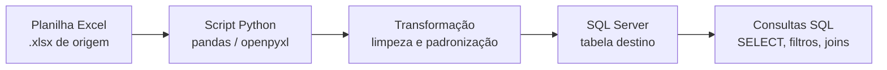

## Visão Geral do Conceito

Depois de entender variáveis em Python, pipeline de dados e ferramentas de laboratório, o próximo passo natural é olhar com mais cuidado para a **linguagem SQL** e para a **integração Python–Excel–SQL Server** apresentada na aula.

Esta lição mostra como:

- usar SQL para consultar dados em bancos relacionais;
- pensar em Excel como **origem** de dados e SQL Server como **destino**;
- escrever um esqueleto de script em Python que conecta esses pontos usando um driver adequado.

## Modelo Mental

Use este modelo mental:

- **Excel**: ponto de partida — planilhas enviadas por times de negócio, sistemas legados ou relatórios manuais.
- **Python**: cola do pipeline — lê arquivos, faz limpezas e transformações, chama bibliotecas e drivers.
- **Banco relacional (SQL Server, PostgreSQL, etc.)**: destino estruturado — onde consultas SQL rodam, relatórios são alimentados e visualizações se conectam.

Você não precisa “escolher um lado”: a força está em **combinar** essas ferramentas na ordem certa.

## Mecânica Central

### 1. SQL em bancos relacionais

SQL (Structured Query Language) é a linguagem usada para:

- **criar** estrutura de dados (tabelas, índices);
- **consultar** dados (`SELECT`);
- **manipular** dados (`INSERT`, `UPDATE`, `DELETE`).

Para a parte de consultas, uma estrutura típica é:

```sql
SELECT
    coluna1,
    coluna2
FROM nome_da_tabela
WHERE condicao
ORDER BY coluna1;
```

No contexto do projeto de bloco, o professor usa SQL Server com uma ferramenta como o **SQL Server Management Studio (SSMS)** para:

- inspecionar tabelas;
- executar `SELECT` de teste (por exemplo, “TOP 1000 linhas”);
- validar se os dados que vieram do Excel chegaram corretamente.

### 2. Importação de Excel para SQL Server

O fluxo que a aula descreve pode ser resumido assim:

1. **Origem**: planilha Excel com dados (por exemplo, vendas, clientes, produtos).
2. **Validação visual**: conferir se as colunas e tipos fazem sentido (datas, números, textos).
3. **Modelagem no banco**:
   - criar uma tabela com colunas correspondentes (`INTEGER`, `DECIMAL`, `VARCHAR`, etc.);
   - definir chaves primárias e índices se necessário.
4. **Carga**:
   - via ferramentas do próprio SQL Server (assistentes de importação) ou
   - via scripts em Python (o foco desta lição).

Em projetos reais, essa etapa é parte de um **ETL**: extrair do Excel, transformar (limpar, converter) e carregar no banco.

### 3. Integração Python–SQL Server com driver

Para conectar Python a um banco SQL Server, você precisa de:

- um **driver** instalado (por exemplo, ODBC do SQL Server);
- uma biblioteca Python que saiba usar esse driver (por exemplo, `pyodbc` ou similar);
- informações de conexão: servidor, banco, usuário, senha, driver.

Um esqueleto simplificado baseado na ideia da aula:

```python
import pyodbc


def get_connection() -> pyodbc.Connection:
    connection_string = (
        "DRIVER={SQL Server};"
        "SERVER=localhost;"
        "DATABASE=projeto_bloco;"
        "UID=projeto_bloco;"
        "PWD=projeto123;"
    )
    return pyodbc.connect(connection_string)
```

Depois da conexão, você pode executar consultas:

```python
def listar_clientes():
    with get_connection() as conn:
        with conn.cursor() as cur:
            cur.execute("SELECT TOP 10 * FROM clientes;")
            for row in cur.fetchall():
                print(row)
```

### 4. Fluxo Excel → Python → SQL

O fluxo completo mostrado na aula pode ser visto assim:



Passos típicos em Python:

1. Ler o Excel (por exemplo, com `pandas.read_excel`).
2. Padronizar nomes de colunas, tipos, datas.
3. Abrir conexão com SQL Server via driver.
4. Inserir linhas na tabela destino (por `INSERT` em loop ou via recursos em lote).

### 5. Vantagens de mover dados para SQL

Alguns motivos práticos comentados e implícitos na aula:

- **Escalabilidade**: bancos lidam melhor com grandes volumes do que planilhas.
- **Confiabilidade**: integridade referencial, tipos fortes, transações.
- **Consumo por múltiplos sistemas**: aplicações, relatórios e dashboards acessam dados centralizados.
- **Histórico e auditoria**: mais controle sobre alterações e acesso.

Excel continua útil como ferramenta de entrada/edição, mas SQL é onde o dado “vive” no longo prazo.

## Uso Prático

### No seu laboratório

Você pode reproduzir em escala reduzida:

- Criar uma tabela `clientes` ou `vendas` em SQL Server (ou outro banco relacional).
- Montar uma planilha Excel com algumas linhas de teste.
- Escrever um script Python que:
  - lê o Excel;
  - converte campos com `int`, `float`, datas;
  - insere dados na tabela com uma instrução `INSERT` parametrizada.

### Exemplo simplificado de carga em Python

```python
import pyodbc
import pandas as pd


def carregar_excel_para_sql(caminho_excel: str) -> None:
    df = pd.read_excel(caminho_excel)

    with get_connection() as conn:
        with conn.cursor() as cur:
            for _, row in df.iterrows():
                cur.execute(
                    """
                    INSERT INTO vendas (data, cliente, valor)
                    VALUES (?, ?, ?)
                    """,
                    row["data"],
                    row["cliente"],
                    float(row["valor"]),
                )
        conn.commit()
```

Este tipo de código é exatamente o que muitos times usam para conectar planilhas a bancos em projetos reais.

## Erros Comuns

- **Ignorar tipos de coluna na criação da tabela**  
  Criar tudo como `VARCHAR` e só depois descobrir que filtros numéricos e de data estão lentos ou incorretos.

- **Confiar que o Excel está sempre limpo**  
  Células vazias, formatos mistos (texto vs número) e datas inconsistentes podem quebrar a carga. É importante prever conversões e validações em Python.

- **Montar strings SQL concatenando valores diretamente**  
  Isso causa problemas de segurança e bugs com aspas e caracteres especiais; prefira comandos parametrizados, como no exemplo com `?`.

- **Esquecer de fechar conexão ou commitar transações**  
  Pode deixar dados parcialmente gravados ou travar recursos no servidor.

## Visão Geral de Debugging

Quando uma integração Python–Excel–SQL dá problema, siga esta ordem:

1. **Excel**  
   - As colunas estão com nomes e formatos consistentes?  
   - Existem linhas em branco ou valores estranhos?
2. **Python (leitura)**  
   - O `DataFrame` ou lista de linhas está como esperado (use `print(df.head())`)?  
   - Conversões de tipo estão funcionando sem exceção?
3. **Conexão / driver**  
   - A string de conexão está correta (servidor, banco, usuário, senha, driver)?  
   - O driver está instalado no sistema?
4. **SQL**  
   - A tabela existe com os nomes de colunas corretos?  
   - Inserções funcionam se testadas manualmente no SSMS?

Essa abordagem baseada no pipeline reduz o tempo gasto tentando adivinhar onde está o erro.

## Principais Pontos

- SQL é a linguagem de consulta central em bancos relacionais e se integra naturalmente com Python em projetos de dados.
- Excel é uma boa origem de dados, mas mover informações para um banco SQL traz ganhos de escalabilidade, segurança e capacidade de consulta.
- A integração Python–Excel–SQL Server depende de um driver e de uma string de conexão bem configurada.
- Entender o pipeline Excel → Python → SQL ajuda a depurar problemas e a projetar soluções mais robustas no projeto de bloco.

## Preparação para Prática

Depois desta lição, você deve ser capaz de:

- Escrever consultas SQL simples para inspecionar tabelas.
- Descrever o fluxo de importação de dados de Excel para um banco relacional.
- Esboçar um script Python que conecta em um banco e executa comandos SQL.

No Laboratório de Prática a seguir, você colocará isso em prática em cenários próximos do que aparece na aula.

## Laboratório de Prática

### Exercício Easy — Primeiras consultas em uma tabela de vendas

Escreva algumas consultas SQL básicas para uma tabela `vendas`.

```sql
-- TODO: selecionar todas as colunas de vendas
SELECT
    *
FROM
    vendas;

-- TODO: selecionar apenas data, cliente e valor, ordenando da venda mais recente para a mais antiga

-- TODO: selecionar vendas acima de um certo valor (por exemplo, 100.00)
```

### Exercício Medium — Esqueleto de integração Excel → SQL com Python

Implemente um esqueleto de função em Python que leia um arquivo Excel e prepare os dados para inserção em SQL.

```python
from typing import Any, Iterable, List


def ler_excel(caminho: str) -> List[dict[str, Any]]:
    """Lê um arquivo Excel e retorna linhas como dicionários."""
    # TODO: usar pandas ou outra biblioteca para ler o Excel
    return []


def inserir_em_sql(linhas: Iterable[dict[str, Any]]) -> None:
    """Insere linhas em uma tabela SQL."""
    # TODO: abrir conexão com o banco e executar INSERT parametrizado
    pass


def main() -> None:
    caminho = "dados.xlsx"  # TODO: ajustar para o caminho real
    linhas = ler_excel(caminho)
    inserir_em_sql(linhas)


if __name__ == "__main__":
    main()
```

### Exercício Hard — Teste de conexão e consulta em Python

Crie um script que testa a conexão com o banco e executa uma consulta de validação.

```python
from typing import Any


def testar_conexao() -> bool:
    """Tenta abrir uma conexão e retorna True se tiver sucesso."""
    # TODO: implementar usando a biblioteca de conexão escolhida (por exemplo, pyodbc)
    return False


def consultar_amostra() -> list[tuple[Any, ...]]:
    """Retorna algumas linhas de uma tabela para inspeção."""
    # TODO: abrir conexão, executar SELECT limitado e retornar as linhas
    return []


if __name__ == "__main__":
    if testar_conexao():
        linhas = consultar_amostra()
        for linha in linhas:
            print(linha)
    else:
        print("Falha ao conectar ao banco.")
```

Esse exercício treina tanto a configuração do driver quanto o uso de SQL dentro de scripts Python.

<!-- CONCEPT_EXTRACTION
concepts:
  - consultas sql basicas
  - integracao python-excel-sql
  - drivers de conexao (odbc)
  - importacao de dados de planilha para banco relacional
skills:
  - Escrever selects simples para inspecionar dados
  - Configurar conexao python-sql com driver apropriado
  - Planejar e esboçar scripts de carga de excel para sql
examples:
  - select-basico-vendas
  - esqueleto-excel-para-sql
  - teste-conexao-sql-em-python
-->

<!-- EXERCISES_JSON
[
  {
    "id": "select-basico-vendas",
    "slug": "select-basico-vendas",
    "difficulty": "easy",
    "title": "Escrever consultas SQL básicas em uma tabela de vendas",
    "discipline": "projeto-bloco",
    "editorLanguage": "sql",
    "tags": ["projeto-bloco", "sql", "consultas"],
    "summary": "Praticar SELECT simples com filtros e ordenação em uma tabela de vendas."
  },
  {
    "id": "esqueleto-excel-para-sql",
    "slug": "esqueleto-excel-para-sql",
    "difficulty": "medium",
    "title": "Esboçar um pipeline Excel → SQL com Python",
    "discipline": "projeto-bloco",
    "editorLanguage": "python",
    "tags": ["projeto-bloco", "python", "sql", "excel"],
    "summary": "Implementar o esqueleto de um script que lê um Excel e prepara dados para inserção em SQL."
  },
  {
    "id": "teste-conexao-sql-em-python",
    "slug": "teste-conexao-sql-em-python",
    "difficulty": "hard",
    "title": "Testar conexão e consulta SQL em Python",
    "discipline": "projeto-bloco",
    "editorLanguage": "python",
    "tags": ["projeto-bloco", "python", "sql"],
    "summary": "Criar um script Python que testa a conexão com o banco e executa uma consulta de amostra."
  }
]
-->

