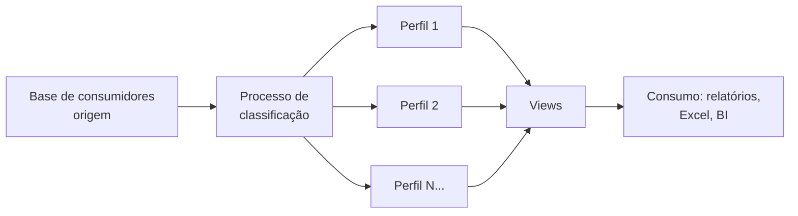

## Visão Geral do Conceito

Esta lição faz um **review** do que foi visto no projeto de bloco e introduz dois eixos centrais: **perfis profissionais** em dados e desenvolvimento (DBA, engenheiro de dados, analista, arquiteto, etc.) e um **case real** de projeto em uma grande empresa — classificação de milhões de consumidores em perfis de consumo, com estrutura de tabelas, regras em SQL e views para consumo.

O objetivo é alinhar expectativas: o que você estuda (CREATE TABLE, SELECT, variáveis, pipelines) é o mesmo tipo de atividade que se faz em projetos reais; o diferencial está em **como** você aplica esse conhecimento ao problema de negócio.

## Modelo Mental

- **Perfis em dados**: pense em uma **cadeia de valor dos dados**. Alguém desenha a arquitetura (arquiteto), alguém constrói e mantém o pipeline e o armazenamento (engenheiro de dados / DBA), alguém analisa e extrai insight (analista de dados). Cada perfil usa ferramentas e entregas diferentes.
- **Arquiteto vs Engenheiro**: o **arquiteto** decide “o quê” e “como em alto nível” (tecnologias, fluxos, padrões); o **engenheiro** implementa, testa, opera e mantém. Os dois trabalham juntos; um não substitui o outro.
- **Case de perfis de consumidor**: dados de consumidores entram → regras de negócio classificam cada um em um perfil → resultados são gravados em tabelas (uma por perfil ou estruturas equivalentes) → views e relatórios consomem esses dados. O mesmo CREATE TABLE e SELECT que você vê na disciplina aparecem nesse contexto.

## Mecânica Central

### 1. Perfis profissionais em foco

O professor apresenta perfis típicos do mercado, com foco em **dados** e **desenvolvimento**:

- **DBA (Database Administrator)**  
  Focado em **bancos de dados**: instalação, configuração, segurança, performance, backup. Não define a aplicação inteira; recebe demandas de projeto e garante que o banco atenda. Em empresas grandes, o servidor (máquina e SO) pode ser entregue por outra área (sustentação); o DBA instala e configura apenas o software de banco.

- **Engenheiro de Dados**  
  Desenvolve e mantém o **pipeline de dados**: origem → processamento → destino. Preocupa-se com integração, ETL/ELT, infraestrutura onde os dados trafegam, testes e otimização. Tem visão de arquitetura mas atua na construção e operação.

- **Arquiteto de Dados / Arquiteto de Soluções (nuvem)**  
  Define **como** os dados e a solução serão estruturados: quais bancos, quais ferramentas, como os componentes se conectam. Em projetos em nuvem, pode definir que um projeto usará, por exemplo, PostgreSQL em um serviço gerenciado; a equipe de nuvem configura o ambiente e o DBA/engenheiro cuida do banco em si.

- **Analista de Dados**  
  **Analisa** os dados já disponíveis: dashboards, relatórios, Power BI, Excel. Encontra padrões, responde perguntas de negócio e entrega insight. Não cuida da infraestrutura do pipeline; consome o que arquitetos e engenheiros deixaram pronto.

- **Analista de Sistemas**  
  Faz a **ponte entre negócio e tecnologia**: entende requisitos e processos e os traduz para a equipe de desenvolvimento. Pode atuar também em desenvolvimento quando conhece o negócio.

- **Engenheiro de Software**  
  Projeta, desenvolve e mantém **sistemas e aplicações**: design de software, qualidade de código, testes, decisões de arquitetura junto com arquitetos.

Esses perfis coexistem; projetos reais reúnem vários deles. ETL, pipeline e governança de dados aparecem como responsabilidades de perfis específicos (como na visita de consultores da IBM citada na aula: um focado em dados, outro em ETL, outros em governança).

### 2. Arquiteto vs Engenheiro

- **Arquiteto**: define a **estrutura** da solução — ex.: “vamos usar microserviços”, “os dados ficam aqui e ali”, “esta tecnologia para isso”. Não implementa o código do dia a dia.
- **Engenheiro**: **implementa** o que o arquiteto desenhou — cria os microserviços, os pipelines, as tabelas, os testes — e mantém tudo funcionando.

Em dados: o arquiteto pode definir “vamos ter um data lake + camada analítica em SQL Server”; o engenheiro de dados constrói os jobs de ingestão, as tabelas e as views.

### 3. Metodologia: quando ágil e quando tradicional

- **Ágil**: entregas curtas (ex.: a cada 2–3 semanas), backlog, ajuste de rumo rápido. Comum em desenvolvimento de sistemas e em muitos projetos de dados.
- **Tradicional**: fases bem definidas, documentação formal, mais rigidez. Usado quando há **regulação ou criticidade** (segurança, área aeronáutica, certificações) que exigem rastreabilidade e processo metódico.

Os dois coexistem no mercado; a escolha depende do tipo de projeto e da empresa.

### 4. Case real: classificação de consumidores em perfis

O professor descreve um projeto em uma **grande empresa de cosméticos** (maior do Brasil, com atuação internacional):

- **Objetivo**: classificar **milhões de consumidores** em **perfis de consumo** (régua de perfis — na aula, 17 perfis).
- **Fluxo**:
  1. Processo (ex.: diário) lê dados de consumidores de uma base de origem.
  2. Regras de negócio classificam cada consumidor em um dos perfis.
  3. Resultados são gravados em **tabelas no SQL Server** — no case, uma tabela por perfil (perfil_1, perfil_2, …).
  4. **Views** reúnem dados de várias tabelas para facilitar consulta e visualização pelo usuário.
  5. Dados podem ser consumidos por relatórios, Excel ou ferramentas de BI.

**Mensagem didática**: os comandos usados são os mesmos da disciplina — <mark style="background-color: #242424; padding: 2px 4px; border-radius: 3px; color: inherit;">`CREATE TABLE`</mark>, <mark style="background-color: #242424; padding: 2px 4px; border-radius: 3px; color: inherit;">`SELECT`</mark>, variáveis em blocos SQL, filtros e regras. A diferença está na escala, nas regras de negócio e na organização do projeto (prazo de meses, várias tabelas e views). Ou seja: **o que você aprende em aula é o que se usa no projeto**.

### 5. Diagrama do case



### 6. Views e tabelas

- **Tabelas**: armazenam os dados brutos ou resultado do processamento (ex.: cada perfil em sua tabela).
- **Views**: são “consultas nomeadas” que juntam ou filtram tabelas para o usuário ou para ferramentas. Para quem consome, pouco importa se veio de uma tabela ou de uma view; importa o **resultado** que atende ao negócio.

### 7. Erro e aprendizado

O professor reforça: **errar faz parte** do processo. Ajustar código, testar, corrigir e refinar é o dia a dia de qualquer perfil técnico. O importante é entender a **lógica** do problema; a ferramenta (Python, SQL, etc.) é um meio. O **diferencial no mercado** é a capacidade de compreender o problema e entregar solução, não só decorar sintaxe.

## Uso Prático

- Use esta lição para **se situar** nos perfis: com qual você mais se identifica (dados vs desenvolvimento, mais arquitetura vs mais mão na massa)?
- Ao estudar <mark style="background-color: #242424; padding: 2px 4px; border-radius: 3px; color: inherit;">`CREATE TABLE`</mark> e <mark style="background-color: #242424; padding: 2px 4px; border-radius: 3px; color: inherit;">`SELECT`</mark>, pense em cenários como o do case: “e se eu tivesse que armazenar o resultado de uma classificação em várias tabelas ou em uma tabela com coluna de perfil?”.
- Treine **traduzir regras de negócio** em estruturas de dados (tabelas, colunas) e em consultas (views, SELECTs).

## Erros Comuns

- **Confundir arquiteto com engenheiro** e achar que um “faz tudo” sozinho; na prática, os papéis se complementam.
- **Achar que projeto real é “outra língua”** — na base estão os mesmos conceitos (tabelas, consultas, tipos, pipelines).
- **Ter medo de errar** ou achar que só “experts” podem mexer em código; erro e iteração fazem parte do trabalho.

## Visão Geral de Debugging

No case de perfis: se um consumidor não aparece no perfil esperado, verificar (1) regras do processo de classificação, (2) dados de entrada, (3) destino (tabela correta?) e (4) view que agrega os dados. O mesmo raciocínio de “seguir o dado” das lições anteriores se aplica.

## Principais Pontos

- Existem vários **perfis** em dados e desenvolvimento (DBA, engenheiro de dados, analista de dados, arquiteto, analista de sistemas, engenheiro de software); cada um com foco e ferramentas diferentes.
- **Arquiteto** define estrutura e tecnologias; **engenheiro** implementa e mantém.
- **Case real**: classificação de consumidores em perfis → tabelas por perfil no SQL Server, regras em código, views para consumo — usando os mesmos conceitos (CREATE TABLE, SELECT, variáveis) vistos em aula.
- O **diferencial** é a compreensão do problema e da solução; ferramentas são meio, não fim.

## Preparação para Prática

Ao final desta lição, você deve conseguir: descrever brevemente cada perfil citado; explicar a diferença entre arquiteto e engenheiro; e relacionar um projeto hipotético de “classificação em categorias” com tabelas, regras e views (como no case).

## Laboratório de Prática

### Exercício Easy — Mapeando perfis e responsabilidades

Modele em código (estrutura de dados) os perfis vistos na aula e uma linha de responsabilidade de cada um.

```python
from dataclasses import dataclass
from typing import List


@dataclass
class Perfil:
    nome: str
    foco: str  # "dados", "desenvolvimento", "negócio"
    responsabilidade_principal: str


def listar_perfis() -> List[Perfil]:
    perfis: List[Perfil] = []
    # TODO: adicionar pelo menos 4 perfis (ex.: DBA, Engenheiro de Dados, Analista de Dados, Arquiteto)
    return perfis


if __name__ == "__main__":
    for p in listar_perfis():
        print(f"{p.nome} ({p.foco}): {p.responsabilidade_principal}")
```

### Exercício Medium — Esqueleto de tabelas para perfis de consumidor

Imagine um cenário com 3 perfis de consumidor (ex.: “alto valor”, “médio”, “baixo”). Defina em código (nomes de tabelas e colunas mínimas) a estrutura que você criaria no banco.

```python
from dataclasses import dataclass
from typing import List


@dataclass
class TabelaPerfil:
    nome_tabela: str
    colunas: List[str]


def estruturas_perfis() -> List[TabelaPerfil]:
    estruturas: List[TabelaPerfil] = []
    # TODO: definir 3 tabelas (ex.: perfil_alto_valor, perfil_medio, perfil_baixo) com colunas como id, consumidor_id, data_classificacao, etc.
    return estruturas


if __name__ == "__main__":
    for t in estruturas_perfis():
        print(f"{t.nome_tabela}: {', '.join(t.colunas)}")
```

### Exercício Hard — Arquiteto vs Engenheiro em um pipeline

Descreva, em texto estruturado (dataclass ou dict), o que seria **decisão de arquiteto** e o que seria **tarefa de engenheiro** em um projeto de pipeline “Excel → processamento → SQL Server → dashboard”.

```python
from dataclasses import dataclass
from typing import List


@dataclass
class DecisaoArquiteto:
    decisao: str
    justificativa: str


@dataclass
class TarefaEngenheiro:
    tarefa: str
    artefato_entregue: str


def decisoes_arquiteto() -> List[DecisaoArquiteto]:
    # TODO: listar 3 decisões que o arquiteto tomaria (ex.: usar SQL Server como destino, ter uma camada de staging)
    return []


def tarefas_engenheiro() -> List[TarefaEngenheiro]:
    # TODO: listar 3 tarefas que o engenheiro executaria (ex.: criar tabelas de staging, script de carga Python)
    return []


if __name__ == "__main__":
    print("Arquiteto:")
    for d in decisoes_arquiteto():
        print(f"  - {d.decisao}: {d.justificativa}")
    print("Engenheiro:")
    for t in tarefas_engenheiro():
        print(f"  - {t.tarefa} -> {t.artefato_entregue}")
```

<!-- CONCEPT_EXTRACTION
concepts:
  - perfis profissionais em dados
  - DBA
  - engenheiro de dados
  - analista de dados
  - arquiteto vs engenheiro
  - case classificação consumidores
  - views e tabelas em projetos reais
skills:
  - Distinguir perfis de mercado em dados e desenvolvimento
  - Relacionar CREATE TABLE, SELECT e views com projetos reais
  - Separar decisões de arquitetura de tarefas de implementação
examples:
  - perfis-responsabilidades
  - tabelas-perfis-consumidor
  - arquiteto-vs-engenheiro-pipeline
-->

<!-- EXERCISES_JSON
[
  {
    "id": "perfis-responsabilidades",
    "slug": "perfis-responsabilidades",
    "difficulty": "easy",
    "title": "Mapear perfis profissionais e responsabilidades",
    "discipline": "projeto-bloco",
    "editorLanguage": "python",
    "tags": ["projeto-bloco", "perfis", "mercado"],
    "summary": "Listar em estrutura de dados os perfis (DBA, engenheiro de dados, analista, arquiteto) e sua responsabilidade principal."
  },
  {
    "id": "tabelas-perfis-consumidor",
    "slug": "tabelas-perfis-consumidor",
    "difficulty": "medium",
    "title": "Definir estrutura de tabelas para perfis de consumidor",
    "discipline": "projeto-bloco",
    "editorLanguage": "python",
    "tags": ["projeto-bloco", "sql", "modelagem"],
    "summary": "Desenhar em código as tabelas e colunas para um cenário de classificação de consumidores em perfis."
  },
  {
    "id": "arquiteto-vs-engenheiro-pipeline",
    "slug": "arquiteto-vs-engenheiro-pipeline",
    "difficulty": "hard",
    "title": "Separar decisões de arquiteto e tarefas de engenheiro em um pipeline",
    "discipline": "projeto-bloco",
    "editorLanguage": "python",
    "tags": ["projeto-bloco", "arquitetura", "pipeline"],
    "summary": "Listar decisões de arquiteto e tarefas de engenheiro para um pipeline Excel → SQL Server → dashboard."
  }
]
-->
