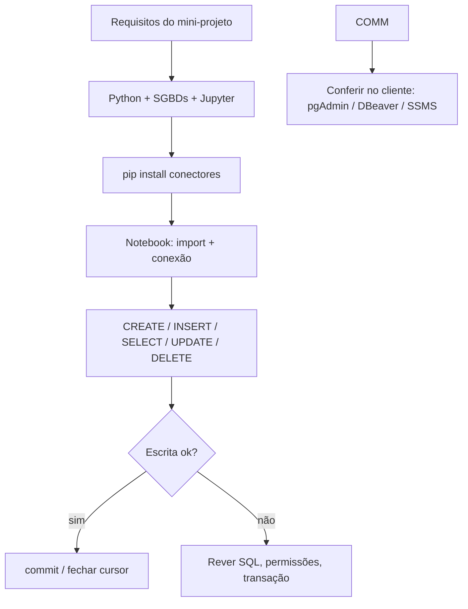
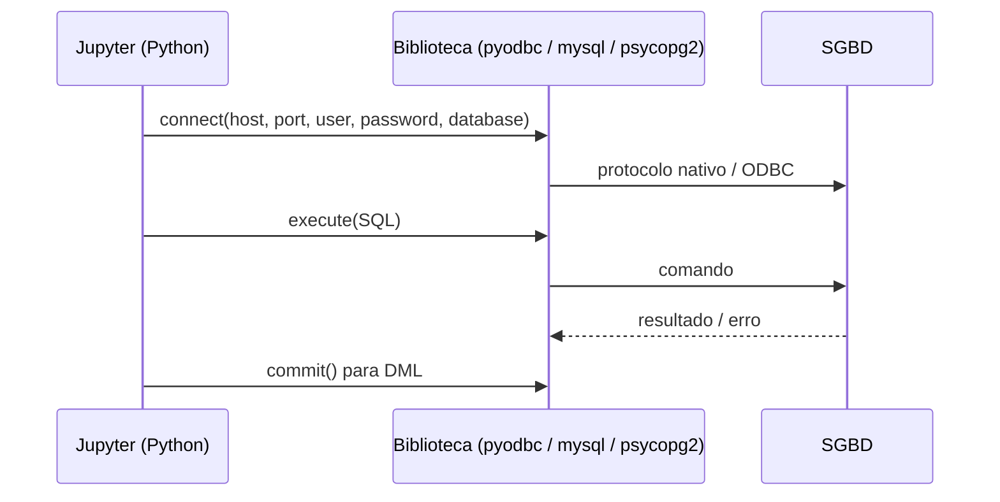
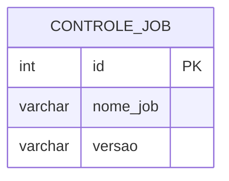

## Visão Geral do Conceito

Esta aula fecha o ciclo **“entender o projeto → montar o laboratório → integrar Python a dados”**: a partir de **requisitos** explícitos (integração com bancos, interface de execução passo a passo, CRUD), você configura **Python estável**, **servidores de banco** (PostgreSQL, MySQL, SQL Server), **Jupyter Notebook** e **bibliotecas de conexão** via <mark style="background-color: #242424; padding: 2px 4px; border-radius: 3px; color: inherit;">`pip`</mark>. O objetivo não é decorar cada linha de SQL, e sim ter um **mapa repetível**: instalar driver/conector, abrir conexão, executar comandos, **confirmar escrita** com <mark style="background-color: #242424; padding: 2px 4px; border-radius: 3px; color: inherit;">`commit`</mark> quando necessário, validar no cliente SQL (pgAdmin, DBeaver, SSMS).

O fio condutor do **Projeto de Bloco — Formação** (consultas SQL, visualização, Python introdutório e avançado) encontra aqui a prática de **ligar linguagem de aplicação a SGBD relacional**, como em times de dados e backend.

## Modelo Mental

- **Projeto = requisitos + ambiente + entrega**: antes do código, define-se o que deve existir (quais bancos, que tipo de interface, quais operações). Isso espelha o **Projeto Bloco Metodologias** (temporário, objetivo claro, recursos definidos) e pode seguir fluxo mais **tradicional** (fases e documentos) ou **ágil** (iterações), conforme o contexto citado nas aulas anteriores.
- **Duas pontes, não uma**: (1) o **servidor** do banco escuta em uma porta; (2) o **driver** (no SO) e a **biblioteca** (no Python) traduzem chamadas da sua aplicação para o protocolo do banco. Sem a biblioteca no Python, a integração não existe.
- **CRUD como contrato**: para uma entidade (ex.: registro de versão de job, produto, cliente de teste), você precisa **criar estrutura/linha**, **ler**, **atualizar** e **apagar** — o mesmo roteiro que uma tela de sistema ou um script de manutenção faria.
- **Notebook = laboratório**: células executam **passo a passo**, o que ajuda a depurar conexão, SQL e ordem de operações (criar antes de inserir, etc.).



## Mecânica Central

### 1. Recapitulação do case e do papel do analista-desenvolvedor

A aula retoma o **projeto real** (SQL Server, regras vindas de planilha, semanas entendendo negócio antes de codar): você **traduz requisitos** em estrutura e SQL. No dia a dia, costuma-se receber **usuário e senha** e **hosts/portas** para ambientes autorizados — o mesmo padrão usado no laboratório com banco <mark style="background-color: #242424; padding: 2px 4px; border-radius: 3px; color: inherit;">`Python`</mark> e login dedicado.

### 2. Requisitos do laboratório da aula

Em linha com o roteiro discutido na transcrição, o conjunto mínimo inclui:

- Integração **Python ↔ banco relacional**.
- Três sabores: **PostgreSQL**, **MySQL**, **SQL Server** (Oracle foi deixado de fora por custo de configuração no tempo da aula).
- Interface **web** simples para edição/execução: **Jupyter Notebook** (alternativas citadas: VS Code com suporte a notebooks, ambientes online).
- Execução **passo a passo** (células).
- Implementar **CRUD** em cada banco.

> **Regra:** CRUD — <mark style="background-color: #242424; padding: 2px 4px; border-radius: 3px; color: inherit;">**C**</mark>reate (inclui criar tabela/registro), <mark style="background-color: #242424; padding: 2px 4px; border-radius: 3px; color: inherit;">**R**</mark>ead (<mark style="background-color: #242424; padding: 2px 4px; border-radius: 3px; color: inherit;">`SELECT`</mark>), <mark style="background-color: #242424; padding: 2px 4px; border-radius: 3px; color: inherit;">**U**</mark>pdate (<mark style="background-color: #242424; padding: 2px 4px; border-radius: 3px; color: inherit;">`UPDATE`</mark>), <mark style="background-color: #242424; padding: 2px 4px; border-radius: 3px; color: inherit;">**D**</mark>elete (<mark style="background-color: #242424; padding: 2px 4px; border-radius: 3px; color: inherit;">`DELETE`</mark>).

### 3. Versões estáveis e pinagem

A aula alerta: **não usar pré-release** no ambiente de trabalho; usar **versão estável** do Python e **não atualizar no meio do projeto** sem necessidade — mudanças podem **deprecar APIs** (ex.: bibliotecas como Pandas) e quebrar scripts. Em equipes, isso vira requisito explícito: **manter versões fixas** dos componentes até passar por **dev → homologação → produção**.

*Não coberto no material em vídeo:* números exatos de versão mudam com o tempo; siga o site oficial do Python e do fornecedor do SGBD para a série estável atual.

### 4. Instalação dos SGBDs (visão prática)

- **PostgreSQL**: instalador Windows, versão de laboratório; após instalar, **pgAdmin** costuma acompanhar. Instalação “mínima” no desktop consome menos RAM que um servidor ajustado para produção — **o mesmo binário** pode ser configurado de forma mais pesada em máquina dedicada.
- **MySQL**: **MySQL Community Server**; na instalação, escolher perfil de **desenvolvimento/desktop** quando disponível, para não reservar recursos como um servidor dedicado. Download: a dica da turma foi usar opção de **baixar sem login** quando a página pede conta Oracle.
- **SQL Server**: opções **Developer** (recursos completos para dev) ou **Express** (limitada, adequada a muitos laboratórios). Instalação típica no Windows.

Links úteis estão consolidados em `Aulas/projetoBloco/Contexto/ProjetoBL-Links-Ferramentas.txt` (Python, PostgreSQL, MySQL, SQL Server, DBeaver, VS Code, etc.).

### 5. Ferramenta cliente e “plano B”

Em incidente real citado na aula, o cliente Oracle **travou** durante investigação de bloqueio no banco; a saída foi usar **DBeaver** para concluir a análise. Moral: domine **mais de um cliente** e saiba reconectar com o mesmo servidor.

### 6. Python, pip e Jupyter

- Verificar instalação: no terminal, <mark style="background-color: #242424; padding: 2px 4px; border-radius: 3px; color: inherit;">`python`</mark> / <mark style="background-color: #242424; padding: 2px 4px; border-radius: 3px; color: inherit;">`python --version`</mark>.
- Instalar Jupyter (pacote clássico):  
  `pip install notebook`  
  Abrir interface web:  
  `python -m notebook`
- <mark style="background-color: #242424; padding: 2px 4px; border-radius: 3px; color: inherit;">`pip`</mark> é o instalador padrão de **bibliotecas** Python; IDE costuma delegar a mesma instalação.

### 7. Bibliotecas de conexão (o que a aula instalou)

| SGBD | Biblioteca Python (exemplo na aula) | Observação |
|------|-------------------------------------|------------|
| SQL Server | <mark style="background-color: #242424; padding: 2px 4px; border-radius: 3px; color: inherit;">`pyodbc`</mark> | Depende de driver ODBC adequado no Windows |
| MySQL | <mark style="background-color: #242424; padding: 2px 4px; border-radius: 3px; color: inherit;">`mysql-connector-python`</mark> | Pacote com nome explícito no PyPI |
| PostgreSQL | driver comunitário tipo <mark style="background-color: #242424; padding: 2px 4px; border-radius: 3px; color: inherit;">`psycopg2`</mark> / <mark style="background-color: #242424; padding: 2px 4px; border-radius: 3px; color: inherit;">`psycopg2-binary`</mark> | Instalação via `pip` |

Comandos típicos:

```bash
pip install notebook pyodbc mysql-connector-python psycopg2-binary
```

Se o banco estivesse **só em outro servidor**, ainda assim seriam necessários **drivers** no cliente para o stack Python escolhido.

### 8. Fluxo de CRUD no notebook

1. <mark style="background-color: #242424; padding: 2px 4px; border-radius: 3px; color: inherit;">`import`</mark> da biblioteca.
2. Abrir **conexão** com host, porta, usuário, senha, nome do banco (parâmetros em variáveis — alinhado ao **mapa mental de variáveis** do projeto: nomes claros, tipos conscientes).
3. Criar **cursor**, executar <mark style="background-color: #242424; padding: 2px 4px; border-radius: 3px; color: inherit;">`CREATE TABLE`</mark> se necessário.
4. <mark style="background-color: #242424; padding: 2px 4px; border-radius: 3px; color: inherit;">`INSERT`</mark> com valores; em muitos drivers, **confirmar** com <mark style="background-color: #242424; padding: 2px 4px; border-radius: 3px; color: inherit;">`commit()`</mark>.
5. <mark style="background-color: #242424; padding: 2px 4px; border-radius: 3px; color: inherit;">`SELECT`</mark> e leitura dos resultados (ex.: laço sobre linhas).
6. <mark style="background-color: #242424; padding: 2px 4px; border-radius: 3px; color: inherit;">`UPDATE`</mark> e <mark style="background-color: #242424; padding: 2px 4px; border-radius: 3px; color: inherit;">`DELETE`</mark> com `commit` conforme o padrão da API.
7. Conferir no cliente gráfico com **refresh** na tabela.

No SQL Server, a aula menciona também **Pandas** (<mark style="background-color: #242424; padding: 2px 4px; border-radius: 3px; color: inherit;">`pip install pandas`</mark>) como ecossistema de manipulação de dados — útil para análise e integração, não só para SQL bruto.



### 9. Ambientes dev, homologação e produção

A aula antecipa conversa futura: em empresas existem **bancos de desenvolvimento**, **homologação** e **produção**, cada um com **permissões** e credenciais próprias — o mesmo tipo de **usuário escopado** que você preparou no PostgreSQL para o banco `Python` no laboratório.

## Uso Prático

Exemplo mínimo (padrão lógico; ajuste driver DSN/usuário ao seu ambiente):

```python
# Ilustração: PostgreSQL com psycopg2 — padrão de conexão + INSERT + commit
import psycopg2

conn = psycopg2.connect(
    host="localhost",
    port=5432,
    user="seu_usuario",
    password="sua_senha",
    dbname="python",
)
cur = conn.cursor()
cur.execute(
    """
    CREATE TABLE IF NOT EXISTS controle_job (
        id SERIAL PRIMARY KEY,
        nome_job VARCHAR(80) NOT NULL,
        versao VARCHAR(20) NOT NULL
    );
    """
)
conn.commit()
cur.close()
conn.close()
```

No **MySQL**, a forma costuma ser análoga com <mark style="background-color: #242424; padding: 2px 4px; border-radius: 3px; color: inherit;">`mysql.connector`</mark>; no **SQL Server**, <mark style="background-color: #242424; padding: 2px 4px; border-radius: 3px; color: inherit;">`pyodbc`</mark> com string de conexão apontando para o driver ODBC instalado.

Modelo mínimo da tabela de exemplo (para relacionar com o mapa **Projeto BL SQL**: tabela, colunas, chave):



## Erros Comuns

- **Esquecer o `commit`**: <mark style="background-color: #242424; padding: 2px 4px; border-radius: 3px; color: inherit;">`INSERT`</mark>/<mark style="background-color: #242424; padding: 2px 4px; border-radius: 3px; color: inherit;">`UPDATE`</mark>/<mark style="background-color: #242424; padding: 2px 4px; border-radius: 3px; color: inherit;">`DELETE`</mark> não persistem se a conexão estiver em transação implícita e você não confirmar.
- **Instalar só o SGBD**: Python continua sem biblioteca — erro ao importar ou ao conectar.
- **Misturar pré-release e estável**: comportamento inesperado e avisos de depreciação (como no relato do Pandas no chat).
- **Atualizar pacote no meio do semestre** sem testar: exemplos do curso e notebooks podem parar de rodar.
- **Porta/host incorretos**: especialmente com múltiplos SGBDs na mesma máquina (<mark style="background-color: #242424; padding: 2px 4px; border-radius: 3px; color: inherit;">`5432`</mark> PostgreSQL, <mark style="background-color: #242424; padding: 2px 4px; border-radius: 3px; color: inherit;">`3306`</mark> MySQL típicos, SQL Server costuma usar instância/porta própria).
- **Permissão de usuário**: usuário só com `SELECT` não cria tabela; erros de **permission denied** vêm daí.

## Visão Geral de Debugging

1. **Ping semântico**: o Python importa a biblioteca? Se não, problema de <mark style="background-color: #242424; padding: 2px 4px; border-radius: 3px; color: inherit;">`pip`</mark> ou ambiente virtual errado.
2. **Teste de conexão mínima**: string de conexão só com `SELECT 1` (ou equivalente) reduz variáveis.
3. **Cliente gráfico**: se DBeaver conecta e o notebook não, compare **driver**, **porta** e **usuário** byte a byte.
4. **Transação**: verifique se há `commit` e se outra sessão não está **lockando** (como no caso da aula com ferramenta travando).
5. **Logs do SGBD**: mensagens de erro do servidor costumam indicar sintaxe vs permissão.

## Principais Pontos

- Requisitos claros (**integração**, **três SGBDs**, **notebook**, **CRUD**) guiam o laboratório como um **mini-projeto**.
- **CRUD** é o conjunto mínimo de operações sobre dados de uma entidade.
- **pip** instala bibliotecas; **drivers** no SO completam a ponte até o banco.
- **Jupyter** viabiliza execução passo a passo e documentação viva.
- **Versões fixas** e evitar pré-releases reduzem surpresas — padrão profissional.
- **Validar no cliente SQL** fecha o ciclo com o mapa mental de **tabelas, linhas e comandos SQL** do projeto.

## Preparação para Prática

Você deve ser capaz de: listar os requisitos do laboratório da aula; instalar Python estável, Jupyter e conectores; criar banco e usuário de teste; executar um CRUD completo em pelo menos um SGBD e repetir o padrão nos outros dois; explicar o papel de `commit` e de credenciais.

## Laboratório de Prática

### Exercício Easy — Dicionário de conexão

Monte um **template** de configuração (sem senhas reais no repositório) para um job de ETL que grava em PostgreSQL.

```python
from typing import TypedDict


class PostgresConn(TypedDict):
    host: str
    port: int
    dbname: str
    user: str
    password: str


def load_connection_from_env() -> PostgresConn:
    # TODO: substituir este placeholder por leitura de variáveis de ambiente ou arquivo ignorado pelo git
    # (ex.: POSTGRES_HOST, POSTGRES_PORT, POSTGRES_DB, POSTGRES_USER, POSTGRES_PASSWORD).
    return {
        "host": "localhost",
        "port": 5432,
        "dbname": "python",
        "user": "TODO_USUARIO",
        "password": "TODO_SENHA",
    }


if __name__ == "__main__":
    cfg = load_connection_from_env()
    print(cfg["host"], cfg["port"], cfg["dbname"])
```

### Exercício Medium — Função CRUD mínima (PostgreSQL)

Implemente funções que executam **uma** operação cada, com `commit` explícito após escrita.

```python
from __future__ import annotations

from typing import Any, List, Tuple


def get_conn() -> Any:
    """Retorna uma conexão psycopg2 (Any até você tipar com o módulo instalado)."""
    # TODO: import psycopg2 e retornar psycopg2.connect(...) com credenciais seguras (env / secrets)
    return None


def crud_ensure_table(conn: Any) -> None:
    # TODO: CREATE TABLE IF NOT EXISTS para tabela de log de importação (id, origem, linhas_ok, criado_em)
    pass


def crud_insert_log(conn: Any, origem: str, linhas_ok: int) -> None:
    # TODO: INSERT + commit
    pass


def crud_select_last_logs(conn: Any, limit: int = 5) -> List[Tuple[Any, ...]]:
    # TODO: SELECT ordenado por criado_em DESC LIMIT %s
    return []
```

### Exercício Hard — Checklist de versões pinadas

Simule um **arquivo de requisitos** usado em time para evitar drift de versões.

```python
REQUIRED = {
    "python": "3.x.x",  # TODO: fixar série estável usada no seu laboratório
    "psycopg2-binary": "x.x.x",
    "mysql-connector-python": "x.x.x",
    "pyodbc": "x.x.x",
    "notebook": "x.x.x",
}


def assert_versions_match_installed() -> list[str]:
    """Retorna lista de divergências entre REQUIRED e pacotes instalados."""
    # TODO: usar importlib.metadata.version ou pkg_resources para comparar
    return []


if __name__ == "__main__":
    for issue in assert_versions_match_installed():
        print("PROBLEMA:", issue)
```

<!-- CONCEPT_EXTRACTION
concepts:
  - requisitos de projeto
  - CRUD
  - pip
  - Jupyter Notebook
  - drivers ODBC
  - pyodbc
  - mysql-connector-python
  - psycopg2
  - commit e transação
  - versões estáveis
skills:
  - Definir requisitos de integração Python com múltiplos SGBDs
  - Instalar conectores com pip e validar imports
  - Executar CRUD via notebook com commit em escritas
  - Fixar versões de Python e bibliotecas para reprodutibilidade
examples:
  - fluxo-requisitos-ambiente-crud
  - checklist-versoes-pinadas
  - crud-log-importacao-postgres
-->

<!-- EXERCISES_JSON
[
  {
    "id": "dict-conexao-postgres-env",
    "slug": "dict-conexao-postgres-env",
    "difficulty": "easy",
    "title": "Template de conexão PostgreSQL via ambiente",
    "discipline": "projeto-bloco",
    "editorLanguage": "python",
    "tags": ["python", "postgresql", "configuracao", "projeto-bloco"],
    "summary": "Completar carregamento tipado de parâmetros de conexão a partir de variáveis de ambiente."
  },
  {
    "id": "crud-minimo-postgres-log",
    "slug": "crud-minimo-postgres-log",
    "difficulty": "medium",
    "title": "CRUD mínimo para log de importação em PostgreSQL",
    "discipline": "projeto-bloco",
    "editorLanguage": "python",
    "tags": ["python", "postgresql", "crud", "psycopg2"],
    "summary": "Garantir tabela de log, inserir registro e listar últimos logs com SELECT."
  },
  {
    "id": "checklist-versoes-pinadas-pip",
    "slug": "checklist-versoes-pinadas-pip",
    "difficulty": "hard",
    "title": "Verificar pacotes instalados vs versões exigidas",
    "discipline": "projeto-bloco",
    "editorLanguage": "python",
    "tags": ["python", "pip", "reprodutibilidade", "devops-leve"],
    "summary": "Implementar comparação entre dicionário REQUIRED e versões instaladas via metadata."
  }
]
-->
