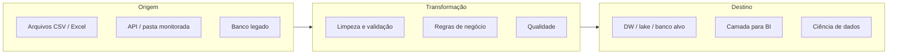
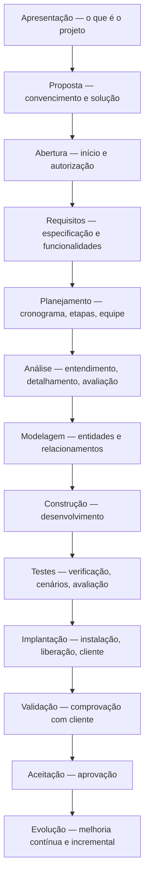

## Visão Geral do Conceito

Esta aula articula três eixos que aparecem juntos na prática: **onde o projeto “começa e termina”** (etapas do **Projeto Bloco**), **como o Python expressa dados e repetições** (estruturas e laços que você já usou em integração com banco e planilhas) e **como se posicionar no mercado** (currículo, redes, busca consistente de oportunidades). O diagrama **Projeto Bloco Etapas** não é burocracia vazia: ele organiza **o que documentar**, **quem costuma participar** em cada fase e **como seu perfil** (desenvolvimento, dados, empreendedor) encaixa em uma ou várias etapas.

A recapitulação técnica reforça que **origem → transformação → destino** é o mesmo raciocínio da aula anterior (Python + SQL + Excel), agora ligado a **qualidade de dados** e a **papéis** (engenheiro de dados prepara; analista/cientista consome; visualização depende de dados já tratados quando possível).

## Modelo Mental

- **Projeto como sequência de compromissos**: da ideia e convencimento (**Apresentação**, **Proposta**, **Abertura**) até o que entra em produção e evolui (**Testes** … **Evolução**). Nem todo projeto formaliza todas as caixas; o mapa serve para você **saber o que está faltando** quando algo dá errado.
- **Seu papel é um recorte**: em empresa grande, você pode ser só **modelagem** ou só **infra de banco**; em empresa pequena ou como empreendedor, você **empilha papéis** e toca várias etapas. O mapa explica por que “saber tudo” não é o padrão — é normal **aprofundar em algumas etapas** e colaborar nas demais.
- **Python como cola**: listas, tuplas e dicionários são formas de **segurar e endereçar dados** em memória; <mark style="background-color: #242424; padding: 2px 4px; border-radius: 3px; color: inherit;">`for`</mark> e <mark style="background-color: #242424; padding: 2px 4px; border-radius: 3px; color: inherit;">`while`</mark> repetem trabalho (por exemplo, linhas de planilha ou resultados de consulta). **Ferramenta** (IDLE, Jupyter, Anaconda, VS Code) é meio; **fundamento** é entender o fluxo.
- **Mercado**: currículo e perfis profissionais online são **pontos de entrada**; entrevistas ruins também ensinam. O objetivo é **iterar** com calma, não esperar acerto na primeira candidatura.



## Mecânica Central

### 1. Diagrama Projeto Bloco Etapas (referência da aula)

As etapas foram apresentadas como um fluxo completo, da concepção à evolução. Em ordem lógica de leitura:



**Gestores de projeto** precisam enxergar **todas** as etapas relevantes para planejar entregas e formalidades. **Especialistas** costumam **profundar** em subconjuntos (por exemplo, requisitos + modelagem + construção para quem desenvolve; modelagem + construção + testes para parte de dados). **Empreendedores** frequentemente atravessam **quase todas** as caixas com menos divisão de papéis.

### 2. Recapitulação: integração Python e banco

O objetivo da semana anterior permanece: entender **conexão** de aplicação a SGBD, **transporte** de dados (por exemplo, planilha → banco), uso de **bibliotecas** via <mark style="background-color: #242424; padding: 2px 4px; border-radius: 3px; color: inherit;">`pip`</mark> e drivers adequados (**PostgreSQL**, **MySQL**, **SQL Server** — cada um com seu conector). Em nuvem, muitos serviços expõem scripts ou configurações em **Python** e **JSON**; o importante é o **padrão mental** de origem, transformação e destino, não decorar um único provedor.

### 3. Ferramentas leves x ambientes completos

- **IDLE**: vem com o Python, **pouco uso de recursos**, bom para **iniciantes** e para testar scripts sem configurar projeto em IDE pesada.
- **Jupyter Notebook**: células executáveis, ótimo para **exploração** e integração passo a passo (como nas aulas de banco).
- **Anaconda**: distribuição que agrupa **Python**, **Jupyter** e muitas ferramentas para **ciência e análise de dados**; ocupa mais disco, mas centraliza ambientes.

Quando a máquina é limitada, **focar no que o curso exige agora** e preferir SGBDs mais leves em laboratório **não invalida** o aprendizado: o mesmo software de servidor pode ser configurado de forma mais pesada em produção.

### 4. Listas, tuplas e dicionários

| Estrutura | Sintaxe típica | Mutabilidade | Uso mental |
|-----------|------------------|--------------|------------|
| Lista | <mark style="background-color: #242424; padding: 2px 4px; border-radius: 3px; color: inherit;">`[ ]`</mark> | Mutável | Sequência ordenada; alterar itens, adicionar, remover |
| Tupla | <mark style="background-color: #242424; padding: 2px 4px; border-radius: 3px; color: inherit;">`( )`</mark> | Imutável | “Congelar” um conjunto de valores após leitura; evita alteração acidental |
| Dicionário | <mark style="background-color: #242424; padding: 2px 4px; border-radius: 3px; color: inherit;">`{ chave: valor }`</mark> | Mutável (valores/chaves conforme operações) | Modelo **chave → valor**; acesso por chave, como colunas nomeadas |

Índices em listas e tuplas começam em **0**; índice negativo percorre **do fim para o início**. <mark style="background-color: #242424; padding: 2px 4px; border-radius: 3px; color: inherit;">`len()`</mark> retorna quantidade de elementos.

### 5. Repetição: `for` versus `while`

- **for**: quando há **contagem definida** ou iteração direta sobre coleção (ex.: <mark style="background-color: #242424; padding: 2px 4px; border-radius: 3px; color: inherit;">`range(n)`</mark> — lembra que vai de **0** a **n-1**).
- **while**: quando a repetição depende de uma **condição** que pode não ter tamanho fixo (ex.: ler até encontrar marcador).

> **Regra:** Em <mark style="background-color: #242424; padding: 2px 4px; border-radius: 3px; color: inherit;">`while`</mark>, **atualize** a variável que controla a condição; caso contrário, você cria **loop infinito** (risco de travar o processo ou a máquina).

### 6. Perfis em projetos de dados (exemplo discutido)

- **Engenheiros de dados**: desenham **fluxo** da origem ao destino (transformações, ambientes sem acesso direto a servidor podem depender de DBA para **volume de tabelas** e **metadados**).
- **Cientistas de dados / analistas de BI**: consomem dados **já preparados** no destino; conectam **Power BI**, **Tableau**, **Qlik** e similares para análise e painéis.
- **DBA / infra**: em alguns cenários, só **preparam servidor e instância**; o **modelo lógico** já veio de outras equipes.

### 7. Performance de dashboards e consultas (debate da aula)

Travamentos em ferramentas de visualização raramente têm **uma** causa: entram **volume de dados**, **largura da tabela** (muitas colunas, campos grandes), **período** consultado (histórico longo força mais processamento), **refresh** e **infraestrutura** (rede, servidor, configuração). **Pré-agregar** e **reduzir colunas** expostas ao painel costuma aliviar carga; o ideal é que o usuário veja **dados já processados** na camada de consumo.

## Uso Prático

### Exemplo: dicionário como “linha” de registro

```python
registro = {
    "pedido_id": "P-1002",
    "valor": 199.90,
    "status": "pendente",
}
# Acesso por chave (falha clara se chave não existir com [])
print(registro["pedido_id"])
```

### Exemplo: tupla para coordenadas fixas de um pipeline

```python
# Ordem fixa: origem, destino, periodicidade_horas
config_etl = ("pasta/inbox", "postgresql://...", 1)
origem, destino, periodicidade = config_etl
```

### Exemplo: `for` com `range` para amostrar índices

```python
for i in range(3):
    print(f"processando lote índice {i}")
```

*Não coberto no vídeo:* implementação completa de um CRUD em terminal; o instrutor sugeriu como possibilidade futura para consolidar integração com banco.

## Erros Comuns

- **Confundir mutabilidade**: tentar “alterar” uma tupla como se fosse lista → gera erro ou leva a recriar objetos sem perceber o impacto em referências compartilhadas.
- **`while` sem progresso**: esquecer de incrementar contador ou atualizar condição → **loop infinito**.
- **`range` e off-by-one**: assumir que <mark style="background-color: #242424; padding: 2px 4px; border-radius: 3px; color: inherit;">`range(5)`</mark> inclui o **5** — na verdade são os índices **0..4**.
- **Achar que a ferramenta de BI resolve modelo ruim**: painel lento com milhões de linhas e centenas de colunas sem camada de preparação → sintoma de **origem/transformação** mal desenhadas, não só “culpa do clique”.
- **Currículo estático**: não atualizar conquistas e palavras-chave alinhadas ao que você **realmente** fez → desalinhamento com o mercado.

## Visão Geral de Debugging

- **Python não faz o esperado com listas/tuplas**: confira **imutabilidade**, **tipos** dos elementos e se você está usando **índice** ou **chave** corretos.
- **Loop não termina**: inspecione a **condição** do <mark style="background-color: #242424; padding: 2px 4px; border-radius: 3px; color: inherit;">`while`</mark> e cada caminho que deveria **sair** do laço.
- **Dashboard lento**: reduza **período**, **colunas** e **granularidade**; verifique se o gargalo é **consulta**, **rede** ou **capacidade** do servidor — documente hipóteses antes de trocar de ferramenta.

## Principais Pontos

- O diagrama **Projeto Bloco Etapas** cobre da apresentação à evolução; **formalize** o que o seu contexto exige.
- **Lista** mutável, **tupla** imutável, **dicionário** chave–valor — escolha pelo **comportamento** dos dados.
- **`for`** para repetições **contadas** ou iteráveis; **`while`** para **condição**; cuide do **loop infinito**.
- **Pipeline** de dados: origem → transformação (qualidade) → destino; perfis diferentes atuam em **pontos** distintos.
- **Mercado**: currículo atualizado, presença em **redes profissionais**, busca **regular** de vagas e **entrevistas como aprendizado**.

## Preparação para Prática

Você deve ser capaz de: **explicar** uma etapa do diagrama em uma frase; **escolher** lista/tupla/dicionário para um caso; **escrever** um laço que percorra índices ou chaves sem erro de lógica; **relacionar** lentidão de painel a **dados** e **infra**, não só à ferramenta de visualização.

## Laboratório de Prática

### Easy — Classificar estrutura de dados

Um script recebe uma string `"lista"`, `"tupla"` ou `"dict"` e deve retornar um exemplo **vazio** da estrutura correspondente (lista vazia, tupla vazia, dicionário vazio). Complete a função.

```python
def estrutura_vazia(tipo: str):
    # TODO: retornar [], () ou {} conforme tipo; para entrada inválida, retornar None
    return None  # placeholder: substitua pela lógica; após implementar, valide os casos abaixo


if __name__ == "__main__":
    # Esperado após o TODO: lista -> [], tupla -> (), dict -> {}, outro -> None
    print(estrutura_vazia("lista"), estrutura_vazia("tupla"), estrutura_vazia("dict"), estrutura_vazia("outro"))
```

### Medium — Contagem segura com `while`

Processar uma fila simulada de IDs de jobs (lista). Remova e imprima cada ID com **while** até a fila esvaziar. Não use `for` sobre a lista original sem cópia — evite mutar a coleção enquanto itera de forma incorreta.

```python
def esvaziar_fila(jobs):
    # TODO: enquanto houver jobs, retire um (pop) e acumule em processados
    processados = []
    return processados


if __name__ == "__main__":
    fila = ["j1", "j2", "j3"]
    print(esvaziar_fila(list(fila)))  # esperado após TODO: ["j1","j2","j3"] e fila de entrada esvaziada na cópia trabalhada
```

### Hard — Mini-checklist de qualidade em registros

Dada uma lista de dicionários representando linhas de um CSV já carregado (`pedido_id`, `valor`, `email`), retorne quantos registros falham em: `valor` nulo ou negativo; `email` sem `"@"`; `pedido_id` duplicado (considerar primeira ocorrência válida, duplicatas seguintes contam como falha).

```python
def auditar_registros(linhas):
    # TODO: retornar dict com chaves "falhas_valor", "falhas_email", "duplicatas_id"
    return {"falhas_valor": 0, "falhas_email": 0, "duplicatas_id": 0}


if __name__ == "__main__":
    amostra = [
        {"pedido_id": "A", "valor": 10.0, "email": "a@x.com"},
        {"pedido_id": "A", "valor": 5.0, "email": "b@x.com"},
        {"pedido_id": "B", "valor": -1, "email": "invalido"},
    ]
    print(auditar_registros(amostra))  # após TODO: duplicatas_id >= 1 para esta amostra
```

<!-- CONCEPT_EXTRACTION
concepts:
  - ciclo de vida do projeto (Projeto Bloco Etapas)
  - lista mutável vs tupla imutável vs dicionário chave-valor
  - for com range e while com condição
  - pipeline origem-transformação-destino
  - perfis: engenheiro de dados, analista, DBA
skills:
  - Mapear entregas às etapas do diagrama de projeto
  - Escolher estrutura de dados adequada ao cenário
  - Implementar repetição sem loop infinito acidental
  - Relacionar sintomas de lentidão em BI a dados e infraestrutura
  - Planejar currículo e busca de vagas de forma iterativa
examples:
  - dict-registro-pedido
  - tupla-config-etl
  - auditar-registros-dict-lista
-->

<!-- EXERCISES_JSON
[
  {
    "id": "estrutura-vazia-por-tipo",
    "slug": "estrutura-vazia-por-tipo",
    "difficulty": "easy",
    "title": "Retornar lista, tupla ou dict vazio por nome",
    "discipline": "projeto-bloco",
    "editorLanguage": "python",
    "tags": ["python", "estruturas-de-dados", "projeto-bloco"],
    "summary": "Completar função que devolve [], () ou {} conforme o tipo pedido."
  },
  {
    "id": "esvaziar-fila-while",
    "slug": "esvaziar-fila-while",
    "difficulty": "medium",
    "title": "Esvaziar fila de jobs com while",
    "discipline": "projeto-bloco",
    "editorLanguage": "python",
    "tags": ["python", "while", "listas"],
    "summary": "Processar IDs com pop até a lista esvaziar sem loop infinito."
  },
  {
    "id": "auditar-registros-qualidade",
    "slug": "auditar-registros-qualidade",
    "difficulty": "hard",
    "title": "Auditoria simples de qualidade em lista de dicts",
    "discipline": "projeto-bloco",
    "editorLanguage": "python",
    "tags": ["python", "dicionarios", "validacao", "etl"],
    "summary": "Contar falhas de valor, email e duplicatas de pedido_id."
  }
]
-->
