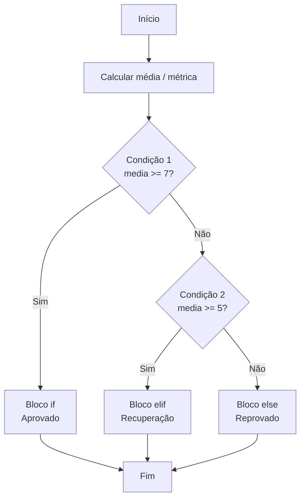

### Visão Geral

Nesta aula você aprende a tomar decisões em Python usando **desvios condicionais** com `if`, `elif` e `else`. A partir de **expressões booleanas** (comparações que resultam em `True` ou `False`), seu programa escolhe **um caminho de execução**: aprovar ou reprovar um aluno, classificar um IMC, decidir desconto, entre outros.

### Modelo Mental

Pense em um **fluxo de triagem** de pronto-socorro: cada paciente passa por perguntas em ordem, e cada resposta o envia para uma fila diferente (emergência, prioridade, rotina). O `if` em Python faz esse papel:

- **Porta de entrada**: uma expressão booleana (`media >= 7`, `imc < 18.5`).
- **Seta de decisão**: se a condição é verdadeira, você entra no **bloco identado** logo abaixo.
- **Rotas alternativas**: `elif` e `else` representam outros caminhos possíveis quando a primeira condição não é satisfeita.

O programa sempre segue **um único ramo** em uma cadeia `if / elif / else`, como um fluxograma de perguntas e respostas.

### Mecânica Central

- **Valores booleanos**:

```python
aprovado = True
reprovado = False
```

- **Operadores relacionais (de comparação)**:

```python
idade = 20

print(idade > 18)   # maior que
print(idade >= 18)  # maior ou igual
print(idade == 18)  # igual
print(idade != 18)  # diferente
print(idade < 18)   # menor que
print(idade <= 18)  # menor ou igual
```

- **If simples**:

```python
media = 8.2

if media >= 7.0:
    print("Aluno aprovado!")
```

- **If / else**:

```python
media = 5.3

if media >= 7.0:
    print("Aluno aprovado!")
else:
    print("Aluno reprovado.")
```

- **If / elif / else (várias faixas)**:

```python
media = 6.2

if media >= 9.0:
    print("Conceito A")
elif media >= 7.0:
    print("Conceito B")
elif media >= 5.0:
    print("Conceito C")
else:
    print("Conceito D")
```

Note a **identação obrigatória** (geralmente 4 espaços) em cada bloco interno.

### Uso Prático

Alguns cenários comuns em ADS:

- **Aprovação com recuperação**: média final em relação a limiares (≥ 7 aprovado, entre 5 e 7 recuperação, < 5 reprovado).
- **Classificação de IMC**: faixas de IMC com textos explicativos para relatório de saúde.
- **Regras de desconto**: aplicar percentuais diferentes dependendo do valor total de compras.

Exemplo de aprovação com recuperação:

```python
media = float(input("Digite a média final do aluno: "))

if media >= 7.0:
    status = "aprovado"
elif media >= 5.0:
    status = "em recuperação"
else:
    status = "reprovado"

print(f"Status do aluno: {status}")
```

### Visual: Fluxo de decisão com if / elif / else



Esse diagrama representa a cadeia completa de decisões. Cada losango é uma **expressão booleana** avaliada em sequência.

### Erros Comuns

- **Esquecer a identação**:

```python
if media >= 7.0:
print("Aprovado")  # Erro: o bloco precisa ser identado
```

- **Misturar comparação com atribuição**:

```python
if media = 7:      # Erro de sintaxe, '=' é atribuição
    ...

if media == 7:     # Comparação correta
    ...
```

- **Sobrepor intervalos ao usar apenas if**:

```python
# Pode imprimir mais de uma mensagem para o mesmo valor
if media >= 5:
    print("C")
if media >= 7:
    print("B")
```

Aqui, se `media == 7.5`, as duas condições são verdadeiras. Use `if/elif/else` quando quiser **exclusividade**.

### Visão Geral de Debugging

Quando algo não funciona em um conjunto de condicionais:

- **Imprima valores intermediários** (média, IMC, total) antes do `if` para conferir se a conta está correta.
- **Teste limites de faixa**: valores bem na borda (`4.9`, `5.0`, `6.99`, `7.0`) para ver em qual ramo caem.
- **Verifique a ordem das condições**: intervalos mais restritos (notas altas) costumam vir primeiro.
- Em caso de **erro de sintaxe**, observe cuidadosamente:
  - Dois pontos `:` no final da linha do `if/elif/else`.
  - Identação consistente usando o mesmo número de espaços.

### Principais Pontos

- **Operadores relacionais** produzem `True` ou `False` a partir de comparações.
- **`if`, `elif`, `else`** definem **ramificações exclusivas** de execução.
- A **identação** define quais linhas pertencem a cada bloco condicional.
- Em classificações por faixa (média, IMC, desconto), a **ordem dos testes** e o uso correto de `elif` são cruciais.

### Preparação para Prática

Antes de ir para o laboratório:

- Releia mentalmente o modelo de **triagem**: uma pergunta por vez, em ordem.
- Tenha em mãos alguns **exemplos concretos** (médias de alunos, valores de IMC, valores de carrinho de compras).
- Anote, em português, as regras de negócio primeiro; depois, traduza essas regras para `if / elif / else`.

### Laboratório de Prática

#### 1. Classificador simples de aprovação (Easy)

Implemente uma função para classificar o status de um aluno com base em sua média final.

Regras:

- Média **maior ou igual a 7.0** → `"aprovado"`.
- Média **entre 5.0 (inclusive) e 7.0 (exclusive)** → `"recuperacao"`.
- Média **menor que 5.0** → `"reprovado"`.

```python
def classificar_aluno(media: float) -> str:
    """
    Classifica o aluno de acordo com a média final.

    Regras:
    - media >= 7.0  -> "aprovado"
    - 5.0 <= media < 7.0 -> "recuperacao"
    - media < 5.0  -> "reprovado"
    """
    status = ""

    # TODO: implementar a lógica de classificação usando if/elif/else
    # Dica: comece testando a condição mais "forte" (aprovado) e vá descendo.

    return status


if __name__ == "__main__":
    exemplos = [4.3, 5.0, 6.9, 7.0, 9.5]
    for m in exemplos:
        print(m, "->", classificar_aluno(m))
```

#### 2. Analise de IMC com faixas (Medium)

Você recebeu uma tabela simplificada de classificação de **Índice de Massa Corporal (IMC)**. Implemente uma função que, dado um valor de IMC, retorne uma string com a categoria.

Use faixas como:

- `imc < 18.5` → `"abaixo do peso"`
- `18.5 <= imc < 25` → `"peso normal"`
- `25 <= imc < 30` → `"sobrepeso"`
- `imc >= 30` → `"obesidade"`

```python
def classificar_imc(imc: float) -> str:
    """
    Classifica o IMC em faixas de saúde.
    """
    categoria = ""

    # TODO: implementar cadeia if/elif/else para cobrir todas as faixas
    # Lembre de garantir que cada valor caia em apenas uma categoria.

    return categoria


if __name__ == "__main__":
    imcs_teste = [17.9, 18.5, 23.7, 25.0, 29.9, 31.2]
    for valor in imcs_teste:
        print(valor, "->", classificar_imc(valor))
```

#### 3. Regra de desconto progressivo em compras (Hard)

Você está implementando a lógica de descontos de uma loja online. A regra é:

- Total **abaixo de 100.00** → sem desconto (0%).
- Total **de 100.00 até 499.99** → 5% de desconto.
- Total **de 500.00 até 999.99** → 10% de desconto.
- Total **a partir de 1000.00** → 15% de desconto.

Implemente uma função que receba o valor total da compra e retorne **o valor final com desconto aplicado**.

```python
def aplicar_desconto(total: float) -> float:
    """
    Calcula o valor final de uma compra após aplicar
    o desconto progressivo definido pela loja.
    """
    valor_final = total

    # TODO: usar if/elif/else para definir a porcentagem de desconto
    # e atualizar o valor_final.
    #
    # Exemplo:
    # - Para total = 120.00, deve aplicar 5% e retornar 114.00

    return valor_final


if __name__ == "__main__":
    carrinhos = [50.0, 150.0, 520.0, 1200.0]
    for total in carrinhos:
        print(f"Total: R$ {total:.2f} -> Com desconto: R$ {aplicar_desconto(total):.2f}")
```

<!-- CONCEPT_EXTRACTION
concepts:
  - id: booleanos
    label: "Valores booleanos em Python"
    description: "Representação de verdadeiro e falso com os literais True e False e seu uso em decisões."
  - id: operadores-relacionais
    label: "Operadores relacionais"
    description: "Operadores de comparação como >, >=, <, <=, == e != que produzem valores booleanos."
  - id: if-elif-else
    label: "Estruturas if, elif e else"
    description: "Blocos condicionais que permitem executar diferentes trechos de código dependendo de expressões booleanas."
  - id: blocos-identados
    label: "Blocos identados em Python"
    description: "Uso da identação para definir o escopo de blocos de código em estruturas condicionais."
skills:
  - id: construir-expressoes-booleanas
    label: "Construir expressões booleanas com operadores relacionais"
    verbs: ["construir", "avaliar", "combinar"]
  - id: implementar-desvios-condicionais
    label: "Implementar desvios condicionais com if/elif/else"
    verbs: ["implementar", "refatorar", "validar"]
  - id: modelar-regras-negocio-condicionais
    label: "Modelar regras de negócio como cadeias condicionais"
    verbs: ["modelar", "traduzir", "depurar"]
examples:
  - id: exemplo-if-simples
    title: "If simples para aprovação"
    code: |
      media = 8.2
      if media >= 7.0:
          print("Aluno aprovado!")
  - id: exemplo-if-elif-else
    title: "Classificação de conceito com if/elif/else"
    code: |
      media = 6.2
      if media >= 9.0:
          print("Conceito A")
      elif media >= 7.0:
          print("Conceito B")
      elif media >= 5.0:
          print("Conceito C")
      else:
          print("Conceito D")
-->

<!-- EXERCISES_JSON
[
  {
    "id": "classificar_aluno_status",
    "title": "Classificar aluno em aprovado, recuperação ou reprovado",
    "difficulty": "easy",
    "function_name": "classificar_aluno",
    "topics": ["if", "elif", "else", "operadores relacionais", "booleanos"]
  },
  {
    "id": "classificar_imc_faixas",
    "title": "Classificar valores de IMC em faixas de saúde",
    "difficulty": "medium",
    "function_name": "classificar_imc",
    "topics": ["if", "elif", "else", "faixas de valores", "regras de negócio"]
  },
  {
    "id": "aplicar_desconto_progressivo",
    "title": "Aplicar desconto progressivo em compras",
    "difficulty": "hard",
    "function_name": "aplicar_desconto",
    "topics": ["if", "elif", "else", "porcentagens", "fluxo condicional"]
  }
]
-->

