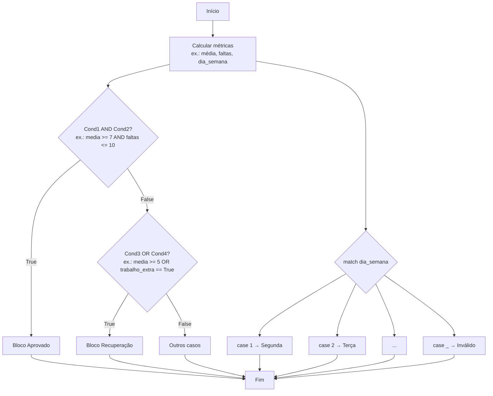

### Visão Geral

Nesta aula você aprende a **combinar condições** em Python usando **operadores lógicos** (`and`, `or`, negação) e a enxergar essas combinações por meio de **tabelas-verdade**. Também vê como o Python interpreta certos valores como **truthy/falsy** e conhece a estrutura **`match/case`**, introduzida no Python 3.10, que substitui cadeias grandes de `if/elif` com código mais limpo.

### Modelo Mental

Imagine uma triagem de regras de negócio como um **painel de interruptores**:

- Cada condição simples (ex.: `media >= 7`, `faltas <= 10`) é um **interruptor** que pode estar ligado (`True`) ou desligado (`False`).
- O operador **`and`** é como “ligar duas chaves em série”: se qualquer uma estiver desligada, a energia não passa.
- O operador **`or`** é como “chaves em paralelo”: se pelo menos uma estiver ligada, a energia passa.
- A **negação** (`not` na sintaxe do Python) inverte o estado da chave: ligado vira desligado e vice-versa.
- O **`match/case`** é um painel numerado: você escolhe um valor (ex.: dia da semana) e ele “casa” com um dos casos pré-definidos, executando apenas o bloco correspondente.

A tabela-verdade é, literalmente, uma **tabela de todas as combinações possíveis** de chaves (`True`/`False`) e de qual resultado final elas produzem.

### Mecânica Central

- **Operadores lógicos básicos em Python**:

```python
a = True
b = False

print(a and b)  # False  (os dois precisam ser True)
print(a or b)   # True   (basta um ser True)
print(not a)    # False  (negação lógica)
```

- **Tabelas-verdade de `and` e `or`**:

| A     | B     | A and B | A or B |
|-------|-------|---------|--------|
| True  | True  | True    | True   |
| True  | False | False   | True   |
| False | True  | False   | True   |
| False | False | False   | False  |

- **Negação**:

| A     | not A |
|-------|-------|
| True  | False |
| False | True  |

- **Combinação de comparações**:

```python
media = 8.0
faltas = 6

aprovado = (media >= 7.0) and (faltas <= 10)
print(aprovado)  # True se as duas condições forem satisfeitas
```

- **Truthy e falsy** em Python (em contexto booleano):
  - Falsy: `False`, `None`, `0`, `0.0`, `""` (string vazia), estruturas vazias (`[]`, `{}`, `set()`).
  - Tudo o mais é tratado como **truthy**.

```python
texto = ""
if texto:
    print("Tem conteúdo")
else:
    print("Está vazio")  # executado, porque "" é falsy
```

- **Match/case (pattern matching estrutural)** – Python 3.10+:

```python
dia = int(input("Digite o dia da semana (1-7): "))

match dia:
    case 1:
        print("Segunda-feira")
    case 2:
        print("Terça-feira")
    case 3:
        print("Quarta-feira")
    case 4:
        print("Quinta-feira")
    case 5:
        print("Sexta-feira")
    case 6:
        print("Sábado")
    case 7:
        print("Domingo")
    case _:
        print("Dia inválido")
```

### Uso Prático

Alguns usos diretos em ADS:

- **Regras de aprovação**: média mínima **e** limite máximo de faltas.
- **Filtros de clientes**: renda suficiente **e** sem dívidas, ou renda muito alta independentemente das dívidas.
- **Alertas em dashboards**: indicador muito baixo **ou** variação muito negativa.

Exemplo de regra de aprovação com presença:

```python
media = float(input("Média final: "))
faltas = int(input("Número de faltas: "))

if media >= 7 and faltas <= 10:
    print("Aprovado")
elif media >= 5 and faltas <= 10:
    print("Recuperação")
else:
    print("Reprovado")
```

### Visual: combinação lógica e match/case



O diagrama mostra como expressões com `and`/`or` direcionam o fluxo e como o `match` faz um roteamento limpo por valor.

### Erros Comuns

- **Confundir `and` com `or`**: usar `or` em regras que exigem duas condições ao mesmo tempo gera aprovações indevidas.
- **Esquecer parênteses em expressões complexas**: confiar apenas na precedência pode deixar o código difícil de ler e interpretar errado.
- **Confiar demais em truthy/falsy sem clareza**: escrever `if valor:` quando na verdade você quer testar explicitamente `if valor is not None and valor != 0`.
- **Achar que `match/case` existe em qualquer versão**: usar `match` em Python < 3.10 resulta em `SyntaxError`.

### Visão Geral de Debugging

Para depurar expressões lógicas:

- Imprima as **subexpressões** separadas:

```python
print(media >= 7, faltas <= 10)
print((media >= 7) and (faltas <= 10))
```

- Monte uma pequena **tabela-verdade de teste**, anotando combinações de entrada e resultado esperado (“teste de mesa”).
- Simplifique expressões grandes, extraindo pedaços para variáveis com nomes claros (`tem_media_suficiente`, `tem_poucas_faltas`).
- Ao usar `match/case`, sempre defina um `case _:` para cobrir valores inesperados.

### Principais Pontos

- `and` só resulta em `True` se **todas** as condições forem verdadeiras; `or` resulta em `True` se **pelo menos uma** for verdadeira; `not` inverte o valor lógico.
- **Tabelas-verdade** ajudam a prever o resultado de combinações de `True`/`False`.
- Python interpreta alguns valores como **falsy** (`False`, `None`, `0`, `""`, coleções vazias) e todo o resto como truthy.
- **`match/case`** oferece uma forma mais legível de escrever múltiplos caminhos de fluxo baseados em um único valor.

### Preparação para Prática

Antes do laboratório:

- Reescreva, em português, **três regras de negócio** que você conhece e sublinhe onde entrariam `and`, `or` e `not`.
- Faça uma tabelinha para duas condições que aparecem no seu dia a dia (ex.: “tem dinheiro” / “tem tempo”) e preencha a tabela-verdade de `and` e `or`.
- Confirme qual é a versão do Python no ambiente que você usa (para saber se pode usar `match/case`).

### Laboratório de Prática

#### 1. Aprovado com média e frequência (Easy)

Implemente uma função que determina o status de um aluno com base em **média** e **percentual de frequência**.

Regras:

- **Aprovado**: média ≥ 7.0 **e** frequência ≥ 75%.
- **Reprovado por nota**: média < 7.0 **e** frequência ≥ 75%.
- **Reprovado por frequência**: frequência < 75% (independentemente da média).

```python
def avaliar_aluno(media: float, frequencia: float) -> str:
    """
    Avalia o status do aluno com base em média e frequência.

    Retorna:
      - "aprovado"
      - "reprovado_nota"
      - "reprovado_frequencia"
    """
    status = ""

    # TODO: usar and / or para implementar as regras acima.
    # Dica: trate primeiro o caso de frequência baixa (regra mais "forte").

    return status


if __name__ == "__main__":
    exemplos = [
        (8.0, 80.0),
        (6.5, 80.0),
        (9.0, 60.0),
    ]
    for media, freq in exemplos:
        print(media, freq, "->", avaliar_aluno(media, freq))
```

#### 2. Filtro de clientes para campanha (Medium)

Você precisa selecionar clientes para uma **campanha de cartão de crédito** usando algumas variáveis:

- `renda_mensal` (float, em reais).
- `tem_dividas_em_atraso` (bool).
- `score_credito` (int, de 0 a 1000).

Regras:

- Cliente está **aprovado** para a campanha se:
  - `renda_mensal >= 3000` **e** `score_credito >= 600` **e** **não** tem dívidas em atraso, **ou**
  - `renda_mensal >= 8000` **e** `score_credito >= 500` (alta renda compensa score médio, desde que `tem_dividas_em_atraso` seja `False`).

```python
def cliente_aprovado_para_campanha(
    renda_mensal: float,
    tem_dividas_em_atraso: bool,
    score_credito: int,
) -> bool:
    """
    Retorna True se o cliente deve entrar na campanha, False caso contrário.
    """
    aprovado = False

    # TODO: implementar a expressão booleana usando and, or e not
    # de acordo com as regras acima.

    return aprovado


if __name__ == "__main__":
    exemplos = [
        (2500.0, False, 700),
        (3500.0, False, 650),
        (9000.0, False, 520),
        (9000.0, True, 750),
    ]
    for renda, em_atraso, score in exemplos:
        print(renda, em_atraso, score, "->",
              cliente_aprovado_para_campanha(renda, em_atraso, score))
```

#### 3. Descrição de dia da semana com match/case (Hard)

Implemente uma função que recebe um inteiro representando o **dia da semana** e retorna uma descrição mais rica, usando **`match/case`**.

Regras:

- `1` → `"Segunda-feira - início da semana de trabalho"`
- `2` → `"Terça-feira - dia produtivo"`
- `3` → `"Quarta-feira - meio da semana"`
- `4` → `"Quinta-feira - quase lá"`
- `5` → `"Sexta-feira - dia de breja (ou deploy!)"`
- `6` → `"Sábado - descanso ou estudos"`
- `7` → `"Domingo - planejamento da semana"`
- Qualquer outro valor → `"Dia inválido"`

```python
def descrever_dia_semana(dia: int) -> str:
    """
    Retorna uma descrição amigável para o dia da semana,
    usando match/case (Python 3.10+).
    """
    descricao = ""

    # TODO: implementar usando match dia: case 1: ... case 2: ... case _:
    # Certifique-se de cobrir o caso padrão com case _.

    return descricao


if __name__ == "__main__":
    for d in range(0, 9):
        print(d, "->", descrever_dia_semana(d))
```

<!-- CONCEPT_EXTRACTION
concepts:
  - id: operadores-logicos
    label: "Operadores lógicos and, or e not"
    description: "Operadores que combinam expressões booleanas em uma única condição composta."
  - id: tabela-verdade
    label: "Tabela-verdade"
    description: "Tabela que mostra o resultado de uma expressão lógica para todas as combinações possíveis de valores booleanos."
  - id: truthy-falsy
    label: "Valores truthy e falsy em Python"
    description: "Convenção da linguagem em que certos valores são tratados como verdadeiros ou falsos em contextos booleanos."
  - id: match-case
    label: "Estrutura match/case em Python"
    description: "Recurso de pattern matching estrutural que permite selecionar blocos de código com base no valor de uma expressão."
skills:
  - id: combinar-condicoes
    label: "Combinar condições com operadores lógicos"
    verbs: ["combinar", "avaliar", "otimizar"]
  - id: projetar-regras-booleanas
    label: "Projetar regras de negócio como expressões booleanas"
    verbs: ["modelar", "traduzir", "refatorar"]
  - id: usar-match-case
    label: "Usar match/case para seleção múltipla"
    verbs: ["implementar", "simplificar", "manter"]
examples:
  - id: exemplo-aprovacao-and-or
    title: "Regra de aprovação com média e faltas"
    code: |
      media = 7.5
      faltas = 8
      if media >= 7 and faltas <= 10:
          print("Aprovado")
  - id: exemplo-match-case-dia
    title: "Mapeando dias da semana com match/case"
    code: |
      dia = 5
      match dia:
          case 1:
              print("Segunda-feira")
          case 5:
              print("Sexta-feira")
          case _:
              print("Outro dia")
-->

<!-- EXERCISES_JSON
[
  {
    "id": "avaliar_aluno_media_frequencia",
    "title": "Avaliar aluno com média e frequência usando and/or",
    "difficulty": "easy",
    "function_name": "avaliar_aluno",
    "topics": ["operadores lógicos", "and", "or", "booleanos", "regras de negócio"]
  },
  {
    "id": "filtro_clientes_campanha_cartao",
    "title": "Filtrar clientes para campanha de cartão usando lógica booleana",
    "difficulty": "medium",
    "function_name": "cliente_aprovado_para_campanha",
    "topics": ["operadores lógicos", "and", "or", "not", "tomada de decisão"]
  },
  {
    "id": "descrever_dia_semana_match_case",
    "title": "Descrever dia da semana com match/case",
    "difficulty": "hard",
    "function_name": "descrever_dia_semana",
    "topics": ["match/case", "pattern matching", "controle de fluxo"]
  }
]
-->

