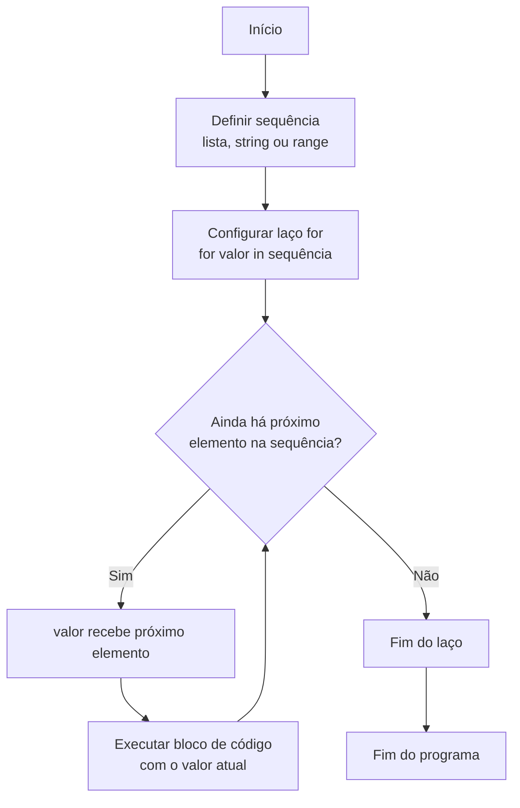

### Visão Geral

Depois de aprender a **tomar decisões** com `if`, `elif`, `else` e operadores lógicos, o próximo passo é aprender a **repetir** trechos de código sem copiar e colar. Nesta aula você vê o laço **`for`**, a função **`range()`** para gerar sequências numéricas e a ideia de **listas** como coleções ordenadas que podem ser percorridas.

### Modelo Mental

Pense em um **carrossel de itens**:

- Uma **lista** é uma fila ordenada de elementos (alunos, notas, produtos, caracteres de uma string).
*- Um laço `for` é o funcionário que, para **cada** item da fila, executa a mesma tarefa: “pega o próximo, processa, volta para o próximo...”.
- A função `range()` é uma **fábrica de números sequenciais**: você diz de onde começa, onde para (não-inclusivo) e de quantos em quantos quer avançar; ela devolve uma sequência que o `for` percorre.

Esse modelo evita o “castigo do Bart Simpson”: escrever a mesma linha de código dez, cem ou mil vezes.

### Mecânica Central

- **Lista (array unidimensional)**:

```python
vogais = ['a', 'e', 'i', 'o', 'u']

print(vogais[0])  # 'a'
print(vogais[2])  # 'i'
```

Cada posição é acessada por um **índice numérico** de `0` até `len(vogais) - 1`.

- **Laço `for` sobre uma sequência**:

```python
vogais = ['a', 'e', 'i', 'o', 'u']

for letra in vogais:
    print(f"Letra: {letra}")
```

- **`for` sobre uma string (strings também são sequências)**:

```python
frase = "Eu amo a linguagem Python"

for caractere in frase:
    print(caractere)  # inclusive espaços em branco
```

- **Função `range()`** – gera sequência numérica imutável (não pode ser alterada depois de criada):

```python
for i in range(10):
    print(i)  # 0, 1, 2, ..., 9

for i in range(2, 15):
    print(i)  # 2, 3, ..., 14

for i in range(2, 21, 2):
    print(i)  # 2, 4, 6, ..., 20 (números pares)
```

### Uso Prático

Laços `for` aparecem em praticamente todo código de dados:

- **Percorrer listas de valores**: notas de alunos, vendas diárias, temperaturas.
- **Iterar sobre caracteres** em uma string para análise de texto.
- **Gerar sequências numéricas** com `range()` para simulações, índices ou construções de tabelas.

Exemplo prático: imprimir o índice e o valor de cada nota de um aluno:

```python
notas = [7.5, 8.0, 6.3, 9.2]

for i in range(len(notas)):
    print(f"Prova {i + 1}: nota = {notas[i]}")
```

### Visual: laço `for` percorrendo uma sequência



O `for` é responsável por pegar **cada elemento** da sequência, um por vez, e executar o mesmo bloco para todos.

### Erros Comuns

- **Copiar e colar prints** em vez de usar `for`, o que dificulta manutenção.
- **Confundir parada não inclusiva de `range()`**: esperar que `range(10)` gere o número 10.
- **Tentar iterar um tipo não iterável**:

```python
frase = 123
for caractere in frase:
    print(caractere)  # TypeError: 'int' object is not iterable
```

- **Esquecer da identação** dentro do laço:

```python
for letra in vogais:
print(letra)  # Erro: precisa estar identado
```

### Visão Geral de Debugging

Para depurar laços:

- Imprima **valores intermediários** dentro do laço (`print(i, letra)`), especialmente em `range()` com três parâmetros.
- Verifique manualmente as extremidades de `range(inicio, parada, passo)` e compare com a saída esperada.
- Use `len(lista)` para confirmar se o intervalo de `range()` está alinhado ao tamanho da sequência.
- Em casos de erros de tipo, confira se o objeto realmente é **iterável** (lista, string, `range`, etc.).

### Principais Pontos

- Listas são coleções ordenadas indexadas de `0` a `len(lista) - 1`.
- O laço `for` em Python itera sobre qualquer **objeto iterável** (listas, strings, `range`, etc.).
- `range()` gera sequências numéricas com parada **não inclusiva**, o que combina perfeitamente com índices de listas.
- Usar laços de repetição reduz duplicação de código e torna seus algoritmos mais claros e fáceis de manter.

### Preparação para Prática

Antes de ir para o laboratório:

- Pegue um trecho de código em que você repetiu `print()` várias vezes e tente reescrever usando um laço `for`.
- Experimente no interpretador Python: `list(range(5))`, `list(range(2, 10))`, `list(range(2, 21, 2))` e veja as sequências geradas.
- Monte uma mini tabela que relacione `len(lista)` com os índices válidos e com `range(len(lista))`.

### Laboratório de Prática

#### 1. Castigo do Bart Simpson automatizado (Easy)

Implemente uma função que recebe uma frase e um número de repetições, e imprime a frase esse número de vezes.

```python
def escrever_castigo(frase: str, repeticoes: int) -> None:
    """
    Imprime a frase repeticoes vezes, uma por linha.
    """
    # TODO: usar um laço for com range(repeticoes)
    # para evitar copiar e colar prints.
    pass


if __name__ == "__main__":
    escrever_castigo("Eu amo Python, eu vou aprender!", 10)
```

#### 2. Relatório de caracteres de uma frase (Medium)

Implemente uma função que, dada uma frase, percorre cada caractere e monta uma **lista de linhas** descrevendo a posição e o próprio caractere.

Exemplo (entrada `"ABC"`):

- `"0: 'A'"`
- `"1: 'B'"`
- `"2: 'C'"`

```python
from typing import List


def descrever_caracteres(frase: str) -> List[str]:
    """
    Retorna uma lista de descrições 'indice: caractere' para cada
    caractere da frase.
    """
    descricoes: List[str] = []

    # TODO: usar range(len(frase)) e frase[i] para montar as descrições
    # e adicioná-las na lista 'descricoes'.

    return descricoes


if __name__ == "__main__":
    for linha in descrever_caracteres("Eu amo Python"):
        print(linha)
```

#### 3. Gerador de números pares com range (Hard)

Implemente uma função que recebe dois inteiros `inicio` e `fim` e devolve uma lista com todos os **números pares** nesse intervalo, inclusive os limites se forem pares.

Use **apenas `range()` e `for`**, sem `while`.

```python
from typing import List


def gerar_pares(inicio: int, fim: int) -> List[int]:
    """
    Gera todos os números pares entre inicio e fim (inclusive),
    usando range() e for.
    """
    pares: List[int] = []

    # TODO:
    # 1. Ajustar o primeiro valor para ser o primeiro par >= inicio.
    # 2. Usar range(inicio_par, fim + 1, 2) para percorrer apenas pares.
    # 3. Preencher a lista 'pares' com os valores gerados.

    return pares


if __name__ == "__main__":
    print(gerar_pares(2, 20))      # esperado: [2, 4, 6, ..., 20]
    print(gerar_pares(3, 15))      # esperado: [4, 6, 8, 10, 12, 14]
    print(gerar_pares(10, 10))     # esperado: [10]
```

<!-- CONCEPT_EXTRACTION
concepts:
  - id: lacos-for-range
    label: "Laços for e range em Python"
    description: "Uso do laço for em conjunto com range() para percorrer sequências numéricas de forma controlada."
  - id: listas-e-sequencias
    label: "Listas e sequências iteráveis"
    description: "Coleções ordenadas de elementos acessados por índice e percorridas com for."
  - id: iteracao
    label: "Iteração sobre coleções"
    description: "Processo de visitar cada elemento de uma sequência para aplicar uma operação."
skills:
  - id: evitar-codigo-duplicado-com-for
    label: "Evitar código duplicado usando laços for"
    verbs: ["refatorar", "simplificar", "automatizar"]
  - id: gerar-sequencias-com-range
    label: "Gerar sequências numéricas com range"
    verbs: ["gerar", "configurar", "validar"]
  - id: percorrer-listas-e-strings
    label: "Percorrer listas e strings com for"
    verbs: ["iterar", "analisar", "agrupar"]
examples:
  - id: exemplo-for-vogais
    title: "Iterando sobre uma lista de vogais"
    code: |
      vogais = ['a', 'e', 'i', 'o', 'u']
      for letra in vogais:
          print(f"Letra: {letra}")
  - id: exemplo-range-pares
    title: "Números pares com range"
    code: |
      for i in range(2, 21, 2):
          print(i)
-->

<!-- EXERCISES_JSON
[
  {
    "id": "escrever_castigo_for",
    "title": "Automatizar o castigo do Bart Simpson com for",
    "difficulty": "easy",
    "function_name": "escrever_castigo",
    "topics": ["for", "range", "laços de repetição"]
  },
  {
    "id": "descrever_caracteres_frase",
    "title": "Descrever caracteres e posições de uma frase",
    "difficulty": "medium",
    "function_name": "descrever_caracteres",
    "topics": ["for", "strings", "índices", "range"]
  },
  {
    "id": "gerar_numeros_pares_range",
    "title": "Gerar números pares em um intervalo usando range",
    "difficulty": "hard",
    "function_name": "gerar_pares",
    "topics": ["for", "range", "listas", "off-by-one"]
  }
]
-->

