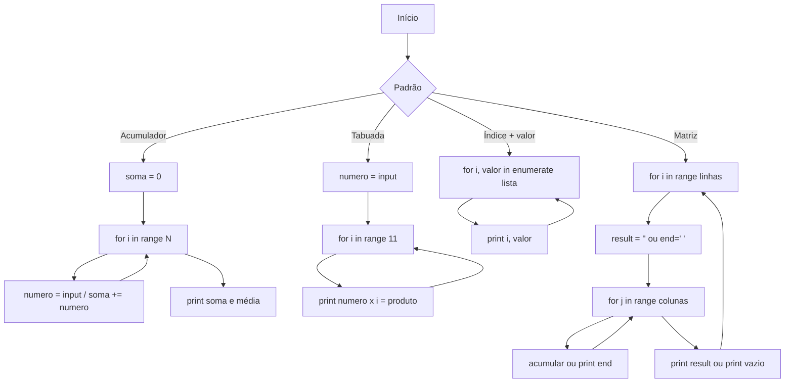

## Visão Geral do Conceito

Esta aula aplica os conceitos de **laços `for` com `range()`**, **acumuladores**, **`enumerate()`** e **loops aninhados** em problemas concretos: soma e média de vários números, tabuada, listagem indexada de uma coleção e representação de coordenadas em matriz. Além disso, introduz o **teste de mesa** como técnica de depuração manual e mostra duas formas de formatar saída em múltiplas “linhas” (acumulando string ou usando o parâmetro <mark style="background-color: #242424; padding: 2px 4px; border-radius: 3px; color: inherit;">`end`</mark> de <mark style="background-color: #242424; padding: 2px 4px; border-radius: 3px; color: inherit;">`print()`</mark>). O objetivo é consolidar o uso desses padrões em situações reais de processamento de dados e relatórios simples.

## Modelo Mental

- **Teste de mesa**: você é o “computador”; a cada linha do código, anota o valor atual das variáveis (por exemplo `soma`, `numero`, `i`). Ao final de cada iteração, sabe exatamente o estado do programa sem precisar executá-lo.
- **Acumulador**: um único “recipiente” (por exemplo `soma`) que começa com um valor neutro (0 para soma, 1 para produto) e, a cada volta do laço, é atualizado com o novo valor (por exemplo `soma += numero`).
- **Tabuada**: um único número fixo (digitado) multiplicado por uma sequência (0 a 10); o laço percorre a sequência e imprime uma linha por vez.
- **Enumerate**: em vez de você mesmo gerar índices com <mark style="background-color: #242424; padding: 2px 4px; border-radius: 3px; color: inherit;">`range(len(lista))`</mark>, a função <mark style="background-color: #242424; padding: 2px 4px; border-radius: 3px; color: inherit;">`enumerate()`</mark> entrega (índice, valor) a cada iteração.
- **Matriz (linhas × colunas)**: o laço externo percorre as linhas; o interno, as colunas. Para exibir “uma linha por vez” no console, ou você acumula os pares em uma string e dá um <mark style="background-color: #242424; padding: 2px 4px; border-radius: 3px; color: inherit;">`print(result)`</mark> ao sair do laço interno, ou usa <mark style="background-color: #242424; padding: 2px 4px; border-radius: 3px; color: inherit;">`print(..., end=' ')`</mark> dentro do interno e um <mark style="background-color: #242424; padding: 2px 4px; border-radius: 3px; color: inherit;">`print()`</mark> vazio depois para quebrar a linha.

## Mecânica Central

### Teste de mesa para soma e média

Algoritmo típico: ler 5 números, acumular em <mark style="background-color: #242424; padding: 2px 4px; border-radius: 3px; color: inherit;">`soma`</mark>, exibir soma e média. O teste de mesa descreve, por iteração, os valores de <mark style="background-color: #242424; padding: 2px 4px; border-radius: 3px; color: inherit;">`soma`</mark> e <mark style="background-color: #242424; padding: 2px 4px; border-radius: 3px; color: inherit;">`numero`</mark> e o resultado da atribuição (por exemplo “soma = 0 + 1 → 1”, “soma = 1 + 2 → 3”, …). Com entradas 1, 2, 3, 4 e 5, o resultado esperado é soma 15 e média 3,000 (três casas decimais).

### Inicialização do acumulador e +=

- O acumulador deve ser **inicializado** antes do laço. Para soma, use o elemento neutro: <mark style="background-color: #242424; padding: 2px 4px; border-radius: 3px; color: inherit;">`soma = 0`</mark>.
- <mark style="background-color: #242424; padding: 2px 4px; border-radius: 3px; color: inherit;">`soma += numero`</mark> é equivalente a <mark style="background-color: #242424; padding: 2px 4px; border-radius: 3px; color: inherit;">`soma = soma + numero`</mark>.

### Tabuada: range(11) e formatação

- Ler um inteiro <mark style="background-color: #242424; padding: 2px 4px; border-radius: 3px; color: inherit;">`numero`</mark>; exibir cabeçalho (ex.: “Tabuada do numero: 5”) e, para <mark style="background-color: #242424; padding: 2px 4px; border-radius: 3px; color: inherit;">`i`</mark> em <mark style="background-color: #242424; padding: 2px 4px; border-radius: 3px; color: inherit;">`range(11)`</mark> (0 a 10), imprimir <mark style="background-color: #242424; padding: 2px 4px; border-radius: 3px; color: inherit;">`numero * i`</mark>.
- Formatação: f-string <mark style="background-color: #242424; padding: 2px 4px; border-radius: 3px; color: inherit;">`f'{numero} x {i} = {numero*i}'`</mark> ou <mark style="background-color: #242424; padding: 2px 4px; border-radius: 3px; color: inherit;">`'{} x {} = {}'.format(numero, i, numero*i)`</mark>; <mark style="background-color: #242424; padding: 2px 4px; border-radius: 3px; color: inherit;">`\t`</mark> pode ser usado para alinhar colunas.

### Enumerate e alternativa com range(len())

- <mark style="background-color: #242424; padding: 2px 4px; border-radius: 3px; color: inherit;">`enumerate(coleção)`</mark> retorna pares (índice, valor). Uso típico: <mark style="background-color: #242424; padding: 2px 4px; border-radius: 3px; color: inherit;">`for i, fruta in enumerate(frutas):`</mark>.
- Alternativa sem <mark style="background-color: #242424; padding: 2px 4px; border-radius: 3px; color: inherit;">`enumerate`</mark>: <mark style="background-color: #242424; padding: 2px 4px; border-radius: 3px; color: inherit;">`for i in range(len(frutas)):`</mark> e acessar <mark style="background-color: #242424; padding: 2px 4px; border-radius: 3px; color: inherit;">`frutas[i]`</mark>. Usar <mark style="background-color: #242424; padding: 2px 4px; border-radius: 3px; color: inherit;">`len(frutas)`</mark> deixa o código dinâmico em relação ao tamanho da lista.

### Loops aninhados para matriz (saída por linha)

- Objetivo: exibir coordenadas <mark style="background-color: #242424; padding: 2px 4px; border-radius: 3px; color: inherit;">`(i, j)`</mark> de uma matriz 3×3, com uma linha de pares por linha do console.
- **Primeira forma**: dentro do laço externo (linhas), inicializar <mark style="background-color: #242424; padding: 2px 4px; border-radius: 3px; color: inherit;">`result = ''`</mark>; no laço interno (colunas), fazer <mark style="background-color: #242424; padding: 2px 4px; border-radius: 3px; color: inherit;">`result += f'({i},{j}) '`</mark>; ao sair do interno, <mark style="background-color: #242424; padding: 2px 4px; border-radius: 3px; color: inherit;">`print(result)`</mark>.
- **Segunda forma**: dentro do interno, <mark style="background-color: #242424; padding: 2px 4px; border-radius: 3px; color: inherit;">`print(f'({i},{j})', end=' ')`</mark>; após o interno, <mark style="background-color: #242424; padding: 2px 4px; border-radius: 3px; color: inherit;">`print()`</mark> para quebrar a linha. O parâmetro <mark style="background-color: #242424; padding: 2px 4px; border-radius: 3px; color: inherit;">`end`</mark> de <mark style="background-color: #242424; padding: 2px 4px; border-radius: 3px; color: inherit;">`print()`</mark> substitui o caractere padrão de fim de linha (<mark style="background-color: #242424; padding: 2px 4px; border-radius: 3px; color: inherit;">`\n`</mark>) pelo valor passado (por exemplo espaço ou string vazia).

Fluxo dos padrões desta aula:



## Uso Prático

### Soma e média de cinco números (com teste de mesa)

Valores a serem digitados: 1, 2, 3, 4 e 5. Resultado esperado: soma 15, média 3,000.

```python
# Variável para acumular os valores digitados
soma = 0

for i in range(5):
    numero = int(input(f'Digite o {i + 1}º numero: '))
    soma += numero  # soma = soma + numero

print(f'Soma dos numeros digitados eh: {soma}')
print(f'A media dos numeros digitados eh: {soma/5:.3f}')
```

Teste de mesa (resumo): 1ª iteração soma 0, numero 1 → soma = 1; 2ª soma 1, numero 2 → 3; 3ª soma 3, numero 3 → 6; 4ª soma 6, numero 4 → 10; 5ª soma 10, numero 5 → 15. Saída: soma 15, média 3,000.

### Tabuada de um número (0 a 10)

Exemplo: digitando 5, exibir “Tabuada do numero: 5” e as linhas 5×0=0 até 5×10=50.

```python
numero = int(input('Digite um numero: '))
print(f'Tabuada do numero: {numero}\n')

for i in range(11):
    print(f'{numero} x {i} = {numero * i}')
```

Alternativa com <mark style="background-color: #242424; padding: 2px 4px; border-radius: 3px; color: inherit;">`.format()`</mark>: <mark style="background-color: #242424; padding: 2px 4px; border-radius: 3px; color: inherit;">`print('{} x {} \t= {}'.format(numero, i, numero * i))`</mark>.

### Lista com índice: enumerate e range(len)

Dada a coleção <mark style="background-color: #242424; padding: 2px 4px; border-radius: 3px; color: inherit;">`['maca', 'uva', 'laranja', 'ata']`</mark>, saída desejada: “fruta 0: maca”, “fruta 1: uva”, etc.

**Com enumerate:**

```python
frutas = ['maca', 'uva', 'laranja', 'ata']

for i, fruta in enumerate(frutas):
    print(f'fruta {i}: {fruta}')
```

**Com range(len) (dinâmico):**

```python
frutas = ['maca', 'uva', 'laranja', 'ata']

for i in range(len(frutas)):
    print(f'fruta {i}: {frutas[i]}')
```

### Matriz 3×3: coordenadas (i, j) por linha

Saída desejada: primeira linha “(0,0) (0,1) (0,2)”, segunda “(1,0) (1,1) (1,2)”, terceira “(2,0) (2,1) (2,2)”.

**Primeira forma — acumulando string por linha:**

```python
for i in range(3):
    result = ''
    for j in range(3):
        result += f'({i}, {j}) '
    print(result)
```

**Segunda forma — print com end e quebra ao final da linha:**

```python
for i in range(3):
    for j in range(3):
        print(f'({i},{j})', end=' ')
    print()
```

## Erros Comuns

- **Não inicializar o acumulador**: usar <mark style="background-color: #242424; padding: 2px 4px; border-radius: 3px; color: inherit;">`soma += numero`</mark> sem antes definir <mark style="background-color: #242424; padding: 2px 4px; border-radius: 3px; color: inherit;">`soma = 0`</mark> gera <mark style="background-color: #242424; padding: 2px 4px; border-radius: 3px; color: inherit;">`NameError`</mark>.
- **Média com divisor errado**: usar o último índice (por exemplo 4) em vez da quantidade de elementos (5) na divisão da média.
- **range(10) quando se quer 0 a 10**: <mark style="background-color: #242424; padding: 2px 4px; border-radius: 3px; color: inherit;">`range(11)`</mark> gera 0..10; <mark style="background-color: #242424; padding: 2px 4px; border-radius: 3px; color: inherit;">`range(10)`</mark> para em 9.
- **.format() com %d**: ao usar <mark style="background-color: #242424; padding: 2px 4px; border-radius: 3px; color: inherit;">`.format()`</mark>, os placeholders são <mark style="background-color: #242424; padding: 2px 4px; border-radius: 3px; color: inherit;">`{}`</mark>, não <mark style="background-color: #242424; padding: 2px 4px; border-radius: 3px; color: inherit;">`%d`</mark> (que é da formatação com <mark style="background-color: #242424; padding: 2px 4px; border-radius: 3px; color: inherit;">`%`</mark>).
- **Esquecer o print() após o laço interno**: ao usar <mark style="background-color: #242424; padding: 2px 4px; border-radius: 3px; color: inherit;">`print(..., end=' ')`</mark>, sem um <mark style="background-color: #242424; padding: 2px 4px; border-radius: 3px; color: inherit;">`print()`</mark> vazio depois do interno todas as coordenadas saem na mesma linha.

## Visão Geral de Debugging

- **Teste de mesa**: anote em papel ou comentário os valores de <mark style="background-color: #242424; padding: 2px 4px; border-radius: 3px; color: inherit;">`soma`</mark>, <mark style="background-color: #242424; padding: 2px 4px; border-radius: 3px; color: inherit;">`numero`</mark> e <mark style="background-color: #242424; padding: 2px 4px; border-radius: 3px; color: inherit;">`i`</mark> a cada iteração e confira o resultado final (soma 15, média 3,0 para 1,2,3,4,5).
- **Impressões temporárias**: dentro do laço, <mark style="background-color: #242424; padding: 2px 4px; border-radius: 3px; color: inherit;">`print(i, numero, soma)`</mark> para inspecionar o estado.
- **Enumerate**: conferir a estrutura com <mark style="background-color: #242424; padding: 2px 4px; border-radius: 3px; color: inherit;">`print(list(enumerate(frutas)))`</mark> (lista de tuplas (índice, valor)).
- **Loops aninhados**: reduzir para <mark style="background-color: #242424; padding: 2px 4px; border-radius: 3px; color: inherit;">`range(2)`</mark> e observar a ordem dos pares (0,0), (0,1), (1,0), (1,1) para entender quem é linha e quem é coluna.

## Principais Pontos

- Teste de mesa é executar o algoritmo “à mão”, anotando variáveis a cada passo; ajuda a validar lógica e a encontrar erros de acumulador ou contagem.
- Acumulador deve ser inicializado (0 para soma) antes do laço; <mark style="background-color: #242424; padding: 2px 4px; border-radius: 3px; color: inherit;">`soma += numero`</mark> é a forma idiomática de atualizar.
- Tabuada de 0 a 10 usa <mark style="background-color: #242424; padding: 2px 4px; border-radius: 3px; color: inherit;">`range(11)`</mark>; saída pode ser f-string ou <mark style="background-color: #242424; padding: 2px 4px; border-radius: 3px; color: inherit;">`.format()`</mark>.
- <mark style="background-color: #242424; padding: 2px 4px; border-radius: 3px; color: inherit;">`enumerate(coleção)`</mark> fornece (índice, valor); alternativa é <mark style="background-color: #242424; padding: 2px 4px; border-radius: 3px; color: inherit;">`range(len(coleção))`</mark> e acesso por índice.
- Em matriz, laço externo = linhas, interno = colunas; para uma linha por linha no console: acumular em string e <mark style="background-color: #242424; padding: 2px 4px; border-radius: 3px; color: inherit;">`print(result)`</mark> ou <mark style="background-color: #242424; padding: 2px 4px; border-radius: 3px; color: inherit;">`print(..., end=' ')`</mark> + <mark style="background-color: #242424; padding: 2px 4px; border-radius: 3px; color: inherit;">`print()`</mark>.

## Preparação para Prática

Antes do laboratório:

- Fazer um teste de mesa completo para o algoritmo de soma de 3 números (por exemplo 10, 20, 30) e conferir soma 60 e média 20,0.
- Escrever a tabuada de 7 usando <mark style="background-color: #242424; padding: 2px 4px; border-radius: 3px; color: inherit;">`range(11)`</mark> e f-string.
- Percorrer uma lista de nomes com <mark style="background-color: #242424; padding: 2px 4px; border-radius: 3px; color: inherit;">`enumerate()`</mark> e imprimir “posição N: nome”.
- Desenhar uma grade 2×2 e listar a ordem dos pares <mark style="background-color: #242424; padding: 2px 4px; border-radius: 3px; color: inherit;">`(i, j)`</mark> como no loop aninhado.

## Laboratório de Prática

### 1. Teste de mesa e soma de N notas (Easy)

Implemente um programa que lê um inteiro <mark style="background-color: #242424; padding: 2px 4px; border-radius: 3px; color: inherit;">`n`</mark>, depois <mark style="background-color: #242424; padding: 2px 4px; border-radius: 3px; color: inherit;">`n`</mark> notas (float), acumula a soma e exibe a média com duas casas decimais. No código, inclua um comentário com um mini teste de mesa para n=3 e notas 8.0, 7.5 e 9.0.

```python
def ler_notas_e_media(qtd: int) -> float:
    """
    Lê 'qtd' notas do usuário, acumula a soma e retorna a média.
    """
    soma = 0.0
    # TODO: for i in range(qtd), ler float(input(...)), acumular em soma
    # TODO: retornar soma / qtd (ou 0.0 se qtd == 0)
    return 0.0


if __name__ == "__main__":
    n = int(input("Quantas notas? "))
    media = ler_notas_e_media(n)
    print(f"Media: {media:.2f}")
```

### 2. Tabuada formatada com cabeçalho (Medium)

Implemente uma função que recebe um inteiro <mark style="background-color: #242424; padding: 2px 4px; border-radius: 3px; color: inherit;">`numero`</mark> e imprime a tabuada de 0 a 10 com um cabeçalho “Tabuada do numero: X” e uma linha em branco abaixo. Use f-string e <mark style="background-color: #242424; padding: 2px 4px; border-radius: 3px; color: inherit;">`\t`</mark> para alinhar a coluna do resultado.

```python
def imprimir_tabuada(numero: int) -> None:
    """Imprime a tabuada de 'numero' de 0 a 10 com cabeçalho."""
    # TODO: print cabeçalho com \n
    # TODO: for i in range(11): print numero x i = produto (com \t)
    pass


if __name__ == "__main__":
    n = int(input("Digite um numero para a tabuada: "))
    imprimir_tabuada(n)
```

### 3. Lista indexada e matriz M×N (Hard)

Implemente duas funções: (1) <mark style="background-color: #242424; padding: 2px 4px; border-radius: 3px; color: inherit;">`listar_com_indice(itens: list)`</mark> que imprime cada elemento no formato “indice: valor” usando <mark style="background-color: #242424; padding: 2px 4px; border-radius: 3px; color: inherit;">`enumerate()`</mark>; (2) <mark style="background-color: #242424; padding: 2px 4px; border-radius: 3px; color: inherit;">`imprimir_matriz_coordenadas(linhas: int, colunas: int)`</mark> que imprime as coordenadas <mark style="background-color: #242424; padding: 2px 4px; border-radius: 3px; color: inherit;">`(i,j)`</mark> com uma linha do console por linha da matriz, usando <mark style="background-color: #242424; padding: 2px 4px; border-radius: 3px; color: inherit;">`print(..., end=' ')`</mark> e <mark style="background-color: #242424; padding: 2px 4px; border-radius: 3px; color: inherit;">`print()`</mark>.

```python
def listar_com_indice(itens: list) -> None:
    """Imprime cada item como 'indice: valor' usando enumerate."""
    # TODO: for i, valor in enumerate(itens): print(f'{i}: {valor}')
    pass


def imprimir_matriz_coordenadas(linhas: int, colunas: int) -> None:
    """Imprime coordenadas (i,j) com uma linha do console por linha da matriz."""
    # TODO: for i in range(linhas): for j in range(colunas): print (i,j) end=' '; depois print()
    pass


if __name__ == "__main__":
    listar_com_indice(["maca", "uva", "laranja"])
    imprimir_matriz_coordenadas(2, 3)
```

<!-- CONCEPT_EXTRACTION
concepts:
  - teste de mesa
  - acumulador e inicialização
  - operador +=
  - tabuada com range(11)
  - enumerate e range(len)
  - loops aninhados (linha e coluna)
  - print(end=) e concatenação por linha
skills:
  - Fazer teste de mesa para algoritmos com laço e acumulador
  - Implementar tabuada com formatação (f-string ou .format)
  - Iterar listas com enumerate e com range(len)
  - Gerar saída por linha em matriz com result ou end=
examples:
  - soma-media-cinco-numeros-teste-mesa
  - tabuada-range-11-format
  - enumerate-frutas-vs-range-len
  - matriz-3x3-result-ou-end
-->

<!-- EXERCISES_JSON
[
  {
    "id": "aula-13-ler-notas-media",
    "slug": "aula-13-ler-notas-media",
    "difficulty": "easy",
    "title": "Ler N notas e calcular média com teste de mesa",
    "discipline": "python",
    "editorLanguage": "python",
    "tags": ["python", "acumuladores", "range", "teste de mesa"],
    "summary": "Implementar leitura de N notas, acumular soma e retornar média; incluir comentário com teste de mesa."
  },
  {
    "id": "aula-13-tabuada-formatada",
    "slug": "aula-13-tabuada-formatada",
    "difficulty": "medium",
    "title": "Tabuada formatada com cabeçalho",
    "discipline": "python",
    "editorLanguage": "python",
    "tags": ["python", "range", "formatação", "tabuada"],
    "summary": "Imprimir tabuada de 0 a 10 com cabeçalho e alinhamento usando f-string e \\t."
  },
  {
    "id": "aula-13-listar-indice-matriz",
    "slug": "aula-13-listar-indice-matriz",
    "difficulty": "hard",
    "title": "Listar com índice (enumerate) e coordenadas de matriz",
    "discipline": "python",
    "editorLanguage": "python",
    "tags": ["python", "enumerate", "loops aninhados", "matriz"],
    "summary": "Implementar listar_com_indice com enumerate e imprimir_matriz_coordenadas com print(end=)."
  }
]
-->
