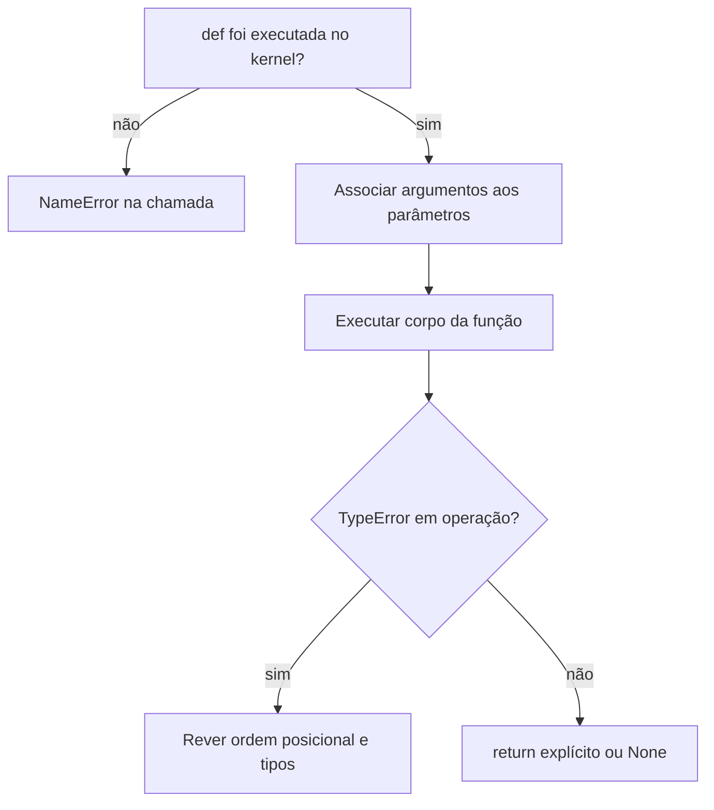

## Visão Geral do Conceito

Funções agrupam trechos de código reutilizáveis, com responsabilidades claras: você nomeia uma operação, define entradas (<mark style="background-color: #242424; padding: 2px 4px; border-radius: 3px; color: inherit;">`parâmetros`</mark>) e pode devolver um resultado (<mark style="background-color: #242424; padding: 2px 4px; border-radius: 3px; color: inherit;">`return`</mark>) ou só produzir efeitos (por exemplo <mark style="background-color: #242424; padding: 2px 4px; border-radius: 3px; color: inherit;">`print`</mark>). Em projetos de dados e automação, funções aparecem em todo lugar: normalizar colunas, validar JSON, formatar logs, aplicar regras de negócio.

Você já usa <mark style="background-color: #242424; padding: 2px 4px; border-radius: 3px; color: inherit;">**funções integradas**</mark> (<mark style="background-color: #242424; padding: 2px 4px; border-radius: 3px; color: inherit;">`built-ins`</mark>) como <mark style="background-color: #242424; padding: 2px 4px; border-radius: 3px; color: inherit;">`print()`</mark>, <mark style="background-color: #242424; padding: 2px 4px; border-radius: 3px; color: inherit;">`input()`</mark>, <mark style="background-color: #242424; padding: 2px 4px; border-radius: 3px; color: inherit;">`int()`</mark>, <mark style="background-color: #242424; padding: 2px 4px; border-radius: 3px; color: inherit;">`float()`</mark>, <mark style="background-color: #242424; padding: 2px 4px; border-radius: 3px; color: inherit;">`type()`</mark> e <mark style="background-color: #242424; padding: 2px 4px; border-radius: 3px; color: inherit;">`len()`</mark>. Esta lição mostra como definir as suas com <mark style="background-color: #242424; padding: 2px 4px; border-radius: 3px; color: inherit;">`def`</mark>, documentar com <mark style="background-color: #242424; padding: 2px 4px; border-radius: 3px; color: inherit;">**docstrings**</mark> e explorar APIs de bibliotecas com <mark style="background-color: #242424; padding: 2px 4px; border-radius: 3px; color: inherit;">`help()`</mark>, alinhado ao [tutorial oficial sobre definição de funções](https://docs.python.org/3/tutorial/controlflow.html#defining-functions) e ao [PEP 8](https://peps.python.org/pep-0008/).

## Modelo Mental

- **Caixa com rótulos na tampa:** a assinatura <mark style="background-color: #242424; padding: 2px 4px; border-radius: 3px; color: inherit;">`def processar(a, b)`</mark> é a “tampa” com os nomes dos slots. Na chamada, os valores que você encaixa nesses slots são os <mark style="background-color: #242424; padding: 2px 4px; border-radius: 3px; color: inherit;">`argumentos`</mark>. Argumentos **posicionais** preenchem da esquerda para a direita; **nomeados** (<mark style="background-color: #242424; padding: 2px 4px; border-radius: 3px; color: inherit;">`b=2, a=1`</mark>) dizem explicitamente qual slot recebe qual valor.
- **Docstring como manual interno:** a primeira string literal após o <mark style="background-color: #242424; padding: 2px 4px; border-radius: 3px; color: inherit;">`def`</mark> vira documentação da função; <mark style="background-color: #242424; padding: 2px 4px; border-radius: 3px; color: inherit;">`help(minha_funcao)`</mark> mostra esse texto no console.
- **Bibliotecas profissionais:** em pacotes como scikit-learn, docstrings seguem estilos estruturados (por exemplo seções *Parameters* e *Returns* no estilo NumPy). Você não precisa memorizar o formato; precisa saber **onde** ler (<mark style="background-color: #242424; padding: 2px 4px; border-radius: 3px; color: inherit;">`help()`</mark>, site da lib).

## Mecânica Central

### Sintaxe básica

```python
def nome_da_funcao(parametro1, parametro2):
    """Uma linha que resume o efeito ou contrato da função."""
    # corpo
    return resultado  # opcional
```

- <mark style="background-color: #242424; padding: 2px 4px; border-radius: 3px; color: inherit;">`def`</mark> associa o nome ao objeto função no namespace atual (módulo ou sessão do notebook).
- Sem <mark style="background-color: #242424; padding: 2px 4px; border-radius: 3px; color: inherit;">`return`</mark> explícito, a função devolve <mark style="background-color: #242424; padding: 2px 4px; border-radius: 3px; color: inherit;">`None`</mark>.

### Parâmetros vs argumentos

> **Regra:** na **definição**, lista-se <mark style="background-color: #242424; padding: 2px 4px; border-radius: 3px; color: inherit;">`parâmetros`</mark> (nomes formais). Na **chamada**, passam-se <mark style="background-color: #242424; padding: 2px 4px; border-radius: 3px; color: inherit;">`argumentos`</mark> (valores reais).

Se a ordem posicional não bater com a intenção (por exemplo trocar altura e nome em um cálculo numérico), o Python ainda “aceita” enquanto os tipos permitirem operações — e o bug aparece tarde, às vezes como <mark style="background-color: #242424; padding: 2px 4px; border-radius: 3px; color: inherit;">`TypeError`</mark> ao aplicar operador a tipos errados.

### Docstrings e `help()`

Docstrings próprias podem ser simples (como na aula). Em código de biblioteca, é comum ver blocos maiores com seções; o mecanismo é o mesmo: texto armazenado em <mark style="background-color: #242424; padding: 2px 4px; border-radius: 3px; color: inherit;">`__doc__`</mark> e exibido por <mark style="background-color: #242424; padding: 2px 4px; border-radius: 3px; color: inherit;">`help(objeto)`</mark>.

Exemplo de uso pedagógico com API de terceiros: após <mark style="background-color: #242424; padding: 2px 4px; border-radius: 3px; color: inherit;">`from sklearn.base import ClusterMixin`</mark>, <mark style="background-color: #242424; padding: 2px 4px; border-radius: 3px; color: inherit;">`help(ClusterMixin.fit_predict)`</mark> mostra assinatura e documentação do método — útil quando o nome do parâmetro explica o contrato (por exemplo <mark style="background-color: #242424; padding: 2px 4px; border-radius: 3px; color: inherit;">`X`</mark> como dados de entrada).

### Builtins recorrentes neste módulo

Consulte a [lista oficial de funções integradas](https://docs.python.org/3/library/functions.html) quando precisar. As que mais aparecem no início da trilha:

| Função | Papel curto |
|--------|----------------|
| <mark style="background-color: #242424; padding: 2px 4px; border-radius: 3px; color: inherit;">`print()`</mark> | Enviar texto ao fluxo de saída; parâmetros <mark style="background-color: #242424; padding: 2px 4px; border-radius: 3px; color: inherit;">`sep`</mark>, <mark style="background-color: #242424; padding: 2px 4px; border-radius: 3px; color: inherit;">`end`</mark> controlam separadores e fim de linha |
| <mark style="background-color: #242424; padding: 2px 4px; border-radius: 3px; color: inherit;">`input()`</mark> | Ler uma linha como <mark style="background-color: #242424; padding: 2px 4px; border-radius: 3px; color: inherit;">`str`</mark> |
| <mark style="background-color: #242424; padding: 2px 4px; border-radius: 3px; color: inherit;">`int()`</mark> / <mark style="background-color: #242424; padding: 2px 4px; border-radius: 3px; color: inherit;">`float()`</mark> | Converter strings numéricas para números |
| <mark style="background-color: #242424; padding: 2px 4px; border-radius: 3px; color: inherit;">`type()`</mark> | Informar o tipo do objeto |
| <mark style="background-color: #242424; padding: 2px 4px; border-radius: 3px; color: inherit;">`len()`</mark> | Tamanho de sequências (ex.: caracteres em uma string) |

### Boas práticas (PEP 8 e aula)

- Nomes de função em <mark style="background-color: #242424; padding: 2px 4px; border-radius: 3px; color: inherit;">`snake_case`</mark>, preferindo **verbos** que descrevem a ação (<mark style="background-color: #242424; padding: 2px 4px; border-radius: 3px; color: inherit;">`calcular_`</mark>, <mark style="background-color: #242424; padding: 2px 4px; border-radius: 3px; color: inherit;">`formatar_`</mark>, <mark style="background-color: #242424; padding: 2px 4px; border-radius: 3px; color: inherit;">`validar_`</mark>).
- Função **pequena e coesa**: uma responsabilidade clara; várias etapas podem virar várias funções chamadas em sequência.
- Incluir docstring no código que outras pessoas (ou você no mês seguinte) vão reutilizar.

Fluxo: definição no ambiente → chamada → associação argumento–parâmetro → execução do corpo → valor de retorno (ou <mark style="background-color: #242424; padding: 2px 4px; border-radius: 3px; color: inherit;">`None`</mark>).



## Uso Prático

### Função sem parâmetros e necessidade de “executar a definição”

Em notebooks, só existe o que já foi executado nesta sessão do kernel.

```python
def saudacao() -> None:
    """Imprime uma saudação fixa."""
    print("Olá — função definida e carregada no kernel.")


saudacao()
```

Se você escrever a célula da <mark style="background-color: #242424; padding: 2px 4px; border-radius: 3px; color: inherit;">`def`</mark> mas não rodá-la, a célula seguinte que chama o nome será uma <mark style="background-color: #242424; padding: 2px 4px; border-radius: 3px; color: inherit;">`NameError`</mark>.

### Parâmetros, docstring e `help` em função própria

```python
def somar_dois_valores(x: float, y: float) -> None:
    """Exibe a soma de dois números (exemplo didático)."""
    soma = x + y
    print(f"Entradas {x} e {y}; soma = {soma}")


somar_dois_valores(1, 2)
# help(somar_dois_valores)  # descomente no notebook para ver a docstring
```

### Quando a ordem posicional quebra o cálculo

Cenário: função com <mark style="background-color: #242424; padding: 2px 4px; border-radius: 3px; color: inherit;">`nome`</mark>, <mark style="background-color: #242424; padding: 2px 4px; border-radius: 3px; color: inherit;">`idade`</mark>, <mark style="background-color: #242424; padding: 2px 4px; border-radius: 3px; color: inherit;">`altura_m`</mark> e <mark style="background-color: #242424; padding: 2px 4px; border-radius: 3px; color: inherit;">`peso_kg`</mark>. Se você passar só por posição na ordem errada, um texto pode cair no parâmetro que deveria ser número e o erro surge em <mark style="background-color: #242424; padding: 2px 4px; border-radius: 3px; color: inherit;">`**`</mark> ou na divisão.

```python
def imc_preview(nome: str, idade: int, altura_m: float, peso_kg: float) -> float:
    """Retorna IMC (peso / altura²); altura em metros."""
    return peso_kg / (altura_m**2)


nome, idade, altura_m, peso_kg = "Ana", 30, 1.70, 72.0

# Errado (não rode): imc_preview(idade, peso_kg, nome, altura_m)  → TypeError em altura_m ** 2

# Certo: argumentos nomeados eliminam ambiguidade de ordem
print(round(imc_preview(nome=nome, idade=idade, altura_m=altura_m, peso_kg=peso_kg), 2))
```

> **Regra:** depois de <mark style="background-color: #242424; padding: 2px 4px; border-radius: 3px; color: inherit;">`input()`</mark>, converta com <mark style="background-color: #242424; padding: 2px 4px; border-radius: 3px; color: inherit;">`int()`</mark> ou <mark style="background-color: #242424; padding: 2px 4px; border-radius: 3px; color: inherit;">`float()`</mark> e chame funções de domínio com **argumentos nomeados** quando houver mais de dois parâmetros facilmente confundíveis.

### Explorar documentação de builtin

```python
# help(print)
```

Mostra assinatura completa (<mark style="background-color: #242424; padding: 2px 4px; border-radius: 3px; color: inherit;">`*args`</mark>, <mark style="background-color: #242424; padding: 2px 4px; border-radius: 3px; color: inherit;">`sep`</mark>, <mark style="background-color: #242424; padding: 2px 4px; border-radius: 3px; color: inherit;">`end`</mark>, <mark style="background-color: #242424; padding: 2px 4px; border-radius: 3px; color: inherit;">`file`</mark>, <mark style="background-color: #242424; padding: 2px 4px; border-radius: 3px; color: inherit;">`flush`</mark>) — útil para logs formatados e saída sem quebra de linha.

**Não coberto no material da aula 14 em profundidade:** valores padrão de parâmetro, <mark style="background-color: #242424; padding: 2px 4px; border-radius: 3px; color: inherit;">`*args`</mark> / <mark style="background-color: #242424; padding: 2px 4px; border-radius: 3px; color: inherit;">`**kwargs`</mark>, anotações de tipo avançadas. Para aprofundar, seguir a seção [“More on Defining Functions”](https://docs.python.org/3/tutorial/controlflow.html#more-on-defining-functions) do tutorial.

## Erros Comuns

- **<mark style="background-color: #242424; padding: 2px 4px; border-radius: 3px; color: inherit;">`NameError: name 'f' is not defined`</mark>:** célula com <mark style="background-color: #242424; padding: 2px 4px; border-radius: 3px; color: inherit;">`def f...`</mark> não foi executada, ou nome digitado diferente do definido.
- **Ordem posicional trocada com tipos “compatíveis” até certo ponto:** o programa imprime lixo (por exemplo nome na variável que era idade) e só falha na linha do cálculo — sintoma de desalinhamento semântico, não só de sintaxe.
- **<mark style="background-color: #242424; padding: 2px 4px; border-radius: 3px; color: inherit;">`TypeError: unsupported operand type(s) for **`</mark> (ou similar):** operação numérica recebeu <mark style="background-color: #242424; padding: 2px 4px; border-radius: 3px; color: inherit;">`str`</mark> ou outro tipo indevido; traceback aponta a expressão — rastreie qual argumento ficou em qual parâmetro.
- **Esquecer que <mark style="background-color: #242424; padding: 2px 4px; border-radius: 3px; color: inherit;">`input()`</mark> devolve string:** usar o valor em conta sem <mark style="background-color: #242424; padding: 2px 4px; border-radius: 3px; color: inherit;">`float()`</mark>/<mark style="background-color: #242424; padding: 2px 4px; border-radius: 3px; color: inherit;">`int()`</mark> antes de funções que esperam número.

## Visão Geral de Debugging

1. Leia a **última linha** do traceback (tipo da exceção e mensagem).
2. Suba até a **primeira linha do seu código** (não da biblioteca padrão): é onde a hipótese mais provável está.
3. Para funções: confira **assinatura** com <mark style="background-color: #242424; padding: 2px 4px; border-radius: 3px; color: inherit;">`help(minha_funcao)`</mark> ou o cabeçalho da <mark style="background-color: #242424; padding: 2px 4px; border-radius: 3px; color: inherit;">`def`</mark>.
4. Insira <mark style="background-color: #242424; padding: 2px 4px; border-radius: 3px; color: inherit;">`print(repr(...))`</mark> ou use o depurador no VS Code/Cursor para ver **tipo e valor** de cada parâmetro na entrada da função.
5. Em notebook: “Kernel não viu a def” é causa número um de <mark style="background-color: #242424; padding: 2px 4px; border-radius: 3px; color: inherit;">`NameError`</mark> — rode de cima para baixo ou use “Run All”.

## Principais Pontos

- <mark style="background-color: #242424; padding: 2px 4px; border-radius: 3px; color: inherit;">`def`</mark> define; **chamar** é usar o nome seguido de <mark style="background-color: #242424; padding: 2px 4px; border-radius: 3px; color: inherit;">`()`</mark> com argumentos.
- Parâmetros na definição; argumentos na chamada; nomeados reduzem troca de ordem.
- Docstrings alimentam <mark style="background-color: #242424; padding: 2px 4px; border-radius: 3px; color: inherit;">`help()`</mark>; bibliotecas reais têm docstrings longas e padronizadas.
- Builtins cobrem I/O básico, conversão, tipo e tamanho — sempre há documentação oficial.
- PEP 8: <mark style="background-color: #242424; padding: 2px 4px; border-radius: 3px; color: inherit;">`snake_case`</mark>, verbos, funções coesas.

## Preparação para Prática

Você deve ser capaz de: criar funções com docstring; chamar com posicionais e nomeados; usar <mark style="background-color: #242424; padding: 2px 4px; border-radius: 3px; color: inherit;">`help()`</mark> em função própria e em builtin; explicar um <mark style="background-color: #242424; padding: 2px 4px; border-radius: 3px; color: inherit;">`NameError`</mark> em notebook por ordem de execução.

## Laboratório de Prática

### 1. Linha de log padronizada (Easy)

Implemente o corpo de <mark style="background-color: #242424; padding: 2px 4px; border-radius: 3px; color: inherit;">`formatar_linha_log`</mark> para retornar no formato exato <mark style="background-color: #242424; padding: 2px 4px; border-radius: 3px; color: inherit;">`[NIVEL] modulo | mensagem`</mark> (espaço após o nível, pipe com um espaço de cada lado). Inclua docstring descrevendo parâmetros em uma linha.

```python
def formatar_linha_log(nivel: str, modulo: str, mensagem: str) -> str:
    """Retorna uma linha no formato '[NIVEL] modulo | mensagem'."""
    # TODO: retornar f-string no formato [NIVEL] modulo | mensagem
    return ""


if __name__ == "__main__":
    print(formatar_linha_log("INFO", "ingestao_csv", "arquivo recebido"))
    print(formatar_linha_log("ERRO", "api_pedidos", "timeout após 30s"))
```

### 2. Classificação de promoção com argumentos nomeados (Medium)

Complete a lógica: se <mark style="background-color: #242424; padding: 2px 4px; border-radius: 3px; color: inherit;">`preco_atual <= 0.8 * preco_original`</mark> retorne <mark style="background-color: #242424; padding: 2px 4px; border-radius: 3px; color: inherit;">`"promocao_forte"`</mark>; se <mark style="background-color: #242424; padding: 2px 4px; border-radius: 3px; color: inherit;">`<= 0.95 * preco_original`</mark> retorne <mark style="background-color: #242424; padding: 2px 4px; border-radius: 3px; color: inherit;">`"promocao_leve"`</mark>; senão <mark style="background-color: #242424; padding: 2px 4px; border-radius: 3px; color: inherit;">`"preco_normal"`</mark>. O bloco <mark style="background-color: #242424; padding: 2px 4px; border-radius: 3px; color: inherit;">`if __name__`</mark> já mostra chamada **só com argumentos nomeados** (ordem diferente da assinatura).

```python
def classificar_faixa_preco(preco_original: float, preco_atual: float, sku: str) -> str:
    """Classifica desconto relativo ao preço original de um SKU."""
    # TODO: implementar comparações com 0.8 e 0.95
    return "preco_normal"


if __name__ == "__main__":
    rotulo = classificar_faixa_preco(
        sku="SKU-9921",
        preco_atual=77.0,
        preco_original=100.0,
    )
    print(rotulo)
```

### 3. Pedido JSON: função auxiliar + resumo (Hard)

Separe responsabilidades: <mark style="background-color: #242424; padding: 2px 4px; border-radius: 3px; color: inherit;">`total_unidades`</mark> soma o campo <mark style="background-color: #242424; padding: 2px 4px; border-radius: 3px; color: inherit;">`quantidade`</mark> de cada item em <mark style="background-color: #242424; padding: 2px 4px; border-radius: 3px; color: inherit;">`payload["itens"]`</mark>; <mark style="background-color: #242424; padding: 2px 4px; border-radius: 3px; color: inherit;">`resumo_pedido`</mark> usa essa função e retorna a string <mark style="background-color: #242424; padding: 2px 4px; border-radius: 3px; color: inherit;">`Pedido {numero}: {total} unidades`</mark>.

```python
def total_unidades(payload: dict) -> int:
    """Soma quantidade de todos os itens do pedido."""
    # TODO: iterar payload['itens'], acumular item['quantidade']
    return 0


def resumo_pedido(numero: str, payload: dict) -> str:
    """Texto resumido para painel operacional."""
    # TODO: usar total_unidades e f-string pedida
    return f"Pedido {numero}: 0 unidades"


if __name__ == "__main__":
    pedido_api = {
        "itens": [
            {"sku": "A1", "quantidade": 2},
            {"sku": "B7", "quantidade": 5},
        ]
    }
    print(resumo_pedido("P-4401", pedido_api))
```

<!-- CONCEPT_EXTRACTION
concepts:
  - def e chamada de função
  - parâmetros formais vs argumentos
  - argumentos posicionais e nomeados
  - docstrings e help()
  - builtins print input int float type len
  - NameError em notebook
  - TypeError por ordem/tipo de argumentos
  - PEP 8 snake_case e verbos
skills:
  - Definir funções coesas com docstring
  - Chamar funções com argumentos nomeados após input/conversão
  - Inspecionar funções com help() e ler documentação de bibliotecas
  - Separar responsabilidades em funções auxiliares
examples:
  - saudacao-sem-parametro-notebook
  - somar-dois-valores-help
  - metrica-ordem-posicional-vs-nomeado
  - sklearn-fit-predict-help-contexto
-->

<!-- EXERCISES_JSON
[
  {
    "id": "aula-14-formatar-linha-log",
    "slug": "aula-14-formatar-linha-log",
    "difficulty": "easy",
    "title": "Formatar linha de log com docstring",
    "discipline": "python",
    "editorLanguage": "python",
    "tags": ["python", "funções", "f-strings", "docstrings"],
    "summary": "Implementar formatar_linha_log e docstring para padrão [NIVEL] modulo | mensagem."
  },
  {
    "id": "aula-14-classificar-faixa-preco",
    "slug": "aula-14-classificar-faixa-preco",
    "difficulty": "medium",
    "title": "Classificar faixa de preço com kwargs",
    "discipline": "python",
    "editorLanguage": "python",
    "tags": ["python", "funções", "argumentos nomeados", "negócio"],
    "summary": "Completar classificar_faixa_preco e usar chamada só com argumentos nomeados."
  },
  {
    "id": "aula-14-resumo-pedido-json",
    "slug": "aula-14-resumo-pedido-json",
    "difficulty": "hard",
    "title": "Total de unidades e resumo de pedido (duas funções)",
    "discipline": "python",
    "editorLanguage": "python",
    "tags": ["python", "funções", "dict", "integração"],
    "summary": "Implementar total_unidades e resumo_pedido a partir de payload estilo API."
  }
]
-->
