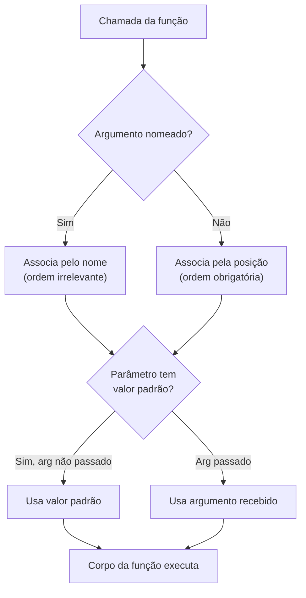

## Visão Geral do Conceito

Funções em Python não são apenas blocos de código reutilizáveis: elas comunicam valores de volta para quem as chamou. O mecanismo de **retorno** (<mark style="background-color: #242424; padding: 2px 4px; border-radius: 3px; color: inherit;">`return`</mark>) é o que transforma uma função de uma instrução isolada em um componente que pode ser encadeado, composto e integrado em fluxos maiores de processamento.

Antes do retorno, a **assinatura da função** — como os parâmetros são declarados — determina o contrato que a função estabelece com quem a chama: o que ela exige, o que é opcional e em que ordem os valores devem chegar.

Esta lição fecha o ciclo básico de funções em Python, cobrindo:

- Os três tipos de parâmetros (posicionais, nomeados, padrão).
- O que <mark style="background-color: #242424; padding: 2px 4px; border-radius: 3px; color: inherit;">`return`</mark> faz e o que acontece sem ele (<mark style="background-color: #242424; padding: 2px 4px; border-radius: 3px; color: inherit;">`None`</mark>).
- Composição: usar o retorno de uma função como argumento de outra.
- Múltiplos retornos e como desestruturá-los com **tuple unpacking**.

---

## Modelo Mental

**Parâmetros** são variáveis declaradas na assinatura; **argumentos** são os valores passados na chamada. Essa distinção é operacional:

```
def somar(x, y):   # x e y são PARÂMETROS
    return x + y

somar(18, 98)       # 18 e 98 são ARGUMENTOS
```

Pense na função como uma máquina: os parâmetros são as entradas definidas na planta da máquina; os argumentos são os materiais que você insere quando a liga.

**Return** é a saída da máquina. Uma função sem <mark style="background-color: #242424; padding: 2px 4px; border-radius: 3px; color: inherit;">`return`</mark> realiza um efeito colateral (ex.: imprime algo) mas não entrega produto algum. Atribuir seu resultado a uma variável dará <mark style="background-color: #242424; padding: 2px 4px; border-radius: 3px; color: inherit;">`None`</mark> — não um erro, apenas a confissão do Python de que não há valor a entregar.

**Composição** é o ato de encadear máquinas: a saída de uma vira a entrada de outra. `is_par(calcular_quadrado(3))` encadeia duas funções sem criar variáveis intermediárias.

---

## Mecânica Central

### Parâmetros posicionais

A posição na chamada mapeia diretamente para a posição na assinatura. A ordem importa.

```python
def somar_dois_numeros(x, y):
    return x + y

somar_dois_numeros(18, 98)   # x=18, y=98 → 116
somar_dois_numeros(98, 18)   # x=98, y=18 → 116 (comutativo aqui, mas a ordem foi diferente)
```

### Parâmetros nomeados (keyword arguments)

Você pode nomear os argumentos na chamada. Quando faz isso, a **ordem deixa de importar**.

```python
somar_dois_numeros(y=98, x=18)   # Resultado idêntico: x=18, y=98
```

Nomeados e posicionais podem coexistir, mas posicionais devem vir primeiro.

### Parâmetros com valor padrão

Defina um valor padrão com `=` na assinatura. O parâmetro torna-se **opcional**: se o argumento não for passado, o padrão é usado; se for passado, o padrão é sobrescrito.

```python
def saudacao(nome, mensagem="Olá, seja bem-vindo!"):
    return f"{mensagem} {nome}"

saudacao("Ana")                         # usa o padrão
saudacao("Ana", mensagem="Boa noite!")  # sobrescreve
```

> **Regra:** Parâmetros com valor padrão devem sempre vir **depois** dos parâmetros obrigatórios na assinatura. `def f(a="x", b)` é inválido.

### Diagrama: tipos de parâmetros



---

## Uso Prático

### return e its consequências

```python
def formatar_status_pedido(pedido_id: str, status: str, prefixo: str = "PEDIDO") -> str:
    return f"[{prefixo}#{pedido_id}] Status: {status.upper()}"

# O retorno pode ser atribuído, usado em print, ou passado para outra função
linha_log = formatar_status_pedido("8821", "processando")
print(linha_log)
# [PEDIDO#8821] Status: PROCESSANDO
```

### None — o retorno implícito

```python
def registrar_evento(evento: str) -> None:
    print(f"LOG: {evento}")
    # sem return

resultado = registrar_evento("conexão estabelecida")
print(f"Valor retornado: {resultado}")
# LOG: conexão estabelecida
# Valor retornado: None
```

<mark style="background-color: #242424; padding: 2px 4px; border-radius: 3px; color: inherit;">`None`</mark> não é um erro. É o valor explícito de "sem retorno". Atribuir o resultado de uma função sem retorno e usar esse valor em lógica condicional geralmente é um bug.

### Composição de funções

```python
def calcular_quadrado(numero: int) -> int:
    return numero ** 2

def e_par(numero: int) -> bool:
    return numero % 2 == 0

# Composição: retorno de calcular_quadrado vira argumento de e_par
numero = int(input("Digite um número: "))
if e_par(calcular_quadrado(numero)):
    print(f"O quadrado de {numero} é par.")
else:
    print(f"O quadrado de {numero} é ímpar.")
```

**Por que não criar variável intermediária?** Se o valor só será usado uma vez como argumento ou condição, armazená-lo em variável ocupa memória desnecessariamente. O Python avalia o argumento interno primeiro, descarta o resultado intermediário da pilha assim que entrega ao argumento externo.

### Composição com resultado armazenado (quando faz sentido)

```python
# Quando o resultado intermediário é reutilizado em mais de um lugar
quadrado = calcular_quadrado(numero)
print(f"Quadrado: {quadrado}")
print(f"É par: {e_par(quadrado)}")
```

### Múltiplos retornos e tuple unpacking

Uma função pode retornar mais de um valor separando-os por vírgula. O Python empacota tudo em uma **tupla** automaticamente.

```python
def min_max(numeros: list[int]) -> tuple[int, int]:
    return min(numeros), max(numeros)

# Sem desestruturação: recebe tupla inteira
resultado = min_max([2, 3, 4, 1])
print(resultado)   # (1, 4)

# Com tuple unpacking: variáveis individuais
menor, maior = min_max([2, 3, 4, 1])
print(f"Menor: {menor}, Maior: {maior}")   # Menor: 1, Maior: 4
```

> **Regra:** Na desestruturação, o número de variáveis à esquerda do `=` deve bater com o número de valores retornados. Caso contrário, <mark style="background-color: #242424; padding: 2px 4px; border-radius: 3px; color: inherit;">`ValueError`</mark>.

---

## Erros Comuns

### 1. Confundir `print` com `return`

**Sintoma:** A função exibe o valor correto no terminal, mas ao atribuí-la a uma variável, a variável é <mark style="background-color: #242424; padding: 2px 4px; border-radius: 3px; color: inherit;">`None`</mark>.

```python
def calcular_total(preco, qtd):
    print(preco * qtd)   # ERRADO: efeito colateral, não retorno

resultado = calcular_total(10.5, 3)
print(resultado * 2)   # TypeError: unsupported operand type(s) for *: 'NoneType' and 'int'
```

**Correção:** substituir `print` por `return`.

---

### 2. Parâmetro padrão com tipo mutável

**Sintoma:** Resultados estranhos entre chamadas separadas da mesma função.

```python
# NUNCA faça isso
def adicionar_item(item, lista=[]):
    lista.append(item)
    return lista

print(adicionar_item("a"))   # ['a']
print(adicionar_item("b"))   # ['a', 'b'] ← objeto padrão reutilizado!
```

**Correção:** use <mark style="background-color: #242424; padding: 2px 4px; border-radius: 3px; color: inherit;">`None`</mark> como padrão e crie o objeto dentro da função:

```python
def adicionar_item(item, lista=None):
    if lista is None:
        lista = []
    lista.append(item)
    return lista
```

---

### 3. Desestruturação com contagem errada

```python
menor, maior, media = min_max([1, 2, 3])
# ValueError: not enough values to unpack (expected 3, got 2)
```

Sempre confira quantos valores a função retorna antes de desestruturar.

---

### 4. Parâmetro obrigatório depois de padrão

```python
def f(a="x", b):   # SyntaxError
    pass
```

Parâmetros sem padrão (obrigatórios) devem sempre vir antes dos que têm padrão.

---

## Visão Geral de Debugging

Quando uma função retorna um resultado inesperado, siga esta ordem:

1. **Verifique o `return`**: tem algum? Está dentro do bloco correto (indentação)? Um `return` dentro de um `if` sem `else` pode deixar execuções sem retorno → `None`.
2. **Inspecione os parâmetros**: adicione um `print(f"DEBUG: a={a}, b={b}")` logo no início da função para confirmar o que chegou.
3. **Teste com valores fixos**: substitua temporariamente variáveis complexas por literais para isolar se o problema é na entrada ou na lógica interna.
4. **Desestruturação falha**: se houver `ValueError: too many values to unpack`, a função retorna mais do que o esperado — confirme o número de valores retornados com `print(type(resultado), resultado)`.

<details>
<summary>Diagnóstico: função retornando None inesperadamente</summary>

Checklist rápido:

- A função tem `print` onde deveria ter `return`?
- O `return` está dentro de um bloco `if` e o fluxo nunca entra nele?
- Você está chamando `função()` e atribuindo, mas a função não tem `return` explícito?

Experimente: `print(type(resultado))` — se mostrar `<class 'NoneType'>`, o problema está confirmado no ponto de retorno.

</details>

---

## Principais Pontos

- **Parâmetros posicionais**: ordem importa; cada posição mapeia para um parâmetro.
- **Parâmetros nomeados**: nome importa; ordem irrelevante na chamada.
- **Parâmetros padrão**: opcionais; obrigatoriamente depois dos sem padrão na assinatura; nunca use tipos mutáveis como padrão.
- **`return`**: encerra a função e entrega o valor; sem ele, a função retorna `None`.
- **`None`**: valor explícito de ausência — não é erro, mas usá-lo inadvertidamente em cálculos é.
- **Composição**: `f(g(x))` — o retorno de `g` vira argumento de `f`; elimina variáveis intermediárias quando o valor não precisa persistir.
- **Múltiplos retornos**: Python empacota em tupla; use tuple unpacking para variáveis individuais.

---

## Preparação para Prática

Ao terminar esta lição, você deve ser capaz de:

1. Escrever uma função com parâmetros mistos (obrigatório + padrão) e chamar corretamente com e sem o argumento opcional.
2. Diferenciar funções de efeito colateral (`print`) de funções que produzem valor (`return`) e escolher a abordagem certa para cada caso.
3. Compor duas funções em uma única expressão sem variáveis intermediárias.
4. Implementar uma função de múltiplos retornos e desestruturá-la com tuple unpacking.

---

## Laboratório de Prática

### 🟢 Easy — Formatar linha de log

Você está construindo um sistema de log para uma API de pagamentos. Implemente a função `formatar_log` que recebe `nivel` (string, padrão `"INFO"`), `codigo` (string) e `mensagem` (string) e retorna uma string formatada.

```python
def formatar_log(codigo: str, mensagem: str, nivel: str = "INFO") -> str:
    # TODO: retornar string no formato "[NIVEL] COD mensagem"
    # Exemplo: "[INFO] PAG-001 Pagamento aprovado"
    return ""


# Teste esperado
print(formatar_log("PAG-001", "Pagamento aprovado"))
# [INFO] PAG-001 Pagamento aprovado

print(formatar_log("PIX-404", "Chave não encontrada", nivel="ERROR"))
# [ERROR] PIX-404 Chave não encontrada
```

---

### 🟡 Medium — Calcular estatísticas de uma lista de preços

Você recebe uma lista de preços de produtos (floats). Implemente `estatisticas_precos` que retorne **três valores**: o menor preço, o maior preço e a média (arredondada em 2 casas). Use tuple unpacking para exibir o resultado.

```python
def estatisticas_precos(precos: list[float]) -> tuple[float, float, float]:
    # TODO: retornar (menor, maior, media)
    # Use as funções built-in min(), max() e sum()
    menor = 0.0
    maior = 0.0
    media = 0.0
    return menor, maior, media


# Teste esperado
precos = [29.90, 15.00, 99.99, 45.50, 8.75]
minimo, maximo, media = estatisticas_precos(precos)
print(f"Menor: R${minimo:.2f} | Maior: R${maximo:.2f} | Média: R${media:.2f}")
# Menor: R$8.75 | Maior: R$99.99 | Média: R$39.83
```

---

### 🔴 Hard — Pipeline de validação de transação

Implemente um mini-pipeline de três funções compostas para validar uma transação financeira:

1. `normalizar_valor(valor_str)` — recebe string como `"R$ 1.250,50"`, remove símbolo e formatação BR e retorna `float`.
2. `classificar_transacao(valor)` — recebe `float`, retorna `"baixo"` (< 100), `"medio"` (100–999.99) ou `"alto"` (≥ 1000).
3. `gerar_alerta(classificacao, limite_diario)` — recebe string de classificação e limite diário (`float`, padrão `5000.0`); retorna `True` se classificação for `"alto"` e limite > 3000, `False` caso contrário.

Compose as três em uma única expressão: `gerar_alerta(classificar_transacao(normalizar_valor("R$ 1.250,50")))`.

```python
def normalizar_valor(valor_str: str) -> float:
    # TODO: remover "R$ ", trocar "." por "" e "," por "." e converter para float
    return 0.0


def classificar_transacao(valor: float) -> str:
    # TODO: retornar "baixo", "medio" ou "alto" conforme os limites
    return ""


def gerar_alerta(classificacao: str, limite_diario: float = 5000.0) -> bool:
    # TODO: retornar True se classificacao == "alto" e limite_diario > 3000
    return False


# Teste esperado
alerta = gerar_alerta(classificar_transacao(normalizar_valor("R$ 1.250,50")))
print(f"Alerta emitido: {alerta}")
# Alerta emitido: True

alerta2 = gerar_alerta(classificar_transacao(normalizar_valor("R$ 45,00")))
print(f"Alerta emitido: {alerta2}")
# Alerta emitido: False
```

---

<!-- CONCEPT_EXTRACTION
concepts:
  - parâmetros posicionais
  - parâmetros nomeados (keyword arguments)
  - parâmetros com valor padrão
  - return
  - None
  - composição de funções
  - múltiplos retornos
  - tuple unpacking
skills:
  - Definir funções com assinaturas mistas (obrigatório + padrão)
  - Chamar funções com argumentos posicionais e nomeados
  - Usar return para produzir valores reutilizáveis
  - Compor funções eliminando variáveis intermediárias desnecessárias
  - Desestruturar múltiplos retornos com tuple unpacking
  - Identificar e corrigir o bug do parâmetro padrão mutável
examples:
  - formatar-status-pedido-return
  - retorno-none-sem-return-explicito
  - composicao-calcular-quadrado-e-par
  - min-max-tuple-unpacking
-->

<!-- EXERCISES_JSON
[
  {
    "id": "formatar-linha-log",
    "slug": "formatar-linha-log",
    "difficulty": "easy",
    "title": "Formatar linha de log com parâmetro padrão",
    "discipline": "python",
    "editorLanguage": "python",
    "tags": ["python", "funcoes", "parametros-padrao", "return"],
    "summary": "Implementar função que formata uma linha de log com nível padrão INFO, usando parâmetro com valor default."
  },
  {
    "id": "estatisticas-precos-multiplos-retornos",
    "slug": "estatisticas-precos-multiplos-retornos",
    "difficulty": "medium",
    "title": "Estatísticas de preços com múltiplos retornos",
    "discipline": "python",
    "editorLanguage": "python",
    "tags": ["python", "funcoes", "multiplos-retornos", "tuple-unpacking", "builtins"],
    "summary": "Implementar função que retorna mínimo, máximo e média de uma lista de preços e desestruturar com tuple unpacking."
  },
  {
    "id": "pipeline-validacao-transacao",
    "slug": "pipeline-validacao-transacao",
    "difficulty": "hard",
    "title": "Pipeline de validação de transação financeira",
    "discipline": "python",
    "editorLanguage": "python",
    "tags": ["python", "funcoes", "composicao", "return", "normalizacao"],
    "summary": "Implementar três funções compostas para normalizar, classificar e gerar alerta de transação financeira em uma única expressão."
  }
]
-->
