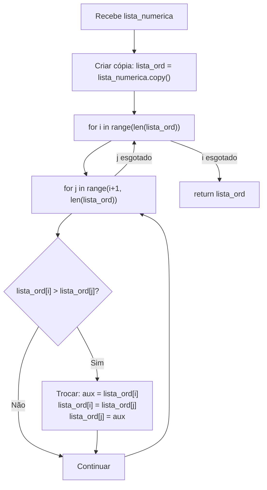
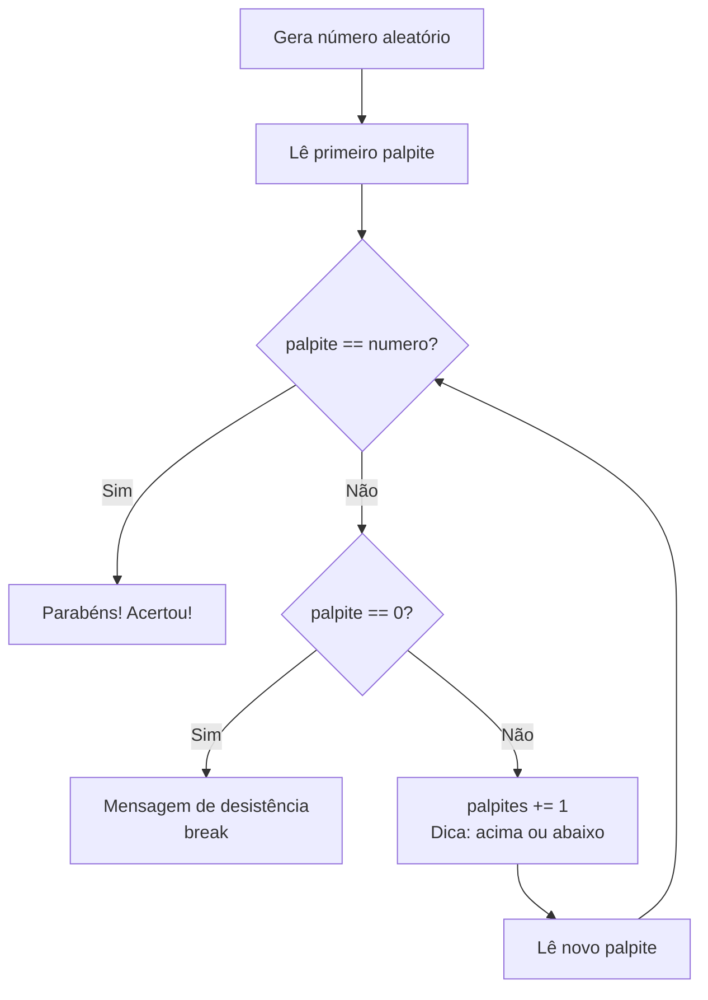

## Visão Geral do Conceito

Esta aula é uma síntese de toda a disciplina de Introdução à Programação com Python. O conteúdo não traz novos vocabulários: traz **novos problemas reais** para resolver com os instrumentos já aprendidos — loops, funções, condicionais, listas e entrada do usuário.

Os três desafios desta aula revelam três competências essenciais de um desenvolvedor:

1. **Pensar em algoritmos** — construir lógica de ordenação do zero.
2. **Usar bibliotecas padrão** — importar e usar o módulo <mark style="background-color: #242424; padding: 2px 4px; border-radius: 3px; color: inherit;">`random`</mark> para gerar dados imprevisíveis.
3. **Decompor problemas em funções compostas** — dividir um sistema em partes menores com responsabilidades claras.

> **Regra:** A habilidade de programar cresce apenas com prática. Ler código não substitui escrever código — e errar faz parte do aprendizado.

---

## Modelo Mental

### Bubble Sort: bolhas subindo

Imagine uma lista de números como uma coluna de bolhas subindo numa água viscosa. As bolhas mais pesadas (números maiores) afundam e as mais leves (números menores) sobem. O algoritmo percorre a lista repetidamente, comparando cada elemento com seu vizinho e trocando de posição quando necessário.

Cada passagem empurra o maior elemento restante para o final — como uma "bolha" que sobe até a superfície.

### Referência vs. cópia de lista

Em Python, uma variável que aponta para uma lista **não guarda os dados** — ela guarda o **endereço de memória** onde os dados estão. Quando você passa essa variável para uma função, a função também recebe o mesmo endereço. Modificar os elementos dentro da função modifica a lista original.

Para preservar a lista original, é necessário criar uma **cópia independente** com <mark style="background-color: #242424; padding: 2px 4px; border-radius: 3px; color: inherit;">`.copy()`</mark> antes de modificar.

### Composição de funções

Em vez de um script monolítico com 60 linhas, um sistema pode ser dividido em funções com responsabilidade única: uma que coleta dados, outra que calcula, outra que exibe o resultado. Cada função é testável e reutilizável de forma independente.

---

## Mecânica Central

### 1. Bubble Sort com dois loops aninhados

O algoritmo compara cada elemento com seu sucessor imediato. Se o elemento atual for maior que o próximo, eles trocam de lugar. Um loop externo percorre os índices `i` (elemento atual) e um loop interno percorre os índices `j` (elemento seguinte, `j = i + 1`).



```python
def ordenar_lista_numerica(lista_numerica: list[int | float]) -> list[int | float]:
    """Retorna uma nova lista ordenada sem modificar a original (Bubble Sort)."""
    lista_ord = lista_numerica.copy()  # cópia independente — não muta o original

    for i in range(len(lista_ord)):
        for j in range(i + 1, len(lista_ord)):
            if lista_ord[i] > lista_ord[j]:
                aux = lista_ord[i]       # guarda o valor atual
                lista_ord[i] = lista_ord[j]  # coloca o menor no lugar
                lista_ord[j] = aux       # coloca o maior no lugar do sucessor

    return lista_ord


# Teste
lista = [4, 5, 1, 2]
lista_ordenada = ordenar_lista_numerica(lista)
print("Original:", lista)        # [4, 5, 1, 2]  — intacta
print("Ordenada:", lista_ordenada)  # [1, 2, 4, 5]
```

> **Atenção ao desempenho:** O Bubble Sort percorre toda a coleção a cada passagem, independentemente de ela já estar ordenada parcialmente. Para N elementos, faz O(N²) comparações no pior caso. É o primeiro algoritmo histórico de ordenação e o de pior performance — Python já oferece <mark style="background-color: #242424; padding: 2px 4px; border-radius: 3px; color: inherit;">`.sort()`</mark> e <mark style="background-color: #242424; padding: 2px 4px; border-radius: 3px; color: inherit;">`sorted()`</mark> que usam Timsort (O(N log N)).

---

### 2. Módulo `random` — números aleatórios

O módulo <mark style="background-color: #242424; padding: 2px 4px; border-radius: 3px; color: inherit;">`random`</mark> faz parte da biblioteca padrão do Python, mas precisa ser **importado explicitamente** para ficar disponível.

```python
import random

numero = random.randint(1, 20)  # inteiro aleatório no intervalo FECHADO [1, 20]
print(numero)  # pode ser qualquer valor de 1 a 20 (inclusive)
```

Funções relevantes do módulo:

| Função | Descrição |
|--------|-----------|
| <mark style="background-color: #242424; padding: 2px 4px; border-radius: 3px; color: inherit;">`random.randint(a, b)`</mark> | Inteiro aleatório em `[a, b]` (fechado nos dois extremos) |
| <mark style="background-color: #242424; padding: 2px 4px; border-radius: 3px; color: inherit;">`random.randrange(start, stop)`</mark> | Inteiro aleatório em `[start, stop)` (igual ao `range`) |
| <mark style="background-color: #242424; padding: 2px 4px; border-radius: 3px; color: inherit;">`random.random()`</mark> | Float aleatório em `[0.0, 1.0)` |
| <mark style="background-color: #242424; padding: 2px 4px; border-radius: 3px; color: inherit;">`random.choice(seq)`</mark> | Elemento aleatório de uma sequência |

---

### 3. Jogo de adivinhação — `while` com múltiplas saídas

```python
import random


def jogar_adivinhacao() -> None:
    """Jogo interativo de adivinhação com dicas de 'acima/abaixo'."""
    numero = random.randint(1, 20)
    palpites = 0
    meu_palpite = int(input("Adivinhe meu número entre 1 e 20 (0 para desistir): "))

    while meu_palpite != numero:
        if meu_palpite == 0:
            print("Que pena, você desistiu do jogo 😢")
            break

        palpites += 1

        if meu_palpite > numero:
            print(f"Seu palpite {meu_palpite} está ACIMA.")
        else:
            print(f"Seu palpite {meu_palpite} está ABAIXO.")

        meu_palpite = int(input("Tente novamente: "))

    if meu_palpite != 0:
        print(f"Ótimo, você acertou em {palpites + 1} tentativas!")


jogar_adivinhacao()
```

**Fluxo de controle:**



---

### 4. Caixa registradora — composição de três funções

O sistema é dividido em três responsabilidades distintas:

- <mark style="background-color: #242424; padding: 2px 4px; border-radius: 3px; color: inherit;">`registrar_compra()`</mark> — coleta valores do usuário e retorna totalizadores.
- <mark style="background-color: #242424; padding: 2px 4px; border-radius: 3px; color: inherit;">`calcular_desconto(total)`</mark> — aplica regras de desconto progressivo.
- <mark style="background-color: #242424; padding: 2px 4px; border-radius: 3px; color: inherit;">`exibir_relatorio(...)`</mark> — exibe o resumo completo da compra.

```python
def registrar_compra() -> tuple[int, float, int]:
    """
    Coleta valores dos produtos via input até que o usuário digite 0.
    Retorna: (qtd_produtos, total, qtd_produtos_caros)
    """
    qtd_produtos = 0
    total = 0.0
    qtd_produtos_caros = 0

    while True:
        valor_produto = float(input("Digite o valor do produto em R$ (0 para encerrar): "))

        if valor_produto == 0:
            break

        if valor_produto < 0:
            print("Valor inválido. Digite um valor positivo.")
            continue  # volta ao início do loop sem registrar

        qtd_produtos += 1
        total += valor_produto

        if valor_produto >= 100:
            qtd_produtos_caros += 1

    return qtd_produtos, total, qtd_produtos_caros


def calcular_desconto(total: float) -> float:
    """
    Aplica desconto progressivo sobre o total da compra.
    < R$ 100      → 0%
    R$ 100–299,99 → 5%
    R$ 300–499,99 → 10%
    ≥ R$ 500      → 15%
    """
    if total < 100:
        return 0.0
    elif total < 300:
        return total * 0.05
    elif total < 500:
        return total * 0.10
    else:
        return total * 0.15


def exibir_relatorio(
    qtd_produtos: int,
    total: float,
    qtd_produtos_caros: int
) -> None:
    """Calcula e exibe o resumo completo da compra."""
    if qtd_produtos == 0:
        print("Nenhum produto registrado.")
        return

    media = total / qtd_produtos
    desconto = calcular_desconto(total)
    valor_final = total - desconto

    print("\n===== RESUMO DA COMPRA =====")
    print(f"Quantidade de produtos:        {qtd_produtos}")
    print(f"Total da compra:               R$ {total:.2f}")
    print(f"Média por produto:             R$ {media:.2f}")
    print(f"Produtos acima de R$ 100,00:   {qtd_produtos_caros}")
    print(f"Desconto aplicado:             R$ {desconto:.2f}")
    print(f"Valor final a pagar:           R$ {valor_final:.2f}")
    print("============================")


# --- Ponto de entrada ---
qtd, total, caros = registrar_compra()
exibir_relatorio(qtd, total, caros)
```

**Tabela de descontos:**

| Total da compra | Desconto |
|-----------------|----------|
| Abaixo de R$ 100 | 0% |
| R$ 100 a R$ 299,99 | 5% |
| R$ 300 a R$ 499,99 | 10% |
| R$ 500 ou mais | 15% |

---

## Uso Prático

### Cenário: processando notas fiscais em lote

A estrutura da caixa registradora pode ser adaptada para processar listas de valores lidos de um CSV ou de uma API, substituindo o `input()` por iteração sobre dados reais:

```python
import csv
from pathlib import Path


def processar_nf(caminho_csv: str) -> tuple[int, float, int]:
    """Processa uma nota fiscal a partir de um CSV com coluna 'valor'."""
    qtd_produtos = 0
    total = 0.0
    qtd_caros = 0

    with Path(caminho_csv).open(encoding="utf-8") as f:
        reader = csv.DictReader(f)
        for row in reader:
            try:
                valor = float(row["valor"])
            except ValueError:
                print(f"Linha ignorada — valor inválido: {row}")
                continue

            if valor <= 0:
                continue

            qtd_produtos += 1
            total += valor
            if valor >= 100:
                qtd_caros += 1

    return qtd_produtos, total, qtd_caros
```

---

## Erros Comuns

### 1. Modificar a lista original sem perceber

**Erro:** Passar a lista para a função de ordenação e imprimir a "original" depois: ambas mostram o mesmo resultado.

```python
# ERRADO: a função muta a lista que recebeu
def ordenar_sem_copia(lista):
    for i in range(len(lista)):
        for j in range(i + 1, len(lista)):
            if lista[i] > lista[j]:
                lista[i], lista[j] = lista[j], lista[i]
    return lista

lista = [4, 2, 7, 1]
ordenada = ordenar_sem_copia(lista)
print(lista)    # [1, 2, 4, 7] — a original foi modificada!
print(ordenada) # [1, 2, 4, 7] — apontam para o mesmo objeto
```

**Correção:** Crie uma cópia no início da função com `lista.copy()`.

---

### 2. `random.randint` vs. `random.randrange` — intervalo fechado vs. aberto

```python
import random

random.randint(1, 20)    # pode retornar 1, 2, ... ou 20  (fechado)
random.randrange(1, 20)  # pode retornar 1, 2, ... ou 19  (20 excluído)
```

Usar `randrange` onde se quer incluir o limite máximo é um bug silencioso: o número 20 **nunca** será sorteado.

---

### 3. `float(input())` sem tratamento de exceção

Se o usuário digitar letras em vez de um número, ocorre <mark style="background-color: #242424; padding: 2px 4px; border-radius: 3px; color: inherit;">`ValueError`</mark>:

```python
# Frágil:
valor = float(input("Digite o valor: "))

# Robusto:
while True:
    try:
        valor = float(input("Digite o valor: "))
        break
    except ValueError:
        print("Entrada inválida. Digite um número.")
```

---

### 4. Loop infinito por esquecer de atualizar a variável de controle

```python
# BUG: palpite nunca é atualizado dentro do loop
palpite = int(input("Palpite: "))
while palpite != numero:
    print("Errou!")
    # palpite nunca muda → loop infinito
```

**Correção:** Leia o novo palpite ao final do bloco do `while`.

---

## Visão Geral de Debugging

**Bubble Sort não ordena corretamente:**
1. Verifique se o loop interno começa em `i + 1` e não em `0` (começar em `0` causa trocas erradas no início).
2. Confirme que o limite do `range` externo é `len(lista)` e não `len(lista) - 1`.
3. Use `print(lista_ord)` ao final de cada iteração do loop externo para rastrear o progresso.

**Jogo de adivinhação entra em loop infinito:**
1. Verifique se `meu_palpite` é atualizado dentro do `while` (nova chamada a `input()`).
2. Confirme que o `break` está dentro do bloco `if meu_palpite == 0`.

**Caixa registradora — total incorreto:**
1. Verifique se `total += valor_produto` está dentro do `else` (após a validação de zero e de valor negativo).
2. Imprima `total` e `qtd_produtos` antes do `return` para confirmar os acumuladores.

<details>
<summary>Ver diagnóstico rápido de acumuladores</summary>

```python
# Adicione temporariamente ao loop da caixa registradora:
print(f"[DEBUG] valor={valor_produto}, total acumulado={total}, qtd={qtd_produtos}")
```

Remova o print depois de confirmar o comportamento correto.
</details>

---

## Principais Pontos

- **Bubble Sort** usa dois `for` aninhados e troca elementos com variável auxiliar — é O(N²) e o pior algoritmo de ordenação, mas didaticamente essencial para entender lógica de comparação e troca.
- **Listas são mutáveis e passadas por referência** — use `.copy()` quando precisar preservar a lista original.
- **`import random`** é necessário para usar `random.randint(a, b)`, que gera inteiro no intervalo **fechado** `[a, b]`.
- **`while True` + `break`** é a forma idiomática de loops com múltiplas condições de saída.
- **Funções com responsabilidade única** tornam o código testável, legível e reutilizável.
- **Retorno múltiplo** (`return a, b, c`) retorna uma tupla — desempacote com `a, b, c = funcao()`.
- **`continue`** pula para a próxima iteração do loop sem executar o restante do bloco.

---

## Preparação para Prática

Após esta lição, o estudante deve conseguir:

- Implementar um algoritmo de busca ou ordenação a partir de uma descrição textual do comportamento.
- Usar o módulo `random` para gerar dados de teste.
- Estruturar um programa interativo com entrada do usuário, validação, laço de repetição e saída formatada.
- Dividir um problema em funções distintas que se compõem para resolver o problema completo.
- Identificar quando uma lista está sendo mutada dentro de uma função e aplicar `.copy()` quando necessário.

---

## Laboratório de Prática

### 🟢 Easy — Buscador de Elemento em Lista

**Contexto:** Um sistema de estoque recebe uma lista de SKUs (identificadores de produto) e precisa verificar se um determinado SKU está presente, retornando sua posição.

Implemente `buscar_sku` sem usar o operador `in` ou o método `.index()` — use apenas um loop `for`.

```python
def buscar_sku(lista_skus: list[str], sku_alvo: str) -> int:
    """
    Percorre lista_skus e retorna o índice da primeira ocorrência de sku_alvo.
    Retorna -1 se o SKU não for encontrado.
    """
    for i in range(len(lista_skus)):
        # TODO: comparar lista_skus[i] com sku_alvo e retornar i se for igual
        pass

    return -1  # TODO: manter este retorno apenas se não encontrou


# Testes
skus = ["SKU-001", "SKU-007", "SKU-042", "SKU-007"]
print(buscar_sku(skus, "SKU-007"))  # esperado: 1
print(buscar_sku(skus, "SKU-999"))  # esperado: -1
```

---

### 🟡 Medium — Simulador de Sorteio com Histórico

**Contexto:** Um sistema de sorteios de cupons fiscais sorteia números sem repetição a partir de um intervalo definido pelo usuário. O histórico de sorteios deve ser preservado entre rodadas.

```python
import random


def sortear_cupom(historico: list[int], minimo: int, maximo: int) -> int | None:
    """
    Sorteia um número inteiro aleatório no intervalo [minimo, maximo]
    que ainda não tenha sido sorteado (não está em historico).
    Retorna None se todos os números do intervalo já foram sorteados.
    """
    # TODO: calcular todos os candidatos do intervalo que não estão em historico
    candidatos: list[int] = []  # TODO: preencher com números disponíveis

    if not candidatos:
        return None

    # TODO: sortear um elemento aleatório de candidatos usando random.choice
    numero = None  # TODO: substituir

    historico.append(numero)
    return numero


# Uso esperado
historico: list[int] = []
for _ in range(5):
    resultado = sortear_cupom(historico, 1, 5)
    print(f"Sorteado: {resultado} | Histórico: {historico}")

# Todos esgotados:
resultado = sortear_cupom(historico, 1, 5)
print(f"Resultado quando esgotado: {resultado}")  # esperado: None
```

---

### 🔴 Hard — Sistema de Desconto por Categoria com Relatório

**Contexto:** Uma loja online aplica descontos diferentes por categoria de produto. Implemente as três funções abaixo e componha-as num pipeline que processa uma lista de itens e gera um relatório detalhado.

**Regras de desconto por categoria:**

| Categoria | Desconto |
|-----------|----------|
| `"eletronico"` | 10% |
| `"vestuario"` | 20% |
| `"alimento"` | 5% |
| Outras | 0% |

```python
from typing import TypedDict


class Produto(TypedDict):
    nome: str
    categoria: str
    preco: float


DESCONTOS: dict[str, float] = {
    "eletronico": 0.10,
    "vestuario": 0.20,
    "alimento": 0.05,
}


def calcular_preco_final(produto: Produto) -> float:
    """Retorna o preço com desconto aplicado conforme a categoria."""
    # TODO: buscar o percentual de desconto em DESCONTOS (.get com default 0.0)
    # TODO: retornar preco * (1 - desconto)
    return produto["preco"]  # placeholder — remover


def gerar_relatorio(produtos: list[Produto]) -> dict[str, float]:
    """
    Processa a lista de produtos e retorna um dicionário com:
    - 'total_original': soma dos preços originais
    - 'total_final': soma dos preços com desconto
    - 'total_economia': diferença entre total_original e total_final
    - 'media_final': média do preço final por produto
    """
    # TODO: inicializar acumuladores
    total_original = 0.0
    total_final = 0.0

    for produto in produtos:
        # TODO: acumular total_original com produto["preco"]
        # TODO: calcular preco_final chamando calcular_preco_final(produto)
        # TODO: acumular total_final com preco_final
        pass

    qtd = len(produtos) if produtos else 1  # evitar divisão por zero
    return {
        "total_original": total_original,
        "total_final": total_final,
        "total_economia": total_original - total_final,
        "media_final": total_final / qtd,
    }


def exibir_relatorio_loja(produtos: list[Produto]) -> None:
    """Imprime o relatório formatado da compra."""
    relatorio = gerar_relatorio(produtos)
    print("\n===== RELATÓRIO DA LOJA =====")
    for produto in produtos:
        pf = calcular_preco_final(produto)
        print(f"  {produto['nome']:20s} | Original: R$ {produto['preco']:7.2f} | Final: R$ {pf:7.2f}")
    print(f"\nTotal original:  R$ {relatorio['total_original']:.2f}")
    print(f"Total final:     R$ {relatorio['total_final']:.2f}")
    print(f"Economia:        R$ {relatorio['total_economia']:.2f}")
    print(f"Média por item:  R$ {relatorio['media_final']:.2f}")
    print("=============================")


# Teste
catalogo: list[Produto] = [
    {"nome": "Notebook Pro", "categoria": "eletronico", "preco": 3500.00},
    {"nome": "Camiseta Dry Fit", "categoria": "vestuario", "preco": 89.90},
    {"nome": "Arroz 5kg", "categoria": "alimento", "preco": 32.50},
    {"nome": "Cabo USB", "categoria": "eletronico", "preco": 45.00},
    {"nome": "Mochila", "categoria": "acessorio", "preco": 199.00},
]

exibir_relatorio_loja(catalogo)
# Economia esperada: 350 + 17,98 + 1,625 + 4,5 + 0 = R$ 374,105
```

---

<!-- CONCEPT_EXTRACTION
concepts:
  - bubble sort
  - algoritmo de ordenação por comparação
  - referência mutável de lista
  - cópia de lista com .copy()
  - módulo random
  - random.randint
  - while True com break
  - continue
  - acumuladores em loops
  - retorno múltiplo de funções (tupla)
  - composição de funções
  - validação de entrada com float(input())
skills:
  - Implementar Bubble Sort usando dois loops for aninhados e variável auxiliar de troca
  - Usar .copy() para evitar mutação indesejada da lista original
  - Importar e usar o módulo random para gerar números aleatórios num intervalo fechado
  - Construir programas interativos com while, break e continue
  - Decompor um problema em funções com responsabilidade única e compô-las numa chamada principal
  - Acumular totais, contagens e médias em loops
  - Tratar entrada do usuário com float/int e validar contra valores inválidos
examples:
  - bubble-sort-dois-loops-aninhados
  - lista-copy-referencia-mutavel
  - random-randint-jogo-adivinhacao
  - caixa-registradora-composicao-funcoes
  - pipeline-produtos-desconto-categoria
-->

<!-- EXERCISES_JSON
[
  {
    "id": "buscar-sku-loop-linear",
    "slug": "buscar-sku-loop-linear",
    "difficulty": "easy",
    "title": "Buscador linear de SKU em lista de estoque",
    "discipline": "python",
    "editorLanguage": "python",
    "tags": ["python", "loops", "listas", "algoritmos", "busca-linear"],
    "summary": "Implementar uma busca linear em lista de SKUs sem usar operadores nativos, retornando o índice da primeira ocorrência ou -1."
  },
  {
    "id": "sorteio-cupom-sem-repeticao",
    "slug": "sorteio-cupom-sem-repeticao",
    "difficulty": "medium",
    "title": "Simulador de sorteio de cupons fiscais sem repetição",
    "discipline": "python",
    "editorLanguage": "python",
    "tags": ["python", "random", "listas", "while", "historico"],
    "summary": "Usar random.choice e filtragem de candidatos para sortear números sem repetição, retornando None quando o intervalo se esgota."
  },
  {
    "id": "desconto-categoria-relatorio-loja",
    "slug": "desconto-categoria-relatorio-loja",
    "difficulty": "hard",
    "title": "Sistema de desconto por categoria com relatório de compra",
    "discipline": "python",
    "editorLanguage": "python",
    "tags": ["python", "funcoes", "composicao", "dicionarios", "acumuladores", "TypedDict"],
    "summary": "Implementar pipeline de três funções compostas para calcular preços finais por categoria, acumular totalizadores e exibir relatório formatado."
  }
]
-->
