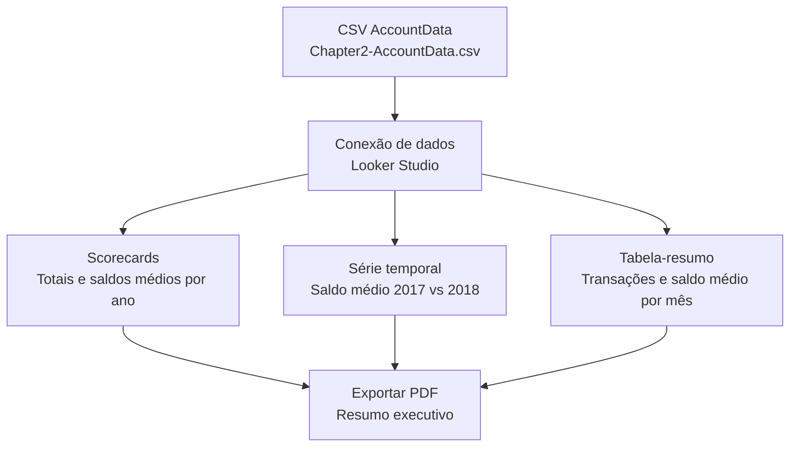

## Visão Geral do Conceito

Esta lição mostra como construir um **dashboard estático** no Looker Studio para comparar o comportamento de uma **conta bancária** entre dois anos (2017 e 2018) usando o dataset `Chapter2-AccountData.csv`.  
Em vez de navegar por centenas de transações, você aprenderá a montar uma **história visual** com **scorecards**, **série temporal** e **tabela-resumo** que pode ser exportada como PDF e compartilhada com terceiros.

O foco é partir de um relatório já existente (da aula anterior) e refiná-lo para responder a uma pergunta específica: **“O que mudou no saldo e nas transações da conta entre 2017 e 2018?”**.

## Modelo Mental

O modelo mental desta lição é pensar o dashboard como um **extrato anual narrado visualmente**:

- Os **scorecards** são o “resumo executivo” – mostram rapidamente totais e médias de um período.
- A **série temporal** é a “linha do tempo da conta” – mostra como o saldo médio evolui ao longo dos meses em cada ano.
- A **tabela-resumo mensal** é o “detalhe compacto” – mostra, mês a mês, quantas transações aconteceram e qual foi o saldo médio.

Em vez de enxergar o CSV como uma planilha caótica com colunas como <mark style="background-color: #242424; padding: 2px 4px; border-radius: 3px; color: inherit;">`Transaction Amount`</mark>, <mark style="background-color: #242424; padding: 2px 4px; border-radius: 3px; color: inherit;">`Balance`</mark> e <mark style="background-color: #242424; padding: 2px 4px; border-radius: 3px; color: inherit;">`Category`</mark>, você passa a vê-lo como **fonte de respostas visuais**: “quanto gastei”, “como variou meu saldo”, “em que meses houve mais movimento”.

## Mecânica Central

### Estrutura do dataset de conta bancária

O arquivo `Chapter2-AccountData.csv` contém colunas típicas de um extrato, como:

- <mark style="background-color: #242424; padding: 2px 4px; border-radius: 3px; color: inherit;">`Transaction Number`</mark>: identificador único da transação.
- <mark style="background-color: #242424; padding: 2px 4px; border-radius: 3px; color: inherit;">`Date`</mark>: data da transação.
- <mark style="background-color: #242424; padding: 2px 4px; border-radius: 3px; color: inherit;">`Description`</mark> e <mark style="background-color: #242424; padding: 2px 4px; border-radius: 3px; color: inherit;">`Memo`</mark>: textos descritivos.
- <mark style="background-color: #242424; padding: 2px 4px; border-radius: 3px; color: inherit;">`Category`</mark>: categoria da transação (ex.: Housing, Food & Dining, Insurance).
- <mark style="background-color: #242424; padding: 2px 4px; border-radius: 3px; color: inherit;">`Transaction Amount`</mark>: valor da transação (crédito ou débito).
- <mark style="background-color: #242424; padding: 2px 4px; border-radius: 3px; color: inherit;">`Balance`</mark>: saldo da conta após a transação.

No Looker Studio, normalmente:

- A coluna <mark style="background-color: #242424; padding: 2px 4px; border-radius: 3px; color: inherit;">`Date`</mark> vira **dimensão de data**.
- As colunas <mark style="background-color: #242424; padding: 2px 4px; border-radius: 3px; color: inherit;">`Transaction Amount`</mark> e <mark style="background-color: #242424; padding: 2px 4px; border-radius: 3px; color: inherit;">`Balance`</mark> viram **métricas numéricas**.
- O campo <mark style="background-color: #242424; padding: 2px 4px; border-radius: 3px; color: inherit;">`Category`</mark> pode ser usado como dimensão para detalhar os gastos por tipo.

### Componentes do dashboard de comparação de anos

O dashboard desta lição é composto, no mínimo, por três blocos principais:

- **Cabeçalho estático**  
  - Nome da pessoa/empresa (ex.: “Chris Cooper”).  
  - Período analisado (ex.: “Visão geral 2018 – comparação com 2017”).

- **Scorecards (Visão Geral / Scorecards)**  
  - Total de transações em 2018 comparado com 2017.  
  - Saldo médio em 2018 comparado com 2017.  
  - (Opcional) Total líquido (entradas − saídas) em 2018 comparado com 2017.

- **Série temporal (linha do tempo do saldo médio)**  
  - Eixo X: meses.  
  - Série 1: saldo médio mensal em 2018.  
  - Série 2: saldo médio mensal em 2017.

- **Tabela-resumo mensal**  
  - Dimensão: mês.  
  - Métricas: número de transações no mês e saldo médio no mês.

### Fluxo lógico do dashboard

O fluxo de informação que o dashboard implementa pode ser visto assim:



O segredo é que **todos os componentes usam a mesma fonte de dados**, mas com **diferentes combinações de dimensões e métricas**:

- Scorecards agregam **por ano**.
- Série temporal agrega **por mês**, mas plota duas séries (uma por ano).
- Tabela agrega **por mês**, exibindo contagem de transações e saldo médio.

## Uso Prático

### 1. Partindo de um relatório existente

Na aula anterior, você já tinha um relatório no Looker Studio com o extrato da conta bancária. Em vez de recriar tudo do zero:

1. Abra o relatório anterior (ex.: “Conta corrente – exemplo prático do Looker Studio 1.0”).  
2. Clique nos **três pontinhos** no canto superior direito do relatório.  
3. Use a opção de **fazer uma cópia** do relatório.  
4. Renomeie o relatório copiado (ex.: “Conta corrente – comparação 2017 vs 2018”).  

Isso garante que:

- As conexões com a fonte de dados (planilha ou CSV) já estejam configuradas.
- O estilo e o layout base sejam reaproveitados.

### 2. Configurando scorecards para comparação de anos

No relatório copiado:

1. Insira três **scorecards** (um para cada métrica principal).  
2. Para cada scorecard:
   - Defina a **métrica principal** (ex.: total de transações ou saldo médio).  
   - Ative a **comparação com período anterior** (ex.: ano anterior).  
   - Formate o número (moeda, separador de milhar, casas decimais).

Um exemplo de combinação possível:

- Scorecard 1: “Total de transações em 2018”  
  - Métrica: contagem de transações (pode usar a métrica automática de contagem de linhas).  
  - Comparação com 2017 (diferença e percentual).

- Scorecard 2: “Saldo médio em 2018”  
  - Métrica: média da coluna de saldo.  
  - Comparação com 2017.

- Scorecard 3: “Total líquido em 2018”  
  - Métrica: soma de <mark style="background-color: #242424; padding: 2px 4px; border-radius: 3px; color: inherit;">`Transaction Amount`</mark>.  
  - Comparação com 2017.

### 3. Série temporal comparando 2017 e 2018

Para construir a série temporal:

1. Insira um **gráfico de série temporal**.  
2. Use como **dimensão de tempo** a coluna de data da transação.  
3. Ajuste o **nível de detalhe** para meses (em vez de dias) para simplificar.  
4. Crie duas séries (métricas) de saldo médio, uma para cada ano, ou configure um campo calculado que separe as séries por ano.

O objetivo é chegar a algo próximo de:

- Linha azul escura: saldo médio mês a mês em 2018.  
- Linha azul clara: saldo médio mês a mês em 2017.  

Visualmente, você quer responder:

- “Em que meses o saldo de 2018 ficou acima ou abaixo do de 2017?”  
- “Há picos ou quedas atípicas em algum dos anos?”

### 4. Tabela-resumo por mês

Para a tabela:

1. Insira um **gráfico de tabela**.  
2. Use como dimensão um campo de **mês** (derivado da data).  
3. Adicione as métricas:
   - Número de transações no mês (contagem de linhas ou de <mark style="background-color: #242424; padding: 2px 4px; border-radius: 3px; color: inherit;">`Transaction Number`</mark>).  
   - Saldo médio no mês (média da coluna de saldo).  
4. Opcionalmente, adicione uma coluna com o total líquido do mês (soma de <mark style="background-color: #242424; padding: 2px 4px; border-radius: 3px; color: inherit;">`Transaction Amount`</mark>).

Essa tabela é o “check” da história contada pelos gráficos:

- Se um mês aparece com muitas transações e saldo médio muito baixo, é um mês de **forte saída de caixa**.
- Se o saldo médio é muito alto com poucas transações, possivelmente houve **pouco movimento**, mas bons aportes.

### 5. Exportando um relatório estático

Ao final da montagem:

1. Ajuste o **layout de página** para caber em uma folha A4 ou similar.  
2. Revise títulos, legendas e textos do cabeçalho.  
3. Use a opção do Looker Studio de **exportar como PDF**.  

O resultado é um **relatório estático**, pronto para ser enviado por e-mail, anexado a um relatório maior ou impresso para discussão em reunião.

## Erros Comuns

- **Misturar granularidades de tempo sem perceber**  
  - Problema: série temporal em nível de dia e tabela em nível de mês, sem deixar isso claro.  
  - Sintoma: números não batem entre o gráfico e a tabela.  
  - Correção: padronizar o nível de agregação (por exemplo, trabalhar tudo em nível de mês para comparação anual).

- **Usar métricas erradas nos scorecards**  
  - Problema: usar soma do saldo em vez de saldo médio, gerando números gigantes e pouco interpretáveis.  
  - Sintoma: o valor do scorecard é muito maior do que qualquer valor de saldo observado.  
  - Correção: garantir que o scorecard use **média de saldo** e não soma.

- **Deixar o controle de período aberto demais**  
  - Problema: o filtro de data inclui mais anos do que o esperado.  
  - Sintoma: as linhas da série temporal se sobrepõem de forma estranha, e os scorecards parecem “sem sentido”.  
  - Correção: travar o dashboard para comparar explicitamente **2017 vs 2018** ou configurar filtros claros para o usuário.

- **Ignorar a consistência visual**  
  - Problema: cores diferentes para o mesmo ano em gráficos distintos.  
  - Sintoma: confusão ao ler o dashboard (ex.: 2018 é azul escuro em um gráfico e azul claro em outro).  
  - Correção: padronizar cores para cada ano e reutilizar essa paleta em todos os componentes.

## Visão Geral de Debugging

Quando algo parece errado no dashboard:

- **1. Conferir o período filtrado**  
  - Verifique se os filtros de data estão realmente pegando apenas 2017 e 2018.  
  - Compare rapidamente com a tabela de dados bruta (no próprio Looker Studio ou na planilha).

- **2. Validar a granularidade de tempo**  
  - Confirme se a série temporal e a tabela-resumo estão usando o mesmo nível (mês).  
  - Se necessário, duplique o gráfico e mude a granularidade para testar o impacto.

- **3. Validar as métricas usadas**  
  - Confira se campos como saldo médio, total líquido e contagem de transações estão definidos corretamente.  
  - Compare os valores de um mês específico entre a tabela e a série temporal.

- **4. Checar a fonte de dados**  
  - Abra o dataset de origem (CSV ou planilha) e confira algumas linhas específicas.  
  - Verifique se há linhas duplicadas, datas fora do intervalo esperado ou categorias estranhas.

## Principais Pontos

- **Dashboard estático**: serve para contar uma história fechada sobre um período, muitas vezes em PDF.
- **Scorecards**: trazem o resumo executivo da conta – totais e médios por ano.
- **Série temporal**: mostra a evolução do saldo médio ao longo dos meses, com duas linhas para comparação de anos.
- **Tabela-resumo mensal**: compacta o detalhe, exibindo número de transações e saldo médio por mês.
- **Consistência**: mesma fonte de dados, granularidade de tempo e paleta de cores coerente ao longo de todo o relatório.

## Preparação para Prática

Após esta lição, você deve ser capaz de:

- Clonar um relatório existente no Looker Studio e adaptá-lo para comparar anos.  
- Escolher dimensões e métricas adequadas para responder perguntas de negócio sobre uma conta bancária.  
- Montar um layout de dashboard estático que combine scorecards, série temporal e tabela-resumo.  
- Validar se os números apresentados fazem sentido, comparando com a fonte de dados.

No Laboratório de Prática, você irá:

- Traduzir o layout do dashboard em consultas SQL que calculam os mesmos números.  
- Explorar variações de comparação (por categoria, por tipo de despesa, por mês).  
- Pensar em novos indicadores que fariam sentido para o “cliente” da conta bancária.

## Laboratório de Prática

### Easy — Totais e saldo médio mensal (2017)

Você recebeu uma cópia da tabela de transações da conta bancária em um banco de dados SQL, na tabela <mark style="background-color: #242424; padding: 2px 4px; border-radius: 3px; color: inherit;">`account_transactions`</mark>, com colunas equivalentes ao CSV: data, valor da transação, saldo e categoria.  
Seu primeiro objetivo é calcular, para o ano de 2017, **quantas transações ocorreram em cada mês** e **qual foi o saldo médio mensal**.

Complete a query abaixo:

```sql
-- TODO: selecionar o ano e o mês da data
-- TODO: contar o número de transações
-- TODO: calcular o saldo médio no mês
SELECT
  strftime('%Y', date) AS year,
  strftime('%m', date) AS month,
  COUNT(*) AS total_transactions,
  AVG(balance) AS average_monthly_balance
FROM account_transactions
WHERE strftime('%Y', date) = '2017'
GROUP BY
  year,
  month
ORDER BY
  year,
  month;
```

Seu desafio é adaptar os campos e funções de data para o dialeto SQL que você estiver usando (SQLite, PostgreSQL, etc.) mantendo a mesma ideia.

### Medium — Comparando totais líquidos por ano

Agora você quer reproduzir, via SQL, um dos scorecards do dashboard: **total líquido (entradas − saídas) em 2017 e 2018**.

Suponha que:

- Créditos (entradas) são transações com valor positivo em <mark style="background-color: #242424; padding: 2px 4px; border-radius: 3px; color: inherit;">`transaction_amount`</mark>.  
- Débitos (saídas) são transações com valor negativo.

Complete a query:

```sql
-- TODO: extrair o ano da data
-- TODO: somar o valor das transações por ano
SELECT
  strftime('%Y', date) AS year,
  SUM(transaction_amount) AS net_total
FROM account_transactions
WHERE strftime('%Y', date) IN ('2017', '2018')
GROUP BY
  year
ORDER BY
  year;
```

Use o resultado para alimentar um scorecard por ano ou para criar um gráfico de barras simples comparando 2017 e 2018.

### Hard — Série temporal de saldo médio comparando anos

Por fim, você quer construir via SQL a base para a **série temporal** do dashboard: o saldo médio mensal de 2017 e 2018, pronto para ser consumido por um gráfico (em Looker Studio ou outra ferramenta).

Complete a query:

```sql
-- TODO: extrair ano e mês da data
-- TODO: calcular saldo médio por ano e mês
SELECT
  strftime('%Y', date) AS year,
  strftime('%m', date) AS month,
  AVG(balance) AS average_monthly_balance
FROM account_transactions
WHERE strftime('%Y', date) IN ('2017', '2018')
GROUP BY
  year,
  month
ORDER BY
  year,
  month;
```

Depois, pense em como você poderia transformar esse resultado em:

- Uma série temporal com duas linhas (uma para cada ano).  
- Um heatmap de meses x anos mostrando a intensidade do saldo médio.

<!-- CONCEPT_EXTRACTION
concepts:
  - dashboards estaticos
  - scorecards
  - series temporais
  - tabelas-resumo mensais
  - comparacao de anos em dados financeiros
skills:
  - Projetar dashboard de comparacao anual no Looker Studio
  - Escolher dimensoes e metricas para comparar periodos
  - Validar numeros de dashboard contra a fonte de dados
  - Traduzir layout de dashboard em consultas SQL agregadas
examples:
  - dashboard-conta-bancaria-2017-2018-scorecards
  - serie-temporal-saldo-medio-2017-2018
  - tabela-resumo-transacoes-saldo-mensal
-->

<!-- EXERCISES_JSON
[
  {
    "id": "dashboard-conta-bancaria-2017-2018-easy",
    "slug": "dashboard-conta-bancaria-2017-2018-easy",
    "difficulty": "easy",
    "title": "Totais e saldo médio mensal para 2017",
    "discipline": "visualizacao-sql",
    "editorLanguage": "sql",
    "tags": ["sql", "agregacao", "datas", "dashboard"],
    "summary": "Calcular o número de transações e o saldo médio mensal da conta bancária para 2017."
  },
  {
    "id": "dashboard-conta-bancaria-2017-2018-medium",
    "slug": "dashboard-conta-bancaria-2017-2018-medium",
    "difficulty": "medium",
    "title": "Comparar totais líquidos por ano",
    "discipline": "visualizacao-sql",
    "editorLanguage": "sql",
    "tags": ["sql", "agregacao", "financeiro"],
    "summary": "Escrever uma consulta SQL que calcule o total líquido de transações em 2017 e 2018."
  },
  {
    "id": "dashboard-conta-bancaria-2017-2018-hard",
    "slug": "dashboard-conta-bancaria-2017-2018-hard",
    "difficulty": "hard",
    "title": "Construir série temporal de saldo médio por ano",
    "discipline": "visualizacao-sql",
    "editorLanguage": "sql",
    "tags": ["sql", "series-temporais", "dashboard"],
    "summary": "Produzir uma tabela agregada com saldo médio mensal para 2017 e 2018 que sirva de base para uma série temporal comparativa."
  }
]
-->

