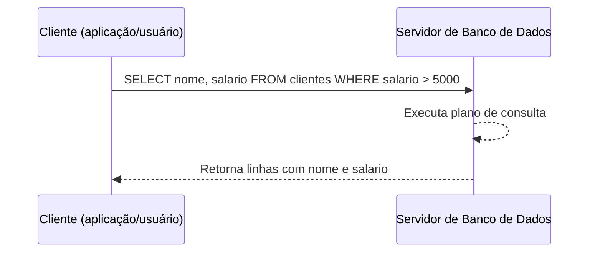

## Visão Geral do Conceito

Esta lição dá um passo atrás em relação aos dashboards e volta para a base: **o que é um banco de dados**, qual a diferença entre **dado** e **informação**, como funcionam **tipos de dados** e qual é o papel do **SQL** em um cenário **cliente-servidor**.  
Antes de escrever consultas complexas ou conectar ferramentas como Looker Studio, é essencial entender como os dados são armazenados, tipados e acessados.

O foco aqui é construir o vocabulário fundamental de bancos de dados: database, tabela, dado, informação, tipos de dados (texto, número, data, timestamp) e a ideia de um cliente que conversa com um servidor usando SQL.

## Modelo Mental

Pense em um **banco de dados** como uma **biblioteca bem organizada de informações**:

- Cada **livro** é como uma tabela.  
- Cada **página** é como um registro (linha).  
- Cada **linha da página** é como um campo (coluna).

Os **dados** são as letras e números escritos nessas páginas; a **informação** é o significado que surge quando você sabe **a que esses dados se referem** (por exemplo, “5” como tamanho de sapato, idade, quantidade, etc.).  
O **tipo de dado** é a “gramática” que define o que pode ser armazenado em cada campo (texto, número, data), e o **SQL** é o idioma formal que o “leitor” (cliente) usa para pedir livros, páginas e trechos específicos ao “bibliotecário” (servidor).

## Mecânica Central

### Bancos de dados e a arquitetura cliente-servidor

Um <mark style="background-color: #242424; padding: 2px 4px; border-radius: 3px; color: inherit;">`database`</mark> é uma coleção organizada de dados que:

- Pode ser **armazenada eficientemente**.  
- Pode ser **ordenada** (ex.: ordenar clientes pelo nome).  
- Pode ser **pesquisada** com rapidez usando consultas.

Na maioria dos sistemas reais, existe uma arquitetura **cliente-servidor**:

- **Cliente**: programa que faz a solicitação (aplicação, ferramenta de BI, linha de comando, script).  
- **Servidor**: software de banco de dados (como PostgreSQL, MySQL, SQL Server, SQLite em modo servidor) que recebe as solicitações, executa as consultas e devolve os resultados.

O **cliente** envia comandos em SQL para o **servidor**, que:

1. Interpreta a instrução.  
2. Lê ou altera os dados nas tabelas.  
3. Retorna os resultados (linhas, contagens, mensagens de erro).

### Dado vs informação

- **Dado**: valor isolado, sem contexto suficiente para interpretação.  
  - Exemplo: o número <mark style="background-color: #242424; padding: 2px 4px; border-radius: 3px; color: inherit;">`5`</mark> sozinho, sem nome de coluna nem unidade.

- **Informação**: dado + contexto, que permite entender o que o valor significa.  
  - Exemplo: “tamanho do sapato = <mark style="background-color: #242424; padding: 2px 4px; border-radius: 3px; color: inherit;">`5`</mark>”.

Em uma tabela de banco de dados:

- O dado aparece como o valor armazenado em uma célula.  
- A informação aparece quando você sabe **o nome da coluna**, **o tipo de dado** e o **significado de negócio** daquela coluna (por exemplo, “idade do cliente”, “preço do produto”, “data de cadastro”).

> **Regra:** sem nome de coluna, tipo e contexto de negócio, o banco armazena apenas dados; a informação surge quando esses elementos se combinam.

### Tipos de dados (datatypes)

Em bancos de dados relacionais, cada coluna tem um **tipo de dado** (datatype) que define:

- Que valores podem ser armazenados.  
- Que operações são permitidas sobre esses valores.

Alguns grupos comuns:

- **Texto**  
  - Exemplos de tipos: <mark style="background-color: #242424; padding: 2px 4px; border-radius: 3px; color: inherit;">`TEXT`</mark>, <mark style="background-color: #242424; padding: 2px 4px; border-radius: 3px; color: inherit;">`CHAR`</mark>, <mark style="background-color: #242424; padding: 2px 4px; border-radius: 3px; color: inherit;">`VARCHAR`</mark>, <mark style="background-color: #242424; padding: 2px 4px; border-radius: 3px; color: inherit;">`STRING`</mark> (dependendo do banco).  
  - Usados para nomes, e-mails, códigos alfanuméricos.  
  - Podem conter letras, números e caracteres especiais (como `@`, `.`, `?`, `!`).

- **Numéricos**  
  - Exemplos: <mark style="background-color: #242424; padding: 2px 4px; border-radius: 3px; color: inherit;">`INT`</mark>, <mark style="background-color: #242424; padding: 2px 4px; border-radius: 3px; color: inherit;">`BIGINT`</mark>, <mark style="background-color: #242424; padding: 2px 4px; border-radius: 3px; color: inherit;">`SMALLINT`</mark>, <mark style="background-color: #242424; padding: 2px 4px; border-radius: 3px; color: inherit;">`NUMERIC(10,2)`</mark>.  
  - Usados para quantidades, salários, preços, contagens.  
  - Tipos como <mark style="background-color: #242424; padding: 2px 4px; border-radius: 3px; color: inherit;">`NUMERIC(10,2)`</mark> indicam, por exemplo, 10 dígitos no total, sendo 2 casas decimais (centavos).

- **Datas e tempos**  
  - Exemplos: <mark style="background-color: #242424; padding: 2px 4px; border-radius: 3px; color: inherit;">`DATE`</mark>, <mark style="background-color: #242424; padding: 2px 4px; border-radius: 3px; color: inherit;">`TIME`</mark>, <mark style="background-color: #242424; padding: 2px 4px; border-radius: 3px; color: inherit;">`TIMESTAMP`</mark>.  
  - <mark style="background-color: #242424; padding: 2px 4px; border-radius: 3px; color: inherit;">`DATE`</mark> guarda dia, mês e ano.  
  - <mark style="background-color: #242424; padding: 2px 4px; border-radius: 3px; color: inherit;">`TIMESTAMP`</mark> guarda data e hora completas (dia, mês, ano, hora, minuto, segundo e, às vezes, milissegundos).

Quando um campo de data é salvo como texto (ex.: <mark style="background-color: #242424; padding: 2px 4px; border-radius: 3px; color: inherit;">`VARCHAR`</mark>), o banco **não sabe** que aquilo é uma data:

- Você perde operações naturais como somar dias, subtrair datas e filtrar por intervalos de tempo.  
- É preciso **converter** o texto para um tipo de data adequado com funções de conversão para então poder manipular de forma correta.

### SQL como linguagem de comunicação com o banco

<mark style="background-color: #242424; padding: 2px 4px; border-radius: 3px; color: inherit;">`SQL`</mark> (Structured Query Language) é a linguagem padrão usada para:

- **Consultar dados**: com comandos como <mark style="background-color: #242424; padding: 2px 4px; border-radius: 3px; color: inherit;">`SELECT`</mark>.  
- **Inserir dados**: com <mark style="background-color: #242424; padding: 2px 4px; border-radius: 3px; color: inherit;">`INSERT`</mark>.  
- **Atualizar dados**: com <mark style="background-color: #242424; padding: 2px 4px; border-radius: 3px; color: inherit;">`UPDATE`</mark>.  
- **Excluir dados**: com <mark style="background-color: #242424; padding: 2px 4px; border-radius: 3px; color: inherit;">`DELETE`</mark>.

Na arquitetura cliente-servidor:

- O cliente envia uma instrução SQL (por exemplo, “traga todos os clientes com idade maior que 30”).  
- O servidor executa essa instrução sobre as tabelas e devolve o conjunto de linhas correspondente.

## Uso Prático

### Exemplo 1 — Tipos de dados em uma tabela de clientes

Imagine uma tabela `clientes` com as seguintes colunas:

- Nome do cliente.  
- Data de nascimento.  
- Salário.  
- Data e hora do cadastro no sistema.

Uma definição de esquema coerente em SQL poderia ser:

```sql
CREATE TABLE clientes (
  id           INT PRIMARY KEY,
  nome         VARCHAR(100),
  data_nasc    DATE,
  salario      NUMERIC(10,2),
  criado_em    TIMESTAMP
);
```

Aqui:

- `nome` é texto (`VARCHAR`) porque aceita letras, números e caracteres especiais.  
- `data_nasc` é `DATE` porque representa apenas a data.  
- `salario` é `NUMERIC(10,2)` para suportar valores monetários com centavos.  
- `criado_em` é `TIMESTAMP` porque guarda data e hora completas.

### Exemplo 2 — Problema de datas como texto

Suponha que você recebeu uma coluna `data_evento` como texto (`VARCHAR`), por exemplo `"2026-02-26 14:35:20.123"`.  
Enquanto permanecer como texto:

- Filtros como `WHERE data_evento > '2026-03-01'` podem se comportar de forma estranha, pois comparam strings, não datas.  
- Operações de soma/subtração de dias não são possíveis diretamente.

Ao converter:

```sql
SELECT
  CAST(data_evento AS TIMESTAMP) AS data_evento_ts
FROM eventos;
```

ou usando a função específica do seu banco, você passa a poder:

- Calcular diferenças entre datas.  
- Ordenar corretamente no tempo.  
- Filtrar por intervalos temporais com significado.

### Exemplo 3 — Clientes e servidor conversando via SQL

Visualize a interação assim:



Nesse fluxo:

- O cliente só precisa “falar SQL”.  
- O servidor se encarrega de localizar tabelas, aplicar filtros, ordenar, agrupar e devolver os resultados.

## Erros Comuns

- **Armazenar datas como texto sem necessidade**  
  - Problema: dificulta filtros, ordenações e operações de tempo.  
  - Correção: usar tipos de data apropriados (`DATE`, `TIMESTAMP`) ou converter textos para esses tipos antes de trabalhar seriamente com tempo.

- **Escolher tipos numéricos inadequados**  
  - Problema: usar inteiros (`INT`) para valores monetários ou campos em que casas decimais importam.  
  - Correção: preferir tipos como `NUMERIC(10,2)` ou equivalentes para valores financeiros.

- **Ignorar a diferença entre dado e informação**  
  - Problema: criar tabelas sem nomes de colunas claros ou sem documentação de significado.  
  - Correção: nomear colunas de forma descritiva e manter documentação mínima sobre o que cada campo representa.

- **Tratar tudo como texto (VARCHAR)**  
  - Problema: perde validações e operações específicas de tipos (datas, números).  
  - Correção: escolher tipos de dados que reflitam a natureza real de cada coluna.

## Visão Geral de Debugging

Quando você se depara com problemas em consultas ou visualizações:

- **1. Verifique o tipo de dado da coluna**  
  - Confirme se datas são de fato `DATE`/`TIMESTAMP` e números são tipos numéricos.  
  - Se estiverem como texto, avalie se é possível converter.

- **2. Analise exemplos de valores**  
  - Observe algumas linhas brutas para entender o formato real (por exemplo, datas com milissegundos, formatos mistos, separadores diferentes).

- **3. Teste conversões em consultas simples**  
  - Antes de aplicar grandes transformações, teste `CAST` ou funções de conversão em algumas linhas para ter certeza de que o resultado é o esperado.

- **4. Revise a intenção da coluna**  
  - Pergunte: “Este campo representa texto livre, um identificador, uma data, uma medida contínua?”.  
  - Ajuste o tipo de dado de acordo com essa intenção.

## Principais Pontos

- Um banco de dados é uma coleção organizada de dados, acessada via arquitetura cliente-servidor.  
- Dado é valor bruto; informação é dado + contexto (nome de coluna, tipo, significado de negócio).  
- Tipos de dados (texto, numérico, data, timestamp) controlam que operações são possíveis sobre cada coluna.  
- SQL é a linguagem que o cliente usa para conversar com o servidor de banco de dados, pedindo leituras e alterações de dados.

## Preparação para Prática

Após esta lição, você deve ser capaz de:

- Ler a definição de uma tabela SQL e interpretar o que cada tipo de dado significa.  
- Identificar quando um dado está tipado de forma inadequada (por exemplo, datas como texto) e planejar correções.  
- Explicar, para alguém da equipe, o papel do SQL como linguagem de comunicação com o banco.  
- Relacionar esses conceitos com ferramentas de visualização, entendendo por que tipos corretos no banco facilitam relatórios corretos.

No Laboratório de Prática, você irá:

- Projetar uma tabela simples escolhendo tipos de dados coerentes para cada coluna.  
- Escrever consultas `SELECT` que explorem campos de diferentes tipos.  
- Experimentar a diferença entre tratar uma coluna como texto e como data.

## Laboratório de Prática

### Easy — Definindo tipos de dados adequados

Você precisa modelar uma tabela `usuarios_site` com as colunas:

- `id` (identificador numérico único).  
- `nome_completo`.  
- `email`.  
- `data_nascimento`.  
- `data_cadastro` (com data e hora).

Complete a definição da tabela escolhendo tipos adequados:

```sql
-- TODO: escolher tipos de dados coerentes para cada coluna
CREATE TABLE usuarios_site (
  id             INT PRIMARY KEY,
  nome_completo  VARCHAR(150),
  email          VARCHAR(150),
  data_nascimento DATE,
  data_cadastro   TIMESTAMP
);
```

Explique (para você mesmo ou em anotações) por que escolheu cada tipo.

### Medium — Comparando datas salvas como texto e como DATE

Suponha que você tenha duas colunas na tabela `eventos`:

- `data_evento_texto` (`VARCHAR`), com valores como `"2026-02-26 14:35:20.123"`.  
- `data_evento` (`TIMESTAMP`), já convertida corretamente.

Escreva duas consultas:

```sql
-- TODO: filtro usando a coluna de texto
SELECT *
FROM eventos
WHERE data_evento_texto > '2026-03-01';

-- TODO: filtro usando a coluna TIMESTAMP
SELECT *
FROM eventos
WHERE data_evento > TIMESTAMP '2026-03-01 00:00:00';
```

Compare os resultados e reflita sobre por que o filtro com `TIMESTAMP` é mais confiável.

### Hard — Explorando diferentes tipos de dados em uma tabela

Modele uma tabela `produtos` com:

- `id` (identificador inteiro).  
- `nome` (texto).  
- `preco` (numérico com casas decimais).  
- `estoque` (inteiro).  
- `criado_em` (timestamp).  

Em seguida:

```sql
-- TODO: criar a tabela produtos com tipos adequados
CREATE TABLE produtos (
  id         INT PRIMARY KEY,
  nome       VARCHAR(200),
  preco      NUMERIC(10,2),
  estoque    INT,
  criado_em  TIMESTAMP
);

-- TODO: escrever uma consulta que use diferentes tipos
SELECT
  nome,
  preco,
  estoque,
  criado_em
FROM produtos
WHERE preco > 100.00
  AND estoque > 0
ORDER BY criado_em DESC;
```

Pense em como essa tabela poderia ser conectada a uma ferramenta de visualização, e por que ter tipos corretos desde o início simplifica a criação de relatórios.

<!-- CONCEPT_EXTRACTION
concepts:
  - bancos de dados relacionais
  - dado vs informacao
  - tipos de dados em SQL
  - arquitetura cliente-servidor
  - sql como linguagem de consulta
skills:
  - Escolher tipos de dados adequados ao modelar tabelas
  - Explicar a diferenca entre dado e informacao em contextos de banco de dados
  - Reconhecer problemas causados por datas armazenadas como texto
  - Descrever o papel de SQL na comunicacao entre cliente e servidor de banco de dados
examples:
  - tabela-clientes-tipos-dados
  - conversao-varchar-para-timestamp
  - consulta-clientes-salario-maior-5000
-->

<!-- EXERCISES_JSON
[
  {
    "id": "introducao-bancos-dados-easy",
    "slug": "introducao-bancos-dados-easy",
    "difficulty": "easy",
    "title": "Definir tipos de dados para usuarios de um site",
    "discipline": "visualizacao-sql",
    "editorLanguage": "sql",
    "tags": ["sql", "modelagem", "tipos-de-dados"],
    "summary": "Criar uma tabela de usuarios de site escolhendo tipos de dados adequados para cada coluna."
  },
  {
    "id": "introducao-bancos-dados-medium",
    "slug": "introducao-bancos-dados-medium",
    "difficulty": "medium",
    "title": "Comparar datas como texto e como TIMESTAMP",
    "discipline": "visualizacao-sql",
    "editorLanguage": "sql",
    "tags": ["sql", "datas", "conversao"],
    "summary": "Escrever consultas que filtram eventos usando datas armazenadas como texto e como TIMESTAMP e comparar os resultados."
  },
  {
    "id": "introducao-bancos-dados-hard",
    "slug": "introducao-bancos-dados-hard",
    "difficulty": "hard",
    "title": "Modelar tabela de produtos com tipos corretos",
    "discipline": "visualizacao-sql",
    "editorLanguage": "sql",
    "tags": ["sql", "modelagem", "tipos-de-dados"],
    "summary": "Projetar uma tabela de produtos com tipos de dados adequados e escrever uma consulta que explore esses tipos."
  }
]
-->

