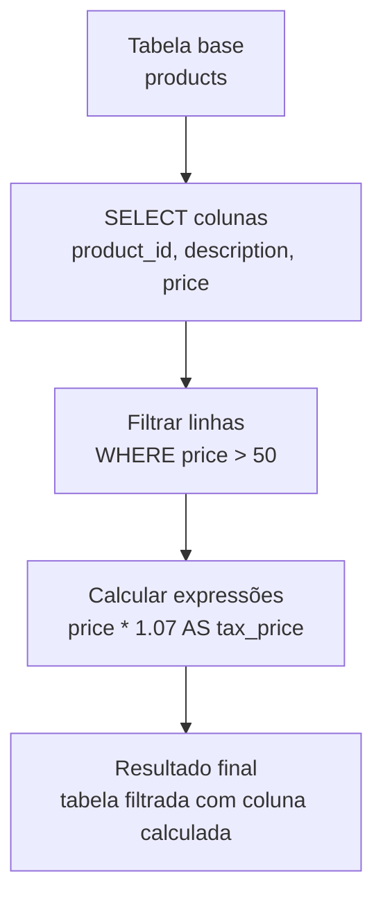

## Visão Geral do Conceito

Esta lição aprofunda o uso do **SELECT** em SQL, mostrando como usar **operadores de comparação**, **operadores lógicos** (`AND`, `OR`, `IN`) e **expressões** para filtrar e calcular dados sem alterar a tabela.  
Partindo de exemplos simples de tabelas (`customer`, `product`), você aprenderá a escrever consultas que selecionam apenas os registros relevantes e criam colunas calculadas no resultado da consulta.

O foco é transformar o SELECT em uma ferramenta flexível: além de “trazer tudo”, você passa a **perguntar** ao banco apenas o que precisa, combinando filtros e cálculos no mesmo comando.

## Modelo Mental

Pense em uma consulta SQL como uma **conversa estruturada** com o banco de dados:

- Os **operadores de comparação** (`>`, `<`, `>=`, `<=`, `=`, `!=`) definem **critérios**: “só quero registros com idade maior que 30”, “só quero produtos mais caros que R$ 100,00”.  
- Os **operadores lógicos** (`AND`, `OR`, `IN`) combinam esses critérios: “maior que 30 **e** do estado SP”, “da categoria X **ou** da categoria Y”, “dentro desta lista de valores”.  
- As **expressões** em SELECT (como `price * 1.07`) criam **colunas derivadas**: novos valores calculados a partir das colunas existentes, sem mexer na estrutura da tabela.

O resultado é como uma **planilha filtrada e enriquecida** gerada sob demanda: você não altera o arquivo original, apenas cria uma visão específica para o que precisa naquele momento.

## Mecânica Central

### Operadores de comparação em WHERE

Os operadores de comparação em SQL permitem comparar valores de colunas com constantes ou com outras colunas:

- `>` (maior que).  
- `<` (menor que).  
- `>=` (maior ou igual).  
- `<=` (menor ou igual).  
- `=` (igual).  
- `!=` ou `<>` (diferente, dependendo do dialeto SQL).

Exemplos de uso:

```sql
-- Clientes com idade maior que 30
SELECT *
FROM clientes
WHERE idade > 30;

-- Produtos com preço menor ou igual a 50
SELECT *
FROM produtos
WHERE preco <= 50.00;
```

### Operadores lógicos AND, OR e IN

Os operadores lógicos combinam condições:

- `AND` — todas as condições precisam ser verdadeiras.  
- `OR` — pelo menos uma condição precisa ser verdadeira.  
- `IN` — verifica se um valor está **dentro** de uma lista.

Exemplos:

```sql
-- Clientes de SP com idade maior que 30
SELECT nome, idade, uf
FROM clientes
WHERE idade > 30
  AND uf = 'SP';

-- Clientes de MG OU ES
SELECT nome, idade, uf
FROM clientes
WHERE uf = 'MG'
   OR uf = 'ES';

-- Mesma lógica, mas usando IN
SELECT nome, idade, uf
FROM clientes
WHERE uf IN ('MG', 'ES');
```

`IN` deixa a consulta mais legível quando você precisa testar **vários valores** para a mesma coluna.

### Expressões em SELECT e aliases

Uma **expressão** em SELECT é um cálculo feito a partir de colunas e constantes, que gera uma coluna apenas no resultado da consulta.  
Ela não altera a tabela, apenas **aparece na saída**.

Exemplo de expressão para calcular preço com taxa:

```sql
SELECT
  product_id,
  description,
  price,
  price * 1.07 AS tax_price
FROM products;
```

Aqui:

- `price * 1.07` é a expressão (preço original + 7% de taxa).  
- `AS tax_price` é o **alias** (apelido) que define o nome do cabeçalho da coluna calculada.

> **Regra:** expressões em SELECT são ideais para cálculos pontuais (percentuais, conversões, formatações) sem necessidade de alterar a estrutura da tabela.

Você também pode usar aliases para renomear colunas existentes:

```sql
SELECT
  product_id AS id_produto,
  description AS descricao,
  price AS preco_sem_taxa
FROM products;
```

### Fluxo lógico de uma consulta com filtros e expressões

Podemos representar o fluxo de uma consulta típica assim:



Na prática:

```sql
SELECT
  product_id,
  description,
  price,
  price * 1.07 AS tax_price
FROM products
WHERE price > 50.00;
```

## Uso Prático

### 1. SELECT básico vs SELECT com colunas específicas

Para ver todas as colunas e todas as linhas de uma tabela:

```sql
SELECT *
FROM customer;
```

Para ver apenas algumas colunas (por exemplo, id e nome do cliente):

```sql
SELECT
  customer_id,
  name
FROM customer;
```

### 2. Filtrando registros com WHERE e operadores de comparação

Exemplo: clientes com idade entre 25 e 40 anos:

```sql
SELECT
  nome,
  idade,
  uf
FROM clientes
WHERE idade >= 25
  AND idade <= 40;
```

Exemplo: produtos com preço maior que R$ 100,00:

```sql
SELECT
  product_id,
  description,
  price
FROM products
WHERE price > 100.00;
```

### 3. Combinando condições com AND, OR e IN

Clientes com idade maior que 30 **e** do estado 'SP':

```sql
SELECT
  nome,
  idade,
  uf
FROM clientes
WHERE idade > 30
  AND uf = 'SP';
```

Clientes de 'SP' **ou** 'RJ':

```sql
SELECT
  nome,
  idade,
  uf
FROM clientes
WHERE uf = 'SP'
   OR uf = 'RJ';
```

Mesma consulta usando `IN`:

```sql
SELECT
  nome,
  idade,
  uf
FROM clientes
WHERE uf IN ('SP', 'RJ');
```

### 4. Criando colunas calculadas com expressões

Exemplo: calcular preço com taxa de 7%:

```sql
SELECT
  product_id,
  description,
  price AS base_price,
  price * 1.07 AS tax_price
FROM products;
```

Exemplo: calcular apenas o valor da taxa (sem o preço original):

```sql
SELECT
  product_id,
  description,
  price,
  price * 0.07 AS tax_only
FROM products;
```

Usar `1.07` preserva o valor original e adiciona 7%; usar `0.07` mostra apenas a parte correspondente à taxa.

### 5. Usando funções em expressões

Você pode combinar funções com expressões.  
Por exemplo, arredondar o preço com taxa para duas casas decimais:

```sql
SELECT
  product_id,
  description,
  price,
  ROUND(price * 1.07, 2) AS tax_price_rounded
FROM products;
```

O comportamento exato de `ROUND` pode variar um pouco entre bancos, mas a ideia é a mesma: ajustar o número de casas decimais do resultado.

## Erros Comuns

- **Esquecer de limitar o escopo do WHERE**  
  - Problema: usar apenas `OR` sem parênteses e obter mais registros do que deveria.  
  - Correção: usar `AND`/`OR` com cuidado e, quando necessário, parênteses para deixar a lógica explícita.

- **Confundir `=` com `IN`**  
  - Problema: escrever várias condições repetidas com `OR` para o mesmo campo.  
  - Correção: preferir `IN` quando a intenção é “estar em uma lista de valores”.

- **Achar que expressões criam colunas permanentes**  
  - Problema: esperar encontrar a coluna calculada na definição da tabela depois do SELECT.  
  - Correção: lembrar que expressões alteram apenas o resultado da consulta; para persistir o valor, seria preciso um `UPDATE` ou uma coluna calculada definida no esquema.

- **Misturar tipos em comparações**  
  - Problema: comparar textos com números ou datas armazenadas como texto sem conversão.  
  - Correção: garantir que os tipos de dados são compatíveis ou aplicar conversão adequada antes de comparar.

## Visão Geral de Debugging

Quando uma consulta com WHERE e expressões não retorna o que você espera:

- **1. Teste partes menores da condição**  
  - Execute consultas separadas com cada condição (`WHERE idade > 30`, depois `WHERE uf = 'SP'`) para entender qual parte está filtrando demais ou de menos.

- **2. Remova temporariamente o WHERE**  
  - Veja alguns registros sem filtro para confirmar que os dados estão no formato esperado.

- **3. Teste a expressão isoladamente**  
  - Por exemplo, `SELECT price, price * 1.07 FROM products` para verificar se o cálculo faz sentido.

- **4. Use aliases descritivos**  
  - Dar nomes claros às colunas calculadas ajuda a evitar confusão ao ler resultados e interpretar erros.

## Principais Pontos

- Operadores de comparação e lógicos em WHERE transformam SELECT em uma ferramenta poderosa de filtro.  
- `AND`, `OR` e `IN` permitem combinar condições de forma expressiva e legível.  
- Expressões em SELECT criam colunas calculadas apenas no resultado da consulta, sem alterar a tabela.  
- Aliases tornam os cabeçalhos mais claros e ajudam na leitura de resultados, especialmente quando há cálculos.

## Preparação para Prática

Depois desta lição, você deve ser capaz de:

- Escrever consultas SELECT que filtram registros com base em múltiplas condições combinadas.  
- Criar colunas calculadas para aplicar porcentagens, somas, diferenças e outras transformações simples.  
- Usar aliases para tornar os resultados mais legíveis.  
- Depurar consultas verificando passo a passo as condições e expressões.

No Laboratório de Prática, você irá:

- Montar consultas em cima de tabelas simples (clientes, produtos) usando operadores e expressões.  
- Traduzir regras de negócio verbais (“clientes de SP com idade maior que 30”) em WHEREs corretos.  
- Explorar a diferença entre “preço com taxa” e “somente taxa”.

## Laboratório de Prática

### Easy — Filtrando clientes por idade e estado

Você tem uma tabela `clientes` com colunas `nome`, `idade` e `uf`.  
Escreva uma consulta que retorne apenas os clientes:

- Com idade maior ou igual a 25.  
- Que moram em 'SP' ou 'RJ'.

```sql
-- TODO: completar a consulta com as condições corretas
SELECT
  nome,
  idade,
  uf
FROM clientes
WHERE idade >= 25
  AND uf IN ('SP', 'RJ');
```

Teste variações trocando os valores numéricos e os estados para ver o efeito no resultado.

### Medium — Calculando preço com taxa e somente taxa

Você tem uma tabela `products` com colunas `product_id`, `description` e `price`.  
Escreva uma consulta que traga:

- O identificador e a descrição.  
- O preço original.  
- O preço com 15% de taxa.  
- Apenas o valor da taxa.

```sql
-- TODO: completar os cálculos com multiplicadores adequados
SELECT
  product_id,
  description,
  price AS base_price,
  ROUND(price * 1.15, 2) AS price_with_tax,
  ROUND(price * 0.15, 2) AS tax_only
FROM products;
```

Experimente alterar a taxa (por exemplo, 7%, 20%) para perceber o impacto na expressão.

### Hard — Combinar múltiplos filtros e expressões em uma única consulta

Você tem uma tabela `pedidos` com colunas:

- `id`.  
- `cliente_id`.  
- `valor_total`.  
- `status` (por exemplo, 'ABERTO', 'PAGO', 'CANCELADO').  
- `criado_em` (timestamp).

Escreva uma consulta que:

1. Traga apenas pedidos com `status = 'PAGO'`.  
2. Filtre para pedidos com `valor_total` maior que 100.  
3. Calcule uma coluna `valor_com_desconto` com 5% de desconto sobre `valor_total`.  
4. Mostre os resultados ordenados do maior para o menor `valor_total`.

```sql
-- TODO: combinar filtros e expressão na mesma consulta
SELECT
  id,
  cliente_id,
  valor_total,
  ROUND(valor_total * 0.95, 2) AS valor_com_desconto,
  criado_em
FROM pedidos
WHERE status = 'PAGO'
  AND valor_total > 100.00
ORDER BY
  valor_total DESC;
```

Pense em como essa consulta poderia ser usada para alimentar um relatório ou dashboard de faturamento.

<!-- CONCEPT_EXTRACTION
concepts:
  - operadores de comparacao em sql
  - operadores logicos and or in
  - uso da clausula where
  - expressoes em select e aliases
skills:
  - Escrever consultas SELECT com filtros compostos usando AND, OR e IN
  - Criar colunas calculadas em SELECT para aplicar percentuais e transformacoes simples
  - Nomear colunas com aliases para melhorar a legibilidade de resultados
  - Depurar consultas verificando condicoes e expressoes passo a passo
examples:
  - clientes-idade-estado-and-in
  - products-price-tax-expression
  - pedidos-filtrados-com-desconto
-->

<!-- EXERCISES_JSON
[
  {
    "id": "sql-operadores-expressoes-easy",
    "slug": "sql-operadores-expressoes-easy",
    "difficulty": "easy",
    "title": "Filtrar clientes por idade e estado",
    "discipline": "visualizacao-sql",
    "editorLanguage": "sql",
    "tags": ["sql", "where", "operadores-logicos"],
    "summary": "Escrever uma consulta SELECT que filtra clientes por idade mínima e lista de estados usando AND e IN."
  },
  {
    "id": "sql-operadores-expressoes-medium",
    "slug": "sql-operadores-expressoes-medium",
    "difficulty": "medium",
    "title": "Calcular preço com taxa e apenas taxa",
    "discipline": "visualizacao-sql",
    "editorLanguage": "sql",
    "tags": ["sql", "expressoes", "aliases"],
    "summary": "Criar uma consulta que calcula preço com taxa percentual e apenas o valor da taxa usando expressões em SELECT."
  },
  {
    "id": "sql-operadores-expressoes-hard",
    "slug": "sql-operadores-expressoes-hard",
    "difficulty": "hard",
    "title": "Combinar filtros e expressões em pedidos pagos",
    "discipline": "visualizacao-sql",
    "editorLanguage": "sql",
    "tags": ["sql", "where", "expressoes"],
    "summary": "Escrever uma consulta que filtra pedidos pagos por valor mínimo e calcula um valor com desconto em uma coluna derivada."
  }
]
-->

