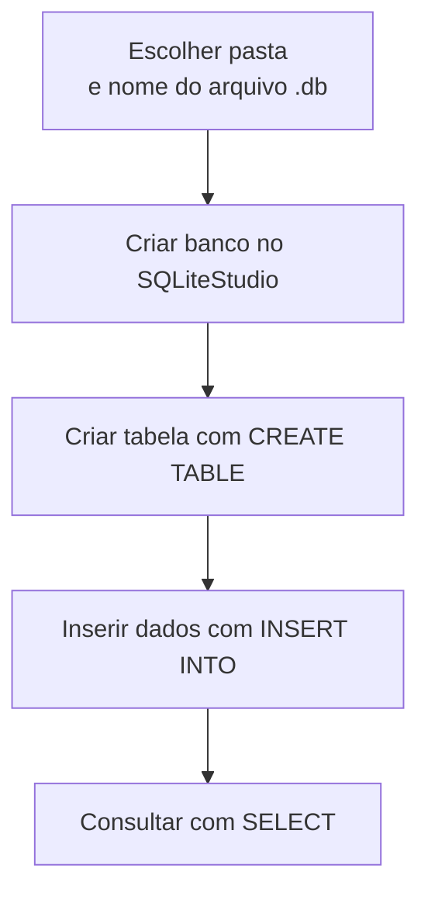

## Visão Geral do Conceito

Esta lição mostra como **sair do zero** em um banco de dados SQLite: criar um arquivo de banco, conectá-lo no **SQLiteStudio**, definir uma tabela com colunas e tipos adequados e populá-la com dados de exemplo usando **INSERT**.  
A aula se apoia em exemplos concretos como as tabelas `sportStars` e `instagram`, aproximando o uso de SQL de cenários reais (celebridades, seguidores, perfis de redes sociais).

O objetivo é que você se sinta confortável em abrir o SQLiteStudio, criar seu próprio banco e escrever os primeiros comandos de **DDL** (Data Definition Language, como `CREATE TABLE`) e **DML** (Data Manipulation Language, como `INSERT` e `SELECT`).

## Modelo Mental

Pense no SQLiteStudio como um **editor visual de bancos de dados**:

- O **arquivo `.db`** é como um “caderno de dados” guardado numa pasta do sistema operacional.  
- O **SQLiteStudio** é a ferramenta que abre esse caderno, mostra as tabelas e permite criar novas páginas (tabelas) e linhas (registros).  
- Os comandos SQL (`CREATE TABLE`, `INSERT`, `SELECT`) são as “anotações estruturadas” que você faz nesse caderno.

Quando você “remove” um banco da lista do SQLiteStudio, você **fecha o caderno na ferramenta**, mas o arquivo físico continua na estante (pasta).  
Só quando você apaga o arquivo `.db` no sistema de arquivos é que o caderno realmente deixa de existir.

## Mecânica Central

### Criando e conectando um banco de dados no SQLiteStudio

Passos gerais mostrados na aula:

1. Abrir o **SQLiteStudio**.  
2. Usar o menu **Database → Add a database** (ou equivalente em português).  
3. Na janela de configuração do banco:
   - Escolher a **pasta** onde o arquivo `.db` será criado.  
   - Definir um **nome de arquivo** (por exemplo, `aula6b.db`).  
   - Clicar em **Test connection** para verificar se tudo está correto.  
   - Confirmar em **OK**.

Depois disso:

- O novo banco aparece na lista à esquerda.  
- Com um **duplo clique**, ele é “ativado” (fica em destaque) e as seções de **Tables** e **Views** ficam disponíveis.

Se você remover o banco da lista (opção “Remover banco de dados” com botão direito), o arquivo `.db` permanece na pasta e pode ser re-adicionado depois.

### Criando uma tabela de exemplo (instagram)

Exemplo de tabela criada na aula:

- Nome da tabela: `instagram`.  
- Colunas:
  - `firstName` — nome (primeiro nome).  
  - `surname` — sobrenome.  
  - `career` — carreira (por exemplo, 'Footballer', 'Singer').  
  - `followersMillions` — número de seguidores em milhões (inteiro).  
  - `instagramHandle` — usuário/perfil no Instagram (por exemplo, `neymarjr`, `leomessi`).

Uma definição em SQL poderia ser:

```sql
CREATE TABLE instagram (
  firstName        VARCHAR(40),
  surname          VARCHAR(40),
  career           VARCHAR(20),
  followersMillions INT,
  instagramHandle  VARCHAR(30)
);
```

Aqui:

- `VARCHAR` é usado para textos de tamanho variável, com um limite máximo.  
- `INT` é usado para o número de seguidores em milhões (valor inteiro).

### Inserindo dados de exemplo com INSERT

Depois de criar a tabela, você pode popular com alguns registros:

```sql
INSERT INTO instagram VALUES ('National', 'Geographic', 'Magazine', 145, 'natgeo');
INSERT INTO instagram VALUES ('Neymar', 'da Silva Santos, Jr', 'Footballer', 142, 'neymarjr');
INSERT INTO instagram VALUES ('Leo', 'Messi', 'Footballer', 167, 'leomessi');
INSERT INTO instagram VALUES ('Beyonce', 'Giselle Knowles', 'Singer', 155, 'beyonce');
INSERT INTO instagram VALUES ('Selena', 'Gomez', 'Singer', 194, 'selenagomez');
INSERT INTO instagram VALUES ('Kim', 'Kardashian', 'Media Personality', 189, 'kimkardashian');
INSERT INTO instagram VALUES ('Dwayne', 'Johnson', 'Actor', 200, 'therock');
INSERT INTO instagram VALUES ('Ariana', 'Grande', 'Singer', 203, 'arianagrande');
INSERT INTO instagram VALUES ('Cristiano', 'Ronaldo', 'Footballer', 239, 'cristiano');
INSERT INTO instagram VALUES ('Instagram', '', 'Social media platform', 371, 'instagram');
```

Esses comandos são típicos da parte DML (manipulação de dados): cada `INSERT` adiciona uma nova linha à tabela.

### Consultando dados com SELECT

Para ver os registros inseridos:

```sql
SELECT *
FROM instagram;
```

Para ver apenas algumas colunas:

```sql
SELECT
  firstName,
  surname,
  followersMillions
FROM instagram;
```

Para aplicar filtros, você pode combinar com o que aprendeu na lição anterior (WHERE, operadores, etc.):

```sql
SELECT
  firstName,
  surname,
  followersMillions
FROM instagram
WHERE followersMillions > 200;
```

### Fluxo de trabalho no SQLiteStudio

O fluxo básico que a aula ilustra pode ser representado assim:



Esse ciclo se repete toda vez que você precisa testar um novo modelo de tabela ou exercício de SQL.

## Uso Prático

### 1. Criando um banco de dados de aula

Em um contexto de aula, faz sentido criar arquivos separados por semana ou tema, como:

- `aula6a.db`, `aula6b.db`, etc.

Passos:

1. No SQLiteStudio, remova da lista bancos antigos se quiser limpar a visualização (sem apagar os arquivos).  
2. Use **Add a database** para criar `aula11.db` (por exemplo).  
3. Ative o banco com duplo clique.

### 2. Criando uma tabela de celebridades esportivas

Além de `instagram`, a aula menciona a tabela `sportStars`.  
Uma definição possível:

```sql
CREATE TABLE sportStars (
  firstName   VARCHAR(40),
  surname     VARCHAR(40),
  monthBorn   VARCHAR(20),
  yearOfBirth INT,
  sport       VARCHAR(30)
);
```

Você pode então inserir registros com `INSERT` e praticar `SELECT` filtrando por mês de nascimento, ano ou tipo de esporte.

### 3. Combinando criação de tabela, INSERT e SELECT

Um exemplo completo:

```sql
-- Criar tabela
CREATE TABLE exemplo (
  id    INT,
  nome  VARCHAR(100),
  valor NUMERIC(10,2)
);

-- Inserir alguns registros
INSERT INTO exemplo VALUES (1, 'Item A', 100.00);
INSERT INTO exemplo VALUES (2, 'Item B', 250.50);
INSERT INTO exemplo VALUES (3, 'Item C', 75.25);

-- Consultar dados
SELECT *
FROM exemplo;
```

Esse padrão se repete com qualquer tabela que você criar.

## Erros Comuns

- **Confundir remoção da lista com exclusão do arquivo**  
  - Problema: achar que ao remover o banco no SQLiteStudio, o arquivo `.db` foi apagado.  
  - Correção: lembrar que remover da lista só afeta a ferramenta; o arquivo físico precisa ser apagado manualmente se você quiser removê-lo de fato.

- **Definir tipos de dados muito restritivos ou muito largos**  
  - Problema: usar `VARCHAR(5)` para nomes ou `VARCHAR(255)` sem necessidade em todos os campos.  
  - Correção: escolher limites razoáveis de acordo com o domínio (por exemplo, 40 para nomes, 30 para handles de redes sociais).

- **Esquecer de ativar o banco antes de criar tabelas**  
  - Problema: criar tabelas no banco errado por não ter dado duplo clique no banco correto.  
  - Correção: sempre confirmar qual banco está ativo na barra e na árvore de bancos.

- **Não testar SELECT após INSERT**  
  - Problema: inserir dados sem conferir se realmente foram gravados como esperado.  
  - Correção: executar `SELECT *` após um conjunto de `INSERTs` para validar o conteúdo.

## Visão Geral de Debugging

Quando algo não funciona ao criar ou popular tabelas:

- **1. Verifique se está no banco correto**  
  - Confirme qual arquivo `.db` está ativo no SQLiteStudio.

- **2. Revise o comando `CREATE TABLE`**  
  - Verifique se os nomes de colunas não têm erros de digitação.  
  - Confirme se os tipos de dados são suportados pelo SQLite.

- **3. Confira os `INSERTs`**  
  - Veja se a quantidade de valores em `VALUES (...)` bate com a quantidade de colunas da tabela.  
  - Verifique se as aspas e vírgulas estão corretas.

- **4. Use `SELECT *` para validar**  
  - Se os dados não aparecem, é possível que o `INSERT` não tenha sido executado ou tenha falhado com erro.

## Principais Pontos

- O SQLiteStudio facilita criar e gerenciar bancos SQLite por meio de uma interface gráfica.  
- Criar um banco envolve escolher uma pasta, um nome de arquivo e testar a conexão.  
- Definir uma tabela exige escolher nomes de colunas e tipos de dados coerentes.  
- `INSERT` e `SELECT` são os primeiros comandos DML que você usa para popular e explorar as tabelas recém-criadas.

## Preparação para Prática

Após esta lição, você deve ser capaz de:

- Abrir o SQLiteStudio e criar um novo arquivo de banco de dados.  
- Definir uma tabela simples com colunas adequadas ao domínio.  
- Inserir dados de exemplo e conferir com SELECT.  
- Repetir esse fluxo sempre que precisar testar um novo modelo ou exercício de SQL.

No Laboratório de Prática, você irá:

- Modelar e criar uma tabela inspirada em redes sociais.  
- Inserir registros manualmente.  
- Rodar consultas básicas para explorar os dados.

## Laboratório de Prática

### Easy — Criando tabela de instagram no SQLite

Modele e crie a tabela `instagram` no seu banco SQLite com as mesmas colunas usadas na aula:

- `firstName` (`VARCHAR(40)`)  
- `surname` (`VARCHAR(40)`)  
- `career` (`VARCHAR(20)`)  
- `followersMillions` (`INT`)  
- `instagramHandle` (`VARCHAR(30)`)

```sql
-- TODO: criar a tabela instagram conforme o modelo descrito
CREATE TABLE instagram (
  firstName         VARCHAR(40),
  surname           VARCHAR(40),
  career            VARCHAR(20),
  followersMillions INT,
  instagramHandle   VARCHAR(30)
);
```

Depois de criar, use `SELECT * FROM instagram;` para confirmar que a tabela existe (mesmo vazia).

### Medium — Inserindo celebridades e consultando seguidores

Insira pelo menos 5 registros na tabela `instagram` e escreva uma consulta que retorne apenas quem tem mais de 150 milhões de seguidores.

```sql
-- TODO: inserir registros de exemplo
INSERT INTO instagram VALUES ('Neymar', 'da Silva Santos, Jr', 'Footballer', 142, 'neymarjr');
INSERT INTO instagram VALUES ('Leo', 'Messi', 'Footballer', 167, 'leomessi');
INSERT INTO instagram VALUES ('Cristiano', 'Ronaldo', 'Footballer', 239, 'cristiano');
INSERT INTO instagram VALUES ('Ariana', 'Grande', 'Singer', 203, 'arianagrande');
INSERT INTO instagram VALUES ('Instagram', '', 'Social media platform', 371, 'instagram');

-- TODO: consultar apenas quem tem mais de 150M de seguidores
SELECT
  firstName,
  surname,
  career,
  followersMillions,
  instagramHandle
FROM instagram
WHERE followersMillions > 150;
```

Altere os valores e o limite para observar como o resultado muda.

### Hard — Criando e populando uma nova tabela de rede social

Modele uma tabela `socialProfiles` com colunas:

- `id` (inteiro).  
- `platform` (por exemplo, 'Instagram', 'Twitter', 'TikTok').  
- `handle` (nome de usuário).  
- `followers` (inteiro com número absoluto de seguidores).  
- `created_at` (timestamp).

Crie a tabela e insira alguns registros, depois escreva uma consulta que retorna apenas perfis:

- Da plataforma 'Instagram'.  
- Com mais de 1.000.000 de seguidores.

```sql
-- TODO: criar a tabela socialProfiles
CREATE TABLE socialProfiles (
  id         INT,
  platform   VARCHAR(20),
  handle     VARCHAR(50),
  followers  INT,
  created_at TIMESTAMP
);

-- TODO: inserir alguns registros de exemplo
INSERT INTO socialProfiles VALUES (1, 'Instagram', 'exemplo1', 1500000, CURRENT_TIMESTAMP);
INSERT INTO socialProfiles VALUES (2, 'Twitter', 'exemplo2', 500000, CURRENT_TIMESTAMP);
INSERT INTO socialProfiles VALUES (3, 'Instagram', 'exemplo3', 2500000, CURRENT_TIMESTAMP);

-- TODO: consultar apenas perfis de Instagram com mais de 1M de seguidores
SELECT
  id,
  platform,
  handle,
  followers,
  created_at
FROM socialProfiles
WHERE platform = 'Instagram'
  AND followers > 1000000;
```

Pense em como essa tabela poderia ser usada em dashboards de acompanhamento de redes sociais.

<!-- CONCEPT_EXTRACTION
concepts:
  - criacao de bancos sqlite no sqlitestudio
  - definicao de tabelas com create table
  - insercao de registros com insert
  - consulta inicial com select
skills:
  - Criar e conectar bancos sqlite usando o sqlitestudio
  - Definir tabelas com colunas e tipos adequados
  - Inserir dados de exemplo e validar com select
  - Diferenciar entre remover banco da lista e apagar o arquivo fisico
examples:
  - tabela-instagram-sqlite
  - inserts-instagram-seguidores
  - socialprofiles-filtro-instagram-maior-1m
-->

<!-- EXERCISES_JSON
[
  {
    "id": "criando-tabelas-sqlite-easy",
    "slug": "criando-tabelas-sqlite-easy",
    "difficulty": "easy",
    "title": "Criar tabela instagram no SQLite",
    "discipline": "visualizacao-sql",
    "editorLanguage": "sql",
    "tags": ["sql", "create-table", "sqlite"],
    "summary": "Definir a tabela instagram no SQLite com colunas e tipos adequados."
  },
  {
    "id": "criando-tabelas-sqlite-medium",
    "slug": "criando-tabelas-sqlite-medium",
    "difficulty": "medium",
    "title": "Inserir e consultar seguidores no instagram",
    "discipline": "visualizacao-sql",
    "editorLanguage": "sql",
    "tags": ["sql", "insert", "select"],
    "summary": "Popular a tabela instagram com registros de celebridades e consultar quem tem mais de 150M de seguidores."
  },
  {
    "id": "criando-tabelas-sqlite-hard",
    "slug": "criando-tabelas-sqlite-hard",
    "difficulty": "hard",
    "title": "Modelar e consultar perfis em multiplas redes sociais",
    "discipline": "visualizacao-sql",
    "editorLanguage": "sql",
    "tags": ["sql", "modelagem", "create-table", "select"],
    "summary": "Criar a tabela socialProfiles, inserir registros de diferentes plataformas e filtrar apenas perfis de Instagram com mais de 1M de seguidores."
  }
]
-->

