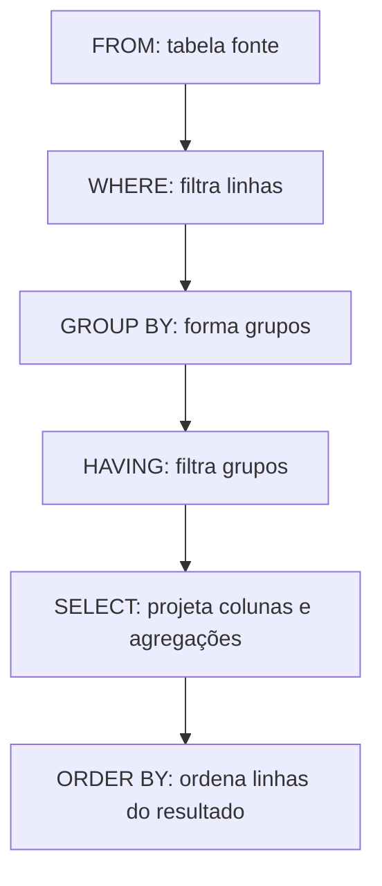
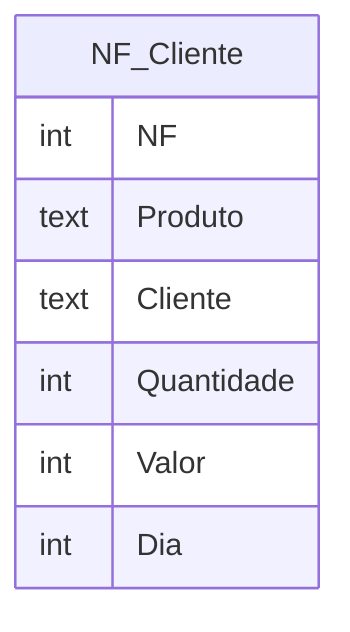

## Visão Geral do Conceito

Em relatórios reais você raramente quer **cada linha bruta** da base: quer **subtotais por cliente**, **contagem de pedidos por status** ou **vendas totais por plataforma**. Em SQL isso é feito com **funções de agregação** (<mark style="background-color: #242424; padding: 2px 4px; border-radius: 3px; color: inherit;">`SUM`</mark>, <mark style="background-color: #242424; padding: 2px 4px; border-radius: 3px; color: inherit;">`COUNT`</mark>, etc.) e com a cláusula <mark style="background-color: #242424; padding: 2px 4px; border-radius: 3px; color: inherit;">`GROUP BY`</mark>, que diz **por qual coluna (ou colunas)** esses totais são calculados.

A Etapa 8 do curso trabalha dois cenários: uma tabela simples de notas fiscais (<mark style="background-color: #242424; padding: 2px 4px; border-radius: 3px; color: inherit;">`NF_Cliente`</mark>) e o dataset público de vendas de jogos <mark style="background-color: #242424; padding: 2px 4px; border-radius: 3px; color: inherit;">`vgsales.csv`</mark>, importado para <mark style="background-color: #242424; padding: 2px 4px; border-radius: 3px; color: inherit;">`Vendas_Jogos`</mark>, para agrupar por plataforma, ano, gênero e editora. Referência complementar: capítulo sobre <mark style="background-color: #242424; padding: 2px 4px; border-radius: 3px; color: inherit;">`GROUP BY`</mark> e <mark style="background-color: #242424; padding: 2px 4px; border-radius: 3px; color: inherit;">`ORDER BY`</mark> em *Getting Started with SQL* (O’Reilly), citado no material da disciplina.

## Modelo Mental

Imagine uma planilha de vendas com milhares de linhas:

- Sem agrupamento, <mark style="background-color: #242424; padding: 2px 4px; border-radius: 3px; color: inherit;">`SUM(Valor)`</mark> vira **um único número** (o total geral).
- Com <mark style="background-color: #242424; padding: 2px 4px; border-radius: 3px; color: inherit;">`GROUP BY Cliente`</mark>, o banco **quebra a planilha em montinhos** — um montinho por cliente — e calcula <mark style="background-color: #242424; padding: 2px 4px; border-radius: 3px; color: inherit;">`SUM`</mark> e <mark style="background-color: #242424; padding: 2px 4px; border-radius: 3px; color: inherit;">`COUNT`</mark> **dentro de cada montinho**.

<mark style="background-color: #242424; padding: 2px 4px; border-radius: 3px; color: inherit;">`WHERE`</mark> atua **antes** de empilhar: remove linhas que não entram na análise.  
<mark style="background-color: #242424; padding: 2px 4px; border-radius: 3px; color: inherit;">`HAVING`</mark> atua **depois**: olha para cada **grupo** (já com sua soma, contagem, etc.) e descarta grupos inteiros que não atendem à condição.

Na aula, isso é enfatizado: *HAVING não examina a tabela original linha a linha como o WHERE faz para agregados; ele examina o resultado do agrupamento.*

## Mecânica Central

### Funções de agregação usadas na etapa

- <mark style="background-color: #242424; padding: 2px 4px; border-radius: 3px; color: inherit;">`SUM(coluna)`</mark> — soma valores numéricos do grupo; em SQL padrão, <mark style="background-color: #242424; padding: 2px 4px; border-radius: 3px; color: inherit;">`NULL`</mark> é ignorado na soma.
- <mark style="background-color: #242424; padding: 2px 4px; border-radius: 3px; color: inherit;">`COUNT(*)`</mark> — conta **linhas** do grupo (incluindo linhas onde alguma coluna é <mark style="background-color: #242424; padding: 2px 4px; border-radius: 3px; color: inherit;">`NULL`</mark>).
- <mark style="background-color: #242424; padding: 2px 4px; border-radius: 3px; color: inherit;">`COUNT(coluna)`</mark> — conta linhas em que **essa coluna** não é <mark style="background-color: #242424; padding: 2px 4px; border-radius: 3px; color: inherit;">`NULL`</mark>.

### GROUP BY e colunas no SELECT

> **Regra:** Toda coluna “não agregada” listada no <mark style="background-color: #242424; padding: 2px 4px; border-radius: 3px; color: inherit;">`SELECT`</mark> deve aparecer no <mark style="background-color: #242424; padding: 2px 4px; border-radius: 3px; color: inherit;">`GROUP BY`</mark> (ou ser funcionalmente dependente do agrupamento, em bancos que permitem modo estrito flexível — no SQLite do curso, pense no alinhamento 1:1).

Exemplo central do material (<mark style="background-color: #242424; padding: 2px 4px; border-radius: 3px; color: inherit;">`NF_Cliente`</mark>):

```sql
SELECT
  Cliente,
  SUM(Valor) AS Soma,
  COUNT(*) AS QtdeRegistros
FROM NF_Cliente
GROUP BY Cliente;
```

### HAVING

Filtra **grupos** com base em agregados ou em colunas de agrupamento, após o <mark style="background-color: #242424; padding: 2px 4px; border-radius: 3px; color: inherit;">`GROUP BY`</mark>:

```sql
SELECT
  Cliente,
  SUM(Valor) AS Soma,
  COUNT(*) AS QtdeRegistros
FROM NF_Cliente
GROUP BY Cliente
HAVING SUM(Valor) > 300
   AND COUNT(*) >= 1;
```

### Ordem lógica das cláusulas

A ordem **de escrita** típica é: <mark style="background-color: #242424; padding: 2px 4px; border-radius: 3px; color: inherit;">`SELECT`</mark> … <mark style="background-color: #242424; padding: 2px 4px; border-radius: 3px; color: inherit;">`FROM`</mark> … <mark style="background-color: #242424; padding: 2px 4px; border-radius: 3px; color: inherit;">`WHERE`</mark> … <mark style="background-color: #242424; padding: 2px 4px; border-radius: 3px; color: inherit;">`GROUP BY`</mark> … <mark style="background-color: #242424; padding: 2px 4px; border-radius: 3px; color: inherit;">`HAVING`</mark> … <mark style="background-color: #242424; padding: 2px 4px; border-radius: 3px; color: inherit;">`ORDER BY`</mark>.



### Modelo da tabela de notas fiscais



Cada linha representa um item em uma NF; o mesmo <mark style="background-color: #242424; padding: 2px 4px; border-radius: 3px; color: inherit;">`NF`</mark> pode aparecer mais de uma vez (vários produtos).

## Uso Prático

### 1. Totais globais e por cliente (<mark style="background-color: #242424; padding: 2px 4px; border-radius: 3px; color: inherit;">`NF_Cliente`</mark>)

```sql
-- Total geral de valor na tabela
SELECT SUM(Valor) FROM NF_Cliente;

-- Total apenas para o cliente C1 (filtro antes de agregar)
SELECT SUM(Valor)
FROM NF_Cliente
WHERE Cliente = 'C1';
```

### 2. Valores distintos e ordenação

```sql
SELECT DISTINCT Cliente FROM NF_Cliente ORDER BY Cliente;
```

<mark style="background-color: #242424; padding: 2px 4px; border-radius: 3px; color: inherit;">`DISTINCT`</mark> elimina duplicatas; <mark style="background-color: #242424; padding: 2px 4px; border-radius: 3px; color: inherit;">`ORDER BY`</mark> organiza o resultado (revisão integrada à etapa).

### 3. Efeito de NULL em Valor

Após inserir linhas com <mark style="background-color: #242424; padding: 2px 4px; border-radius: 3px; color: inherit;">`Valor`</mark> nulo:

```sql
SELECT
  Cliente,
  SUM(Valor) AS Soma,
  COUNT(*) AS QtdeLinhas,
  COUNT(Valor) AS QtdeValorNaoNulo
FROM NF_Cliente
GROUP BY Cliente;
```

Compare <mark style="background-color: #242424; padding: 2px 4px; border-radius: 3px; color: inherit;">`COUNT(*)`</mark> com <mark style="background-color: #242424; padding: 2px 4px; border-radius: 3px; color: inherit;">`COUNT(Valor)`</mark> para ver o impacto dos nulos.

### 4. Dataset vgsales no Excel e no SQLite

No material, o CSV é aberto no Excel e soma-se <mark style="background-color: #242424; padding: 2px 4px; border-radius: 3px; color: inherit;">`NA_Sales`</mark> + <mark style="background-color: #242424; padding: 2px 4px; border-radius: 3px; color: inherit;">`EU_Sales`</mark> + <mark style="background-color: #242424; padding: 2px 4px; border-radius: 3px; color: inherit;">`JP_Sales`</mark> + <mark style="background-color: #242424; padding: 2px 4px; border-radius: 3px; color: inherit;">`Other_Sales`</mark> e compara-se com <mark style="background-color: #242424; padding: 2px 4px; border-radius: 3px; color: inherit;">`Global_Sales`</mark>: **nem sempre bate** — útil para discutir qualidade de dados, arredondamento e origem do dataset.

No SQLiteStudio, importa-se o CSV para <mark style="background-color: #242424; padding: 2px 4px; border-radius: 3px; color: inherit;">`Vendas_Jogos`</mark> (primeira linha como cabeçalho, separador vírgula). O roteiro usa tipos numéricos inteiros nas colunas de venda; em bases reais o ideal é tipo decimal para milhões de cópias. A ideia pedagógica é reproduzir os <mark style="background-color: #242424; padding: 2px 4px; border-radius: 3px; color: inherit;">`GROUP BY`</mark> por dimensão:

```sql
SELECT
  Plataforma_Jogo,
  ROUND(SUM(Vendas_Mundial_Jogo), 2) AS Total_Mundial
FROM Vendas_Jogos
GROUP BY Plataforma_Jogo
ORDER BY Plataforma_Jogo;
```

Variações do texto da etapa: agrupar por <mark style="background-color: #242424; padding: 2px 4px; border-radius: 3px; color: inherit;">`Ano_Jogo`</mark>, <mark style="background-color: #242424; padding: 2px 4px; border-radius: 3px; color: inherit;">`Genero_Jogo`</mark>, <mark style="background-color: #242424; padding: 2px 4px; border-radius: 3px; color: inherit;">`Empresa_Jogo`</mark>, e ordenar pelo total regional ou mundial com <mark style="background-color: #242424; padding: 2px 4px; border-radius: 3px; color: inherit;">`DESC`</mark>.

### 5. WHERE e GROUP BY juntos

```sql
SELECT Cliente, SUM(Valor) AS Soma
FROM NF_Cliente
WHERE Cliente = 'C1'
GROUP BY Cliente;
```

<mark style="background-color: #242424; padding: 2px 4px; border-radius: 3px; color: inherit;">`WHERE`</mark> restringe **quais linhas entram** nos grupos; não substitui <mark style="background-color: #242424; padding: 2px 4px; border-radius: 3px; color: inherit;">`HAVING`</mark> para condição em <mark style="background-color: #242424; padding: 2px 4px; border-radius: 3px; color: inherit;">`SUM`</mark>.

## Erros Comuns

- **Usar WHERE com agregado (ex.: `WHERE SUM(Valor) > 300`)**  
  Sintoma: erro de sintaxe ou comportamento inesperado.  
  Correção: use <mark style="background-color: #242424; padding: 2px 4px; border-radius: 3px; color: inherit;">`HAVING SUM(Valor) > 300`</mark> após <mark style="background-color: #242424; padding: 2px 4px; border-radius: 3px; color: inherit;">`GROUP BY`</mark>.

- **Coluna no SELECT fora do GROUP BY**  
  Sintoma: erro ou (em modos permissivos de outros SGBDs) valor arbitrário.  
  Correção: inclua a coluna no <mark style="background-color: #242424; padding: 2px 4px; border-radius: 3px; color: inherit;">`GROUP BY`</mark> ou agregue-a com função adequada.

- **Confundir COUNT(*) com COUNT(coluna)**  
  Sintoma: contagens “estranhas” quando há <mark style="background-color: #242424; padding: 2px 4px; border-radius: 3px; color: inherit;">`NULL`</mark>.  
  Correção: escolha <mark style="background-color: #242424; padding: 2px 4px; border-radius: 3px; color: inherit;">`COUNT(*)`</mark> para linhas do grupo e <mark style="background-color: #242424; padding: 2px 4px; border-radius: 3px; color: inherit;">`COUNT(coluna)`</mark> para presença de valor na coluna.

- **Esperar ordem “natural” nos grupos**  
  Correção: sempre <mark style="background-color: #242424; padding: 2px 4px; border-radius: 3px; color: inherit;">`ORDER BY`</mark> explícito no relatório agregado.

- **Tipo de coluna inadequado na importação CSV**  
  Vendas fracionadas em colunas declaradas como inteiro podem truncar ou arredondar.  
  Correção: preferir <mark style="background-color: #242424; padding: 2px 4px; border-radius: 3px; color: inherit;">`REAL`</mark> ou <mark style="background-color: #242424; padding: 2px 4px; border-radius: 3px; color: inherit;">`NUMERIC`</mark> para métricas contínuas.

## Visão Geral de Debugging

- **Some ou contagem não batem com o Excel**  
  Verifique tipos na importação, separador decimal, linhas com <mark style="background-color: #242424; padding: 2px 4px; border-radius: 3px; color: inherit;">`N/A`</mark> no ano (o material filtra <mark style="background-color: #242424; padding: 2px 4px; border-radius: 3px; color: inherit;">`Ano_Jogo != 'N/A'`</mark> em um dos exemplos) e arredondamento com <mark style="background-color: #242424; padding: 2px 4px; border-radius: 3px; color: inherit;">`ROUND`</mark>.

- **HAVING “não funciona”**  
  Confira se há <mark style="background-color: #242424; padding: 2px 4px; border-radius: 3px; color: inherit;">`GROUP BY`</mark> antes e se a expressão no <mark style="background-color: #242424; padding: 2px 4px; border-radius: 3px; color: inherit;">`HAVING`</mark> usa agregação coerente com o grupo.

- **Grupos a mais ou a menos**  
  Revise espaços em branco em chaves textuais (<mark style="background-color: #242424; padding: 2px 4px; border-radius: 3px; color: inherit;">`'C1'`</mark> vs <mark style="background-color: #242424; padding: 2px 4px; border-radius: 3px; color: inherit;">`'C1 '`</mark>) e valores <mark style="background-color: #242424; padding: 2px 4px; border-radius: 3px; color: inherit;">`NULL`</mark> na coluna de agrupamento.

<details>
<summary>Conferência rápida: soma manual vs SUM</summary>

Para poucos registros, uma soma manual (<mark style="background-color: #242424; padding: 2px 4px; border-radius: 3px; color: inherit;">`160 + 34 + …`</mark> no slide) ajuda a validar o resultado de <mark style="background-color: #242424; padding: 2px 4px; border-radius: 3px; color: inherit;">`SUM(Valor)`</mark> antes de confiar em consultas maiores.

</details>

## Principais Pontos

- <mark style="background-color: #242424; padding: 2px 4px; border-radius: 3px; color: inherit;">`GROUP BY`</mark> define **dimensões** do relatório; agregações calculam **métricas** por dimensão.
- <mark style="background-color: #242424; padding: 2px 4px; border-radius: 3px; color: inherit;">`WHERE`</mark> filtra linhas; <mark style="background-color: #242424; padding: 2px 4px; border-radius: 3px; color: inherit;">`HAVING`</mark> filtra grupos após agregar.
- <mark style="background-color: #242424; padding: 2px 4px; border-radius: 3px; color: inherit;">`COUNT(*)`</mark> e <mark style="background-color: #242424; padding: 2px 4px; border-radius: 3px; color: inherit;">`COUNT(coluna)`</mark> divergem quando há <mark style="background-color: #242424; padding: 2px 4px; border-radius: 3px; color: inherit;">`NULL`</mark> na coluna.
- <mark style="background-color: #242424; padding: 2px 4px; border-radius: 3px; color: inherit;">`ORDER BY`</mark> ordena o **resultado final** (útil para rankings por total de vendas).
- O fluxo Excel ↔ SQL com <mark style="background-color: #242424; padding: 2px 4px; border-radius: 3px; color: inherit;">`vgsales`</mark> reforça leitura de schema, importação e sanidade de métricas.

## Preparação para Prática

Você deve ser capaz de:

- Criar <mark style="background-color: #242424; padding: 2px 4px; border-radius: 3px; color: inherit;">`NF_Cliente`</mark>, carregar os <mark style="background-color: #242424; padding: 2px 4px; border-radius: 3px; color: inherit;">`INSERT`</mark>s da etapa e reproduzir os <mark style="background-color: #242424; padding: 2px 4px; border-radius: 3px; color: inherit;">`SELECT`</mark> com agregação e <mark style="background-color: #242424; padding: 2px 4px; border-radius: 3px; color: inherit;">`HAVING`</mark>.
- Importar <mark style="background-color: #242424; padding: 2px 4px; border-radius: 3px; color: inherit;">`vgsales.csv`</mark> para <mark style="background-color: #242424; padding: 2px 4px; border-radius: 3px; color: inherit;">`Vendas_Jogos`</mark> e montar agrupamentos por plataforma, ano, gênero e editora com ordenação por total.

No Laboratório abaixo, use o mesmo ambiente (SQLiteStudio) e tabelas da etapa.

## Laboratório de Prática

### Easy — Filtrar grupos com HAVING

Sobre a tabela <mark style="background-color: #242424; padding: 2px 4px; border-radius: 3px; color: inherit;">`NF_Cliente`</mark>, parta da agregação por cliente e **adicione** uma cláusula para manter apenas clientes cuja soma de <mark style="background-color: #242424; padding: 2px 4px; border-radius: 3px; color: inherit;">`Valor`</mark> seja estritamente maior que 300.

```sql
SELECT
  Cliente,
  SUM(Valor) AS Soma,
  COUNT(*) AS QtdeRegistros
FROM NF_Cliente
GROUP BY Cliente
-- TODO: adicionar HAVING com SUM(Valor) > 300
;
```

### Medium — COUNT(*) versus COUNT(Valor)

Escreva uma única consulta agrupada por <mark style="background-color: #242424; padding: 2px 4px; border-radius: 3px; color: inherit;">`Cliente`</mark> que mostre <mark style="background-color: #242424; padding: 2px 4px; border-radius: 3px; color: inherit;">`SUM(Valor)`</mark>, <mark style="background-color: #242424; padding: 2px 4px; border-radius: 3px; color: inherit;">`COUNT(*)`</mark> e <mark style="background-color: #242424; padding: 2px 4px; border-radius: 3px; color: inherit;">`COUNT(Valor)`</mark>. Rode antes e depois de inserir linhas com <mark style="background-color: #242424; padding: 2px 4px; border-radius: 3px; color: inherit;">`Valor`</mark> nulo (como no roteiro da etapa) e compare as colunas de contagem.

```sql
-- TODO: incluir COUNT(Valor) com alias (ex.: QtdeValorNaoNulo) e comparar com COUNT(*)
SELECT
  Cliente,
  SUM(Valor) AS Soma,
  COUNT(*) AS QtdeAsterisco
FROM NF_Cliente
GROUP BY Cliente;
```

### Hard — Ranking de gêneros por vendas mundiais

Assumindo a tabela <mark style="background-color: #242424; padding: 2px 4px; border-radius: 3px; color: inherit;">`Vendas_Jogos`</mark> preenchida a partir de <mark style="background-color: #242424; padding: 2px 4px; border-radius: 3px; color: inherit;">`vgsales.csv`</mark>, produza um relatório com <mark style="background-color: #242424; padding: 2px 4px; border-radius: 3px; color: inherit;">`Genero_Jogo`</mark> e soma arredondada de <mark style="background-color: #242424; padding: 2px 4px; border-radius: 3px; color: inherit;">`Vendas_Mundial_Jogo`</mark>, **ordenado do gênero com maior total para o menor**.

```sql
SELECT
  Genero_Jogo,
  ROUND(SUM(Vendas_Mundial_Jogo), 2) AS Total_Mundial
FROM Vendas_Jogos
GROUP BY Genero_Jogo
-- TODO: adicionar ORDER BY para ordenar por Total_Mundial DESC
;
```

<!-- CONCEPT_EXTRACTION
concepts:
  - SUM e COUNT em SQL
  - GROUP BY por dimensão
  - HAVING para filtrar grupos
  - WHERE antes da agregação
  - COUNT asterisco vs COUNT coluna com NULL
  - ORDER BY em consultas agregadas
  - importação CSV vgsales para SQLite
skills:
  - Calcular totais e contagens por grupo com GROUP BY
  - Diferenciar filtro de linhas (WHERE) de filtro de grupos (HAVING)
  - Interpretar resultados quando há valores NULL em colunas agregadas
  - Montar rankings com ORDER BY sobre expressões agregadas
  - Validar consistência de métricas entre planilha e banco
examples:
  - nf-cliente-sum-por-cliente
  - nf-cliente-having-soma-minima
  - nf-cliente-count-null-valor
  - vgsales-group-by-genero-order-desc
-->

<!-- EXERCISES_JSON
[
  {
    "id": "sql-group-by-having-easy",
    "slug": "sql-group-by-having-easy",
    "difficulty": "easy",
    "title": "Filtrar grupos com HAVING na NF_Cliente",
    "discipline": "visualizacao-sql",
    "editorLanguage": "sql",
    "tags": ["sql", "group-by", "having", "sum"],
    "summary": "Completar a consulta agregada por cliente com HAVING para manter apenas somas acima de 300."
  },
  {
    "id": "sql-group-by-having-medium",
    "slug": "sql-group-by-having-medium",
    "difficulty": "medium",
    "title": "Comparar COUNT(*) e COUNT(Valor) com NULL",
    "discipline": "visualizacao-sql",
    "editorLanguage": "sql",
    "tags": ["sql", "group-by", "count", "null"],
    "summary": "Montar consulta agrupada que expõe diferença entre COUNT(*) e COUNT(Valor) na presença de nulos."
  },
  {
    "id": "sql-group-by-having-hard",
    "slug": "sql-group-by-having-hard",
    "difficulty": "hard",
    "title": "Ranking de generos por vendas mundiais (vgsales)",
    "discipline": "visualizacao-sql",
    "editorLanguage": "sql",
    "tags": ["sql", "group-by", "order-by", "vgsales"],
    "summary": "Agrupar vendas por genero e ordenar pelo total mundial decrescente como em relatorio de BI."
  }
]
-->
