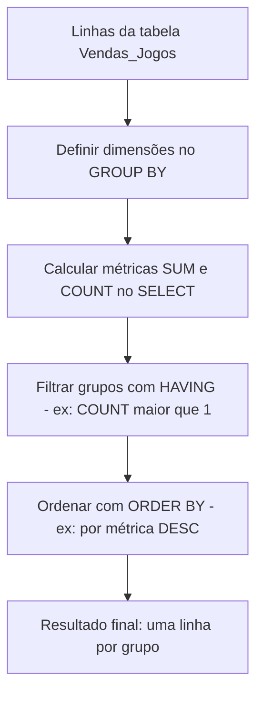
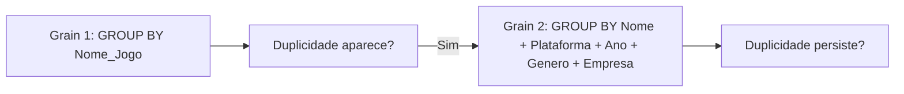

## Visão Geral do Conceito

Na Aula 14, você viu <mark style="background-color: #242424; padding: 2px 4px; border-radius: 3px; color: inherit;">`GROUP BY`</mark> e <mark style="background-color: #242424; padding: 2px 4px; border-radius: 3px; color: inherit;">`HAVING`</mark> para criar relatórios com totais e contagens.

Nesta lição, o foco é um uso ainda mais “de analista”: transformar o <mark style="background-color: #242424; padding: 2px 4px; border-radius: 3px; color: inherit;">`vgsales`</mark> em:

- ranking de vendas (por <mark style="background-color: #242424; padding: 2px 4px; border-radius: 3px; color: inherit;">`Genero_Jogo`</mark>, <mark style="background-color: #242424; padding: 2px 4px; border-radius: 3px; color: inherit;">`Empresa_Jogo`</mark>, etc.) usando <mark style="background-color: #242424; padding: 2px 4px; border-radius: 3px; color: inherit;">`SUM`</mark> e <mark style="background-color: #242424; padding: 2px 4px; border-radius: 3px; color: inherit;">`ORDER BY`</mark>;
- diagnóstico de duplicidade usando <mark style="background-color: #242424; padding: 2px 4px; border-radius: 3px; color: inherit;">`COUNT(*)`</mark> e <mark style="background-color: #242424; padding: 2px 4px; border-radius: 3px; color: inherit;">`HAVING COUNT(*) > 1`</mark>.

A ideia central (dita na transcrição) é que o conjunto de colunas no <mark style="background-color: #242424; padding: 2px 4px; border-radius: 3px; color: inherit;">`GROUP BY`</mark> define a “granularidade” do resultado: quando você adiciona dimensões, você muda o tamanho dos grupos e a contagem muda também.

## Modelo Mental

Pense em duas peças:

1. Dimensões: são as colunas que você lista no <mark style="background-color: #242424; padding: 2px 4px; border-radius: 3px; color: inherit;">`GROUP BY`</mark> (ex.: nome do jogo, plataforma, ano, gênero, empresa). Elas definem “qual agrupamento” está sendo analisado.
2. Métrica: é a agregação calculada no <mark style="background-color: #242424; padding: 2px 4px; border-radius: 3px; color: inherit;">`SELECT`</mark> (ex.: <mark style="background-color: #242424; padding: 2px 4px; border-radius: 3px; color: inherit;">`SUM(Vendas_Mundial_Jogo)`</mark> ou <mark style="background-color: #242424; padding: 2px 4px; border-radius: 3px; color: inherit;">`COUNT(*)`</mark>).

Quando você detecta que “um jogo aparece muitas vezes”, isso pode acontecer por diferentes motivos:

- Você agrupou em um nível alto (ex.: só por <mark style="background-color: #242424; padding: 2px 4px; border-radius: 3px; color: inherit;">`Nome_Jogo`</mark>), então registros distintos caem no mesmo grupo.
- Você agrupou em um nível mais fino (ex.: <mark style="background-color: #242424; padding: 2px 4px; border-radius: 3px; color: inherit;">`Nome_Jogo`</mark> + <mark style="background-color: #242424; padding: 2px 4px; border-radius: 3px; color: inherit;">`Plataforma_Jogo`</mark> + <mark style="background-color: #242424; padding: 2px 4px; border-radius: 3px; color: inherit;">`Ano_Jogo`</mark> + ...), e aí a duplicidade pode desaparecer.

Isso é exatamente o que a Aula 15 demonstra ao: primeiro contar por nome; depois contar por combinações maiores de dimensões para “ver se a duplicidade persiste”.

## Mecânica Central

<mark style="background-color: #242424; padding: 2px 4px; border-radius: 3px; color: inherit;">`GROUP BY`</mark> + agregações + <mark style="background-color: #242424; padding: 2px 4px; border-radius: 3px; color: inherit;">`HAVING`</mark> forma um pipeline lógico:



### ORDER BY em cima de métricas agregadas

Para criar ranking, você mede uma métrica por grupo (via <mark style="background-color: #242424; padding: 2px 4px; border-radius: 3px; color: inherit;">`SUM`</mark>) e depois ordena com <mark style="background-color: #242424; padding: 2px 4px; border-radius: 3px; color: inherit;">`ORDER BY ... DESC`</mark>.

Exemplo (ranking por <mark style="background-color: #242424; padding: 2px 4px; border-radius: 3px; color: inherit;">`Genero_Jogo`</mark>):

```sql
SELECT
  Genero_Jogo,
  ROUND(
    SUM(Vendas_EUA_Jogo + Vendas_Europa_Jogo + Vendas_Japao_Jogo + Vendas_Outros_Lugares_Jogo),
    2
  ) AS Soma_Regionais,
  ROUND(SUM(Vendas_Mundial_Jogo), 2) AS Soma_Mundial
FROM Vendas_Jogos
GROUP BY Genero_Jogo
ORDER BY Soma_Mundial DESC;
```

Na transcrição, a ordenação descendente é usada para responder “qual gênero mais vendeu”.

### GROUP BY composto define granularidade

Ao adicionar mais colunas ao <mark style="background-color: #242424; padding: 2px 4px; border-radius: 3px; color: inherit;">`GROUP BY`</mark>, você divide o conjunto em grupos menores.

Compare:

1) Agrupar apenas por nome:

```sql
SELECT
  Nome_Jogo,
  COUNT(*) AS QtdeRepeticoes
FROM Vendas_Jogos
GROUP BY Nome_Jogo;
```

2) Agrupar por nome + plataforma + ano + gênero + empresa:

```sql
SELECT
  Nome_Jogo,
  Plataforma_Jogo,
  Ano_Jogo,
  Genero_Jogo,
  Empresa_Jogo,
  COUNT(*) AS QtdeRepeticoes
FROM Vendas_Jogos
GROUP BY
  Nome_Jogo,
  Plataforma_Jogo,
  Ano_Jogo,
  Genero_Jogo,
  Empresa_Jogo;
```

A Aula 15 ressalta essa regra na prática: “se eu vou selecionar dimensões, eu preciso repetir essas dimensões no <mark style="background-color: #242424; padding: 2px 4px; border-radius: 3px; color: inherit;">`GROUP BY`</mark>”.

### Duplicidade com COUNT e HAVING

Para encontrar grupos “repetidos”, você usa <mark style="background-color: #242424; padding: 2px 4px; border-radius: 3px; color: inherit;">`COUNT(*)`</mark> como métrica e filtra com <mark style="background-color: #242424; padding: 2px 4px; border-radius: 3px; color: inherit;">`HAVING`</mark>.

Exemplo: nomes de jogos que aparecem mais de uma vez:

```sql
SELECT
  Nome_Jogo,
  COUNT(*) AS QtdeRepeticoes
FROM Vendas_Jogos
GROUP BY Nome_Jogo
HAVING COUNT(*) > 1
ORDER BY QtdeRepeticoes DESC;
```

Depois, para entender se a duplicidade é “crítica” ou apenas consequência de agrupar em nível alto, você aumenta o conjunto de dimensões no <mark style="background-color: #242424; padding: 2px 4px; border-radius: 3px; color: inherit;">`GROUP BY`</mark> e repete a análise.

### Quando duplicidade “some”

Uma duplicidade por nome (<mark style="background-color: #242424; padding: 2px 4px; border-radius: 3px; color: inherit;">`HAVING COUNT(*) > 1`</mark> em <mark style="background-color: #242424; padding: 2px 4px; border-radius: 3px; color: inherit;">`Nome_Jogo`</mark>) pode desaparecer quando você agrupa por combinação completa de dimensões. Isso sugere que as linhas eram “iguais” só no nome, mas diferentes em plataforma/ano/gênero/empresa.



## Uso Prático

### 1. Ranking: qual gênero mais vende?

Use um <mark style="background-color: #242424; padding: 2px 4px; border-radius: 3px; color: inherit;">`SUM`</mark> das vendas regionais (EUA, Europa, Japão e outros) para criar uma métrica, e <mark style="background-color: #242424; padding: 2px 4px; border-radius: 3px; color: inherit;">`ORDER BY ... DESC`</mark> para ranquear.

```sql
SELECT
  Genero_Jogo,
  ROUND(SUM(Vendas_Mundial_Jogo), 2) AS Total_Mundial
FROM Vendas_Jogos
GROUP BY Genero_Jogo
ORDER BY Total_Mundial DESC;
```

Se você preferir, pode ordenar pela métrica construída a partir do somatório das quatro colunas regionais (como o roteiro faz no Excel).

### 2. Duplicidade: quais nomes de jogos se repetem?

```sql
SELECT
  Nome_Jogo,
  COUNT(*) AS QtdeRepeticoes
FROM Vendas_Jogos
GROUP BY Nome_Jogo
HAVING COUNT(*) > 1
ORDER BY QtdeRepeticoes DESC;
```

Na Aula 15, a contagem total de linhas existe, e a contagem por nome reduz porque “o nome” é uma dimensão não única.

### 3. Diagnóstico: duplicidade persiste em granularidade mais fina?

Se quiser confirmar se a duplicidade é “crítica” (isto é, se existe mais de uma linha idêntica no nível de dimensões escolhido), agrupe por nome + plataforma + ano + gênero + empresa e aplique a mesma condição.

```sql
SELECT
  Nome_Jogo,
  Plataforma_Jogo,
  Ano_Jogo,
  Genero_Jogo,
  Empresa_Jogo,
  COUNT(*) AS QtdeRepeticoes
FROM Vendas_Jogos
GROUP BY
  Nome_Jogo,
  Plataforma_Jogo,
  Ano_Jogo,
  Genero_Jogo,
  Empresa_Jogo
HAVING COUNT(*) > 1
ORDER BY QtdeRepeticoes DESC;
```

Se retornar linhas, você tem duplicidade mesmo nesse nível de granularidade (e o próximo passo é inspecionar as linhas brutas com um <mark style="background-color: #242424; padding: 2px 4px; border-radius: 3px; color: inherit;">`SELECT`</mark> com <mark style="background-color: #242424; padding: 2px 4px; border-radius: 3px; color: inherit;">`WHERE`</mark> para uma combinação específica).

## Erros Comuns

- Esquecer colunas no <mark style="background-color: #242424; padding: 2px 4px; border-radius: 3px; color: inherit;">`GROUP BY`</mark> enquanto seleciona dimensões
  - Sintoma: erro do SQL ou resultados “sem sentido” (dependendo do SGBD/modo).
  - Correção: alinhar tudo que é dimensão no <mark style="background-color: #242424; padding: 2px 4px; border-radius: 3px; color: inherit;">`SELECT`</mark> com as colunas do <mark style="background-color: #242424; padding: 2px 4px; border-radius: 3px; color: inherit;">`GROUP BY`</mark>.

- Usar <mark style="background-color: #242424; padding: 2px 4px; border-radius: 3px; color: inherit;">`WHERE COUNT(*) > 1`</mark>
  - Sintoma: erro de sintaxe ou filtro que não faz o que você espera.
  - Correção: usar <mark style="background-color: #242424; padding: 2px 4px; border-radius: 3px; color: inherit;">`HAVING COUNT(*) > 1`</mark> após o <mark style="background-color: #242424; padding: 2px 4px; border-radius: 3px; color: inherit;">`GROUP BY`</mark>.

- Ordenar por uma coluna que não representa o ranking
  - Sintoma: “o mais vendido” aparece em posição inesperada.
  - Correção: ordenar pela métrica agregada correta (ex.: <mark style="background-color: #242424; padding: 2px 4px; border-radius: 3px; color: inherit;">`Total_Mundial`</mark> ou pela métrica de soma regionais).

- Interpretar duplicidade sem aumentar granularidade
  - Sintoma: você acha que há erro no dataset quando na verdade é apenas repetição em níveis diferentes (ex.: nome igual, mas plataforma/ano diferentes).
  - Correção: comparar o resultado em Grain 1 (nome) vs Grain 2 (nome + demais dimensões).

## Visão Geral de Debugging

Quando o resultado “não bate” ao tentar detectar duplicidade ou ranking:

1. Verifique se você realmente está agrupando pela dimensão que faz sentido para a pergunta (por nome? por nome+plataforma+ano?).
2. Confirme a métrica:
   - Se a pergunta é “quantas linhas”, use <mark style="background-color: #242424; padding: 2px 4px; border-radius: 3px; color: inherit;">`COUNT(*)`</mark>.
   - Se a pergunta é “valor total”, use <mark style="background-color: #242424; padding: 2px 4px; border-radius: 3px; color: inherit;">`SUM(...)`</mark> na coluna correta.
3. Separe em etapas:
   - primeiro: <mark style="background-color: #242424; padding: 2px 4px; border-radius: 3px; color: inherit;">`GROUP BY`</mark> + <mark style="background-color: #242424; padding: 2px 4px; border-radius: 3px; color: inherit;">`COUNT`</mark> sem <mark style="background-color: #242424; padding: 2px 4px; border-radius: 3px; color: inherit;">`HAVING`</mark>;
   - depois: adicione <mark style="background-color: #242424; padding: 2px 4px; border-radius: 3px; color: inherit;">`HAVING COUNT(*) > 1`</mark>.
4. Se ainda houver duplicidade, aumente o número de dimensões no <mark style="background-color: #242424; padding: 2px 4px; border-radius: 3px; color: inherit;">`GROUP BY`</mark> até o nível em que você considera “duplicado”.

<details>
<summary>Ajuda mental rápida: por que duplicidade muda quando adiciono dimensões?</summary>

Porque <mark style="background-color: #242424; padding: 2px 4px; border-radius: 3px; color: inherit;">`GROUP BY`</mark> cria grupos por combinação exata das dimensões. Mais dimensões significam mais combinações distintas e, portanto, menos linhas por grupo.

</details>

## Principais Pontos

- <mark style="background-color: #242424; padding: 2px 4px; border-radius: 3px; color: inherit;">`GROUP BY`</mark> composto define a granularidade do seu relatório.
- Rankings agregados usam <mark style="background-color: #242424; padding: 2px 4px; border-radius: 3px; color: inherit;">`ORDER BY`</mark> sobre métricas como <mark style="background-color: #242424; padding: 2px 4px; border-radius: 3px; color: inherit;">`SUM`</mark> ou <mark style="background-color: #242424; padding: 2px 4px; border-radius: 3px; color: inherit;">`COUNT`</mark>.
- Duplicidade se detecta com <mark style="background-color: #242424; padding: 2px 4px; border-radius: 3px; color: inherit;">`HAVING COUNT(*) > 1`</mark>.
- Para entender se duplicidade é “só nome” ou “só nesse nível”, compare múltiplos grains de <mark style="background-color: #242424; padding: 2px 4px; border-radius: 3px; color: inherit;">`GROUP BY`</mark>.

## Preparação para Prática

Depois desta lição, você deve ser capaz de:

- Montar um ranking por dimensão (ex.: gênero) usando <mark style="background-color: #242424; padding: 2px 4px; border-radius: 3px; color: inherit;">`SUM`</mark> e <mark style="background-color: #242424; padding: 2px 4px; border-radius: 3px; color: inherit;">`ORDER BY ... DESC`</mark>.
- Detectar duplicidade no dataset com <mark style="background-color: #242424; padding: 2px 4px; border-radius: 3px; color: inherit;">`COUNT(*)`</mark> + <mark style="background-color: #242424; padding: 2px 4px; border-radius: 3px; color: inherit;">`HAVING`</mark>.
- Ajustar a granularidade repetindo dimensões no <mark style="background-color: #242424; padding: 2px 4px; border-radius: 3px; color: inherit;">`GROUP BY`</mark> para diagnosticar quando a duplicidade “some”.

No Laboratório, você vai repetir exatamente esse raciocínio com a tabela <mark style="background-color: #242424; padding: 2px 4px; border-radius: 3px; color: inherit;">`Vendas_Jogos`</mark> importada do <mark style="background-color: #242424; padding: 2px 4px; border-radius: 3px; color: inherit;">`vgsales.csv`</mark>.

## Laboratório de Prática

### Easy — Ranking de gêneros por vendas mundiais

Escreva uma consulta que retorne:

- <mark style="background-color: #242424; padding: 2px 4px; border-radius: 3px; color: inherit;">`Genero_Jogo`</mark>
- uma métrica <mark style="background-color: #242424; padding: 2px 4px; border-radius: 3px; color: inherit;">`Total_Mundial`</mark> (soma arredondada)

e ordene do maior total para o menor.

```sql
-- TODO: calcular Total_Mundial e ordenar por Total_Mundial DESC
SELECT
  Genero_Jogo,
  ROUND(SUM(Vendas_Mundial_Jogo), 2) AS Total_Mundial
FROM Vendas_Jogos
GROUP BY Genero_Jogo
-- TODO: adicionar ORDER BY Total_Mundial DESC
;
```

### Medium — Nomes de jogos repetidos (COUNT) com HAVING

Escreva uma consulta que:

- agrupe por <mark style="background-color: #242424; padding: 2px 4px; border-radius: 3px; color: inherit;">`Nome_Jogo`</mark>
- conte <mark style="background-color: #242424; padding: 2px 4px; border-radius: 3px; color: inherit;">`COUNT(*)`</mark>
- mantenha apenas grupos com contagem maior que 1
- ordene por contagem decrescente

```sql
-- TODO: agrupar por Nome_Jogo e filtrar duplicidade com HAVING COUNT(*) > 1
SELECT
  Nome_Jogo,
  COUNT(*) AS QtdeRepeticoes
FROM Vendas_Jogos
GROUP BY Nome_Jogo
-- TODO: adicionar HAVING COUNT(*) > 1
-- TODO: ordenar por QtdeRepeticoes DESC
;
```

### Hard — Duplicidade em granularidade fina (5 dimensões)

Nesta tarefa você vai repetir o diagnóstico em um nível em que “duplicado” significa:

o mesmo <mark style="background-color: #242424; padding: 2px 4px; border-radius: 3px; color: inherit;">`Nome_Jogo`</mark> + <mark style="background-color: #242424; padding: 2px 4px; border-radius: 3px; color: inherit;">`Plataforma_Jogo`</mark> + <mark style="background-color: #242424; padding: 2px 4px; border-radius: 3px; color: inherit;">`Ano_Jogo`</mark> + <mark style="background-color: #242424; padding: 2px 4px; border-radius: 3px; color: inherit;">`Genero_Jogo`</mark> + <mark style="background-color: #242424; padding: 2px 4px; border-radius: 3px; color: inherit;">`Empresa_Jogo`</mark>.

```sql
-- TODO: agrupar por todas as 5 dimensões e filtrar apenas combinações repetidas
SELECT
  Nome_Jogo,
  Plataforma_Jogo,
  Ano_Jogo,
  Genero_Jogo,
  Empresa_Jogo,
  COUNT(*) AS QtdeRepeticoes
FROM Vendas_Jogos
GROUP BY
  Nome_Jogo,
  Plataforma_Jogo,
  Ano_Jogo,
  Genero_Jogo,
  Empresa_Jogo
-- TODO: adicionar HAVING COUNT(*) > 1
-- TODO: ordenar por QtdeRepeticoes DESC (opcional, mas recomendado)
;
```

Interprete o resultado: se não houver linhas, a duplicidade era “apenas no nome”. Se houver linhas, existe duplicidade mesmo no nível fino definido pelas 5 dimensões.

<!-- CONCEPT_EXTRACTION
concepts:
  - group by composto
  - granularidade de agregacao
  - order by em ranking agregado
  - count para detectar repeticoes
  - having count maior que 1
skills:
  - Construir rankings agregados com SUM e ORDER BY
  - Detectar duplicidade por grupo com COUNT(*) e HAVING
  - Ajustar granularidade repetindo dimensoes no GROUP BY
examples:
  - vgsales-ranking-genero-soma-mundial
  - vgsales-duplicidade-nome-jogo-count
  - vgsales-duplicidade-granularidade-fina-5-dimensoes
-->

<!-- EXERCISES_JSON
[
  {
    "id": "vgsales-ranking-generos-easy",
    "slug": "vgsales-ranking-generos-easy",
    "difficulty": "easy",
    "title": "Ranking de gêneros por vendas mundiais",
    "discipline": "visualizacao-sql",
    "editorLanguage": "sql",
    "tags": ["sql", "group-by", "order-by", "sum", "ranking"],
    "summary": "Agrupar por gênero, somar Vendas_Mundial_Jogo e ordenar do maior para o menor."
  },
  {
    "id": "vgsales-duplicidade-nome-medium",
    "slug": "vgsales-duplicidade-nome-medium",
    "difficulty": "medium",
    "title": "Detectar jogos repetidos por nome",
    "discipline": "visualizacao-sql",
    "editorLanguage": "sql",
    "tags": ["sql", "group-by", "having", "count", "duplicidade"],
    "summary": "Contar Nome_Jogo por grupo e manter apenas os nomes com COUNT(*) > 1."
  },
  {
    "id": "vgsales-duplicidade-granularidade-hard",
    "slug": "vgsales-duplicidade-granularidade-hard",
    "difficulty": "hard",
    "title": "Duplicidade em granularidade fina (5 dimensões)",
    "discipline": "visualizacao-sql",
    "editorLanguage": "sql",
    "tags": ["sql", "group-by", "having", "count", "granularidade", "vgsales"],
    "summary": "Agrupar por Nome+Plataforma+Ano+Gênero+Empresa e filtrar combinações repetidas com HAVING COUNT(*) > 1."
  }
]
-->

