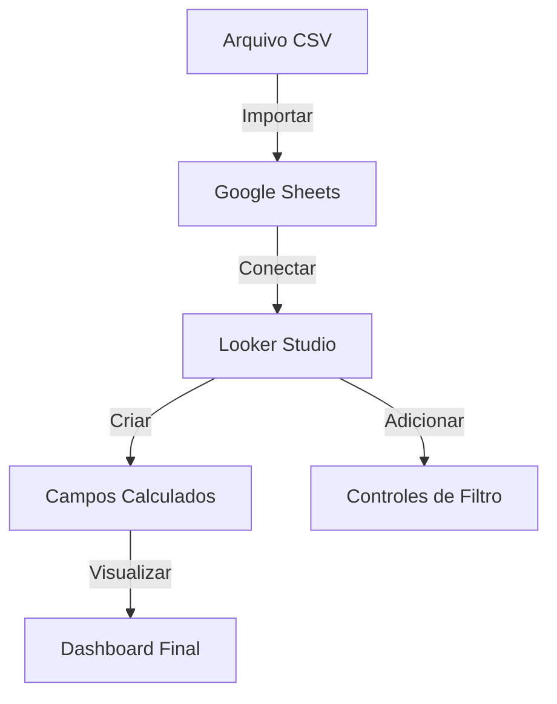

## Visão Geral do Conceito

O **Assessment Task (AT)** é o projeto final que consolida as competências de extração, manipulação e visualização de dados. Ele exige que o estudante saia do papel de apenas "escrever código" e passe a atuar como um analista, transformando dados brutos da operação de uma academia em informações visuais acionáveis e consultas SQL precisas.

Esta etapa avalia não apenas o acerto técnico, mas a capacidade de manter **consistência visual** e **lógica de negócio** em um ambiente de BI (Business Intelligence).

## Modelo Mental

Imagine um pipeline de dados onde a informação flui de um arquivo estático para um painel vivo:

1.  **Dados Brutos (`.csv`):** O registro frio das aulas.
2.  **Repositório Ativo (Google Sheets):** Onde os dados ganham "vida" na nuvem.
3.  **Camada de Visualização (Looker Studio):** Onde os dados são filtrados, agregados e apresentados para decisão.

No SQL, o modelo mental é o de **filtragem seletiva**: você tem um oceano de dados e precisa pescar apenas os peixes (registros) que atendem a critérios específicos de turno, modalidade ou unidade.

## Mecânica Central

### 1. Integração Sheets -> Looker
Para que o Looker Studio funcione corretamente, os dados devem estar estruturados no Google Sheets com um cabeçalho claro na primeira linha. O Looker consome essas colunas como **Dimensões** (texto/datas) e **Métricas** (números agregáveis).

### 2. Campos Calculados
Às vezes, a informação necessária não está na tabela original. Criamos métricas customizadas no Looker:
- **Exemplo (Taxa de Ocupação):** `Inscritos / Vagas_Ofertadas`.
- **Exemplo (Taxa de Presença):** `Presentes / Inscritos`.

### 3. Filtros (Controles)
Os filtros permitem que o usuário final interaja com o dashboard. Os principais tipos são:
- **Lista suspensa:** Para categorias (Unidade, Turno).
- **Filtro de período:** Para dimensões de data.



## Uso Prático: O Projeto Academia

O projeto final foca na análise de ocupação de uma rede de academias. A estrutura do dashboard deve seguir quatro páginas lógicas:

1.  **Visão Geral (Tabela):** Listagem bruta filtrada (`Data`, `Unidade`, `Modalidade`).
2.  **Métricas de Desempenho (Visão Macro):** Visões de total de inscritos vs. presentes.
3.  **Análise por Categoria:** Gráficos de barra e pizza para comparar modalidades e professores.
4.  **Evolução Temporal:** Gráfico de série temporal para identificar picos de uso.

### Exemplo de Consulta SQL Analítica
Para a Parte 2 do AT, você deve dominar seleções com filtros compostos:

```sql
-- Buscar alunos presentes em Yoga, no turno da Noite, na Unidade Sul
SELECT Data_Aula, Professor, Presentes 
FROM Academia
WHERE Modalidade = 'Yoga' 
  AND Turno = 'Noite' 
  AND Unidade = 'Sul'
ORDER BY Data_Aula DESC;
```

## Erros Comuns

- <mark style="background-color: #242424; padding: 2px 4px; border-radius: 3px; color: inherit;">`Uso de IA Gerativa`</mark>: O uso de ferramentas como ChatGPT na execução do AT é estritamente proibido e passível de desclassificação.
- <mark style="background-color: #242424; padding: 2px 4px; border-radius: 3px; color: inherit;">`Inconsistência Visual`</mark>: Usar cores diferentes ou fontes variadas entre as páginas do relatório quebra a experiência do usuário.
- <mark style="background-color: #242424; padding: 2px 4px; border-radius: 3px; color: inherit;">`Missing TP3`</mark>: Não entregar os trabalhos parciais impede a correção da prova final.

## Visão Geral de Debugging

Se os dados não aparecerem no Looker:
1.  Verifique se o cabeçalho no Google Sheets não possui células mescladas.
2.  Certifique-se de que a coluna de **Data** foi reconhecida como tipo "Data" pelo Looker (e não apenas texto).
3.  Confira se não há valores nulos nas colunas de `Vagas` que possam causar erro de divisão por zero em campos calculados.

## Principais Pontos

- O AT é a única entrega que compõe a nota final, mas os TPs são pré-requisitos.
- Identidade visual coerente é um requisito explícito de avaliação.
- O relatório no Looker Studio deve conter exatamente 4 páginas.
- Parte 1 é visual (Looker); Parte 2 é lógica (SQL).

## Preparação para Prática

Ao final desta lição e antes de entregar o AT, você deve ser capaz de:
- Conectar fontes de dados externas ao Looker Studio.
- Criar métricas matemáticas que não existem na base original.
- Estruturar um painel interativo e navegável.
- Escrever consultas SQL que respondam perguntas de negócio específicas.

## Laboratório de Prática

### Desafio 1: Easy (Métrica Base)
No Google Sheets, após importar o arquivo `Uso Academia.csv`, identifique a coluna de inscritos. No Looker Studio, crie um **Cartão de Pontuação** que exiba a soma total de `Presentes` em todas as unidades.

### Desafio 2: Medium (Campo Calculado)
Crie um campo calculado chamado `Percentual_Comparecimento`.
- **Fórmula:** `SUM(Presentes) / SUM(Inscritos)`
- **Objetivo:** Exibir este valor em um gráfico de barras comparando a média de comparecimento por **Professor**.

### Desafio 3: Hard (SQL Report)
Escreva uma consulta SQL para a Parte 2 do AT que retorne:
- A média de `Duracao_Minutos` por `Modalidade`.
- Apenas para a unidade 'Centro'.
- Ordenado da maior duração para a menor.

<!-- CONCEPT_EXTRACTION
concepts:
  - Integração Looker Studio
  - Campos Calculados SQL/BI
  - Filtros Multidimensionais
  - Dashboards Multi-página
skills:
  - Construir dashboards profissionais consistentes
  - Implementar lógica de negócio em BI
  - Extrair relatórios via SQL
examples:
  - taxa-ocupacao-academia
  - dashboard-4-paginas
  - sql-filtro-unidade
-->

<!-- EXERCISES_JSON
[
  {
    "id": "at-métrica-scorecard",
    "slug": "at-metrica-scorecard",
    "difficulty": "easy",
    "title": "Configurando Métrica de Presença",
    "discipline": "visualizacao-sql",
    "editorLanguage": "javascript",
    "tags": ["looker-studio", "bi", "dashboard"],
    "summary": "Implementar um cartão de pontuação para somatório de métricas no Looker Studio."
  },
  {
    "id": "at-campo-calculado-percentual",
    "slug": "at-campo-calculado-percentual",
    "difficulty": "medium",
    "title": "Criando Taxa de Comparecimento",
    "discipline": "visualizacao-sql",
    "editorLanguage": "javascript",
    "tags": ["looker-studio", "calculos", "bi"],
    "summary": "Construir um campo calculado que relacione presentes e inscritos."
  },
  {
    "id": "at-sql-media-duracao",
    "slug": "at-sql-media-duracao",
    "difficulty": "hard",
    "title": "Média de Duração por Unidade",
    "discipline": "visualizacao-sql",
    "editorLanguage": "sql",
    "tags": ["sql", "agregacao", "sqlite"],
    "summary": "Escrever uma query SQL para agrupar duração média por modalidade e unidade."
  }
]
-->
