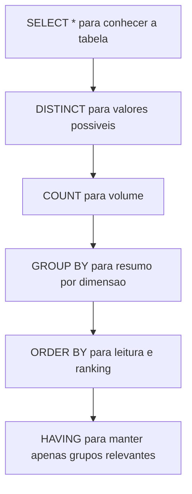

## Visão Geral do Conceito

Quando você abre um banco novo (um `.db` que você baixou da internet, um dump de produção, um dataset de pesquisa), o primeiro trabalho não é “fazer dashboard” — é **entender o dado**: período coberto, entidades, colunas, valores possíveis, faltantes e como criar **tabelas resumo** (agregações) para responder perguntas de negócio.

Nesta aula, isso é feito com o dataset `weather_stations.db`, usando a tabela <mark style="background-color: #242424; padding: 2px 4px; border-radius: 3px; color: inherit;">`station_data`</mark>. O foco prático é aplicar:

- <mark style="background-color: #242424; padding: 2px 4px; border-radius: 3px; color: inherit;">`DISTINCT`</mark> para entender valores únicos (e combinações).
- <mark style="background-color: #242424; padding: 2px 4px; border-radius: 3px; color: inherit;">`COUNT`</mark>, <mark style="background-color: #242424; padding: 2px 4px; border-radius: 3px; color: inherit;">`AVG`</mark>, <mark style="background-color: #242424; padding: 2px 4px; border-radius: 3px; color: inherit;">`SUM`</mark>, <mark style="background-color: #242424; padding: 2px 4px; border-radius: 3px; color: inherit;">`MAX`</mark> para medir fenômenos.
- <mark style="background-color: #242424; padding: 2px 4px; border-radius: 3px; color: inherit;">`GROUP BY`</mark> por ano e por ano+mês (múltiplas dimensões).
- <mark style="background-color: #242424; padding: 2px 4px; border-radius: 3px; color: inherit;">`ORDER BY`</mark> para ordenar relatórios.
- <mark style="background-color: #242424; padding: 2px 4px; border-radius: 3px; color: inherit;">`HAVING`</mark> para filtrar **grupos** (ex.: “anos com precipitação total > 30”).

## Modelo Mental

Pense em uma consulta analítica como um pipeline:

1) **Explorar** (o que existe?)  
2) **Quantificar** (quanto tem?)  
3) **Resumir** (por qual dimensão?)  
4) **Ordenar** (o que aparece primeiro?)  
5) **Filtrar grupos** (o que merece atenção?)  

Em SQL, isso aparece como:



Uma segunda ideia importante da aula é: **dados têm dono**. Em empresas, nem sempre você pode “copiar uma base e mandar para outro lugar” sem autorização. Esse tema aparece junto da lembrança de <mark style="background-color: #242424; padding: 2px 4px; border-radius: 3px; color: inherit;">LGPD</mark>, governança e responsabilidade sobre dados.

## Mecânica Central

### Preparação do ambiente (SQLiteStudio + database)

O fluxo prático seguido na aula foi:

- Baixar o banco `weather_stations.db` do repositório do autor (O’Reilly / Getting Started with SQL).
- No SQLiteStudio: **Database → Add a database**, selecionar o arquivo e usar **Test connection**.
- Abrir a tabela <mark style="background-color: #242424; padding: 2px 4px; border-radius: 3px; color: inherit;">`station_data`</mark>.

> **Regra prática:** “remover o banco” no SQLiteStudio remove da *lista da ferramenta*, não apaga o arquivo físico `.db`.

### 1) Explorar: olhar a tabela inteira (amostragem)

```sql
SELECT *
FROM station_data;
```

Mesmo que a tabela tenha muitas linhas, esse passo ajuda a:

- reconhecer nomes de colunas;
- ver valores típicos;
- identificar colunas booleanas/flags (ex.: tornado, rain).

### 2) Descobrir o período: MIN e MAX do ano

```sql
SELECT MIN(year), MAX(year)
FROM station_data;
```

Isso responde rápido “qual é o intervalo temporal da base”.

### 3) DISTINCT: valores únicos e combinações

Valores únicos de uma coluna:

```sql
SELECT DISTINCT station_number
FROM station_data;
```

Valores únicos da combinação (ex.: estação + ano), com ordenação:

```sql
SELECT DISTINCT station_number, year
FROM station_data
ORDER BY 1, 2;
```

Aqui, <mark style="background-color: #242424; padding: 2px 4px; border-radius: 3px; color: inherit;">`ORDER BY 1, 2`</mark> significa “ordenar pela 1ª e 2ª colunas do SELECT”. Funciona, mas é um atalho (pode perder legibilidade).

### 4) Contagem total e contagem com filtro (WHERE)

```sql
SELECT COUNT(*) AS record_count
FROM station_data;
```

```sql
SELECT COUNT(*) AS record_count
FROM station_data
WHERE tornado = 1;
```

Esse padrão é a forma mais rápida de medir “quantas linhas entram na condição”.

### 5) GROUP BY: contagem por ano (dimensão = year)

```sql
SELECT year, COUNT(*) AS record_count
FROM station_data
WHERE tornado = 1
GROUP BY year;
```

Pontos-chave:

- <mark style="background-color: #242424; padding: 2px 4px; border-radius: 3px; color: inherit;">`WHERE`</mark> filtra linhas **antes** de agrupar.
- <mark style="background-color: #242424; padding: 2px 4px; border-radius: 3px; color: inherit;">`GROUP BY`</mark> cria um resultado com “uma linha por ano”.

### 6) GROUP BY composto: contagem por ano e mês (granularidade mais fina)

```sql
SELECT year, month, COUNT(*) AS record_count
FROM station_data
WHERE tornado = 1
GROUP BY year, month
ORDER BY year, month;
```

Se você ordenar decrescente por ano:

```sql
SELECT year, month, COUNT(*) AS record_count
FROM station_data
WHERE tornado = 1
GROUP BY year, month
ORDER BY year DESC, month;
```

Isso vira um relatório pronto para leitura (e muitas vezes já “alimentável” em ferramenta de BI).

### 7) COUNT(coluna) e o efeito de NULL (ausência de valor)

Na aula, a coluna <mark style="background-color: #242424; padding: 2px 4px; border-radius: 3px; color: inherit;">`snow_depth`</mark> foi usada para mostrar o comportamento:

```sql
SELECT COUNT(snow_depth) AS recorded_snow_depth_count
FROM station_data;
```

Como <mark style="background-color: #242424; padding: 2px 4px; border-radius: 3px; color: inherit;">`COUNT(coluna)`</mark> ignora <mark style="background-color: #242424; padding: 2px 4px; border-radius: 3px; color: inherit;">`NULL`</mark>, ele conta apenas os registros em que `snow_depth` está preenchido.

Para medir quantos NULL existem:

```sql
SELECT COUNT(*) AS null_snow_depth_count
FROM station_data
WHERE snow_depth IS NULL;
```

E para confirmar os não nulos:

```sql
SELECT COUNT(*) AS not_null_snow_depth_count
FROM station_data
WHERE snow_depth IS NOT NULL;
```

### 8) AVG e ROUND: média por mês (após 2000)

```sql
SELECT month, AVG(temperature) AS avg_temp
FROM station_data
WHERE year >= 2000
GROUP BY month;
```

Para deixar legível:

```sql
SELECT month, ROUND(AVG(temperature), 2) AS avg_temp
FROM station_data
WHERE year >= 2000
GROUP BY month;
```

### 9) SUM e MAX por ano: múltiplas métricas no mesmo relatório

```sql
SELECT
  year,
  ROUND(SUM(snow_depth), 2) AS total_snow,
  ROUND(SUM(precipitation), 2) AS total_precipitation,
  ROUND(MAX(precipitation), 2) AS max_precipitation
FROM station_data
WHERE year >= 2000
GROUP BY year;
```

Aqui, <mark style="background-color: #242424; padding: 2px 4px; border-radius: 3px; color: inherit;">`year`</mark> é dimensão; o resto são métricas.

### 10) HAVING: filtrar grupos por total anual

```sql
SELECT
  year,
  ROUND(SUM(precipitation), 2) AS total_precipitation
FROM station_data
GROUP BY year
HAVING total_precipitation > 30;
```

O uso de <mark style="background-color: #242424; padding: 2px 4px; border-radius: 3px; color: inherit;">`HAVING`</mark> é o que permite filtrar por **resultado do grupo** (a soma anual), não por linha.

## Uso Prático

### Checklist de exploração rápida de uma tabela nova

1) Ver as colunas e valores:

```sql
SELECT *
FROM station_data
LIMIT 20;
```

2) Período coberto:

```sql
SELECT MIN(year) AS min_year, MAX(year) AS max_year
FROM station_data;
```

3) Cardinalidade (quantos “IDs” distintos):

```sql
SELECT COUNT(DISTINCT station_number) AS stations
FROM station_data;
```

4) Relatório de ocorrência por tempo (ex.: tornado):

```sql
SELECT year, month, COUNT(*) AS tornado_records
FROM station_data
WHERE tornado = 1
GROUP BY year, month
ORDER BY year, month;
```

5) Métricas anuais (neve/precipitação):

```sql
SELECT
  year,
  ROUND(SUM(snow_depth), 2) AS total_snow,
  ROUND(SUM(precipitation), 2) AS total_precipitation
FROM station_data
WHERE year >= 2000
GROUP BY year
ORDER BY year;
```

## Erros Comuns

- **Achar que `COUNT(coluna)` conta linhas**  
  `COUNT(coluna)` ignora <mark style="background-color: #242424; padding: 2px 4px; border-radius: 3px; color: inherit;">`NULL`</mark>. Se você quer linhas, use <mark style="background-color: #242424; padding: 2px 4px; border-radius: 3px; color: inherit;">`COUNT(*)`</mark>.

- **Esquecer de alinhar dimensões no `GROUP BY`**  
  Se `year` e `month` estão no SELECT sem agregação, precisam estar no <mark style="background-color: #242424; padding: 2px 4px; border-radius: 3px; color: inherit;">`GROUP BY`</mark>.

- **Confundir `WHERE` e `HAVING`**  
  <mark style="background-color: #242424; padding: 2px 4px; border-radius: 3px; color: inherit;">`WHERE`</mark> filtra linhas; <mark style="background-color: #242424; padding: 2px 4px; border-radius: 3px; color: inherit;">`HAVING`</mark> filtra grupos.

- **Usar `ORDER BY 1,2` sem perceber que ficou frágil**  
  Funciona, mas se você mexer no SELECT, muda a ordenação. Para relatórios que outras pessoas vão manter, prefira `ORDER BY year, month`.

## Visão Geral de Debugging

Quando um resultado “parece estranho”:

- **Cheque a granularidade**: você está agrupando no nível certo (ano) ou fino demais (ano+mês)?
- **Verifique NULL**: uma métrica pode estar baixa porque muitos valores estão ausentes (ex.: `snow_depth`).
- **Confirme o filtro**: `tornado = 1` faz sentido para a coluna? Há outros valores além de 0 e 1?
- **Valide com consultas pequenas**: pegue um ano específico e confira manualmente com `COUNT(*)` + `WHERE year = ...`.

## Principais Pontos

- <mark style="background-color: #242424; padding: 2px 4px; border-radius: 3px; color: inherit;">`DISTINCT`</mark> revela valores e combinações possíveis.
- <mark style="background-color: #242424; padding: 2px 4px; border-radius: 3px; color: inherit;">`GROUP BY`</mark> cria relatórios por dimensão (ano, mês, estação...).
- <mark style="background-color: #242424; padding: 2px 4px; border-radius: 3px; color: inherit;">`ORDER BY`</mark> dá legibilidade e permite rankings.
- <mark style="background-color: #242424; padding: 2px 4px; border-radius: 3px; color: inherit;">`COUNT(*)`</mark> conta linhas; <mark style="background-color: #242424; padding: 2px 4px; border-radius: 3px; color: inherit;">`COUNT(coluna)`</mark> ignora NULL.
- <mark style="background-color: #242424; padding: 2px 4px; border-radius: 3px; color: inherit;">`HAVING`</mark> filtra grupos por agregações (ex.: `SUM(...) > X`).
- Dados em empresa têm dono: governança e LGPD são parte do trabalho com dados.

## Preparação para Prática

Ao final desta lição, você deve conseguir:

- carregar um `.db` no SQLiteStudio e achar a tabela correta;
- medir volume e período da base;
- montar relatórios de ocorrência por ano e por mês;
- investigar dados faltantes em colunas numéricas;
- gerar tabelas-resumo com múltiplas métricas e filtrar grupos com HAVING.

## Laboratório de Prática

### Easy — Perfil da base (período + cardinalidade)

Escreva uma consulta que retorne:

- menor e maior ano (<mark style="background-color: #242424; padding: 2px 4px; border-radius: 3px; color: inherit;">`MIN(year)`</mark> e <mark style="background-color: #242424; padding: 2px 4px; border-radius: 3px; color: inherit;">`MAX(year)`</mark>)
- quantidade de estações distintas (<mark style="background-color: #242424; padding: 2px 4px; border-radius: 3px; color: inherit;">`COUNT(DISTINCT station_number)`</mark>)

```sql
SELECT
  -- TODO: retornar menor ano como min_year
  MIN(year) AS min_year,
  -- TODO: retornar maior ano como max_year
  MAX(year) AS max_year,
  -- TODO: contar quantas estacoes distintas existem
  COUNT(DISTINCT station_number) AS stations
FROM station_data;
```

### Medium — Tornados por ano e mês (com ordenação)

Gere um relatório com:

- <mark style="background-color: #242424; padding: 2px 4px; border-radius: 3px; color: inherit;">`year`</mark>, <mark style="background-color: #242424; padding: 2px 4px; border-radius: 3px; color: inherit;">`month`</mark>
- contagem de registros com tornado
- ordenação por ano desc e mês asc

```sql
SELECT
  year,
  month,
  COUNT(*) AS tornado_records
FROM station_data
WHERE tornado = 1
GROUP BY year, month
-- TODO: ordenar por year DESC e month ASC
ORDER BY year DESC, month ASC;
```

### Hard — Anos com precipitação “alta” (HAVING + múltiplas métricas)

Crie um relatório anual (apenas anos >= 2000) com:

- total de precipitação (soma arredondada)
- máxima precipitação diária (max arredondado)

Depois, filtre para mostrar apenas anos com total de precipitação > 30.

```sql
SELECT
  year,
  ROUND(SUM(precipitation), 2) AS total_precipitation,
  ROUND(MAX(precipitation), 2) AS max_precipitation
FROM station_data
WHERE year >= 2000
GROUP BY year
-- TODO: filtrar grupos com total_precipitation > 30 (HAVING)
HAVING total_precipitation > 30
ORDER BY total_precipitation DESC;
```

  > **Fechamento da aula (projeto):** Fechamento da aula (projeto): no final, o professor comentou sobre o ISS e elogiou a iniciativa, reforçando a importância de seguir o processo da disciplina com consistência.
No clima da turma, a leitura foi simples: **“se o caduzão falou, está falado.”**

<!-- CONCEPT_EXTRACTION
concepts:
  - station_data
  - distinct
  - order by (nomes e posicoes 1,2)
  - count asterisco vs count coluna
  - null em agregacoes
  - group by por ano
  - group by por ano e mes
  - avg sum max round
  - having
  - governanca de dados e lgpd
skills:
  - Carregar um database sqlite no sqlitestudio e localizar tabelas
  - Explorar colunas e valores com select e distinct
  - Montar relatorios agregados com group by e order by
  - Contar valores nulos e nao nulos com is null e is not null
  - Interpretar impacto de null em count(coluna) e em metricas agregadas
  - Filtrar grupos com having usando somatorios e aliases
examples:
  - station-data-min-max-year
  - station-data-distinct-station-year-orderby-12
  - station-data-tornado-groupby-year-month
  - station-data-null-snow-depth-count
  - station-data-precipitation-having-total
-->

<!-- EXERCISES_JSON
[
  {
    "id": "sql-weather-stations-easy-perfil-base",
    "slug": "sql-weather-stations-easy-perfil-base",
    "difficulty": "easy",
    "title": "Perfil da base station_data (MIN/MAX + DISTINCT)",
    "discipline": "visualizacao-sql",
    "editorLanguage": "sql",
    "tags": ["sql", "sqlite", "distinct", "min", "max"],
    "summary": "Gerar um perfil rápido da base: intervalo de anos e número de estações distintas."
  },
  {
    "id": "sql-weather-stations-medium-tornados-ano-mes",
    "slug": "sql-weather-stations-medium-tornados-ano-mes",
    "difficulty": "medium",
    "title": "Tornados por ano e mês com GROUP BY e ORDER BY",
    "discipline": "visualizacao-sql",
    "editorLanguage": "sql",
    "tags": ["sql", "group-by", "order-by", "count"],
    "summary": "Criar relatório de contagem de tornados por ano e mês, com ordenação descendente por ano."
  },
  {
    "id": "sql-weather-stations-hard-having-precipitacao",
    "slug": "sql-weather-stations-hard-having-precipitacao",
    "difficulty": "hard",
    "title": "Filtrar anos com precipitação total alta (HAVING)",
    "discipline": "visualizacao-sql",
    "editorLanguage": "sql",
    "tags": ["sql", "having", "sum", "max", "round", "group-by"],
    "summary": "Agregar precipitação por ano (>=2000) e usar HAVING para manter apenas anos com total acima de um limiar."
  }
]
-->

