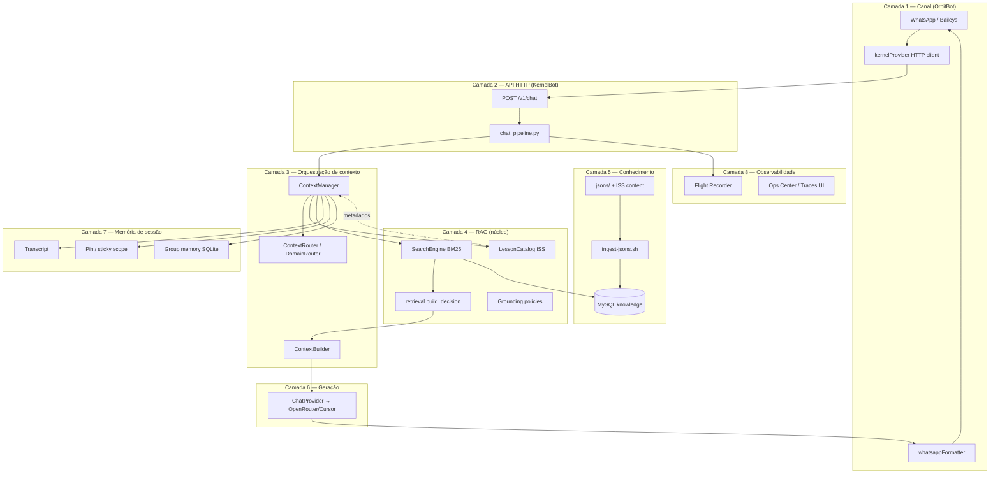
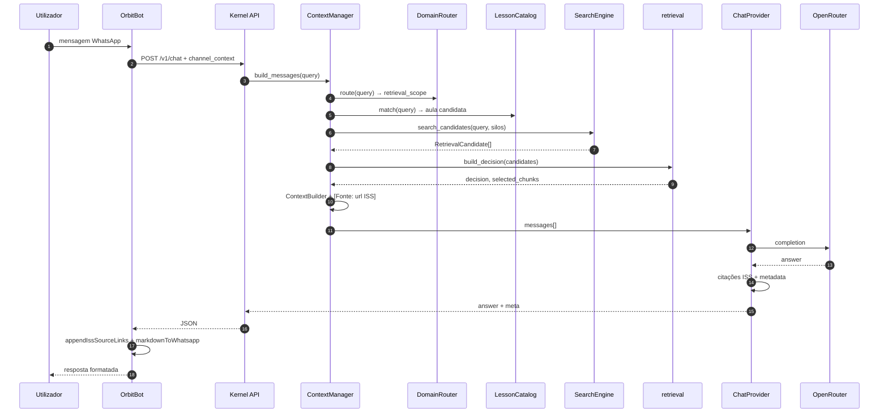

# Ecossistema KernelBot — camadas, comunicação e RAG

Documento introdutório para quem **não conhece o projeto**. Cada camada é explicada **isoladamente**; no final, como todas conversam. **Ênfase no RAG** (Retrieval-Augmented Generation).

| Campo | Valor |
|-------|-------|
| Público | onboarding, stakeholders, devs novos |
| Repositórios | `KernelBot` (Python) + `OrbitBot` (Node.js) |
| Última revisão | 2026-08-29 |

**Ver também:** [domain-experts.md](domain-experts.md) · [CONTEXT-ARCHITECTURE.md](../CONTEXT-ARCHITECTURE.md) · [05-bm25-chunking.md](../wiki/05-bm25-chunking.md)

---

## 1. Visão em uma frase

O **KernelBot** é o cérebro: indexa aulas do curso ISS, recupera trechos relevantes (RAG) e gera respostas via LLM. O **OrbitBot** é o rosto: recebe mensagens no WhatsApp, chama o Kernel e devolve texto formatado. O conhecimento vive no **MySQL** (chunks BM25) e nos **JSONs ISS** (fonte canónica).

---

## 2. Mapa das camadas



---

## 3. Camadas explicadas isoladamente

### 3.1 Camada 1 — OrbitBot (canal WhatsApp)

**O que é:** adapter Node.js que liga o utilizador ao Kernel. **Não faz RAG** nem chama LLM directamente (caminho actual).

**Responsabilidades:**

| Função | Módulo | Descrição |
|--------|--------|-----------|
| Transporte WhatsApp | `app.js`, Baileys | Sessão, QR, mensagens 1:1 e grupos |
| Invocação | `@orbit`, menção em grupo | Extrai texto útil da mensagem |
| Cliente Kernel | `src/providers/kernelProvider.js` | `POST http://127.0.0.1:8001/v1/chat` |
| Contexto de canal | `src/kernelContext.js` | `platform`, `userId`, `channelId`, `reset_context` |
| Resposta | `src/openai.js` | Normaliza answer, acrescenta links ISS (`source_citations`) |
| Formatação | `src/utils/whatsappFormatter.js` | Markdown → sintaxe nativa WhatsApp (`*negrito*`, `_itálico_`) |
| HTTP interno | porta `8010` | Outbound proactivo (Comunicações Kernel → WhatsApp) |

**O que o Orbit NÃO guarda:**

- Índice BM25, catálogo ISS, políticas de grounding — tudo no Kernel.
- Histórico longo de conversa (SSOT do transcript é o Kernel para o canal WhatsApp).

**Contrato com o Kernel:**

```json
POST /v1/chat
{
  "message": "Como funciona switch em Java?",
  "channel_context": {
    "platform": "whatsapp",
    "user_id": "...",
    "channel_id": "..."
  },
  "stream": false
}
```

Resposta: `{ "answer": "...", "metadata": { "sources", "source_citations", "decision", "confidence", ... } }`.

---

### 3.2 Camada 2 — API HTTP (KernelBot)

**O que é:** fronteira HTTP FastAPI. Valida entrada, delega ao pipeline, devolve JSON ou SSE.

**Ficheiros principais:**

| Peça | Caminho |
|------|---------|
| Entry | `main.py` → `app/factory.py` |
| Chat legado | `api/routes.py` — `POST /chat` |
| Chat v1 (Orbit) | `api/routes_v1.py` — `POST /v1/chat` |
| Pipeline | `api/chat_pipeline.py` |
| Search sem LLM | `POST /search` |
| DI / serviços | `app/state.py` — `AppServices` |

**Responsabilidades:**

- Rate limit (`POST /chat`: 30 req/IP/min).
- Idempotência por mensagem (409 se duplicada em processamento).
- Emissão de eventos Flight Recorder (`KERNEL_RAG_STARTED`, `KERNEL_LLM_FINISHED`, …).
- Agregação de resposta quando `stream: false` (caso Orbit).

**Não contém lógica RAG** — só orquestra quem a executa (`ContextManager` + `ChatProvider`).

---

### 3.3 Camada 3 — Orquestração de contexto

**O que é:** monta **todas** as peças do prompt antes e depois do RAG. O ficheiro central é `kernel/orchestrator/context.py` (`ContextManager`).

**Subcamadas:**

#### 3.3.1 Context Router (`kernel/context/router.py`)

Classifica perfil `FAST | NORMAL | DEEP` (se `ACL_CONTEXT_ROUTER=1`). Decide **quais camadas** entram no prompt:

- identidade institucional;
- calendário académico;
- transcript;
- **RAG** (pode ser skipped em FAST ou perguntas só temporais).

#### 3.3.2 Domain Router (`kernel/context/domain_router.py`)

**Sem LLM.** Classifica a pergunta num **expert** (Python, SQL, Java, backend-requisitos, …) via keywords + contexto recente.

- Output: `retrieval_scope` — lista de silos BM25 permitidos.
- Reduz ruído: pergunta de Java não busca em `fundamentos-csharp`.

Config: `kernel/context/domain_experts.json` + `kernel/disciplines/disciplines.json`.

#### 3.3.3 Context Builder (`kernel/context/builder.py`)

Ordem canónica do system prompt:

1. Identidade + regras académicas  
2. Contexto temporal (relógio do servidor)  
3. Calendário / institucional  
4. Catálogo de aulas (se enabled)  
5. Pin / sticky scope  
6. Política de grounding  
7. **Trechos RAG** `[Fonte: url ISS | Score: …]`  
8. Instruções do expert (se houver)

#### 3.3.4 ContextTrace

Objeto devolvido em metadata: `sources`, `source_details`, `decision`, `reason`, `confidence`, `rag_skipped`, etc. Alimenta Orbit, Ops e testes.

---

### 3.4 Camada 4 — RAG (núcleo cognitivo)

Esta é a camada mais importante do projeto. Separa-se **deliberadamente** em três peças:

```text
SearchEngine (recuperação bruta)
    ↓
retrieval.build_decision (política / gates)
    ↓
ContextManager (injecção no prompt + trace)
```

#### 3.4.1 LessonCatalog ISS (`kernel/knowledge/lesson_catalog.py`)

**Papel:** mapa curricular **fora** do BM25 — títulos, slugs, excerpts, ordem das aulas.

- Fonte: `ACL_CATALOG_JSON_DIR` (ex.: `../ISS/content` — `lessons.json`, `search-index.json`).
- Activa com `ACL_CATALOG_ENABLED=true`.
- Faz **match léxico** query → aula antes ou em paralelo ao BM25.
- Com `ACL_CATALOG_RERANK=true`: boost ×1.35 nos chunks da aula casada.

**Porquê existe:** BM25 sozinho erra quando a pergunta é genérica ou há aulas homónimas; o catálogo ancora “qual aula” o aluno provavelmente quer.

#### 3.4.2 SearchEngine — BM25 (`kernel/rag/search.py`)

**Papel:** recuperação **léxica bruta**. Não decide se o contexto basta — só devolve candidatos com score.

| Aspecto | Detalhe |
|---------|---------|
| Algoritmo | `rank_bm25.BM25Okapi` |
| Índice | **In-memory**, rebuild a partir do MySQL |
| Silos | Um BM25 por `discipline` (ex.: `fundamentos-java`, `python`) |
| Identificador | `source = db:{discipline}/{slug}` |
| API | `search_candidates(query, discipline_filters, candidate_k)` |
| Scores | `raw_score` (BM25 puro) + `normalized_score` (ranking local) |

**Chunking (Opção B2):** MySQL guarda documento unificado; chunks (~500 palavras, overlap 50) são criados **em RAM** no rebuild. Meta (keywords, conceitos) só no chunk 0 — evita IDF zerado. Ver [05-bm25-chunking.md](../wiki/05-bm25-chunking.md).

**Expansão de query:** `expand_query_tokens()` normaliza termos (sinónimos léxicos limitados, stopwords PT).

#### 3.4.3 Política de retrieval (`kernel/rag/retrieval.py`)

**Papel:** classificar se os candidatos BM25 **sustentam** uma resposta ancorada.

| Gate / reason | Significado |
|---------------|-------------|
| `ok` | Contexto suficiente, confiança alta/média |
| `insufficient_context` | Score ou coverage baixos |
| `ambiguous_retrieval` | Dois candidatos muito próximos |
| `underspecified_query` | Poucos termos informativos |
| `vague_but_high_risk` | Termos genéricos + domínio ambíguo |
| `low_confidence` | Passou thresholds fracos |
| `index_gap` | Catálogo confiante mas chave ausente no índice |
| `post_generation_misalignment` | Resposta LLM desalinhada dos trechos (pós-geração) |

Thresholds configuráveis: `ACL_RETRIEVAL_MIN_SCORE`, `MIN_COVERAGE`, `MIN_TERMS`, `CANDIDATE_K`, `TOP_K`, `MAX_CHUNKS_PER_SOURCE`.

**Importante:** `allow_generation` tende a ser true — gates são **telemetria + UX** (desambiguação, avisos), não bloqueio cego do LLM em todos os modos.

#### 3.4.4 Camadas RAG adicionais (melhorias recentes)

| Flag | Efeito no RAG |
|------|----------------|
| `ACL_DOMAIN_ROUTER` | Limita silos antes do BM25 |
| `ACL_CATALOG_ENABLED` | Match curricular + prompt de catálogo |
| `ACL_CATALOG_RERANK` | Reordena candidatos BM25 favorecendo aula do catálogo |
| `ACL_RETRIEVAL_CANDIDATE_K=12` | Mais candidatos na pool antes do top-k |
| `ACL_RETRIEVAL_MAX_CHUNKS_PER_SOURCE=1` | Diversidade de fontes no prompt |
| `ACL_QUERY_DISCIPLINE_BOOST` | Boost de disciplina quando query não cita linguagem |
| `ACL_DISAMBIGUATION_ENABLED` | Opções estruturadas quando ambíguo |

Evidência (subset 20 perguntas difíceis, 2026-08-28): baseline 5% top-1 → **45%** com fases A+B+C. Ver `memory/rag-battery-evidence/PHASE_REPORT.md`.

#### 3.4.5 Grounding e citações (`kernel/policies/`, `kernel/knowledge/iss_links.py`)

- Prompts em `kernel/policies/systemPrompt/` (ex.: `grounding_anchored.txt`).
- Trechos injectados como `[Fonte: https://…ISS…/aula.html?d=&a=]`.
- Pós-geração: `replace_db_source_citations`, `source_citations` com título + disciplina + URL.
- Orbit formata rodapé `📚 Material de referência` no WhatsApp.

---

### 3.5 Camada 5 — Conhecimento (dados ISS)

**O que é:** fonte da verdade pedagógica, independente do runtime.

| Artefacto | Local | Papel |
|-----------|-------|-------|
| Aulas JSON | `jsons/<disciplina>/*.json` | Conteúdo espelhado do ISS (~140 aulas) |
| Índice humano | `jsons/index.json` | Lista disciplina + slug + título |
| ISS content | `ACL_CATALOG_JSON_DIR` | Catálogo público (`lessons.json`) |
| MySQL | tabela `knowledge` | Row por aula; ingest UPSERT |
| Site público | `gaabdevweb.github.io/ISS` | Links citados nas respostas |

**Pipeline de ingest:**

```bash
./bin/ingest-jsons.sh   # → kernel.knowledge.jsons_ingest → MySQL
# Boot ou POST /reload → SearchEngine.rebuild() → BM25 in-memory
```

**Drift:** `GET /health/catalog` (com bearer) compara catálogo ISS vs chaves indexadas.

---

### 3.6 Camada 6 — Geração (LLM)

**O que é:** `kernel/providers/chat_provider.py` — único sítio que chama OpenRouter ou Cursor SDK.

**Fluxo:**

1. Recebe `messages` já montados pelo ContextManager.
2. Stream ou agregação (`stream: true/false`).
3. `_finalize_answer_and_meta`: substitui citações, aplica pós-validação, monta metadata.
4. Devolve `answer` + `tokens_used` + flags (`post_generation_advisory`, `disambiguation_options`).

**Config típica:** `ACL_LLM_PROVIDER=openrouter`, `ACL_LLM_MAX_TOKENS=1200`, temperatura ~0.3.

O LLM **não escolhe** quais aulas buscar — só redige sobre o que o RAG injectou (salvo modo geral / RAG skipped).

---

### 3.7 Camada 7 — Memória de sessão

Complementa o RAG com continuidade conversacional — **não substitui** retrieval.

| Mecanismo | Módulo | Função |
|-----------|--------|--------|
| Transcript | `kernel/memory/` | Últimos turnos user/assistant por sessão |
| Pin / sticky | `kernel/memory/pinned_store.py` | Fixa disciplina ou aula (`/python`, scope) |
| Group memory | SQLite opcional | Histórico/recência em grupos WhatsApp |
| Group profile | SQLite opcional | Perfil do grupo para routing |
| Idempotency | v1 chat | Evita processar a mesma mensagem duas vezes |

**Limitação actual:** pin/transcript in-process — restart do Kernel limpa estado em memória.

---

### 3.8 Camada 8 — Observabilidade

**O que é:** debug operacional do RAG e do pipeline — essencial para calibrar gates.

| Ferramenta | URL / módulo |
|------------|----------------|
| Flight Recorder | `kernel/inspect/recorder.py`, eventos trace |
| Traces UI | `/traces/*` |
| Ops Center | `/ops/*` |
| Logs estruturados | `ACL_MOD_SEARCH`, `ACL_MOD_DECISION`, `ACL_MOD_PROVIDER` |
| Bateria RAG | `scripts/run_rag_battery.py`, `memory/rag-battery-evidence/` |

Permite ver: query tokens, top_sources, scores, `reason`, prompt forensics, latência RAG vs LLM.

---

## 4. Como todas as camadas conversam

### 4.1 Fluxo feliz (pergunta com RAG)



### 4.2 Tabela de interfaces

| De | Para | Protocolo | Payload chave |
|----|------|-----------|-----------------|
| Orbit | Kernel | HTTP JSON | `message`, `channel_context`, `stream: false` |
| Kernel | Orbit | HTTP JSON | `answer`, `metadata.source_citations` |
| Kernel | MySQL | PyMySQL | `SELECT` chunks por discipline |
| Kernel | OpenRouter | HTTPS SSE/JSON | chat completion |
| Kernel | Orbit (outbound) | HTTP `:8010` | Comunicações proactivas |
| Operador | Kernel | HTTP | `/search` (só RAG), `/health/catalog` |

### 4.3 Onde o RAG entra e sai

```text
ENTRADA RAG
  query do utilizador
  + scope (comando /pin, domain router, discipline hint)
  + catalog match (opcional)

PROCESSAMENTO RAG
  BM25 por silo → candidatos
  → gates (retrieval.py)
  → seleção top-k chunks
  → headers [Fonte: url ISS]

SAÍDA RAG
  trechos no system/user prompt
  + metadata.sources / source_details / source_citations
  + trace.reason / confidence
  + links ISS na resposta (Kernel + Orbit)
```

---

## 5. RAG em profundidade — modelo mental

### 5.1 Por que BM25 e não embeddings?

| BM25 (actual) | Embeddings (não usado) |
|---------------|------------------------|
| Previsível, auditável | Melhor paráfrase |
| Sem serviço vectorial | Requer modelo + índice vectorial |
| Scores interpretáveis | Caixa-preta |
| Fraco em sinónimos | Forte semântica |

Estratégia: compensar limites léxicos com **catálogo ISS**, **domain router**, **meta enriquecida no chunk 0** e **query markers** por disciplina.

### 5.2 Silo = disciplina

Cada disciplina indexada (`python`, `fundamentos-java`, `sql-modelagem-relacional`, …) é um **silo BM25** independente. Busca global (`ACL_GLOBAL_CONTEXT=geral`) merge candidatos de todos os silos por score — mais recall, menos precisão.

### 5.3 Identidade de fonte

```text
db:fundamentos-java/switch-menu-do-while-calculadora-java
         │                              │
    discipline                      slug (aula)
```

URL pública:

```text
https://gaabdevweb.github.io/ISS/public/aula.html?d=fundamentos-java&a=switch-menu-do-while-calculadora-java
```

### 5.4 Decisão ≠ bloqueio absoluto

O sistema distingue:

- **Recuperação falhou** → `reason=insufficient_context`, confiança baixa, resposta pode ser conservadora ou pedir reformulação.
- **Recuperação ambígua** → `disambiguation_options` na metadata.
- **Recuperação ok** → grounding anchored, citações obrigatórias.

Calibrar thresholds é trabalho contínuo (`memory/rag-battery-evidence/`).

---

## 6. Configuração RAG (referência rápida)

| Variável | Default típico prod | Efeito |
|----------|---------------------|--------|
| `ACL_CATALOG_ENABLED` | `true` | Catálogo ISS |
| `ACL_CATALOG_JSON_DIR` | path ISS/content | Fonte catálogo |
| `ACL_DOMAIN_ROUTER` | `true` | Scoped retrieval |
| `ACL_CATALOG_RERANK` | `true` | Boost aula do catálogo |
| `ACL_RETRIEVAL_CANDIDATE_K` | `12` | Pool BM25 |
| `ACL_RETRIEVAL_TOP_K` | `4` | Chunks no prompt |
| `ACL_RETRIEVAL_MAX_CHUNKS_PER_SOURCE` | `1` | Diversidade |
| `ACL_QUERY_DISCIPLINE_BOOST` | `true` | Boost sem hint de linguagem |
| `ACL_DISAMBIGUATION_ENABLED` | `true` | Opções quando ambíguo |
| `ACL_GROUNDING_POLICY` | `anchored` / `hybrid` | Strictness das citações |

---

## 7. Limitações conhecidas

- **Top-1 ~45%** no subset difícil de 20 perguntas — melhorou muito vs baseline, ainda abaixo de meta ~80%.
- **BM25** não captura paráfrases distantes do texto indexado.
- **Transcript/pin** não sobrevive restart single-process.
- **Dois repositórios** (Kernel + Orbit) — contrato `/v1/chat` deve manter-se estável.
- **Shell exports** (`ACL_CATALOG_ENABLED=false` no `.zshrc`) podem anular `.env` — usar `env -u` ao arrancar.

---

## 8. Glossário mínimo

| Termo | Significado |
|-------|-------------|
| **RAG** | Recuperar trechos + gerar resposta condicionada a eles |
| **Silo** | Índice BM25 de uma disciplina |
| **Chunk** | Janela de texto indexada (derivada do row MySQL) |
| **Source** | ID `db:disciplina/slug` |
| **Gate** | Regra em `retrieval.py` que classifica qualidade do retrieval |
| **Pin** | Scope fixado pelo utilizador entre turnos |
| **Expert** | Config de routing por domínio (`domain_experts.json`) |
| **Grounding** | Política de ancoragem em fontes vs resposta livre |

---

## 9. Próximos passos para quem entra no projeto

1. Ler este documento + [domain-experts.md](domain-experts.md).
2. Subir staging: `./bin/staging-setup.sh` + `./bin/staging-serve.sh`.
3. Testar RAG isolado: `POST /search` com query real.
4. Correr bateria: `python scripts/run_rag_battery.py --subset20 --label minha-config`.
5. Inspeccionar trace em `/traces` ou logs `ACL_MOD_SEARCH`.

---

*Documento mantido em `docs/architecture/`. Para alterações de contrato API, actualizar também `docs/API_SPEC.md`.*
