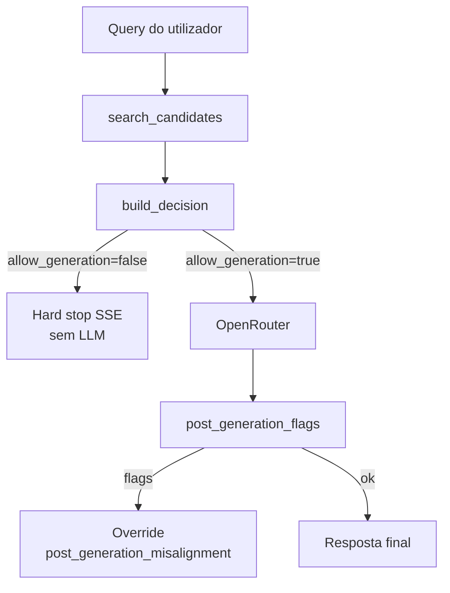

# Gates e decisões de retrieval

[← Índice](README.md)

## Filosofia

`engine/retrieval.py` implementa: **na dúvida, não responder**.

A geração só ocorre quando `RetrievalDecision.allow_generation == True` (modo `strict`).

## Fluxo de decisão



## Thresholds (defaults em código / `.env`)

| Parâmetro | Default | Variável `.env` | Efeito se falhar |
|-----------|---------|-----------------|------------------|
| Score mínimo top1 | 1.5 | `ACL_RETRIEVAL_MIN_SCORE` | `insufficient_context` |
| Margem 1º vs 2º | 0.15 | `ACL_RETRIEVAL_MIN_SCORE_MARGIN` | `ambiguous_retrieval` |
| Coverage | 0.34 | `ACL_RETRIEVAL_MIN_COVERAGE` | `context_misaligned` |
| Coverage ponderada | 0.34 | `ACL_RETRIEVAL_MIN_COVERAGE_WEIGHTED` | `context_misaligned` |
| Termos informativos mín. | 2 | `ACL_RETRIEVAL_MIN_TERMS` | `underspecified_query` |
| Candidatos BM25 | 8 | `ACL_RETRIEVAL_CANDIDATE_K` | — |
| Chunks no prompt | 4 | `ACL_RETRIEVAL_TOP_K` | — |
| Max chunks / fonte | 2 | `ACL_RETRIEVAL_MAX_CHUNKS_PER_SOURCE` | diversidade |

## `DecisionReason` — catálogo

| `reason` | Quando | LLM chamado? |
|----------|--------|--------------|
| `ok` | Passou todos os gates | Sim |
| `insufficient_context` | Sem hits ou `top_score < MIN_SCORE` | Não (sim se `ACL_RETRIEVAL_MODE=fallback` — sem chunks, `grounding_permissive`) |
| `underspecified_query` | Menos de `MIN_TERMS` termos informativos | Não |
| `ambiguous_retrieval` | 2+ candidatos, margem < 0.15 | Não (sim se `ACL_DISAMBIGUATION_ENABLED=true` e ≥2 scores ≥ `MIN_SCORE`) |
| `context_misaligned` | Coverage baixa no melhor chunk | Não |
| `vague_but_high_risk` | Query estruturalmente vaga (ex.: performance + banco) | Não |
| `low_confidence` | Confiança agregada baixa | Não |
| `index_gap` | Catálogo confiante mas chave fora do índice | Não (emitido em `context.py`) |
| `post_generation_misalignment` | Sanity pós-LLM falhou | Sim, mas resposta substituída por aviso |
| `provider_error` | OpenRouter falhou | Parcial |

## Mensagens ao utilizador (`context.py`)

Cada `reason` tem template em `HARD_STOP_MESSAGES` — texto pedagógico de reformulação.

Exemplo `underspecified_query`:

```text
Sua pergunta está vaga para responder com segurança usando a base.
Use o formato: [tecnologia] + [problema] + [contexto].
```

## Pós-geração: `post_generation_flags`

Executado em `chat_provider.py` após o LLM responder (modo strict).

| Flag | Condição (resumo) |
|------|-------------------|
| `missing_informative_terms` | Resposta não contém termos informativos da query |
| `missing_source_entities` | Não menciona fonte nem termos longos dos chunks |
| `introduced_unsupported_terms` | >25 termos técnicos longos sem suporte nos chunks |

Se há flags → stream adicional com `post_generation_misalignment`:

```text
Preparei uma resposta com base nos trechos encontrados, mas a checagem final
indicou que ela pode ter saído do escopo das fontes.
```

### Porque isto aparece nos teus testes de staging

| Observação nos testes | Explicação |
|----------------------|------------|
| Resposta longa, bem fundamentada, Score 1.00 | Retrieval e LLM OK |
| Disclaimer no final | `missing_source_entities` ou `introduced_unsupported_terms` — resposta reformula com palavras novas |
| Índice só com 2 aulas | Heurística mais sensível; fontes `legacy` + `fluencia` em muitas queries |

**Não confundir** com falha do Opção B2 no BM25 — são camadas diferentes.

## Contratos de grounding condicionais

`engine/context.py` escolhe o bloco injectado via `_select_grounding()`:

| `decision.reason` | Condição extra | Ficheiro | Chunks no prompt |
|-------------------|----------------|----------|------------------|
| (qualquer com geração OK) | default | `grounding_strict.txt` | `[Fonte: path \| Score: …]` |
| `insufficient_context` | `ACL_RETRIEVAL_MODE=fallback` | `grounding_permissive.txt` | vazio |
| `ambiguous_retrieval` | `ACL_DISAMBIGUATION_ENABLED=true` | `grounding_disambiguation.txt` | `[Fonte 1: …]`, `[Fonte 2: …]` |

Hard stops continuam a usar `hard_stop_message()` — textos em `_HARD_STOP_MESSAGES` não mudam quando `allow_generation=false`.

## Ordem dos gates em `build_decision()` (simplificado)

1. Sem candidatos ou top score baixo → `insufficient_context` (ou geração em `fallback`)
2. Poucos termos informativos → `underspecified_query`
3. Margem entre top2 → `ambiguous_retrieval`
4. Coverage / weighted coverage → `context_misaligned`
5. Vague but high risk → `vague_but_high_risk`
6. Caso contrário → `ok`

## Calibração

Os defaults são **conservadores** por design. Ajuste via `.env` após bateria de casos reais — documentar mudanças no [Backlog](16-backlog.md).

## Ver também

- [07-apis-e-sse.md](07-apis-e-sse.md) — `ACL_META` no SSE
- [08-frontend-ui.md](08-frontend-ui.md) — UI por `reason`
- [13-staging-testes.md](13-staging-testes.md) — perguntas de teste
