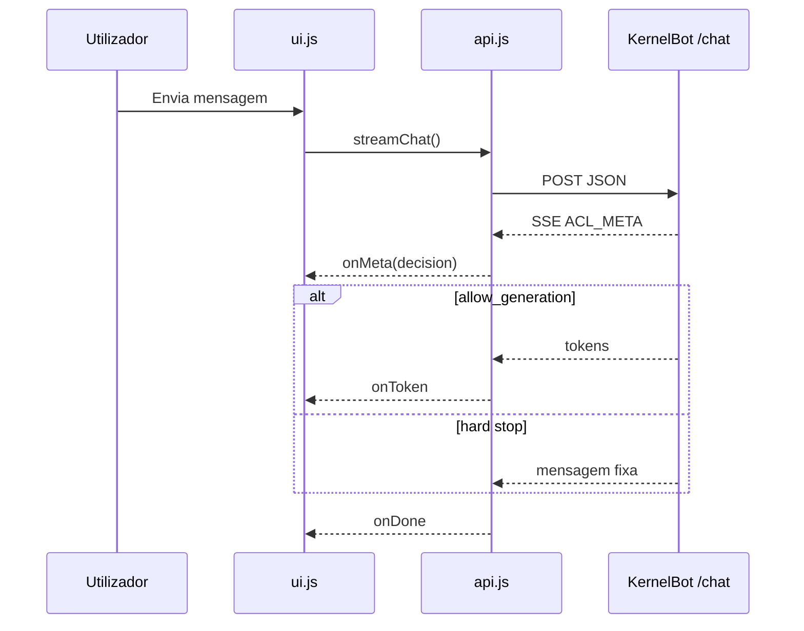

# Frontend e UI

[← Índice](README.md)

## Stack UI

| Peça | Localização |
|------|-------------|
| Template | `templates/index.html` |
| Lógica | `frontend/src/ui.js`, `main.js` |
| API SSE | `frontend/src/api.js` |
| Sessão | `frontend/src/utils/sessionId.js` |
| Estilos | `frontend/assets/css/theme.css` |

## Fluxo do chat (browser)

## Contrato UI ↔ `ACL_META` (v=3)

Campo canónico: **`allow_generation`** (boolean). O frontend também aceita fallback legado: `decision === "answer"` ⇒ geração permitida.

| `reason` | `allow_generation` | `decision` | UI |
|----------|-------------------|------------|-----|
| `ok` | `true` | `answer` | Stream markdown + breadcrumbs de fontes |
| `ambiguous_retrieval` | `true` | `answer` | Stream markdown **sem** XML cru; `DisambiguationChips` quando há `<ambiguity_options>` ou `disambiguation_options` no meta/texto |
| `ambiguous_retrieval` | `false` | `hard_stop` | `DisambiguationChips` ou texto fixo; `onDelta` ignorado |
| `post_generation_misalignment` | `false` | `hard_stop` (override) | Badge **misalignment** substitui hint de desambiguação; header `warning` |
| `index_gap` | `false` | `hard_stop` | `IndexGapAlert` |
| Outros hard stops | `false` | `hard_stop` | Texto fixo streamed (sem LLM) |

Regras em `parseAclMeta.js` + `parseAmbiguityOptions.js`:

- **Hard stop** (`allow_generation=false`): chips/index gap como antes; `onDelta` ignorado em modo `structured`.
- **Desambiguação com geração** (`ambiguous_retrieval` + `allow_generation=true`): o modelo deve emitir `<ambiguity_options>…</ambiguity_options>` (ver `grounding_disambiguation.txt`). O frontend remove o XML do markdown e monta os mesmos `DisambiguationChips`. O backend pode reforçar com `ACL_META` contendo `disambiguation_options` e `payload.suggested_candidates`.

### Flags de override pós-geração (reactividade)

| Campo `ACL_META` | Quando | Efeito na UI |
|------------------|--------|----------------|
| `post_generation_override: true` | Fase 3 strict | Substitui hint verde/cinza por `message-hint-badge--misalignment` |
| `misalignment: true` | Idem | Alias semântico do override |
| `allow_generation: false` | Após override | Impede tratar o turno como “sucesso” de desambiguação |

O **primeiro** `ACL_META` pode mostrar hint de desambiguação; o **segundo** (pós-stream) com override **substitui** o badge — nunca coexistem hint de sucesso + aviso de misalignment.

### Smoke manual (browser)

1. `ACL_DISAMBIGUATION_ENABLED=false` — pergunta ambígua com 2+ hits próximos → chips ou mensagem fixa, sem markdown longo do modelo.
2. `ACL_DISAMBIGUATION_ENABLED=true` — mesma pergunta → chips se o modelo emitir `<ambiguity_options>` (ou fallback meta do backend); hint cinza nos breadcrumbs; XML não visível.
3. Pergunta com match claro → stream normal, sem badge de desambiguação.
4. Cenário que dispare `post_generation_misalignment` → hint amarelo substitui o de desambiguação; badge do header “Revisão”.

## Componentes por `reason` (hard stop)

| Componente | Ficheiro | Quando |
|------------|----------|--------|
| `IndexGapAlert` | `components/IndexGapAlert.js` | `index_gap` + `allow_generation=false` |
| `DisambiguationChips` | `components/DisambiguationChips.js` | `ambiguous_retrieval` + `allow_generation=false` + `payload.suggested_candidates` |

## ACL meta no rodapé

A UI mostra (quando disponível):

- Score de confiança
- Fontes (`db:...`)
- Termos correspondidos
- Aviso `post_generation_misalignment`

## Parse de ACL (`frontend/src/acl/parseAclMeta.js`)

| Função | Papel |
|--------|-------|
| `allowsGeneration` | Lê `allow_generation` ou infere de `decision` |
| `isStructuredHardStop` | `index_gap` / `ambiguous_retrieval` sem geração |
| `shouldMountDisambiguationChips` | Chips bloqueantes |
| `isDisambiguationGeneration` | Hint `disambiguation` no stream |
| `isPostGenerationOverride` | Hint `misalignment` + header warning |
| `parseAmbiguityOptions.js` | Strip XML/JSON do texto; extrai candidatos para chips |

## Sessão

| Aspecto | Implementação |
|---------|---------------|
| ID | UUID em `sessionStorage` |
| Pin | Servidor-side `PinnedSessionStore` por `session_id` |
| TTL pin | `ACL_PIN_TTL_TURNS` (default 3) |

## Markdown na resposta

Renderização client-side das mensagens do assistente (biblioteca conforme `ui.js`).

## Ver também

- [07-apis-e-sse.md](07-apis-e-sse.md)
- [06-gates-e-decisoes.md](06-gates-e-decisoes.md)
