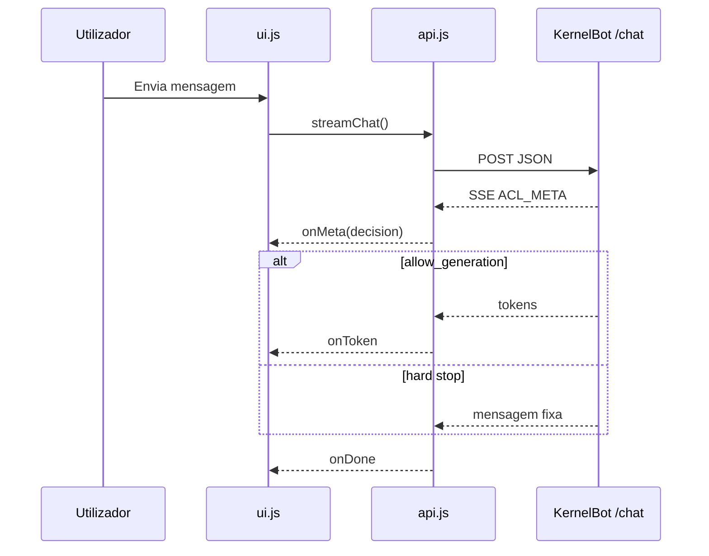

# Frontend e UI

[← Índice](README.md)

## Stack UI

| Peça | Localização |
|------|-------------|
| Template | `templates/index.html` |
| Lógica | `frontend/src/ui.js`, `main.js` |
| API SSE | `frontend/src/api.js` |
| Sessão | `frontend/src/utils/sessionId.js` |
| Estilos | `frontend/assets/css/theme.css` |

## Fluxo do chat (browser)

## Componentes por `reason`

| Componente | Ficheiro | `reason` |
|------------|----------|----------|
| `IndexGapAlert` | `components/IndexGapAlert.js` | `index_gap` |
| `DisambiguationChips` | `components/DisambiguationChips.js` | `ambiguous_retrieval` |

## ACL meta no rodapé

A UI mostra (quando disponível):

- Score de confiança
- Fontes (`db:...`)
- Termos correspondidos
- Aviso `post_generation_misalignment`

## Parse de ACL (`frontend/src/acl/parseAclMeta.js`)

Normaliza payload `ACL_META` v=3 para consumo da UI.

## Sessão

| Aspecto | Implementação |
|---------|---------------|
| ID | UUID em `sessionStorage` |
| Pin | Servidor-side `PinnedSessionStore` por `session_id` |
| TTL pin | `ACL_PIN_TTL_TURNS` (default 3) |

## Markdown na resposta

Renderização client-side das mensagens do assistente (biblioteca conforme `ui.js`).

## Ver também

- [07-apis-e-sse.md](07-apis-e-sse.md)
- [06-gates-e-decisoes.md](06-gates-e-decisoes.md)
