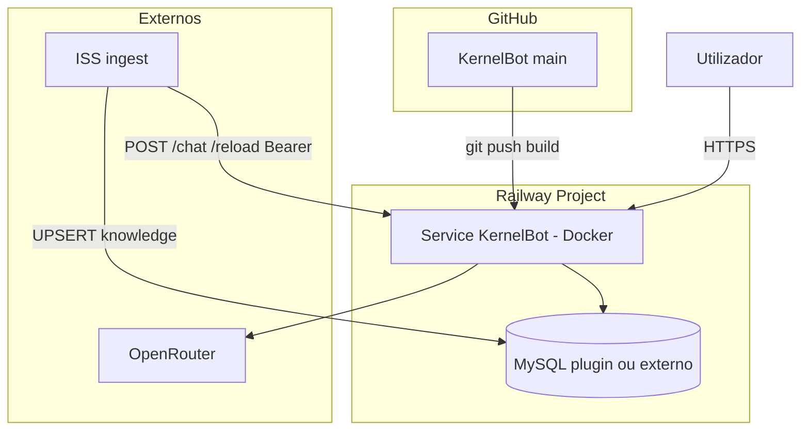

# 20 — Deploy Railway (KernelBot / ACL)

> **Runbook de produção.** Como colocar o KernelBot na [Railway](https://railway.com) de
> forma reproduzível, popular o corpus e operar (ingest, reload, rollback).
> Prompt-fonte: `docs/PROMPT-AGENTE-DEPLOY-RAILWAY.md`.

**Última revisão:** junho/2026 · Builder Docker · LLM `openrouter` · 1 réplica.

---

## 1. URL de produção

| Campo | Valor |
|-------|-------|
| URL pública | `https://kernelbot-deploy-production.up.railway.app` |
| Projeto Railway | `independent-illumination` · serviço `KernelBot-Deploy` · região `sfo` |
| Método de deploy | `railway up` (upload local; serviço também ligado ao GitHub) |
| MySQL | **Opção B — Aiven externo** (liga sem SSL; ver §7) |
| Builder | Dockerfile (`railway.toml`) |
| Healthcheck | `GET /health` · timeout 180s |

> Deploy validado em junho/2026: 219 chunks / 4 silos a partir do corpus Aiven (59 aulas ativas).

---

## 2. Arquitetura de deploy

O KernelBot **não é stateless puro**: o corpus vive no MySQL, o índice BM25 é reconstruído em
RAM no boot, e o histórico de chat vive no `localStorage` do browser.

| Componente | Onde vive | Implicação de deploy |
|------------|-----------|----------------------|
| Corpus textual (`knowledge`) | **MySQL** | Sem rows → chat sem `[Fonte:]` |
| Índice BM25 | **RAM** do container | Rebuild no boot e em `/reload` |
| Pin de sessão | **RAM** | Restart apaga pins (aceitável) |
| Histórico de chat | **Browser** `localStorage` | Railway não persiste |
| LLM | **OpenRouter** (prod) | Cursor SDK inadequado em PaaS headless |
| UI + API | Container Uvicorn `0.0.0.0:$PORT` | Railway injecta `PORT` |



**Sequência de boot** (verificada em `main.py` / `engine/database.py`):

1. Railway injecta `PORT`; `uvicorn main:app --host 0.0.0.0 --port $PORT`.
2. `SearchEngine.rebuild()` lê o MySQL → BM25 em RAM.
3. Se o MySQL estiver inacessível no boot: o container **arranca na mesma** com índice vazio
   (`chunk_total=0`) e logs `mysql_unreachable` — `/health` continua a responder `ok`.
4. Healthcheck Railway = `GET /health` (liveness; **não** testa MySQL).

---

## 3. Variáveis do serviço (sem valores secretos)

Definir no **Railway Dashboard → Service → Variables** (ou `railway variables set`).
Template completo em `.env.railway.example`.

| Variável | Obrigatória | Valor / nota |
|----------|-------------|--------------|
| `ACL_LLM_PROVIDER` | sim | `openrouter` |
| `OPENROUTER_API_KEY` | sim | **secret** |
| `DB_HOST` | sim | Ver Fase 2 |
| `DB_PORT` | sim | `3306` típico |
| `DB_NAME` | sim | |
| `DB_USER` | sim | |
| `DB_PASSWORD` | sim | **secret** |
| `ACL_RELOAD_BEARER_TOKEN` | sim | `openssl rand -hex 32` — **secret** |
| `ACL_GROUNDING_POLICY` | recomendado | `anchored` |
| `ACL_GLOBAL_CONTEXT` | recomendado | `geral` |
| `ACL_CATALOG_ENABLED` | recomendado | `false` |
| `ACL_LOG_FORMAT` | opcional | `json` em produção |
| `PORT` | **proibido** | Railway injecta automaticamente |

Alias aceite: `KERNELBOT_RELOAD_TOKEN` = mesmo valor que `ACL_RELOAD_BEARER_TOKEN`
(usado pelo pipeline ISS `sync-kernelbot-knowledge`).

> **Sem `ACL_RELOAD_BEARER_TOKEN`** → `POST /chat` com `/reload` e `GET /health/catalog`
> respondem **503** (`reload token not configured`). Confirmado em `_verify_reload_bearer`
> (`api/routes.py`).

---

## 4. Fluxo de deploy por fases

### Fase 0 — Pré-voo local (validado neste repo)

Resultado da verificação local (Docker daemon sem `docker compose` → usado `docker build` + `docker run`):

| Gate | Critério | Estado |
|------|----------|--------|
| G0.1 | `docker build` exit 0 | **PASS** |
| G0.2 | `GET /health` → `{"status":"ok"}` e `GET /` → HTML | **PASS** |
| `$PORT` | `PORT=9090` → uvicorn em `0.0.0.0:9090` | **PASS** |
| G0.3 | Chat on-corpus com `[Fonte:]` | **TBD** (exige `OPENROUTER_API_KEY` + corpus) |

Reproduzir o pré-voo mínimo:

```bash
cd /caminho/KernelBot
docker build -t kernelbot:deploy-check .
docker run -d --name kb-check -p 8011:8001 \
  -e ACL_LLM_PROVIDER=openrouter -e OPENROUTER_API_KEY=dummy \
  -e DB_HOST=127.0.0.1 -e DB_PORT=3306 -e DB_NAME=none -e DB_USER=none -e DB_PASSWORD=none \
  kernelbot:deploy-check
sleep 8 && curl -fsS http://127.0.0.1:8011/health && echo
docker rm -f kb-check
```

> Se tiveres `docker compose` instalado, o caminho canónico é
> `docker compose -f docker-compose.deploy-staging.yml up -d --build` (stack app + MySQL).

### Fase 1 — Projeto Railway

1. Criar projeto Railway e ligar o repo GitHub `KernelBot`.
2. Definir branch de deploy (`main` ou acordada).
3. Confirmar deteção de `railway.toml` + `Dockerfile`.
4. **Não** criar a variável `PORT` manualmente.

### Fase 2 — MySQL (escolher UMA opção)

**Opção A — Plugin MySQL Railway** (recomendado no 1.º deploy):

```env
DB_HOST=${{MySQL.MYSQLHOST}}
DB_PORT=${{MySQL.MYSQLPORT}}
DB_NAME=${{MySQL.MYSQLDATABASE}}
DB_USER=${{MySQL.MYSQLUSER}}
DB_PASSWORD=${{MySQL.MYSQLPASSWORD}}
```

Aplicar o schema `knowledge` (DDL idempotente — `docker/init-knowledge.sql`):

```sql
CREATE TABLE IF NOT EXISTS knowledge (
  id BIGINT UNSIGNED NOT NULL AUTO_INCREMENT,
  discipline VARCHAR(128) NOT NULL,
  slug VARCHAR(255) NOT NULL,
  title VARCHAR(512) NOT NULL,
  `order` INT NOT NULL DEFAULT 0,
  content LONGTEXT,
  active TINYINT(1) NOT NULL DEFAULT 1,
  created_at TIMESTAMP NOT NULL DEFAULT CURRENT_TIMESTAMP,
  updated_at TIMESTAMP NOT NULL DEFAULT CURRENT_TIMESTAMP ON UPDATE CURRENT_TIMESTAMP,
  PRIMARY KEY (id),
  UNIQUE KEY uk_discipline_slug (discipline, slug),
  KEY idx_active (active)
) ENGINE=InnoDB DEFAULT CHARSET=utf8mb4 COLLATE=utf8mb4_unicode_ci;
```

Gate: `SELECT COUNT(*) FROM knowledge WHERE active = 1;`

**Opção B — Aiven / MySQL externo:** usar credenciais existentes; garantir que a saída de rede
da Railway tem acesso (allowlist Aiven). **Atenção SSL:** ver §7 (TBD).

### Fase 3 — Variáveis do serviço

Definir as variáveis da §3. Gerar o token de reload:

```bash
openssl rand -hex 32   # → ACL_RELOAD_BEARER_TOKEN (secret)
```

### Fase 4 — Primeiro deploy

1. Trigger por push (ou `railway up`).
2. Monitorizar logs: `index_rebuilt` / `chunk_total`, erros `pymysql`, `OPENROUTER`, OOM.
3. Gate:

```bash
export BASE_URL="https://<subdominio>.up.railway.app"
curl -fsS "$BASE_URL/health"
```

### Fase 5 — Ingest do corpus (ISS → MySQL)

O deploy **não** popula aulas. Caminhos:

| Método | Quando |
|--------|--------|
| `bin/staging-ingest-iss.sh` adaptado (`DB_*` → MySQL Railway via proxy TCP) | Repo ISS local |
| Pipeline ISS GHA `sync-kernelbot-knowledge` | Produção contínua |
| SQL/seed manual | Só smoke mínimo |

Após o ingest, reconstruir o índice:

```bash
curl -sS -N -X POST "$BASE_URL/chat" \
  -H "Content-Type: application/json" \
  -H "Authorization: Bearer $ACL_RELOAD_BEARER_TOKEN" \
  -d '{"message": "/reload"}'
# Esperado: SSE com "Índice reconstruído: N chunk(s) total (M silo(s) do MySQL)."
```

### Fase 6 — Smoke de produção

| # | Teste | Esperado |
|---|-------|----------|
| S1 | `GET /health` | `{"status":"ok"}` |
| S2 | `GET /` | HTML da UI |
| S3 | `POST /chat` pergunta on-corpus | Stream SSE + `[Fonte: db:…]` (se corpus indexado) |
| S4 | Follow-up na mesma sessão | Continuidade (history no browser) |
| S5 | `POST /chat` `/reload` + Bearer | `Índice reconstruído: …` |
| S6 | Pergunta off-corpus | Lacuna honesta, sem advisory espúrio |

Opcional: `GET /health/catalog` + Bearer → drift catálogo vs índice.

### Fase 7 — Domínio e operação

- Ativar domínio Railway / custom domain (HTTPS automático).
- Alertas e logs Railway.
- Fixar URL final e procedimento de rollback (§6).

---

## 5. Comandos de smoke (copy-paste)

```bash
export BASE_URL="https://<subdominio>.up.railway.app"
export ACL_RELOAD_BEARER_TOKEN="<token>"

# S1 — liveness
curl -fsS "$BASE_URL/health"

# S3 — chat on-corpus (stream SSE)
curl -sS -N -X POST "$BASE_URL/chat" \
  -H "Content-Type: application/json" \
  -d '{"message": "/python O que são variáveis?", "session_id": "deploy-smoke-001"}'

# S5 — reload (Bearer obrigatório)
curl -sS -N -X POST "$BASE_URL/chat" \
  -H "Content-Type: application/json" \
  -H "Authorization: Bearer $ACL_RELOAD_BEARER_TOKEN" \
  -d '{"message": "/reload"}'
```

---

## 6. Rollback

1. Railway → Service → **Deployments** → escolher o deployment estável anterior → **Redeploy**.
2. Alternativa Git: reverter o commit problemático em `main` e deixar o build automático refazer.
3. **Nunca** `git push --force` em `main`.
4. O corpus MySQL **não** é afetado por rollback da app; só o código/imagem regride.

---

## 7. Limitações conhecidas e TBD

| Item | Estado | Nota |
|------|--------|------|
| **SSL MySQL** | **RESOLVIDO** | Aiven desta conta liga **sem** SSL (`pymysql.connect` sem `ssl` → OK, 59 rows). Validado do host local e em produção (`/reload` → 219 chunks/4 silos). Se mudares de instância Aiven com `require_secure_transport=ON`, reabrir (erro 3159/2026 → passar `ssl=...`). |
| **Readiness vs MySQL** | **TBD** | `/health` é só liveness; não deteta MySQL down. Considerar readiness probe que valide `SELECT 1`. |
| **G0.3 / chat on-corpus** | **RESOLVIDO** | Smoke S3 em produção: `reason=ok`, `confidence=high`, 4 fontes `db:…` citadas. |
| **DB_HOST com espaço** | atenção | O `.env` local tinha espaço à esquerda em `DB_HOST`; `_normalize_db_host` faz `.strip()`, mas convém manter os valores limpos ao definir variáveis. |
| **Chat sem auth** | conhecido | POC académica sem login; documentar risco de abuso/jailbreak. |
| **1 réplica** | invariante | BM25 em RAM não partilha estado; múltiplas réplicas → pins/índice inconsistentes. Manter **1 réplica**. |
| **Ingest automático** | TBD | GHA `sync-kernelbot-knowledge` do ISS por configurar para produção contínua. |

---

## 8. Árvore de falhas (resumo)

```
Deploy FAILED / unhealthy
├─ Build falha            → ler log → Dockerfile / requirements-prod.txt
├─ Crash loop
│  ├─ OPENROUTER_API_KEY  → definir secret (provider=openrouter exige a chave)
│  ├─ DB connection       → DB_* e rede MySQL (ver §7 SSL)
│  └─ OOM                 → subir plano / reduzir corpus de teste
├─ Healthy mas sem fontes
│  ├─ COUNT(knowledge)=0  → ingest (Fase 5)
│  └─ COUNT>0             → POST /reload + verificar chunk_total nos logs
├─ 503 em /reload         → ACL_RELOAD_BEARER_TOKEN ausente
└─ SSE corta a meio       → timeout proxy; UI já usa inactivity guard
```

---

## 9. Referências

| Documento | Uso |
|-----------|-----|
| [07-apis-e-sse.md](07-apis-e-sse.md) | Contrato `/chat`, `/reload`, SSE |
| [12-configuracao.md](12-configuracao.md) | Todas as env vars |
| [04-dados-e-mysql.md](04-dados-e-mysql.md) | Schema `knowledge` |
| [10-integracao-iss-fase5b.md](10-integracao-iss-fase5b.md) | Pipeline ingest ISS |
| [13-staging-testes.md](13-staging-testes.md) | Staging local |
| `.env.railway.example` | Template de variáveis |
| `docs/PROMPT-AGENTE-DEPLOY-RAILWAY.md` | Prompt-fonte do agente de deploy |
