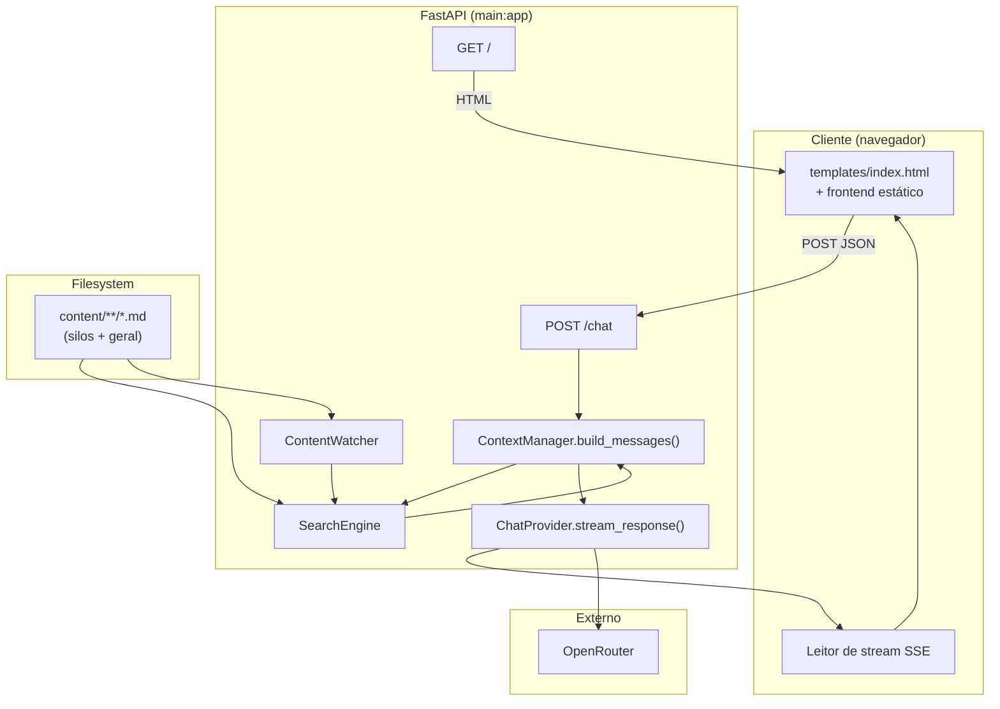
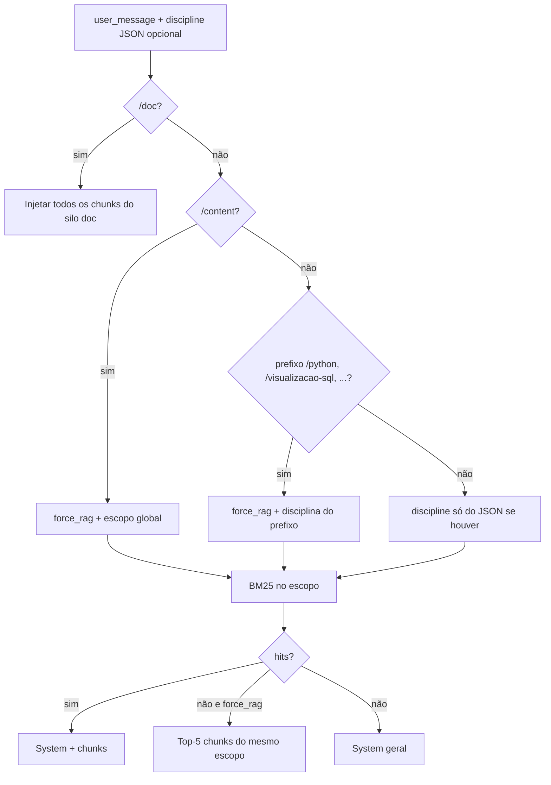

# ACL — Agente de Contexto Local

> Chatbot RAG com indexação BM25, file-watching reativo e streaming SSE via OpenRouter. Backend modular (`main.py` + pacotes `core`, `engine`, `api`, `app`).

---

## Propósito do sistema

O **ACL (Agente de Contexto Local)** existe para transformar um diretório local de arquivos Markdown (`content/`) em base de conhecimento consultável via chat: o usuário envia texto, o backend decide se injeta contexto recuperado por BM25 (e modos `/content` e `/doc`), e um LLM acessível pela **OpenRouter** responde em **streaming** (SSE). Não há banco de dados nem fila: índice e chunks ficam em memória no processo.

O público-alvo são desenvolvedores ou equipes que querem um assistente “no seu corpus” com deploy simples (Python + `.env`).

### Síntese das entregas documentadas neste ficheiro

As secções **Registro de alterações** abaixo descrevem, por ordem cronológica aproximada de evolução do produto:

| # | Tema | Resumo do que foi feito |
|---|------|-------------------------|
| 1 | **Refatoração modular** | Saída de `app.py` monolítico para `main.py` + pacotes `core`, `engine`, `api`, `app`; `Settings` tipado, logging por área, `SearchEngine`, `ContentWatcher`, rotas com estado injetado. |
| 2 | **Silos BM25 e comandos** | Índice por pasta sob `content/`, silo `geral`, comandos `/doc`, `/content`, prefixos de disciplina, JSON `discipline`, `ACL_GLOBAL_CONTEXT` (`geral` / `all`). |
| 3 | **Feedback e rastreabilidade na UI** | `BuildMessagesResult` / `ContextTrace`, primeiro evento SSE `[ACL_META]` (`label`, `sources`), estado “Analisando resumos…”, breadcrumbs, chip de silo no input, `onFirstToken` para ocultar o estado intermédio no primeiro token do modelo. |
| 4 | **Contexto fixado por sessão** | `PinnedSessionStore` em memória, `session_id` no `POST /chat`, pin após RAG forte ou `/doc`/fallback, reutilização em perguntas de acompanhamento quando BM25 falha ou é fraco, `/reset` e `/limpar`, expiração por turnos, campos `pinned_active` / `pinned_display` no meta e badge **“Contexto: …”** no cabeçalho. |

O restante deste documento (**Arquitetura**, **APIs**, **Fluxos**, **Glossário**) detalha o estado atual do sistema e alinha nomes com o código.

### Alterações recentes: refatoração modular

Até a refatoração, praticamente toda a lógica vivia em um único **`app.py`** (config, BM25, watchdog, montagem de mensagens, streaming e rotas FastAPI).

**O que mudou (estado atual):**

| Antes | Depois |
|--------|--------|
| `app.py` monolítico | `main.py` orquestra serviços e expõe `app` ao Uvicorn |
| Constantes e `load_dotenv` no topo do módulo | `core/config.py` — `Settings` tipado e `Settings.load()` |
| `logging.basicConfig` + logger único | `core/logging_config.py` — `configure_logging()`; loggers `kernelbots.*` por área |
| `BM25Index` global | `engine/search.py` — classe `SearchEngine` (mesma semântica: chunks, lock, threshold) |
| Watchdog acoplado ao módulo | `engine/watcher.py` — `ContentWatcher` + `start_content_observer()` |
| `_build_messages` | `engine/context.py` — `ContextManager.build_messages()` |
| `_stream_response` | `engine/chat_provider.py` — `ChatProvider.stream_response()` |
| Rotas no mesmo arquivo | `api/routes.py` — `APIRouter`; dependências via `request.app.state` |
| `Jinja2Templates("templates")` (CWD) | `app/factory.py` — `create_app()` com path **absoluto** para `templates/` |
| `uvicorn app:app` / `python app.py` | `uvicorn main:app` / `python main.py` |

**O que foi preservado (sem regressão intencional):**

- Endpoints `GET /` e `POST /chat`, status codes e corpo de erro para JSON inválido e `message` vazio.
- Threshold BM25 **0,7** (configurável no código via `Settings`), lista de modelos e fallback SSE (`[DONE]` / `[ERROR]`).
- Debounce do watchdog **1,5 s**.

**Testes:** smoke em `tests/test_smoke.py` (`pytest`); validação manual com `import main` e subida do servidor.

### Registro de alterações: silos BM25, filtro `discipline` e comandos de pasta

Esta secção consolida **tudo o que foi alterado** em relação ao desenho anterior (apenas `content/*.md` plano e `/doc` por nome de ficheiro).

| Área | Ficheiros | O que mudou |
|------|-----------|-------------|
| **Índice BM25** | `engine/search.py` | Deixou de ser um único índice sobre `content/*.md`. Passou a haver **um `BM25Okapi` por silo**: subpastas **diretas** de `content/` (nome sem `.` inicial), mais o silo lógico **`geral`** (`content/*.md` + `content/geral/**/*.md`). Cada chunk tem `source` (caminho POSIX relativo a `content/`) e `discipline`. Métodos novos/alterados: `normalize_discipline`, `chunks_for_scope`, `search(..., discipline_filter=...)`, propriedade `discipline_ids`. Modo global sem filtro: `Settings.global_context_mode` **`geral`** (só silo geral) ou **`all`** (até `top_k` hits por silo com score normalizado no silo, fusão e corte global em `top_k`). Uso de **`threading.RLock`** para evitar deadlock entre `search` e `normalize_discipline`. |
| **Configuração** | `core/config.py` | Novo campo `global_context_mode` em `Settings`. Variável de ambiente **`ACL_GLOBAL_CONTEXT`**: `geral` (omissão) ou `all`; outro valor → **erro ao arrancar** (`RuntimeError`). |
| **Arranque** | `main.py` | `SearchEngine` passa a receber `settings.global_context_mode`. Log de arranque inclui o modo de contexto global. |
| **Watchdog** | `engine/watcher.py` | `observer.schedule(..., recursive=True)` para detectar alterações em `content/<disciplina>/**/*.md`, não só na raiz de `content/`. |
| **Contexto / RAG** | `engine/context.py` | `build_messages(user_message, discipline_filter=None)`: filtro opcional alinhado ao motor (sanitização via `normalize_discipline`). **Prefixos de disciplina** na mensagem: `/python`, `/visualizacao-sql`, `/projeto-bloco`, `/planejamento-curso-carreira` — forçam RAG **só** nesse silo (lista fixa em `_DISCIPLINE_COMMAND_PREFIXES`, ordenada do prefixo mais longo para o mais curto; após o comando exige-se **espaço ou fim de string**, para não confundir com `/pythonfoo`). **`/doc`**: deixou de filtrar por `documentation.md` em qualquer lado; passa a injetar **todos** os chunks com `discipline == "doc"` (i.e. `content/doc/**/*.md`). **`/content`**: mantém RAG forçado no **escopo global** (conforme `ACL_GLOBAL_CONTEXT`), não numa disciplina isolada. **Precedência:** prefixo de disciplina na mensagem **prevalece** sobre o campo JSON `discipline`. Fallback quando há RAG forçado mas sem hits BM25: top-5 chunks de **`chunks_for_scope`** (mesmo universo que a busca). |
| **API HTTP** | `api/routes.py` | Corpo JSON opcional **`discipline`** (string). Tipo inválido → **400**. Disciplina inválida ou desconhecida → **ignorada** (*warning* no log), fluxo do chat continua. |
| **Interface** | `templates/index.html` | Texto de ajuda e **pills** de exemplo para `/python`, `/visualizacao-sql`, `/projeto-bloco`, `/planejamento-curso-carreira`, `/doc`, `/content`. O cliente `frontend/src/api.js` envia, por omissão, **só** `message`; o utilizador usa os prefixos no texto ou um cliente pode enviar `discipline` no JSON. |
| **Testes** | `tests/test_smoke.py` | Cobertura acrescentada: isolamento de silo com `discipline_filter`, sanitização (`..`, paths, desconhecido), modo global `geral` sem ficheiros na raiz, tipo não-string de `discipline` → 400, `/doc` só silo `doc`, prefixo `/python` vs `/pythonfoo`, RAG com prefixo de disciplina. |

**Extensão futura:** novas disciplinas no disco não ganham comando `/nome` automático — é preciso acrescentar o par `("/nome", "nome")` em `_DISCIPLINE_COMMAND_PREFIXES` em `engine/context.py` (manter ordem: prefixos mais longos primeiro).

### Registro de alterações: feedback na UI, rastreabilidade e `ACL_META`

Esta secção descreve a entrega de **feedback enquanto o contexto é preparado**, **breadcrumbs** com ficheiros usados no system prompt, **indicação do silo/comando** na área de input e o **contrato SSE** associado. Comportamento implementado no código referenciado abaixo.

| Área | Ficheiros | O que mudou |
|------|-----------|-------------|
| **Contexto e metadados** | `engine/context.py` | `build_messages` passou a devolver **`BuildMessagesResult`**: campo **`messages`** (lista para o LLM) e **`trace`** (`**ContextTrace**`: `label` legível, `sources` como tuplo de caminhos relativos a `content/`, **deduplicados** e **limitados a 20**). O `trace` é preenchido em todos os ramos: modo `/doc` (fontes dos chunks do silo `doc`), RAG com hits BM25 (fontes dos hits), RAG forçado sem hits (fontes do fallback top-5 de `chunks_for_scope`), modo assistente geral sem contexto local (`sources` vazio, rótulo adequado). |
| **Streaming SSE** | `engine/chat_provider.py` | `stream_response(messages, trace=…)` aceita o `ContextTrace`. **Antes** de contactar a OpenRouter, emite **uma** linha `data: [ACL_META]` seguida de JSON UTF-8 (`v`, `label`, `sources`; e, em versões atuais, `pinned_active`, `pinned_display`). Os tokens do modelo seguem no formato já existente (`\n` escapado como `\n` no payload). |
| **Rota** | `api/routes.py` | Desempacota `built = context_manager.build_messages(…)` e chama `chat_provider.stream_response(built.messages, trace=built.trace)`. |
| **Cliente HTTP** | `frontend/src/api.js` | `sendStream` aceita **`onMeta`** (payload JSON após o prefixo `[ACL_META]`) e **`onFirstToken`** (disparado quando o primeiro carácter de texto do modelo é acrescentado ao acumulado — **não** no evento de metadados). Linhas `[ACL_META]` **não** entram em `fullText`. |
| **UI do chat** | `frontend/src/ui.js`, `frontend/src/components/MessageRow.js`, `frontend/src/components/ChatView.js` | Após a mensagem do utilizador: bloco **“Analisando resumos de …”** (rótulo imediato via `frontend/src/utils/contextLabel.js`, alinhável ao `label` do servidor quando `onMeta` chega). Esse bloco **oculta-se com transição** no primeiro token (`onFirstToken`). Cada resposta do bot pode mostrar **breadcrumbs** (`Pasta > Subpasta > Ficheiro.md`) acima da bolha, com estilo muted; lista limitada na UI (ex.: 5 linhas + “+N”). |
| **Silo ativo** | `frontend/src/ui.js`, `templates/index.html`, `frontend/assets/css/theme.css` | O texto do `textarea` é analisado com a **mesma ideia de prefixos** que o servidor (`/doc`, `/content`, comandos de disciplina). Aplica-se classe na área de input e um **chip** textual (“Silo: …”) quando um comando é reconhecido. |
| **Histórico** | `frontend/src/utils/history.js` (formato), `ChatView.js` | Entradas `bot` podem incluir **`sources`** para reapresentar breadcrumbs ao recarregar (`sessionStorage`, chave existente). |
| **Testes** | `tests/test_smoke.py` | Chamadas a `build_messages` usam `built.messages` / `built.trace`; asserts de `trace` em cenários `/doc` e `/python`. |

**Notas de integração**

- Clientes que ignorem `[ACL_META]` e tratarem qualquer `data:` como texto do modelo verão comportamento incorreto; o frontend do repositório é o consumidor previsto.
- O rótulo imediato no browser para `/content` não conhece `ACL_GLOBAL_CONTEXT`; o valor **oficial** do contexto global continua a vir no `label` de `onMeta` após a resposta do servidor.

### Registro de alterações: contexto fixado por sessão (“pinned context”)

Objetivo: reduzir **perda de contexto** em perguntas curtas de acompanhamento (ex.: após `/python … aula 15`, a mensagem “E o AT?”) quando o BM25 da nova frase **não devolve hits** ou devolve scores **abaixo** de um limiar configurável.

| Área | Ficheiros | O que mudou |
|------|-----------|-------------|
| **Armazenamento** | `engine/pinned_store.py` | `PinnedSessionStore` em memória, thread-safe: por `session_id` guarda `scope_key` (`doc`, `content`, `discipline:<id>`), lista de chunks `{source, text}` (truncada por tamanho), `display_name` (para UI) e `turns_left`. `begin_turn` consome **um turno** no início de cada mensagem com sessão; ao chegar a zero o pin é removido. |
| **Configuração** | `core/config.py` | Novos campos em `Settings`: `pinned_max_turns` (`ACL_PINNED_MAX_TURNS`, default **5**), `pinned_max_chars` (`ACL_PINNED_MAX_CHARS`, default **24000**), `pinned_weak_score` (`ACL_PINNED_WEAK_SCORE`, default **0,4**) — limiar de score BM25 **normalizado no silo** abaixo do qual os hits são tratados como “fracos” para efeito de substituição pelo pin. |
| **Montagem de mensagens** | `engine/context.py` | `build_messages(..., session_id=None)` integra o store: **`/reset`** ou **`/limpar`** no início da mensagem limpa o pin; mudança de **âmbito explícito** (ex.: `/python` → `/doc`, ou JSON `discipline` diferente do pin) invalida o pin; mensagens **sem** comando nem `discipline` no JSON **herdam** a disciplina do pin (`discipline:…`) para a busca BM25. Se houver hits **fortes**, o system prompt usa-os e **atualiza** o pin; se **não houver hits**, hits fracos (com pin), ou modo geral sem hits mas com pin válido, injeta-se o **conteúdo fixado** com instrução explícita a priorizar esse material. |
| **Serviços** | `main.py`, `app/state.py` | `PinnedSessionStore` criado no arranque e injetado em `ContextManager` e `AppServices`. |
| **API** | `api/routes.py` | Campo opcional **`session_id`** (string **8–128** caracteres: letras, dígitos, `_`, `-`); formato ou tipo inválido → **400**. |
| **`ContextTrace` / SSE** | `engine/context.py`, `engine/chat_provider.py` | `trace` inclui `pinned_active` e `pinned_display`; `[ACL_META]` envia os mesmos campos para o cliente. |
| **Frontend** | `frontend/src/utils/sessionId.js`, `frontend/src/api.js`, `frontend/src/ui.js`, `templates/index.html`, `theme.css` | UUID (hex 32) persistido em `sessionStorage` (`acl_session_id`); cada `POST /chat` envia `session_id`. Badge **“Contexto: …”** no cabeçalho quando `pinned_active` e `pinned_display` vêm no meta. |
| **Testes** | `tests/test_smoke.py` | Cenários: follow-up sem hits reutiliza texto fixado; `/reset` limpa sessão; `session_id` inválido → 400; `AppServices` inclui `pinned_store`. |

**Limites:** o estado é **só na RAM do processo**; reiniciar o servidor ou usar outro dispositivo sem o mesmo `session_id` perde o pin. Não há deteção semântica de “mudou de assunto” além de comandos, JSON `discipline`, expiração por turnos e limiar BM25.

---

## Arquitetura

### Visão geral e stack

| Camada | Tecnologia |
|--------|------------|
| Servidor HTTP | FastAPI + Uvicorn |
| Índice | BM25Okapi (`rank-bm25`) |
| File watching | Watchdog (thread em background) |
| LLM | OpenRouter (`httpx` async, stream) |
| UI servida | Jinja2 (`templates/index.html`) + arquivos estáticos opcionais em `frontend/` |
| Streaming | Server-Sent Events (SSE) |

### Estrutura de pastas

```
KernelBots/
├── main.py             # Logging, Settings, SearchEngine, observer, AppServices, create_app
├── core/               # Settings (env), logging_config
├── engine/             # SearchEngine, ContentWatcher, ContextManager, ChatProvider, PinnedSessionStore
├── api/                # Rotas FastAPI
├── app/                # create_app(), mounts estáticos, lifespan
├── frontend/           # Opcional: /assets, /src montados por create_app
├── content/            # Silos = subpastas diretas; BM25 por disciplina (+ silo lógico geral)
├── templates/          # index.html (shell da UI)
├── tests/
├── requirements.txt
└── .env                # OPENROUTER_API_KEY (obrigatório)
```

### Diagrama lógico



### Injeção de estado (sem globais de domínio nas rotas)

- `main.py` instancia `AppServices` (`search_engine`, `context_manager`, `chat_provider`, `observer`, `pinned_store`) e chama `create_app(services)`.
- `create_app` grava `app.state.services` e `app.state.templates`.
- Handlers em `api/routes.py` leem `request.app.state.services` e `request.app.state.templates`.

### `create_app` e arquivos estáticos

Em `app/factory.py`, se existirem `frontend/assets` e `frontend/src`, são montados em **`/assets`** e **`/src`**, permitindo que `index.html` referencie CSS/JS modulares sem depender do diretório de trabalho atual.

### Ciclo de vida do watchdog

- `Observer` é iniciado em **`main.py`** após criar o `SearchEngine`.
- No **shutdown** do FastAPI (`lifespan` em `app/factory.py`), chamam-se `observer.stop()` e `observer.join()`.

### Módulos do motor (`engine/`)

#### `SearchEngine` (BM25 multi-silo)

- **Silos:** cada subpasta direta de `content/` (nome sem `.` inicial) é uma disciplina com índice próprio; o silo lógico **`geral`** reúne `content/*.md` e `content/geral/**/*.md`.
- Chunks incluem `source` (caminho relativo a `content/`, ex.: `python/aula-01.md`) e `discipline`.
- `normalize_discipline` valida contra pastas reais e rejeita caracteres fora de `[A-Za-z0-9_-]` (proteção a path traversal).
- `search(query, top_k=3, discipline_filter=None)`: com filtro válido, busca só nesse silo; sem filtro, aplica `Settings.global_context_mode`: **`geral`** → só silo geral; **`all`** → até `top_k` candidatos por silo (score normalizado no silo), fusão global ordenada e corte em `top_k`.
- `chunks_for_scope(discipline_filter)` devolve a lista de chunks do mesmo universo usado no fallback (uma disciplina, ou geral, ou união ordenada por nome de silo em modo `all`).
- `chunks` expõe a união de todos os silos; `threading.RLock` na leitura/escrita concorrente com `rebuild`.

#### `ContentWatcher`

- Debounce **1,5 s** com `threading.Timer` antes de `search_engine.rebuild()`; observação **recursiva** sob `content/` para alterações em subpastas.

#### `ContextManager`

- **Prefixos na mensagem:** `/content` (força RAG no escopo global conforme `ACL_GLOBAL_CONTEXT`); `/doc` (injeta **todos** os chunks do silo `doc`, isto é `content/doc/**/*.md`); `/python`, `/visualizacao-sql`, `/projeto-bloco`, `/planejamento-curso-carreira` (forçam RAG **só** nessa disciplina — o comando deve ser seguido de espaço ou fim de linha, ex. `/python` ou `/python o que é for?`, não `/pythonfoo`).
- O campo JSON opcional `discipline` combina com o texto: se a mensagem **não** usar um prefixo de disciplina, vale `discipline` do body; se houver prefixo, ele prevalece sobre o JSON.
- `build_messages(user_message, discipline_filter=None, session_id=None)` devolve **`BuildMessagesResult`**: `messages` para o LLM e **`trace`** (`ContextTrace`: `label`, `sources` deduplicados até 20 entradas, `pinned_active`, `pinned_display`) para breadcrumbs, “Analisando…” e badge de contexto fixado. Com **`session_id`**, usa `PinnedSessionStore`: `/reset` e `/limpar`, expiração por turnos, invalidação ao mudar âmbito (`/doc` vs `/content` vs disciplina), herança da disciplina do pin em mensagens curtas sem comando.
- **`PinnedSessionStore`** (`engine/pinned_store.py`): ver registo “contexto fixado por sessão” em Propósito.

#### `ChatProvider`

- POST streaming na OpenRouter; fallback em cadeia nos modelos configurados em `Settings`; emite linhas `data: …` compatíveis com o frontend.
- **Antes** do stream de tokens, envia **uma** linha `data: [ACL_META]<json>` com `v`, `label`, `sources`, `pinned_active`, `pinned_display` (metadados alinhados ao `trace` do `ContextManager`).

### Logging

- Configuração central: `core/logging_config.py` (`configure_logging`).
- Nomes estáveis do tipo `kernelbots.engine.search`, `kernelbots.api.chat`, `kernelbots.app`, etc., para filtro em produção.

### Configuração e operação

| Variável (`.env`) | Obrigatório | Descrição |
|-------------------|-------------|-----------|
| `OPENROUTER_API_KEY` | Sim | Chave OpenRouter; ausência → erro na subida. |
| `ACL_GLOBAL_CONTEXT` | Não | `geral` (default) ou `all`: escopo BM25 quando **não** há `discipline` válido no JSON. Valor inválido → erro ao subir. |
| `ACL_PINNED_MAX_TURNS` | Não | Número de **mensagens com sessão** após fixar o contexto antes de expirar o pin (default **5**, limitado entre 1 e 50). |
| `ACL_PINNED_MAX_CHARS` | Não | Teto de caracteres de texto total guardados no pin (default **24000**). |
| `ACL_PINNED_WEAK_SCORE` | Não | Abaixo deste score normalizado BM25, os hits contam como “fracos” e pode usar-se o pin (default **0,4**). |

Dependências principais: ver `requirements.txt` (inclui `pytest` para testes).

```bash
python main.py
# ou
uvicorn main:app --host 127.0.0.1 --port 8000 --reload
```

Conteúdo novo em qualquer `content/**.md` é detectado pelo watchdog (rebuild em até ~1,5 s após eventos).

### Limitações conhecidas

| # | Tema | Nota |
|---|------|------|
| 1 | Estado no servidor | O **histórico de chat** continua só no cliente; o **pin** de RAG fica em **memória** por `session_id` até expirar ou reiniciar o processo. |
| 2 | Threshold BM25 0,7 | Vocabulário distante do corpus pode cair em modo geral; usar `/content` ou um prefixo de disciplina (`/python`, …). |
| 3 | Modelos gratuitos | Rate limit; fallback entre modelos pode esgotar. |
| 4 | Segurança local | Sem autenticação na API; adequado a `127.0.0.1`. |
| 5 | Versões pip | Pacotes sem pin exato em `requirements.txt` — risco de drift. |

### Extensões naturais

Fixar versões; rate limit no `/chat`; multi-turno no payload; embeddings híbridos; auth básica se exposto além de localhost.

---

## APIs

Base típica: `http://127.0.0.1:8000` (desenvolvimento). **Não há autenticação** documentada no código.

| Método | Caminho | Descrição |
|--------|---------|-----------|
| `GET` | `/` | Responde `index.html` (Jinja2 em `templates/`). |
| `GET` | `/assets/*` | Arquivos estáticos sob `frontend/assets/`, se existirem. |
| `GET` | `/src/*` | Módulos estáticos sob `frontend/src/`, se existirem. |
| `POST` | `/chat` | Corpo JSON `{"message": "<texto>", "discipline": "<opcional>", "session_id": "<opcional>"}`; resposta **SSE** (`text/event-stream`). |

### `POST /chat`

- **Content-Type:** `application/json`.
- **Campo:** `message` (string). Vazio ou só espaços → **400** com detalhe explícito.
- **Campo opcional:** `discipline` (string) — nome da pasta sob `content/` ou `geral` para o silo lógico geral. Deve coincidir com uma disciplina conhecida no scan; **string inválida ou desconhecida é ignorada** (filtro tratado como ausente) e gera *warning* no log — o chat não retorna **400** por disciplina desconhecida.
- **Comandos no texto de `message`:** além do JSON, o utilizador pode prefixar a mensagem com `/content`, `/doc`, `/python`, `/visualizacao-sql`, `/projeto-bloco` ou `/planejamento-curso-carreira` (ver `ContextManager` e registo de alterações acima). Isto é **independente** do campo `discipline`, excepto quando o prefixo define a disciplina — nesse caso o prefixo ganha.
- **`discipline` com tipo não string** (ex.: número, array) → **400**.
- **Campo opcional:** `session_id` — identifica a sessão para **contexto fixado**; string 8–128 caracteres `[A-Za-z0-9_-]+`; inválido → **400**; omitido → comportamento sem pin (compatível com clientes antigos).
- **JSON inválido** → **400**.

### Cliente web (`frontend/`)

- `ChatService` em `frontend/src/api.js` envia `message` e, quando existe, **`session_id`** (gerado em `sessionId.js` e guardado em `sessionStorage`). O campo **`discipline`** no JSON continua opcional; na UI típica usa-se o prefixo na caixa de texto (ex.: `/python …`).
- O mesmo módulo interpreta **`[ACL_META]`** no stream (`onMeta`, `onFirstToken`), incluindo **`pinned_active`** e **`pinned_display`** para o badge de contexto fixado. O histórico em `sessionStorage` pode guardar **`sources`** por mensagem do bot para breadcrumbs após recarga.

### Contrato SSE (resumo)

- **Primeiro evento (opcional mas habitual):** `data: [ACL_META]` seguido de JSON UTF-8 com `v`, `label`, `sources` (como antes), mais **`pinned_active`** (boolean) e **`pinned_display`** (string ou `null` — nome amigável do ficheiro/material fixado). O cliente **não** concatena esta linha ao texto do assistente.
- Linhas seguintes: `data: <payload>` com texto do modelo; newline escapado como `\n` no payload textual.
- Término: `data: [DONE]` ou `data: [ERROR] <mensagem>` se todos os modelos falharem.

---

## Fluxos

### 1. Mensagem do usuário até tokens na tela

1. Usuário envia texto no chat → `POST /chat` com `{ "message": "..." }` e, opcionalmente, `{ "discipline": "..." }` e `{ "session_id": "..." }` para contexto fixado.
2. `ContextManager.build_messages` aplica turno de sessão, invalidações (`/reset`, mudança de âmbito), interpreta prefixos, aplica `discipline` (comando > JSON > herança do pin), executa BM25 e, se necessário, reutiliza **chunks fixados**; monta o **`trace`** (rótulo, fontes, pin).
3. `ChatProvider.stream_response(messages, trace)` emite `[ACL_META]` e depois chama OpenRouter em modo stream.
4. O cliente lê o corpo da resposta como stream, aplica metadados à UI (breadcrumbs), interpreta tokens SSE e atualiza a bolha do assistente.

**Detalhe de UX (implementação atual):** entre a mensagem do utilizador e a bolha do assistente é mostrado o estado **“Analisando resumos de …”** com o rótulo de contexto; o texto pode ser inferido de imediato no cliente (`contextLabel.js`) e **atualizado** quando chega `onMeta.label`. Os breadcrumbs são preenchidos a partir de `onMeta.sources`. A mensagem intermédia **só desaparece** (transição CSS) quando chega o **primeiro** fragmento de texto do modelo (`onFirstToken`), não quando chegam os metadados.

### 2. Subida e encerramento do processo

1. `main.py` chama `configure_logging()` e `Settings.load()`.
2. Cria `SearchEngine`, inicia `Observer` em `content/`, monta `ContextManager` e `ChatProvider`, depois `app = create_app(services)`.
3. Ao encerrar o servidor, o `lifespan` para o observer de forma ordenada.

### 3. Decisão de contexto (RAG)



O modo **`/doc`** injeta **todo** o Markdown indexado sob `content/doc/` (campo `discipline == "doc"` nos chunks), não apenas um ficheiro com nome fixo.

### 4. Contexto fixado por sessão (visão resumida)

1. O cliente gera ou reutiliza um **`session_id`** (ex.: hex em `sessionStorage`) e envia-o em cada `POST /chat`.
2. No **início** de `build_messages`, o servidor consome **um turno** do pin existente (`begin_turn`); se o contador chegar a zero, o pin é removido.
3. Comandos **`/reset`** ou **`/limpar`** no início da mensagem **limpam** o pin; uma mudança explícita de âmbito (ex.: de `/python` para `/doc`) também **invalida** o pin anterior.
4. Após uma recuperação **forte** (hits BM25 acima do limiar fraco) ou injeção `/doc`/fallback `/content`, o servidor **atualiza** o pin com os chunks usados (truncados por `ACL_PINNED_MAX_CHARS`) e reinicia o contador de turnos (`ACL_PINNED_MAX_TURNS`).
5. Mensagens **sem** comando nem `discipline` no JSON **herdam** a disciplina do pin para a busca BM25; se a busca **não devolver hits** ou for **fraca**, o system prompt reutiliza o **texto fixado** com instrução explícita a priorizar esse material.
6. O primeiro evento **`[ACL_META]`** informa `pinned_active` e `pinned_display`; a UI mostra o badge **“Contexto: …”** quando aplicável.

---

## Glossário e referências

| Termo | Significado |
|-------|-------------|
| **ACL** | Agente de Contexto Local — este produto. |
| **RAG** | Retrieval-Augmented Generation: respostas condicionadas a trechos recuperados do corpus. |
| **BM25** | Função de ranking lexical; aqui via `rank_bm25.BM25Okapi`. |
| **Silo** | Conjunto de ficheiros Markdown e um índice BM25 associado (ex.: pasta `content/python/` ou o silo lógico `geral`). |
| **SSE** | Server-Sent Events — stream unidirecional servidor → cliente. |
| **OpenRouter** | Gateway HTTP para vários modelos; chave em `OPENROUTER_API_KEY`. |
| **AppServices** | Dataclass em `app/state.py` agrupando instâncias injetadas no `app.state`. |
| **ACL_GLOBAL_CONTEXT** | Variável de ambiente que define o escopo BM25 **sem** filtro de disciplina: `geral` ou `all`. |
| **`ACL_META`** | Prefixo no payload SSE (`data: [ACL_META]` + JSON) que transporta metadados para a UI antes dos tokens do LLM: `label`, `sources`, e (estado atual) `pinned_active`, `pinned_display`. |
| **`ContextTrace`** | Dataclass em `engine/context.py`: `label`, `sources`, `pinned_active`, `pinned_display`. |
| **`PinnedSessionStore`** | `engine/pinned_store.py` — mapa em memória `session_id` → chunks fixados e metadados. |
| **`BuildMessagesResult`** | Retorno de `build_messages`: `messages` + `trace`. |

**Referências no repositório:** `README.md` (comandos rápidos); documentação de produto e arquitetura em `content/doc/` (indexada no modo **`/doc`** como silo `doc`); código em `main.py`, `app/factory.py`, `api/routes.py`, `engine/*`, `core/*`, `templates/index.html`, `frontend/src/*`.
